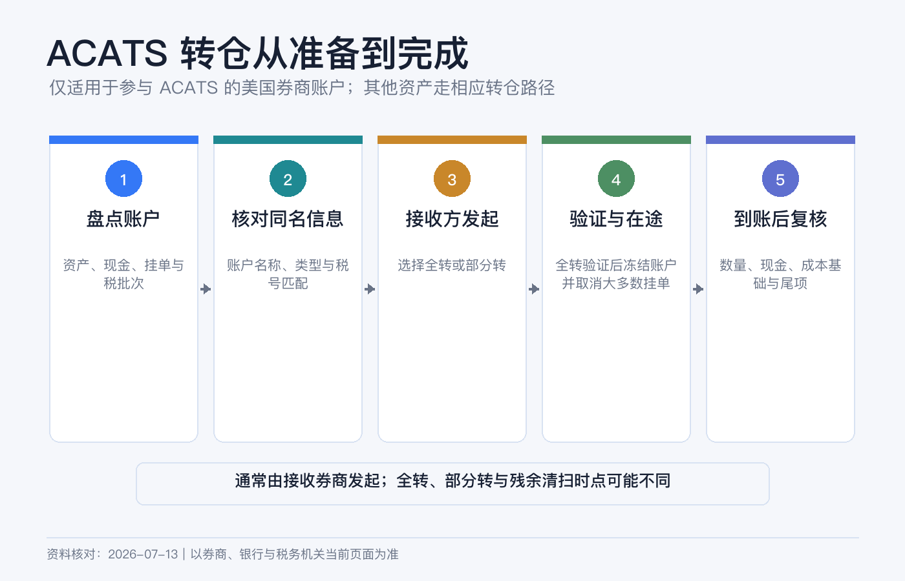
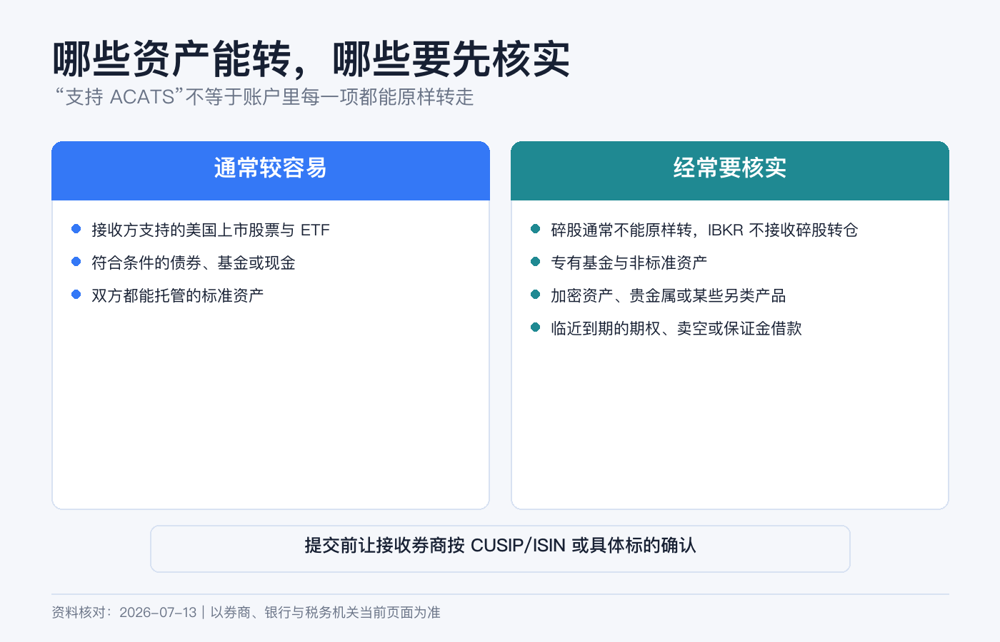
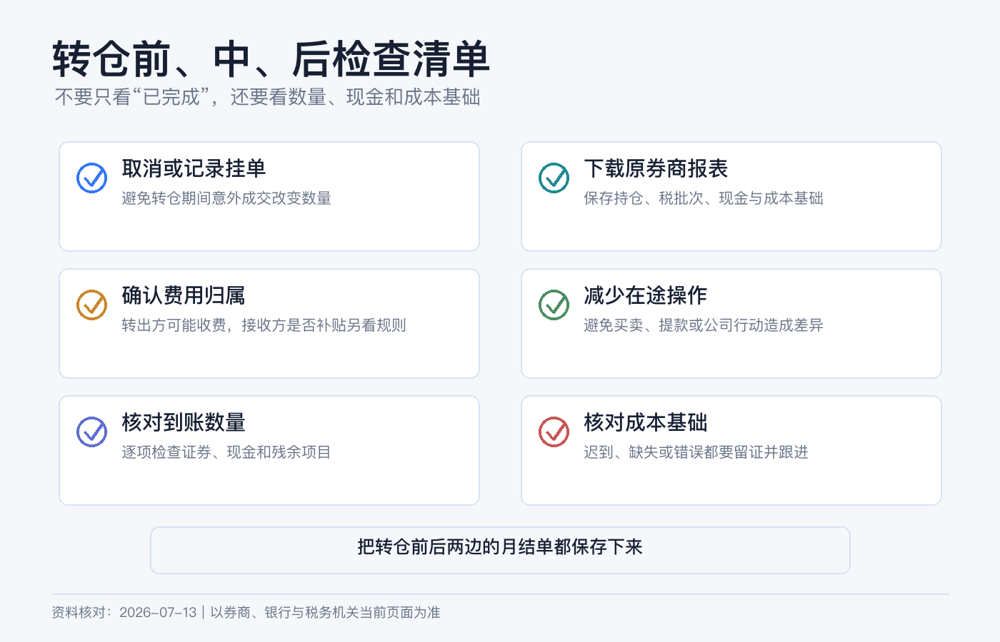

# 换券商不用先卖股票：ACATS 转仓流程、成本和注意事项

想把美股账户换到另一家券商，很多人的第一反应是：先把股票全卖掉，汇出现金，再到新券商买回来。

如果新旧券商都参加 ACATS，而且资产符合接收条件，通常可以直接“原仓转移”。股票数量和持有关系被搬到新券商，不必为了换平台先制造一笔卖出和一笔买入。但这也不是一键复制：碎股、专属基金、保证金负债、期权、成本基础和在途股息，都可能让转仓变复杂。

> 本文是美国券商账户转移的一般操作说明，不构成投资、税务或法律建议。ACATS 只适用于符合条件的参与机构和资产；退休账户、联名账户、信托、公司账户和跨境税务居民可能有额外要求。费用、接收标准和时效以两家券商当前页面为准。资料核对日期：2026-07-13。

## ACATS 到底是什么

ACATS 是 Automated Customer Account Transfer Service，由 DTCC 旗下的 NSCC 运营，用来标准化美国券商之间的客户账户转移。流程里有三方：

| 角色 | 你会看到的名称 | 负责什么 |
|---|---|---|
| 旧券商 | Delivering / Carrying Firm | 验证请求、列出资产并交付可转部分。 |
| 新券商 | Receiving Firm | 收取你的授权并在 ACATS 发起请求，决定是否接收资产。 |
| NSCC | ACATS 运营方 | 传递标准化指令、状态和交付数据。 |

最重要的操作原则是：**从接收券商发起**。你要先开好新账户，再在新券商提交 Transfer Initiation Form 或等效电子授权，而不是只给旧券商发一封“请转走”的邮件。

ACATS 主要处理美国参与券商之间的转移。加拿大常见 ATON，全球证券还可能使用 FOP、DRS、DWAC 或当地托管转移。页面没有 ACATS 时，不要硬选一个相似缩写。

## 全转和部分转怎么选

| 方式 | 会发生什么 | 更适合谁 | 主要注意点 |
|---|---|---|---|
| Full Transfer | 原则上把账户中的全部可转资产和现金移走，旧账户通常进入关闭流程。 | 确定彻底离开旧券商的人。 | 未结算交易、负余额和不可转资产更容易造成异常；后续残余款项仍可能补转。 |
| Partial Transfer | 只转你指定的证券和数量，旧账户继续保留。 | 想先测试一只证券，或两边都要继续使用的人。 | 要准确填写代码、CUSIP/ISIN、数量和多空方向；碎股仍不能直接转。 |

新手第一次更适合先做一笔部分转仓：选择一只流动性较好、无公司行动、无碎股、无借贷状态的普通美股或 ETF，跑通后再决定是否全转。

全转并不代表“所有东西一定都转”。它只是对全部账户资产发出指令，接收券商仍可根据产品、信用和合规政策拒收特定项目。

## 发起前先做资产体检

FINRA 说明，现金、美国国内公司股票和债券、上市期权等常见资产通常能通过 ACATS 转移；但“常见”不等于“必收”。逐项向新券商确认，不要只问旧券商“能不能转出”。

### 通常较容易转

- 已结算的整股美国股票和 ETF；
- 接收券商支持的美国债券、权证和上市期权；
- 已结算现金；
- 两家券商都能承接、且没有销售协议障碍的部分美国共同基金。

### 经常需要额外处理

- **碎股：** FINRA 当前投资者资料明确指出，碎股不能转到另一家券商。通常要保留、补成整股或卖出碎股后转现金；卖出可能产生税务后果。
- **券商专属产品：** 旧券商自有基金、第三方基金或货币基金，如果新券商没有承销或持有安排，可能不可转。
- **外国证券和特殊托管线路：** 同一家公司在不同交易所、币种或存管地的证券，可能需要先变更存管地点或改用其他转移方式。
- **OTC、微盘股、受限证券：** 接收券商可能有额外文件、持仓来源或最低市值要求。
- **加密资产、年金、私募、有限合伙权益：** 往往不在标准 ACATS 可转范围内。
- **期权和空头：** 到期日太近、权限不匹配或保证金不足时，新券商可能拒收。
- **质押、借出或保证金负债：** 证券借贷、未偿借款、short position 和抵押关系会影响可转数量与信用审核。
- **正在发生公司行动的证券：** 拆股、合并、收购、分红选择或投票事件可能延迟交付。

最稳的做法是把最新月结单导出为表格，逐行标记“可转、需确认、不可转”，再决定全转还是部分转。

## 账户资料必须对得上

ACATS 会比对姓名或账户名称、旧账户号码、账户类型、税号等资料。IBKR 当前入口还要求填写 Account Title 和 Tax ID。

提交前核对：

1. 新旧账户的实际拥有人和登记形式是否一致；
2. Individual、Joint、Trust、IRA 等账户类型是否可对应；
3. 姓名拼写、空格、后缀和联名顺序是否一致；
4. 旧券商账号是否包含前缀或破折号；
5. 税号是否与旧账户记录一致；
6. 旧账户地址和身份资料是否已经过期。

把个人账户转进公司账户，或把单人账户直接转进联名账户，不是简单的“改个名字”，可能涉及所有权和税务变化，应先让两家券商书面确认路径。

## 转入 IBKR 的完整路径

IBKR Client Portal 当前操作如下：

1. 登录后进入 Transfer & Pay > Transfer Positions。
2. 选择正确的 IBKR 接收账户。
3. Transaction Type 选择 Incoming。
4. Region 选择 United States。
5. Method 选择 ACATS。
6. 选择旧券商，填写旧账号、Account Title、Account Type 和 Tax ID。
7. 选择 Full 或 Partial。
8. 若部分转，按代码、CUSIP 或 ISIN 搜索资产，填写数量和 Long / Short。
9. 预览全部资料，完成电子签名和身份确认。
10. 保存确认页和 Transfer ID，在 Transaction Status & History 查看状态。

全转页面还可能询问共同基金、美国微盘股等特殊资产的处理授权。不要一路默认选 Yes；看不懂时先退出，向新券商确认“拒收后会怎样”，再提交。

## 在途期间为什么最好别交易

FINRA Rule 11870 对完整转仓写得更明确：全转请求通过验证后，转出账户会被冻结，大多数未成交订单被取消，转出方不再接受新订单；部分转仓的交易限制则要看两家券商的具体安排。原因很直观：你提交时的持仓快照，可能因为成交、交收、期权行权或公司行动发生变化。

发起前我会做这几件事：

- 取消未成交订单、自动定投和可能触发的条件单；
- 等待近期股票和 ETF 交易完成交收；美国多数证券目前采用 T+1，但不同产品可能不同；
- 避开期权临近到期、股息选择和重大公司行动窗口；
- 留足现金支付旧券商可能收取的转出或关闭费用；
- 不在两边重复卖出同一仓位。

转移状态显示 Pending，不代表证券已经能在新账户交易。等到新券商明确显示 Available，并核对数量后再操作。

## 需要多久、会花多少钱

FINRA 当前投资者页面说明，在资料正确匹配、接收券商同意接收后，验证和交付通常约需 3—4 个工作日。这是顺利案例的流程参考，不是到账承诺。非券商机构、退休或托管账户、不可转资产、资料不匹配、公司行动和人工转移都会更久。

成本要分四层看：

| 成本来源 | 如何核对 |
|---|---|
| ACATS 处理费 | IBKR 当前费率页列明其入站和出站 ACATS 不收费，但另一家券商可能收费；两边都要查。 |
| 旧账户关闭或转出费 | 看旧券商最新 fee schedule，尤其是全转。 |
| 不可转资产处置成本 | 卖出佣金、买卖价差、换汇、税款或提前赎回费用。 |
| 在途持仓成本 | 保证金利息、借券费、市场波动和无法及时交易的机会成本。 |

不要只比较“转仓费”和“卖出佣金”。如果先卖再买，还会产生离场期间的价格风险和潜在税务事件。

## 持仓到了，成本基础可能还没到

这是最容易被忽略的一步。证券数量通过 ACATS 到账，不代表每个 tax lot 的购买日期和调整后成本已经同步完成。

IRS 2026 年 Form 1099-B 指引要求，适用的 covered securities 转移后，转出方通常应在转移结算后 15 天内向接收券商提供 transfer statement。成本基础记录仍可能比持仓晚到，老旧或 noncovered 证券也可能没有完整数据。

因此，在转仓前保存：

- 最近一期和年末 Activity Statement；
- 每个 tax lot 的购买日期、数量、单价和佣金；
- 公司行动、股息再投资、拆股与 wash sale 调整记录；
- 历年 1099-B、1042-S 或你所在税区需要的资料；
- ACATS 确认页和最终转仓报表。

IBKR 当前可在 Performance & Reports > Tax Documents > Cost Basis > Position Transfer 查看或补充转入持仓的数量、购入日期、总成本和币种。手工录入能帮助账户显示与 lot 管理，但是否能替代券商依法传递的正式成本基础、以及你所在税区如何申报，应向税务专业人士确认。

## 到账后做三次对账

### 第一次：仓位

逐只核对代码、数量、多空方向、交易所和币种。重点看碎股是否留在旧账户、期权合约乘数和到期日是否正确。

### 第二次：现金和负债

核对已结算现金、保证金借款、应计利息和转仓费用。全转后旧账户仍可能收到迟到的股息、利息或公司行动款项。FINRA 规则要求完整转仓后的残余贷方余额在一定期间内继续转送，因此不要到账当天就丢掉旧账户登录。

### 第三次：税务批次

把新券商显示的购入日期、数量、成本和长期/短期标记与旧报表逐批比较。发现 Unknown 或缺失时，先保存截图并联系两家券商，不要等到卖出后才补。

## 7 个常见误区

1. **“转仓就是卖出。”** 原仓转移通常不需要卖出；但不可转资产被清算时可能产生税务后果。
2. **“全转一定包含碎股。”** 碎股目前不能跨券商转移。
3. **“旧券商同意转出，新券商就必须接。”** 接收券商可以根据产品和信用政策拒收。
4. **“提交后还能照常交易。”** 在途交易可能导致冻结、差异或延迟。
5. **“持仓显示到了，成本也一定到了。”** 两条记录链可能不同步。
6. **“ACATS 固定三天完成。”** 3—4 个工作日只是正常匹配后的通常流程，异常可明显延长。
7. **“IBKR 不收费，所以转仓零成本。”** 对手券商、处置交易、税务、换汇和在途融资仍可能产生费用。

## 提交前检查清单

- [ ] 新旧券商都支持本次 ACATS，账户所有权和类型可匹配。
- [ ] 下载了旧券商最新报表和逐批成本基础。
- [ ] 逐项确认碎股、基金、外国证券、期权和微盘股可转性。
- [ ] 清理未成交订单，等待近期交易交收。
- [ ] 处理或确认保证金负债、证券借贷和空头仓位。
- [ ] 比较两家券商的转出、关闭和接收费用。
- [ ] 保存 Transfer ID，并预留在途不能交易的时间。
- [ ] 到账后核对仓位、现金、负债、费用和 tax lots。
- [ ] 暂时保留旧账户登录，跟踪残余股息和现金。

## 参考资料

- FINRA, [Brokerage Accounts — Account Transfers](https://www.finra.org/investors/investing/investment-accounts/brokerage-accounts).
- FINRA, [Customer Account Transfers](https://www.finra.org/rules-guidance/key-topics/customer-account-transfers).
- FINRA Rule 11870, [Customer Account Transfer Contracts](https://www.finra.org/rules-guidance/rulebooks/finra-rules/11870).
- FINRA, [Investing in Fractional Shares](https://www.finra.org/investors/insights/investing-fractional-shares).
- DTCC, [Automated Customer Account Transfer Service](https://www.dtcc.com/clearing-and-settlement-services/equities-clearing-services/acats).
- IBKR Client Portal User Guide, [Enter an ACATS Position Transfer](https://www.ibkrguides.com/clientportal/transferandpay/enteracattransfer.htm).
- IBKR Client Portal User Guide, [Position Transfer Cost Basis](https://www.ibkrguides.com/clientportal/performanceandstatements/positiontransfer.htm).
- Interactive Brokers, [Other Fees — Security Transfer Fees](https://www.interactivebrokers.com/en/pricing/other-fees.php).
- IRS, [Instructions for Form 1099-B (2026) — Transfer Statements](https://www.irs.gov/instructions/i1099b).
