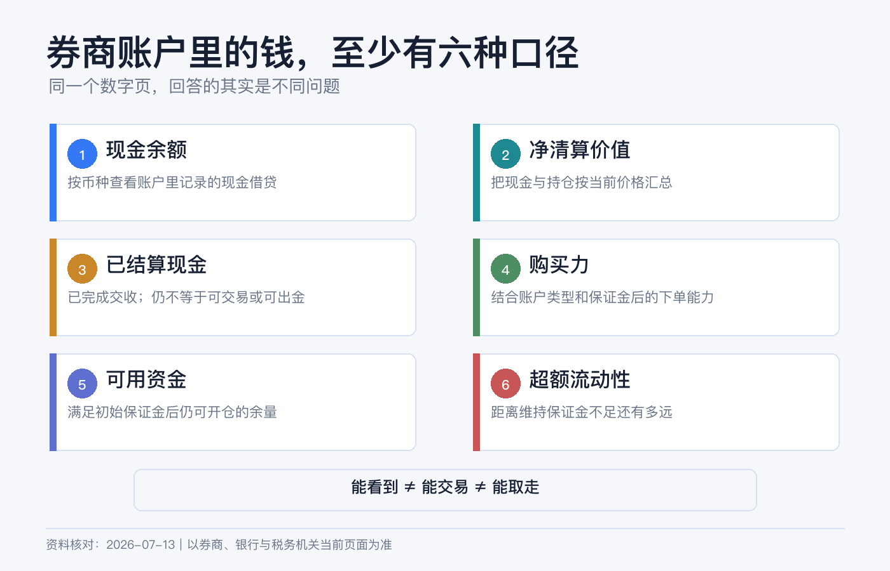
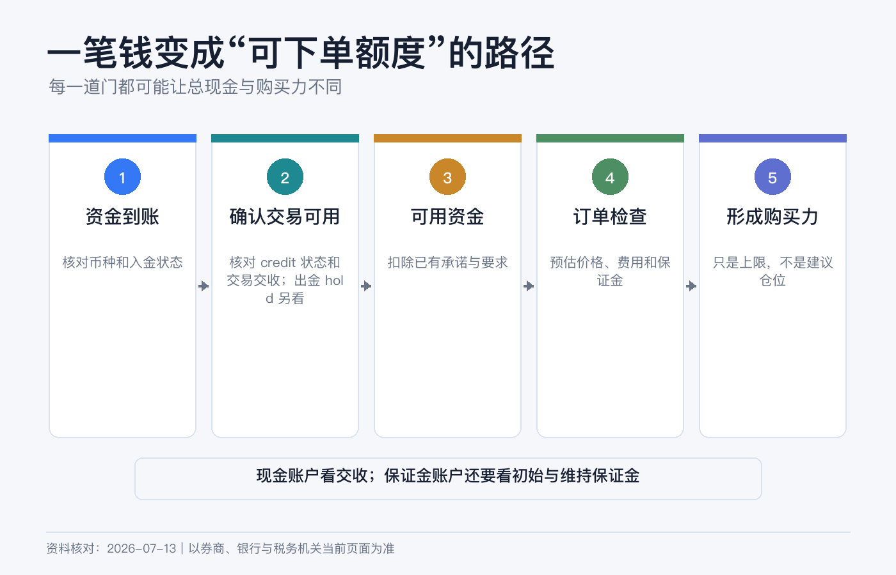
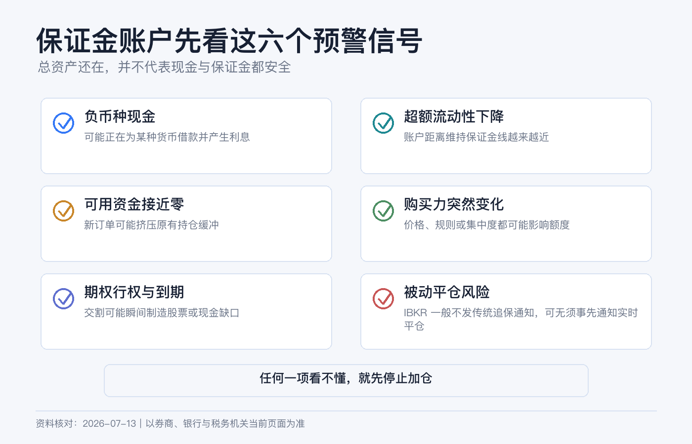

# 券商账户里的钱怎么看：现金、净资产、购买力和保证金一次讲清

第一次打开券商账户的余额页，最容易产生一个错觉：页面上的每个大数字，似乎都在回答“我有多少钱”。

其实不是。现金回答“账户里有哪些货币余额”，净清算价值回答“整个账户现在值多少”，购买力回答“系统最多还允许我买多少”，保证金字段则回答“持仓需要多少权益，以及距离风控线还有多远”。它们不能互相替代。

> 本文为个人经验记录和券商账户字段说明，不构成投资、融资、税务或法律建议。不同账户实体、账户类型、产品和市场的计算方法会不同，券商也可能随时提高自家保证金要求。界面入口以你当前使用的 Client Portal、App 或桌面端为准。资料核对日期：2026-07-14。

## 先记住：四个数字回答四个问题

| 字段 | 它回答的问题 | 新手最容易误解的地方 |
|---|---|---|
| 现金 / Cash | 账户当前按币种记了多少现金 | 总现金不一定都已交收，也不一定立刻可提取 |
| 净清算价值 / Net Liquidation Value | 现金加持仓按当前价格估值后，账户净值约多少 | 这是估值，不是保证能按该金额立刻变现 |
| 购买力 / Buying Power | 不追加资产时，系统最多允许建立多大证券头寸 | 保证金账户的购买力可能包含借款，不是你的本金 |
| 保证金 / Margin | 开仓、持仓分别需要多少权益 | “还有购买力”不等于离强平很远 |

如果只想快速看懂账户，我会按这个顺序：先看账户类型，再看分币种现金，然后看净清算价值；只要账户涉及融资、卖出期权、期货等保证金要求，就继续看可用资金、超额流动性和前瞻值。现金账户若只全额买入普通股票或 ETF，这些字段通常不是第一优先级。

## 现金要分“币种”和“是否交收”

IBKR 是多币种账户。你可能同时有 USD、HKD、EUR 现金，因此先看每种货币的真实余额，不要只看被换算成基础货币的一行总数。

常见字段有两层：

- **Total Cash / Cash**：IBKR 的余额说明中，它可包含已结算现金、交易发生时确认的卖出款以及期货盈亏。它适合看账户当前现金账面，但不等于全部都已完成交收。
- **Settled Cash / 已结算现金**：已经完成交收的现金。现金账户下单、换汇或出金时，这一项往往比“总现金”更接近需要核对的数字，但仍可能受入金冻结期、出金路径和其他限制影响。

例如，你原有 9,000 美元已结算现金，今天卖出 3,000 美元股票。总现金可能已反映卖出款，但已结算现金要等适用的交收流程完成后才变化。所以“卖掉了”不等于“现在就能把钱提走”。

还有一个更危险的信号：**某币种现金为负数**。在保证金账户里，负的 USD 通常意味着你借了美元；正的 HKD 不会因为同在一个账户里就自动把美元借款抹掉。只看合计现金，可能漏掉正在计息的外币负余额。

## 净清算价值，才更接近“账户净资产”

IBKR 对证券账户净清算价值的概括是：总现金价值，加上股票、证券期权、债券和基金等持仓价值。可把它理解为当前时点的账户净资产估算。

一个简化例子：

| 项目 | 金额 |
|---|---:|
| 已持有股票市值 | 18,000 美元 |
| 现金 | 12,000 美元 |
| 净清算价值 | 约 30,000 美元 |

如果是保证金账户，你用 20,000 美元本金加 10,000 美元借款买了 30,000 美元股票，账户可能显示股票市值 30,000、现金 -10,000，净清算价值仍约为 20,000 美元。30,000 是头寸规模，不是你的净资产。

净清算价值也不是“按一下按钮必定拿回的钱”。行情在变，买卖价差、流动性、汇率、佣金和税费都会影响实际变现金额；盘后价格不足时，平台还可能显示净清算价值不确定性。

另外，若账户持有多种货币或外币资产，平台会把它们按汇率折算成基础货币。即使你一天没有交易，汇率变化也可能让基础货币口径的净值变化。这不是现金被自动兑换了。

## 购买力不是余额，而是交易额度

IBKR 将 Buying Power 定义为：不再存入额外权益时，账户可购买证券的最大金额。

现金账户的购买力受到已结算资金、待处理订单和产品规则约束，通常不会凭空创造借款。标准保证金账户的购买力可能把你自己的权益和券商允许的融资一起计算，因此数字可能远高于净清算价值。

这正是购买力最容易误导人的地方：

- 净清算价值 20,000 美元、购买力 60,000 美元，不代表你有 60,000 美元；
- 订单预览显示“可以下单”，只代表当下通过风控，不代表持仓下跌后仍安全；
- 不同股票的可融资比例不同，集中、低价、波动大或流动性差的证券可能需要更高保证金；
- 券商可以采用高于监管最低要求的 house margin，并可能调整。

所以我不会拿“购买力”做资产配置预算。长期投资者更实用的预算是：计划投入的自有现金、预留费用，以及自己明确愿意承担的融资上限。

## 保证金页面真正要看哪几个值

保证金字段很多，新手先掌握四个就够了。

| 字段 | 简化理解 | 用途 |
|---|---|---|
| Initial Margin / 初始保证金 | 建立当前或新头寸所需的最低权益 | 判断能否开仓 |
| Maintenance Margin / 维持保证金 | 继续持有现有头寸所需的最低权益 | 判断持仓底线 |
| Available Funds / 可用资金 | 证券账户通常为可贷款权益减初始保证金 | 判断还有多少开仓空间 |
| Excess Liquidity / 超额流动性 | 证券账户通常为可贷款权益减维持保证金 | 判断距离被处置还有多少缓冲 |

“可用资金”偏向开新仓，“超额流动性”偏向保住现有仓位。IBKR 官方说明，当超额流动性为负，账户已不满足维持保证金要求，券商可能开始平仓以恢复合规。

不要把这理解成“跌到零才危险”。价格下跌会让账户权益下降，波动上升或券商提高保证金比例又会让要求上升，两边可以同时挤压缓冲。FINRA 也提醒，券商可强制卖出证券，且投资者不应假设券商必须先通知或给出延期。

如果页面还有 Look Ahead / 前瞻、Overnight / 隔夜字段，含义是按下一次保证金变化或隔夜要求预估。持有期权、期货、临近到期产品或高波动头寸时，当前值尚可而前瞻值骤降，同样需要处理。

## 一套不会看乱的核对路径

以当前 IBKR Client Portal 指南为例，Portfolio 页面可以看持仓、按币种汇总的现金，以及包含保证金要求和交易限制的 Balances。App 和 IBKR Desktop 的名称可能略有不同，找英文原名通常更可靠。

### 第一步：确认账户类型

先确认是 Cash、Reg T Margin 还是 Portfolio Margin。相同字段在不同账户类型下可能有不同公式；证券与商品期货分部的计算也不同，不能拿别人的截图逐项照抄。

### 第二步：展开按币种现金

逐一检查 USD、HKD、EUR 等余额：哪些为正，哪些为负，哪些尚未交收。不要只看 BASE 或合计行。

### 第三步：看净清算价值

用净清算价值回答“整个账户现在约值多少”，再与持仓市值和现金相加做一次粗略勾稽。若差异明显，检查期权、应计利息、股息、费用、汇率和不同账户分部。

### 第四步：涉及保证金要求时再看三道线

依次看 Current Available Funds、Current Excess Liquidity、Look Ahead Excess Liquidity。负外币现金还要单独检查借款利率和累计利息。

### 第五步：下单前使用 Preview

当前 Client Portal 的订单票据支持 Preview，可查看交易后的账户余额预测。重点比较交易前后初始保证金、维持保证金和超额流动性，不要只确认“订单金额没输错”。

### 第六步：用 Activity Statement 对账

App 是实时视图，正式复盘要看活动报表。把期初现金、入出金、买卖、佣金、利息、股息、汇兑和期末现金逐项串起来，才能判断数字变化来自投资盈亏还是资金流动。

## 五个常见误区

**误区一：现金就是可出金金额。** 现金可能未交收，入金也可能有提取限制。

**误区二：持仓市值就是我的资产。** 有融资时必须减去负现金和其他负债，净清算价值才更接近净资产。

**误区三：购买力很高，所以仓位很安全。** 购买力偏向开仓能力，超额流动性才更接近持仓缓冲。

**误区四：券商会先打电话，再给我补钱时间。** 不要依赖通知；保证金不足时可能被直接处置。

**误区五：BASE 行显示美元，所以账户里全是美元。** BASE 是折算口径，真实现金仍要逐币种查看。

## 账户余额检查清单

- 我知道自己的账户类型和开户实体。
- 我逐币种检查过现金，没有忽略负余额。
- 我区分了总现金和已结算现金。
- 我用净清算价值看净资产，而不是用持仓总市值。
- 我没有把购买力当成自有资金。
- 保证金账户的当前与前瞻超额流动性都有缓冲。
- 下单前看过交易后的保证金影响。
- 我能在活动报表中解释本期现金变化。

如果只记一句话：**现金看币种，资产看净清算价值，开仓看可用资金，风控看超额流动性。**

## 参考资料

- Interactive Brokers, [Account Balances](https://www.ibkrguides.com/ibkrdesktop/account-balances-portfolio.htm).
- Interactive Brokers, [Available for Trading Values](https://www.ibkrguides.com/traderworkstation/available-for-trading.htm).
- Interactive Brokers, [Client Portal Portfolio](https://www.ibkrguides.com/clientportal/portfolio.htm).
- Interactive Brokers, [Excess Liquidity Glossary](https://www.interactivebrokers.com/campus/glossary-terms/excess-liquidity/).
- Interactive Brokers, [Buying Power Glossary](https://www.interactivebrokers.com/campus/glossary-terms/buying-power/).
- FINRA, [Brokerage Accounts: Margin Requirements and Risks](https://www.finra.org/investors/investing/investment-accounts/brokerage-accounts).
