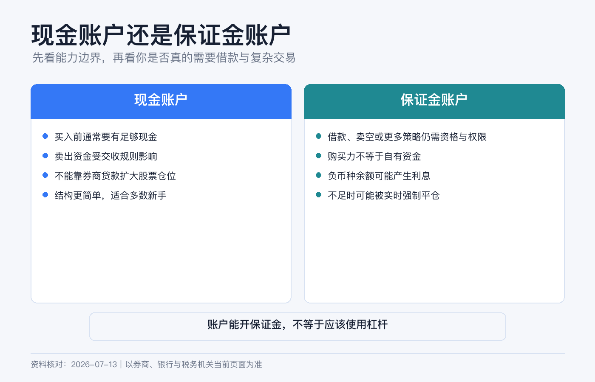
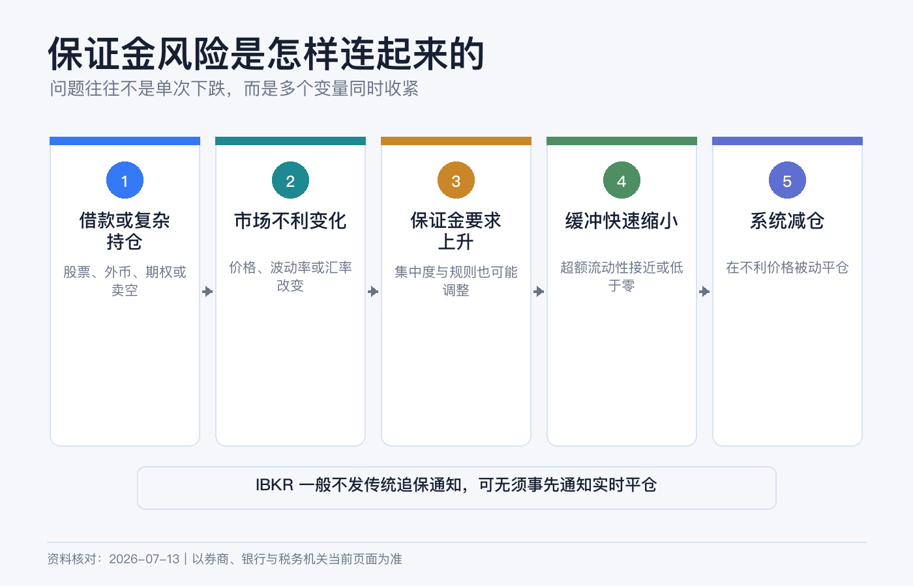
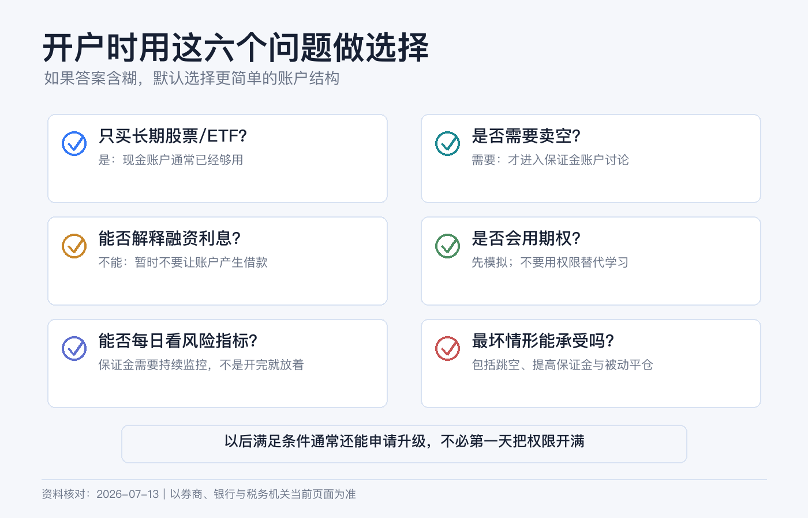

# 现金账户还是保证金账户：新手开户时应该怎么选

如果你的计划只是每月买一点美股或 ETF，现金账户通常已经够用。保证金账户不是“高级版现金账户”，而是一份允许券商借钱给你、并在风险不足时处置抵押品的信用协议。

我的新手默认答案很简单：**没有明确的借款、卖空或特定衍生品需求，就先选现金账户。** IBKR 允许符合条件的现金账户之后申请升级，没必要在开户第一天为“以后可能用到”提前承担误借款和强平风险。

> 本文是账户机制与风险教育，不构成开户、融资、投资、税务或法律建议。IBKR 不同实体、居住地、产品和交易所适用的账户类型与保证金规则不同，开户前应阅读本人账户协议和实时保证金要求。资料核对日期：2026-07-13。

## 先把几个词说清楚

| 概念 | 实际含义 |
|---|---|
| 现金账户 Cash | 买入时要用自己的钱全额支付，不能形成融资借款，也不能卖空股票。账户仍可持有股票、ETF、债券等证券。 |
| 保证金账户 Margin | 可用账户资产作抵押向券商借款；部分卖空、期权和多币种交易能力也依赖它。 |
| 已交收现金 Settled Cash | 已完成交收、可按规则使用的现金，不等于页面上的所有现金变动。 |
| 购买力 Buying Power | 券商按现金、持仓和保证金规则计算的下单上限；它不是“建议投入金额”。 |
| 初始保证金 | 建仓时需要由你提供的最低权益。 |
| 维持保证金 | 持仓期间必须持续保有的最低权益。 |
| 超额流动性 Excess Liquidity | 账户权益高于维持保证金的缓冲；接近零意味着离强制平仓很近。 |
| 借方余额 Debit Balance | 某个币种现金为负，通常代表你正在借款并可能产生利息。 |

## 两类账户到底差在哪里

| 维度 | 现金账户 | 保证金账户 |
|---|---|---|
| 买入资金 | 原则上要有足够的已交收现金覆盖成交与费用。 | 可使用自有资金加券商贷款，但每种证券的可融资比例不同。 |
| 卖空股票 | 不允许。 | 可能允许，但还需要权限、可借券源并承担借券费等成本。 |
| 卖出款再使用 | 要遵守产品交收周期。 | 券商可立即把买卖款纳入购买力计算，但不代表没有融资风险。 |
| 多币种 | 可以持有和交易多币种，但不能借入某币种。 | 一种货币为正、另一种为负时，可能已在借外币。 |
| 期权 | 通常只开放全额支付或有充分覆盖的有限策略。 | 可申请更多策略，但权限审批与保证金要求是另外两道门槛。 |
| 风险下限 | 普通全额买入股票，损失通常以投入金额为限。 | 杠杆、卖空和衍生品可能令损失超过初始投入。 |
| 强制平仓 | 普通股票全额持有不因价格下跌产生保证金追缴，但费用、交割等仍可能造成负余额风险。 | 权益不足时可被实时平仓，且不保证先通知或让你挑选卖哪只。 |

## 现金账户的约束：慢一点，但边界清楚

现金账户最重要的规则不是“账户里有现金”，而是**付款和交收必须对得上**。

美国大多数适用证券自 2024 年 5 月 28 日起采用 T+1 标准交收：周一卖出，通常周二完成交收，节假日另算。IBKR 某些旧说明仍残留 T+3 示例，不应继续沿用。其他国家、债券、基金、外汇和特殊交易的周期可能不同，应看成交确认和结算日。

现金账户常见错误是把尚未交收的卖出款当成随时可反复使用的现金，买入新证券后又在付款完成前卖掉。按适用规则，这可能构成现金交易违规，券商可以拒单或限制账户。最简单的做法是：只看 Settled Cash，下单后给佣金和价格波动留余量。

这并不代表现金账户“功能很少”。长期买入普通股票或 ETF、收股息、定期投资和正常卖出，通常都不需要融资。

## 保证金账户的便利，来自一笔真实贷款

假设你有 5,000 美元，用保证金再借 5,000 美元，买入 10,000 美元股票。若股票下跌 20%，市值剩 8,000 美元；先不计利息和费用，扣除 5,000 美元贷款后，你的权益只剩 3,000 美元，亏损是自有资金的 40%。

杠杆把上涨和下跌同时放大，而且还会增加三类成本：

1. **融资利息。** IBKR 按币种和借款档位计算，利息按日累计、按月入账，利率会变化。
2. **规则变化。** 监管、交易所和券商都可以调整保证金；某只证券也可能从可融资变为要求 100% 资金。
3. **被动处置。** 市场下跌时，你可能在最差的时间被卖出，之后还要承担剩余负债。

## IBKR 的强平规则尤其要看懂

很多人以为券商会先打电话，再给几天补钱。IBKR 官方明确说明：其系统实时计算保证金，通常**不发传统意义上的 margin call**；一旦出现保证金缺口，可能实时自动平仓。平台会尽力发送预警，但快速行情下不保证你有时间入金。

FINRA 也提醒，券商可以提高自己的 house requirement，可以不事先书面通知；为满足要求，券商不一定先联系客户，也不必让客户选择卖出哪项资产。

所以，保证金账户里的 Excess Liquidity 不是装饰数字。它下降时要立刻理解原因，而不是等“客服通知”。

## 还有一个隐蔽风险：借错货币

你把人民币或港币换成美元之前，看到总购买力足够，就直接买了美元计价股票。在现金账户中，系统通常会要求相应币种有足够资金；在保证金账户中，订单却可能通过，并留下负的美元余额。

这不是“自动换汇”，而可能是借入美元。即使总资产为正，只要某币种现金为负，就要检查是否计息。因此每次跨币种交易前都看 Cash by Currency，而不是只看 Base Currency 汇总值。

## 5 类新手怎么选

| 你的真实需求 | 更合适的起点 |
|---|---|
| 每月定投普通股票或 ETF，不卖空、不做期权 | 现金账户。 |
| 偶尔卖出后想立刻再买，但不想使用杠杆 | 仍可先用现金账户并等待交收；若为效率申请保证金，必须把每个币种余额保持非负。 |
| 需要卖空股票 | 保证金账户，但卖空还有权限、借券、费用和无限损失风险，不适合作为新手起点。 |
| 需要价差、裸卖等特定期权策略 | 可能需要保证金账户和额外权限；先在模拟账户理解到期与指派风险。 |
| 只是觉得“购买力越大越好” | 现金账户。购买力不是福利额度。 |

有一个很实用的判断题：**如果页面突然出现负现金、维持保证金和强平预警，你能否独立解释并处理？** 答案是否定的，就先别开保证金。

## 开户和后续升级怎么走

新开户时，在账户类型页面选择 Cash，继续完成财务信息、投资目标、交易经验与风险披露。不要为了通过审批夸大收入、净资产或经验。

以后确有需求，可以在 Client Portal 尝试：

`右上角用户菜单 → Settings → Account Configuration → Account Type`

选择从 Cash 升级到 Margin 后，需要满足资格要求、更新交易权限并签署风险披露，最终是否批准由 IBKR 决定。不同实体对能否降级、如何降级规定不同，不要把“以后再改回去”当作当然；操作前向本人账户实体确认。

即使已经是保证金账户，也可以用“现金方式”管理：

- 下单金额以已交收现金为上限，不以 Buying Power 为上限。
- 每天检查各币种现金，任何负数都查明来源。
- 关注 Available Funds、Excess Liquidity 和 Accrued Interest。
- 不开启卖空、复杂期权和自己还不懂的权限。
- 给费用、汇率变化和公司行动留现金缓冲。

## 开户前最后检查清单

- 我能用一句话说清为什么需要保证金，而不是“可能以后有用”。
- 我知道美国适用证券通常 T+1 交收，但其他市场和产品可能不同。
- 我知道负的外币余额可能是借款，不是自动换汇。
- 我看过当前融资利率和本人账户实体的保证金协议。
- 我接受 IBKR 可能实时平仓，且未必先通知或让我选卖什么。
- 我不会把 Buying Power 当作自己的钱。

如果这些问题还没有答案，现金账户不是“保守过头”，而是在你建立账户理解之前，把最昂贵的错误先关在门外。

## 参考资料

- Interactive Brokers, [Configuring Your Account](https://www.interactivebrokers.com/en/accounts/configuring-your-account.php).
- IBKR Campus, [Margin Account](https://www.interactivebrokers.com/campus/glossary-terms/margin-account/).
- IBKR Campus, [Margin Call](https://www.interactivebrokers.com/campus/glossary-terms/margin-call/).
- Interactive Brokers, [Margin Rates and Financing](https://www.interactivebrokers.com/en/trading/margin-rates.php).
- IBKR Client Portal Guide, [Account Type](https://www.ibkrguides.com/orgportal/homemenu/accounttype.htm).
- SEC, [Statement on Implementation of the T+1 Settlement Cycle](https://www.sec.gov/newsroom/press-releases/2024-62).
- FINRA, [Brokerage Accounts](https://www.finra.org/investors/investing/investment-accounts/brokerage-accounts).
- FINRA, [Know What Triggers a Margin Call](https://www.finra.org/investors/insights/margin-calls).
