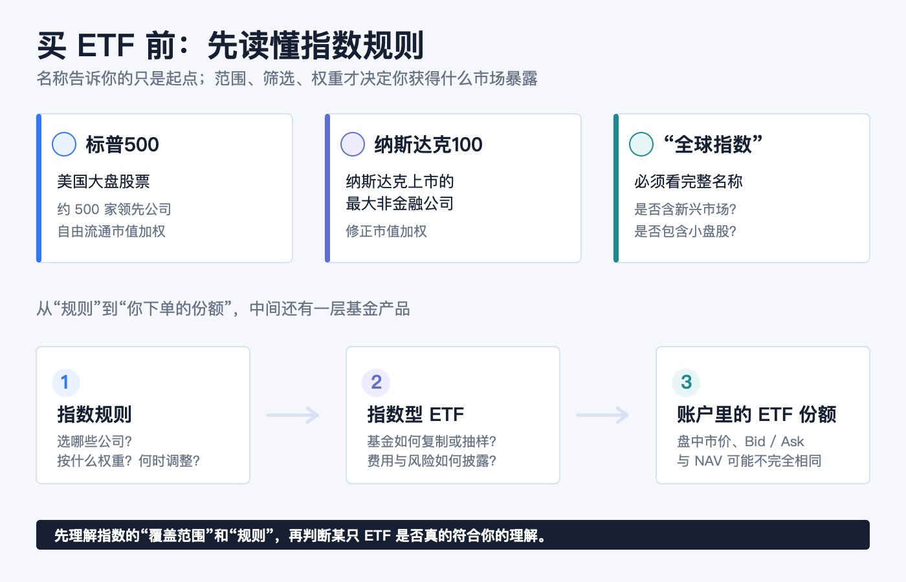
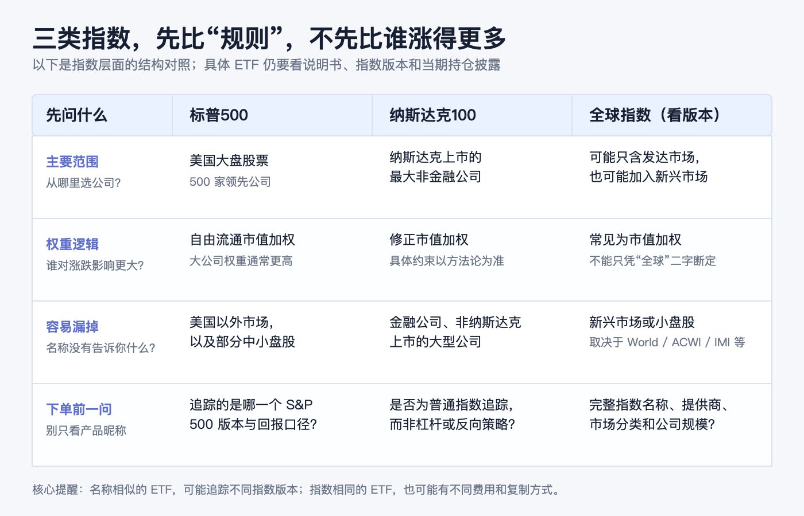
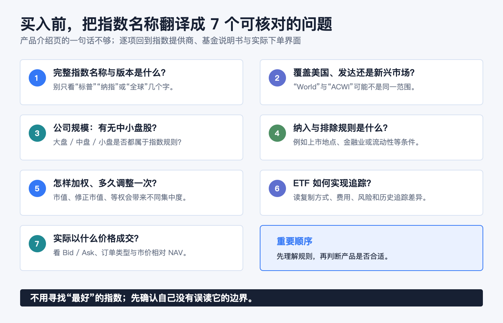

先说结论：**ETF 名称里的“标普500”“纳斯达克100”或“全球”，说的首先是它想追踪的指数规则，不是一句自动等于“更分散”或“更适合我”的标签。** 买入前先看三件事：指数从哪个市场挑选公司、按什么规则赋予权重、明确没有覆盖什么。把这三件事看懂，才知道一只 ETF 提供的是美国大盘暴露、纳斯达克非金融大公司暴露，还是某一种全球股票暴露。

指数本身是一套公开或可查的编制规则，不能直接放进账户；指数基金或指数 ETF 才是尝试追踪该规则回报的产品。美国 SEC 的投资者材料也提醒，指数基金可以采用全复制或抽样复制，因此实际基金不会必然与指数完全一致，费用、交易摩擦和追踪差异仍然存在。[Investor.gov：指数基金](https://www.investor.gov/introduction-investing/general-resources/news-alerts/alerts-bulletins/investor-bulletins-26)

> 本文仅作一般投资教育，不构成投资、交易、税务、法律、开户、银行或跨境资金建议。指数成份、权重、市场分类、ETF 说明书、费用、交易价格与可交易性都会变化。实际下单前，请以目标 ETF 的当前说明书、基金官网和本人券商订单页面为准。资料核对日期：2026-08-16。

## 别从代码开始：先把“指数、指数基金、ETF”拆开

这三个词经常出现在同一页报价里，但它们不是一回事。

| 层次 | 它是什么 | 下单前该确认什么 |
|---|---|---|
| 指数 | 一套选样、加权、调整和计算规则 | 覆盖市场、纳入条件、权重、调整频率与指数版本 |
| 指数基金 | 以追踪某一指数为目标的基金 | 是全复制还是抽样复制、费用与可能的追踪差异 |
| ETF | 可在交易所买卖的一种基金份额形式 | 该 ETF 实际追踪什么、价格相对 NAV、买卖价差和订单条件 |

所以，“跟踪标普500的 ETF”并不是把 500 家公司原封不动塞进一个代码；它是基金管理人按产品文件，去尽量贴近该指数的回报。SEC 说明，指数型 ETF 的管理人目标是追踪标的证券指数；而 ETF 份额在交易所按市场价格交易，市价可高于或低于每份净值（NAV）。[Investor.gov：ETF 投资者公告](https://www.investor.gov/introduction-investing/general-resources/news-alerts/alerts-bulletins/investor-bulletins-24)

## 标普500：美国大盘的“广覆盖”，不是美国全部股票

S&P Dow Jones Indices 把标普500描述为衡量美国大盘股票的基准：由 500 家领先公司组成，覆盖约 80% 的可投资美国股票市值。它采用自由流通市值加权，因此可自由交易市值更大的公司，对指数涨跌的影响通常也更大。[S&P Dow Jones Indices：S&P 500](https://www.spglobal.com/spdji/en/indices/equity/sp-500/)

这句话里有两个容易漏掉的限定：

1. **它是美国大盘的代表，不是“全世界股票”。** 公司的收入可能来自全球，但指数的选样范围仍是美国市场的大盘公司框架。
2. **它是“广覆盖”，不是“美国全部股票”。** 小盘股、部分中盘股与未被纳入者，并不因为你买了标普500指数基金而自动被覆盖。

市值加权也不表示每家公司影响相同。美国 SEC 对市值加权的解释很直观：市值更高的证券占指数价值的比重更大。因此，读“500”时，不要只数公司数量；还要看最大的成份公司和行业合计占多大权重。[Investor.gov：指数基金](https://www.investor.gov/introduction-investing/general-resources/news-alerts/alerts-bulletins/investor-bulletins-26)

## 纳斯达克100：不是“纳斯达克所有股票”，也不只是科技股

纳斯达克100的筛选逻辑和标普500不同。Nasdaq 的官方说明是：该指数衡量在纳斯达克股票市场上市的、规模最大的 100 家国内和国际**非金融**公司的表现；它采用修正市值加权。指数成份跨越计算机软硬件、电信、零售/批发和生物技术等行业，而金融公司（包括投资公司）不在其中。[Nasdaq：Nasdaq-100 概览](https://indexes.nasdaqomx.com/Index/Overview/NDX) [Nasdaq-100 方法论](https://indexes.nasdaqomx.com/docs/methodology_NDX.pdf)

这会带来三个实用判断：

- 它的出发点是“纳斯达克上市的最大非金融公司”，而不是“美国全部大型公司”；上市地点和金融业排除规则都会影响样本范围。
- 它常被口语化为“科技指数”，但它不是只收科技公司；更准确的说法是，它是一组跨多个行业、但排除金融公司且以纳斯达克上市公司为范围的非金融大公司。
- “100”说的是入选公司的目标规模，不等于任何时点都能只靠名称判断单一公司、单一行业或单一股票类别的实际权重。应回到当期成份与权重披露核对。

把标普500与纳斯达克100并列，不是“一个保守、一个进攻”的产品评级，而是在比较**两套不同的抽样边界和权重规则**。它们都可能被市值更大的公司显著影响，也都不等于自动覆盖美国以外市场。

## “全球指数”不是一个固定答案：至少分清 World 和 ACWI

“全球 ETF”最容易让人产生过度想象。它通常不是“每个国家、每家上市公司、每种规模都持有”。指数名称中的 World、All Country、All-World、IMI 等词，必须连同指数提供商和具体版本一起读。

用 MSCI 两个常见基准作规则示例，差别很清楚：

| 指数示例 | 市场范围 | 公司规模范围 | 最容易误会的地方 |
|---|---|---|---|
| MSCI World | 发达市场的股票 | 大盘与中盘；在每个发达市场约覆盖 85% 的自由流通市值 | 名称有 “World”，但不包含新兴市场股票。 |
| MSCI ACWI | 发达市场 + 新兴市场的股票 | 大盘与中盘；约覆盖全球可投资股票机会集的 85% | “All Country”也不是“每只全球股票”；小盘股仍可能不在这个标准指数里。 |

MSCI 对 [MSCI World Index](https://www.msci.com/indexes/index/990100/msci-world-index) 的定义是发达市场的大盘和中盘代表性；对 [MSCI ACWI Index](https://www.msci.com/indexes/index/892400/msci-acwi-index) 的定义则加入发达市场和新兴市场，并约覆盖全球可投资股票机会集的 85%。这就是为什么“全球”不是充分的信息：同一大类名称下，是否含新兴市场、是否含小盘股、是否按市值加权，都会改变你实际持有的风险来源。

还有一个容易被忽视的事实：地域更广，不等于任何时点的国家或公司权重都更平均。若指数采用市值加权，规模最大的国家、行业和公司仍会占较高权重；分散的是规则覆盖的市场范围，不是把每个地区强行配成相同份额。

## 用一张表，先比较“规则”，不要比较过去谁涨得更多

| 先问的问题 | 标普500 | 纳斯达克100 | 全球指数（须看具体版本） |
|---|---|---|---|
| 主要市场范围 | 美国大盘股票 | 纳斯达克上市的最大非金融公司 | 可能是发达市场，也可能含新兴市场 |
| 筛选重点 | 美国大型、具代表性的公司 | 纳斯达克上市 + 非金融 + 大型 | 国家/市场分类、公司规模和可投资性规则 |
| 权重的核心影响 | 自由流通市值较大的公司影响更大 | 修正市值加权，具体上限和规则以方法论为准 | 常见为自由流通市值加权，但不能只凭“全球”二字断定 |
| 容易遗漏什么 | 美国以外市场、小盘部分 | 金融公司、非纳斯达克上市的大公司、美国以外市场 | 新兴市场或小盘股可能缺席；国家权重未必均衡 |
| 对 ETF 的下一步 | 查基金是否准确追踪此指数及其版本 | 查产品是否为普通指数追踪，而非杠杆、反向或其他策略 | 查指数提供商、World/ACWI/IMI 等全名与市场分类 |

过去表现可以帮助理解历史，但不是这张表的替代品。不同指数可能使用价格回报、总回报或净总回报口径；而一只 ETF 的费用、税务处理、现金拖累、复制方式和交易价格又会让其表现与指数回报产生差异。比较时必须让**指数版本、收益口径和基金份额类别**处在同一行。

## 买入前的七个问题：把一个宣传名称翻译成可核对的事实

1. **它追踪的完整指数名称是什么？** 不只看“标普”“纳指”或“全球”几个字。
2. **指数覆盖哪个市场？** 是美国、发达市场，还是也包含新兴市场？
3. **覆盖哪些公司规模？** 只含大盘/中盘，还是包含小盘？
4. **纳入和排除规则是什么？** 例如纳斯达克100排除金融公司；这与“科技”这个昵称不是同一件事。
5. **怎么加权、多久调整？** 市值加权、修正市值加权、等权或其他规则，会改变集中度与换手。
6. **ETF 怎么实现追踪？** 看说明书中的基准、复制方式、费用、风险披露和历史追踪差异，而非假定每只指数 ETF 完全相同。
7. **你实际以什么价格买到？** ETF 在盘中成交；查看 Bid、Ask、订单类型和市场价格相对 NAV 的信息。

最后，把顺序倒过来记会更有用：**先选自己要理解的市场范围和规则，再找对应、可交易且自己能读懂的产品；不要先被一个熟悉的 ETF 代码带着走，再反过来猜它追踪了什么。**

## 官方资料

- [Investor.gov：指数基金](https://www.investor.gov/introduction-investing/general-resources/news-alerts/alerts-bulletins/investor-bulletins-26)
- [Investor.gov：Updated Investor Bulletin: Exchange-Traded Funds (ETFs)](https://www.investor.gov/introduction-investing/general-resources/news-alerts/alerts-bulletins/investor-bulletins-24)
- [S&P Dow Jones Indices：S&P 500](https://www.spglobal.com/spdji/en/indices/equity/sp-500/)
- [Nasdaq：Nasdaq-100 概览](https://indexes.nasdaqomx.com/Index/Overview/NDX)；[Nasdaq-100 方法论](https://indexes.nasdaqomx.com/docs/methodology_NDX.pdf)
- [MSCI：MSCI World Index](https://www.msci.com/indexes/index/990100/msci-world-index)；[MSCI：MSCI ACWI Index](https://www.msci.com/indexes/index/892400/msci-acwi-index)

资料核对日期：2026-08-16。指数规则、成份、市场分类和基金披露会更新；实际交易前，请复核指数提供商和基金管理人发布的当期文件。
