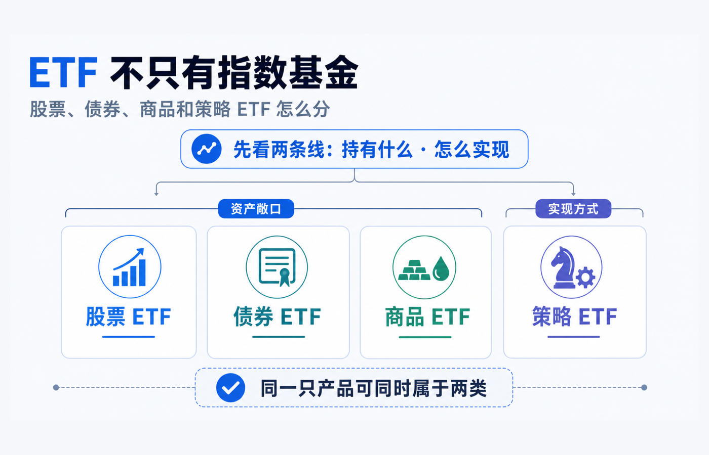
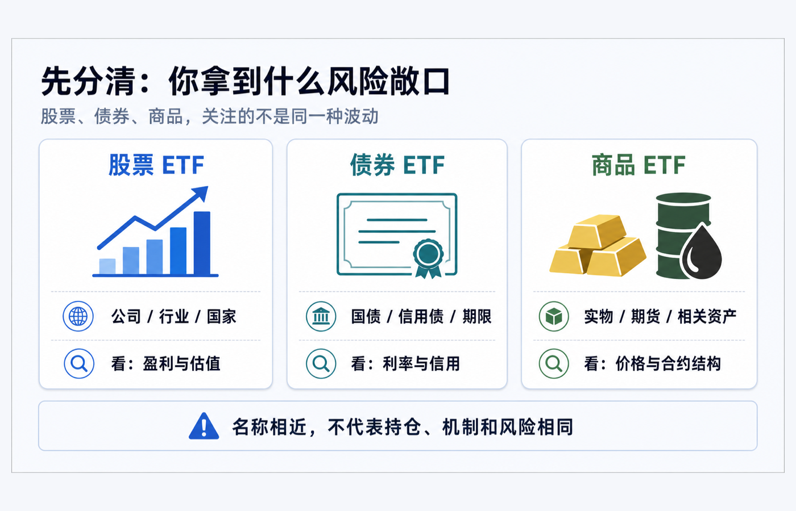
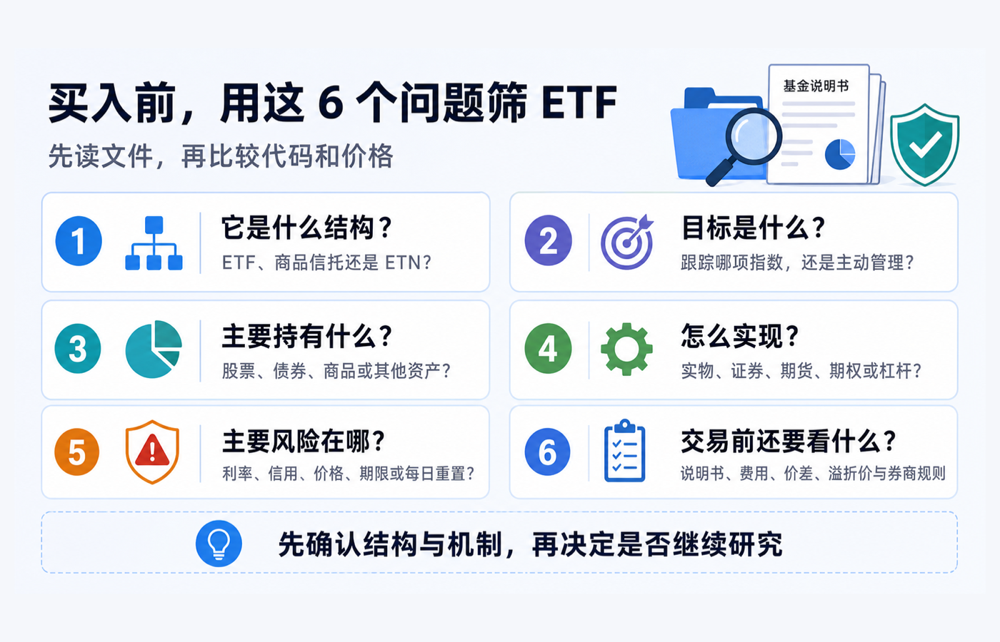

先说结论：**ETF 是一种可以在交易所买卖的基金份额或交易所交易产品的载体，不是“指数基金”的同义词。** 股票、债券和商品，回答的是“它主要给了你什么资产敞口”；策略 ETF，回答的更多是“它用什么规则或工具来实现目标”。所以，一只产品可以同时有两张标签：例如它可能是“股票 + 主动管理 + 期权策略”，也可能是“商品相关 + 实物或期货安排”。

这也是初学者最容易卡住的地方：同样叫 ETF，代码看起来都能像股票一样下单，背后的资产、法律结构、风险来源和预期用途却可能完全不同。美国 SEC 的投资者材料明确区分了指数型与主动管理型 ETF；上海证券交易所也按资产类型或运作模式列出股票、债券、跨境、商品和货币市场等不同类型。不要把“ETF”三个字，误读成“低费率、分散、长期持有、跟踪指数”这一整串结论。[Investor.gov：ETF 投资者公告](https://www.investor.gov/introduction-investing/general-resources/news-alerts/alerts-bulletins/investor-bulletins-24) [上交所：ETF 专栏](https://www.sse.com.cn/assortment/fund/etf/)

> 本文用于一般投资教育，不构成投资、交易、税务、法律、开户、银行或跨境资金建议。不同市场中“ETF”“商品信托”“ETN”等名称可能对应不同法律结构；基金目标、持仓、费用、风险、交易规则和适当性要求也会随产品及账户地区而不同。实际交易前，请阅读目标产品的最新说明书、发行人页面、交易所披露和本人券商订单页面。资料核对日期：2026-08-16。

## 先别按名字站队：用两条线拆分类

想避免把“指数”“资产类别”和“策略”混在一起，先把每只产品放到下面两条线中：

| 先问什么 | 常见答案 | 它帮你识别什么 |
|---|---|---|
| **主要持有什么 / 暴露于什么？** | 股票、债券、商品、现金工具，或它们的组合 | 你主要承受的是公司盈利、利率与信用、商品价格等哪一类风险。 |
| **怎样实现目标？** | 跟踪指数、主动选券、持有实物、使用期货或期权、每日杠杆 / 反向等 | 基金如何把“想要的敞口或结果”做出来，以及哪些额外机制会改变体验。 |

“指数 ETF”主要描述第二条线：它通常以复制某项指数为目标；“主动 ETF”则由管理人按投资目标买卖组合，并不要求贴合某个指数。SEC 对这两种方式的界定很清楚：两者都可能持有股票、债券或其他资产，因此“指数 / 主动”不能替代“股票 / 债券 / 商品”的分类。[Investor.gov：ETF 的类型与主动管理](https://www.investor.gov/introduction-investing/investing-basics/investment-products/mutual-funds-and-exchange-traded-2)

“策略 ETF”也不是所有市场都采用的一项统一法律分类。本文把它当作一个实用的阅读标签：**当产品的投资目标明显依赖某种选股、期权、杠杆、反向、收益分配或规则化再平衡方法时，就要把“怎么实现”单独读出来。** 它可能仍然是股票 ETF，也可能不是指数基金。

## 股票 ETF：先看你分散的是哪一种股票风险

股票 ETF 主要投资于股票或权益类证券。它可以覆盖宽基市场，也可能集中在某个行业、国家、主题、风格因子，甚至单一股票相关敞口；它还可以是指数型或主动管理型。于是，“股票 ETF”只告诉你风险的主要来源靠近权益市场，**并没有自动告诉你持仓数量、行业集中度、地域集中度或是否真的分散。** [Investor.gov：股票基金与 ETF 分类](https://www.investor.gov/introduction-investing/investing-basics/investment-products/mutual-funds-and-exchange-traded-2)

读股票 ETF 时，先把下面四件事写下来：

1. **范围**：它是全市场、某个市场、行业，还是一组更窄的公司？
2. **规则**：它跟踪什么指数，或由谁按什么目标主动选择？
3. **集中度**：前几大持仓和单一行业 / 国家占比是否会主导表现？
4. **附加机制**：有没有汇率、期权、杠杆、反向或证券借贷等会改变风险的安排？

把“买了一篮子”直接等同于“风险很低”，是常见误解。篮子也可以很小、很集中；而单一股票杠杆或反向 ETF 更可能把单一公司波动放大。SEC 特别提醒，单一股票 ETF 往往追求单一股票的每日杠杆或反向结果，并不提供传统分散化带来的好处。[Investor.gov：单一股票 ETF](https://www.investor.gov/introduction-investing/investing-basics/glossary/single-stock-etfs)

## 债券 ETF：买到的是债券组合，不是一张有固定到期日的债券

债券 ETF 的底层通常是国债、信用债、地方政府债或其他债务证券的组合；上交所将债券 ETF 定义为以债券类指数为跟踪标的的交易型证券投资基金，并进一步按国债、信用债等标的范围细分。[上交所：什么是债券 ETF？](https://www.sse.com.cn/assortment/fund/etf/question/c/c_20240118_5734743.shtml)

但买入债券 ETF 的一份基金份额，不等于你自己持有一张到期日、票面利率和兑付条件都固定的单只债券。基金会按其规则持有和调整一组债券，基金份额本身在交易所按市场价格买卖。因此，理解债券 ETF 时，要把“资产池里的债券条款”与“自己账户里 ETF 份额的价格”分开看。

最有用的四个阅读点是：

- **利率敏感度 / 久期**：利率变化会怎样影响组合价格；
- **信用质量**：它主要承担政府信用、投资级信用还是更高信用风险；
- **期限与再平衡规则**：组合是在固定期限段内滚动，还是随指数规则调整；
- **收入与本金的边界**：分配频率、历史分配和收益率显示方式，不能替代对本金波动和信用风险的理解。

以一只广泛债券指数 ETF 的资料为例，iShares Core U.S. Aggregate Bond ETF 说明其目标是追踪包含美国投资级债券的指数；这说明“债券 ETF”内部仍会因指数、期限、信用范围和管理规则而有明显差异。例子只用于演示读法，并非产品推荐。[iShares：AGG 基金说明书摘要](https://www.ishares.com/us/literature/fact-sheet/agg-ishares-core-u-s-aggregate-bond-etf-fund-fact-sheet-en-us.pdf)

## 商品 ETF / ETP：先确认结构，再谈“跟踪商品价格”

“商品 ETF”这个叫法尤其需要多看一层。上交所把商品 ETF 列为 ETF 的一种类型；但在美国，某些交易所交易商品信托和 ETN 属于更广义的 ETP（交易所交易产品），即使名字里有 ETF 或被市场俗称为 ETF，也不一定与注册投资公司的传统 ETF 处于同一法律结构。SEC 说明，交易所交易商品信托通常主要持有商品、货币或相关衍生工具，而 ETN 则是金融机构的无担保债务义务。[Investor.gov：交易所交易产品（ETP）](https://www.investor.gov/introduction-investing/investing-basics/glossary/exchange-traded-products-etps)

所以看到“黄金 ETF”“原油 ETF”或“商品 ETF”时，不要只问它跟哪个价格图走，还要问：

- 它是持有实物、期货合约、相关公司股票，还是其他工具？
- 如果使用期货，合约如何展期，期货曲线和展期成本可能如何影响结果？
- 发行人、托管、对手方和产品结构分别是什么？
- 市场价格、指示价值或 NAV 是否可能出现溢价 / 折价？

例如，SPDR Gold Trust 的发行人页面把目标表述为反映金条价格、扣除信托费用后的表现。这个例子说明，面对商品相关交易所产品，阅读“主要资产是什么、目标如何写、适用的结构与文件是什么”比仅凭名称推断更可靠；它同样不是买入建议。[SPDR Gold Shares：官方产品页](https://www.spdrgoldshares.com/usa/gld/)

## 策略 ETF：持有的可能还是股票，但路径已经变了

策略 ETF 往往最容易被误判成“又一种资产类别”。其实它更像一层方法：产品可能在股票、债券或商品敞口之上，叠加主动选券、备兑看涨期权、低波动筛选、收益目标、杠杆 / 反向或其他规则。它回答的是“基金怎么做”，而不一定回答“基金主要持有什么”。

这里有两个关键边界：

1. **策略不等于保证结果。** 写着“收益”“低波动”“防御”或“对冲”只是在描述目标、方法或历史定位；仍需看说明书中的主要风险、费用和实现条件。
2. **指数也能很复杂，主动也不必然更冒险。** 有些指数按复杂的规则构建；有些主动 ETF 只是在既定投资范围内调仓。判断时回到具体基金文件，而不是凭“指数 / 主动”四个字贴好坏标签。

以 JEPI 为例，发行人将其描述为由防御性美国大盘股组合加上期权覆盖层构成，以寻求收入和资本增值前景。这是“股票敞口 + 主动管理 / 期权策略”的一个阅读样本：看见策略名称后，仍要继续确认股票组合、期权安排、收益来源、上行参与度、费用和风险，而不是把它当成独立资产类别或把分配金额当作固定利息。[J.P. Morgan：JEPI 策略说明](https://am.jpmorgan.com/us/en/asset-management/adv/investment-strategies/etf-investing/investment-ideas/why-invest-in-equity-premium-income-etf-jepi/)

杠杆和反向产品则把“机制”放得更前面。SEC 提醒，这类 ETF 通常追求**每日**的倍数或反向结果；持有超过一天的表现可能与目标指数同期的倍数或反向表现显著不同，波动市场中尤需理解每日重置、衍生工具和损失放大的影响。[Investor.gov：杠杆与反向 ETF](https://www.investor.gov/introduction-investing/general-resources/news-alerts/alerts-bulletins/investor-alerts/sec)

## 不要只把产品塞进一格：用“资产 + 机制”写完整名称

比起说“这是某类 ETF”，更有用的练习是把它写成一条完整句子：

| 你看到的简称 | 更完整的拆法 | 接下来应核对什么 |
|---|---|---|
| 宽基股票 ETF | 股票敞口 + 指数跟踪 | 指数范围、权重、国家 / 行业集中度、费用与价差。 |
| 债券 ETF | 债券敞口 + 指数或主动管理 | 久期、信用质量、期限规则、分配与波动。 |
| 黄金相关产品 | 商品敞口 + 实物 / 期货 / 其他结构 | 法律结构、主要资产、托管或对手方、价格跟踪方式。 |
| 收益策略 ETF | 通常为股票或债券敞口 + 期权 / 选券等规则 | 策略怎样产生现金流、会放弃什么、费用与主要风险。 |
| 杠杆或反向 ETF | 某类敞口 + 每日杠杆 / 反向机制 | 每日目标、重置、衍生工具、持有期与极端波动风险。 |

这个句式的好处是，它允许分类重叠。你不必为了“它到底是股票 ETF 还是策略 ETF”二选一；你需要的是同时知道**主要承受什么风险**和**这种风险是怎样被放进产品里的**。

## 买入前，用这 6 个问题筛 ETF

1. **它是什么结构？** 是注册 ETF、商品信托、ETN，还是其他交易所交易产品？
2. **目标是什么？** 跟踪哪项指数，还是按明确目标主动管理？
3. **主要持有什么？** 股票、债券、商品、现金工具、衍生品或其他资产分别占多少？
4. **怎么实现？** 直接持有、抽样复制、实物托管、期货展期、期权覆盖、每日杠杆还是其他方式？
5. **主要风险在哪？** 是公司 / 行业集中、利率、信用、商品价格、合约结构、对手方、每日重置，还是这些风险的组合？
6. **交易前还要看什么？** 说明书、持仓披露、费用率、买卖价差、溢价 / 折价、交易货币和本人券商规则是否都已核对？

如果第 1、3、4 个问题还说不清，先不要因为代码熟悉、分配率显眼或别人给了一个标签就下单。ETF 的价值在于让投资者以一个交易入口接触不同资产和策略；真正保护你的，不是把它们都叫“指数基金”，而是把结构、资产和机制分开读。

## 官方资料

- [Investor.gov：Updated Investor Bulletin: Exchange-Traded Funds (ETFs)](https://www.investor.gov/introduction-investing/general-resources/news-alerts/alerts-bulletins/investor-bulletins-24)
- [Investor.gov：Exchange-Traded Funds (ETFs)](https://www.investor.gov/introduction-investing/investing-basics/investment-products/mutual-funds-and-exchange-traded-2)
- [Investor.gov：Exchange-Traded Products (ETPs)](https://www.investor.gov/introduction-investing/investing-basics/glossary/exchange-traded-products-etps)
- [Investor.gov：Updated Investor Bulletin: Leveraged and Inverse ETFs](https://www.investor.gov/introduction-investing/general-resources/news-alerts/alerts-bulletins/investor-alerts/sec)
- [上海证券交易所：ETF 专栏](https://www.sse.com.cn/assortment/fund/etf/)
- [上海证券交易所：什么是债券 ETF？](https://www.sse.com.cn/assortment/fund/etf/question/c/c_20240118_5734743.shtml)
- [iShares：AGG Fund Fact Sheet](https://www.ishares.com/us/literature/fact-sheet/agg-ishares-core-u-s-aggregate-bond-etf-fund-fact-sheet-en-us.pdf)
- [SPDR Gold Shares：官方产品页](https://www.spdrgoldshares.com/usa/gld/)
- [J.P. Morgan：JEPI 策略说明](https://am.jpmorgan.com/us/en/asset-management/adv/investment-strategies/etf-investing/investment-ideas/why-invest-in-equity-premium-income-etf-jepi/)

归档材料《ETF 入门系列：基金分类 & 什么是 ETF》《ETF 开箱：JEPI、JEPQ》《ETF 开箱：SQQQ》与《桥水 ALLW 全天候策略 ETF》用于梳理本篇的初学者解释顺序和“资产 + 机制”阅读框架。它们包含的历史规模、费率、产品条款、收益率和观点均未作为本篇现行事实依据；本篇涉及当前产品机制的表述以以上官方页面和最新基金文件为准。

资料核对日期：2026-08-16。基金持仓、目标、费用、规则、产品结构和市场数据会更新；实际交易前，请再次阅读目标产品的当前说明书、发行人和交易所披露，并以本人账户可见规则为准。
