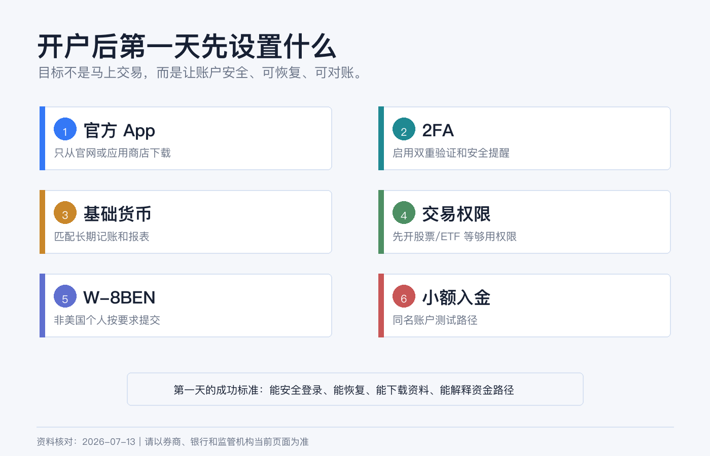
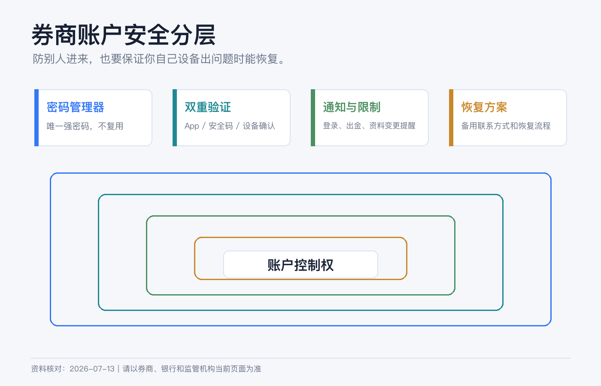
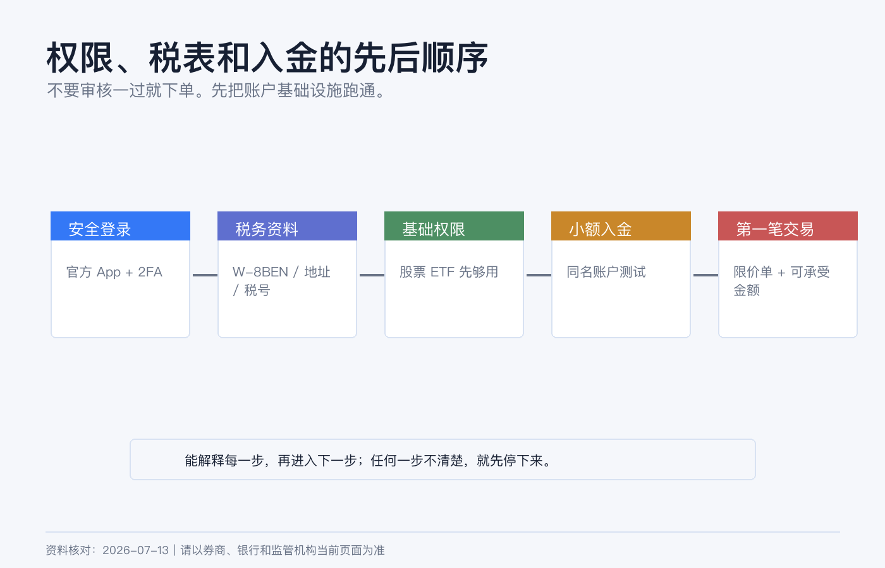

# 开户后第一天要设置什么：App、2FA、基础货币、交易权限和 W-8

券商账户审核通过后，很多人第一反应是入金、换汇、下单。

我不建议这么急。开户后的第一天，最该做的不是买第一只股票，而是把账户变成一个可长期维护、可恢复、可对账、可解释的金融账户。

你需要先处理五件事：官方 App、2FA、安全通知、基础货币和交易权限。然后再确认 W-8BEN、入金路径、报表保存和第一笔交易边界。

> 本文为个人经验记录和开户后设置清单，不构成投资、税务或法律建议，也不是换汇或跨境汇款建议。不同券商、居住地和账户实体的设置入口会变化，操作前以当前 App、网页端和官方说明为准。资料核对日期：2026-07-14。

## 第一步：只安装官方 App

先做一件很小但很重要的事：确认你安装的是官方 App。

IBKR 可能涉及 IBKR Mobile、Client Portal、TWS、IBKR Desktop、GlobalTrader 等多个入口；嘉信可能涉及 Schwab Mobile、网页端和 thinkorswim。新手不要一上来把所有软件都装满。

我会这样分工：

| 入口 | 第一阶段用途 |
|---|---|
| 手机 App | 登录验证、查看账户、接收通知、必要时确认交易或资金操作。 |
| 网页端 | 设置账户、安全、税务表格、入出金、报表下载。 |
| 桌面交易软件 | 只有当你真的需要复杂订单、期权或高频查看行情时再用。 |

下载 App 时，只从 App Store、Google Play 或券商官网跳转。不要通过微信群、Telegram、邮件附件或“客服发来的安装包”安装金融 App。

IBKR 防诈骗页面也提醒，IBKR 不会索要登录详情，不会要求远程访问你的电脑或手机，也不会让你通过电话完成股票或资金转移。这个规则可以推广到所有券商：凡是让你交出登录权限、验证码或远程控制设备的，都先按诈骗处理。

## 第二步：立刻启用 2FA

开户后第一天，2FA 比下单更重要。

嘉信官方安全页面建议用户设置安全提醒，并启用 advanced authentication / two-step verification，登录时在密码之外再使用一次性安全码。IBKR 的账户体系也会围绕移动端验证和安全登录来保护账户。

我会按这个顺序设置：

1. 设置一个只用于金融账户的强密码，并放进密码管理器。
2. 启用券商支持的 2FA 或移动端验证。
3. 确认手机号、邮箱和备用联系方式正确。
4. 打开登录、资金转出、资料变更、订单成交等通知。
5. 记录恢复流程，但不要把恢复信息和密码放在同一个地方。

安全设置里最容易漏的是“恢复”。很多人只设置了当前手机，却没有想过手机丢失、换号、出国漫游失败或邮箱被锁时怎么办。金融账户的安全不是只防别人登录，也要保证你自己在设备出问题时能恢复访问。

## 第三步：检查基础货币和报表币种

如果是 IBKR，开户后要确认 Base Currency 是否符合你的长期记录方式。基础货币主要影响账户汇总、报表和盈亏展示，不等于你只能持有这个币，也不等于每笔交易会自动换汇。

我会用三个问题判断：

1. 我平时用什么币种做家庭资产复盘？
2. 我主要买的资产以什么币种计价？
3. 我未来报表、税务文件和转仓资料希望用什么币种对账？

如果你主要买美国 ETF，USD 往往更直观。如果你主要用港币做账户管理，可以考虑 HKD，但美股成本和股息税仍要单独理解。不要以为基础货币能帮你消除汇率风险。

嘉信这类美国券商账户通常更围绕美元运行。你要确认的是美元现金、银行入金、股息、税表和报表如何记录，而不是在账户里追求多币种显示。

## 第四步：把交易权限降到“够用”

开户后看到一堆可申请权限，很容易手痒。

IBKR 官方说明，交易权限按资产类别和国家拆分，可以在开户申请时选择，也可以之后通过 Client Portal 升级，升级要经过审核。嘉信也说明期权交易需要满足特定要求，期权风险高且不适合所有投资者。

所以第一天最稳的权限组合是：

| 目标 | 第一阶段权限 |
|---|---|
| 长期买美股 ETF | 美国股票/ETF，现金账户，延迟行情也可以先用。 |
| 少量港股 + 美股 | 对应股票市场权限，先不碰衍生品。 |
| 只做账户测试 | 只保留最基础权限，先完成入金、报表和安全设置。 |
| 想学期权 | 先学习和模拟，不要在第一天开真实期权权限。 |

不要为了“以后可能用”而开保证金、期权、期货、现货外汇、复杂杠杆产品和一堆实时行情。权限越多，误操作空间越大，也越容易让你在没准备好的情况下做高风险交易。

## 第五步：确认 W-8BEN

如果你是非美国个人，开美国券商或交易美国证券时，W-8BEN 是很常见的税务文件。

IRS 官方说明：外国个人如果是相关收入的受益所有人，在扣缴义务人或付款方要求时，应向其提供 Form W-8BEN；无论是否申请较低预扣税率或免税待遇，被要求时都应提交。

几个重点：

1. W-8BEN 通常交给券商或付款方，不是你自己寄给 IRS。
2. 它用来证明外国身份，并用于美国预扣税和申报处理。
3. 姓名、国家、永久居住地址、税号和税收协定声明不能乱填。
4. 税务居民身份变化、地址变化或表格过期时，要重新更新。
5. 不确定税收协定和税号怎么填时，找专业人士，不要照抄网友模板。

很多新手只关心交易佣金，却忽略 W-8BEN。实际长期投资中，税表、股息预扣、年度报表和资金流水，往往比第一笔交易更重要。

## 第六步：小额入金测试

安全、税表和权限确认后，再考虑入金。

不要第一次就汇大额。先小额测试一条路径，看它能不能完整跑通：

1. 在券商端创建入金通知。
2. 使用本人同名账户。
3. 按指定币种和收款信息汇出。
4. 保存银行凭证。
5. 到账后核对金额、币种、备注和可交易时间。
6. 记录这条路径的费用和到账时间。

IBKR 入金页面提醒，电汇 routing instructions 会因币种不同而变化，并且强烈不鼓励、通常会拒绝第三方入金。这个原则适用于大多数券商：同名、可追踪、可解释，比“快一点”更重要。

## 第七步：先下载一份空白报表

开户第一天还没有交易，也可以先看报表入口。

你要知道在哪里下载：

| 文件 | 为什么要找入口 |
|---|---|
| Activity Statement / 月结单 | 以后对账、报税、转仓都会用。 |
| Trade Confirmation | 每笔交易的正式记录。 |
| Tax Forms | 年度税务资料入口，不要等报税时才找。 |
| Deposit / Withdrawal History | 证明资金路径和金额。 |
| Account Profile | 地址、税务、权限和联系方式更新记录。 |

我会在本地建一个文件夹：`brokerage/YYYY/broker-name/`，把月结单、税表、入出金凭证和重要通知按年份保存。金融账户的长期价值，不只在资产本身，也在资料能不能几年后找回来。

## 第一天下单前，最后问自己 5 个问题

如果前面都做完了，仍然不急着下单。再问自己：

1. 我是否知道这笔交易用哪种货币结算？
2. 我是否知道订单类型、有效期和成交价格边界？
3. 我是否知道交易后多久交收、卖出后多久能出金？
4. 我是否保存了资金来源、入金和账户资料？
5. 我是否开了任何自己还不理解的权限？

只要有一个答案不清楚，先停下来。开户后的第一天，目标不是赚钱，而是把账户从“刚审核通过”变成“可以长期安全使用”。

## 参考资料

- Charles Schwab, [Security](https://www.schwab.com/security).
- Charles Schwab, [Account Protection](https://www.schwab.com/legal/account-protection).
- Charles Schwab, [Pricing](https://www.schwab.com/pricing).
- Interactive Brokers, [Trading and Market Data](https://www.interactivebrokers.com/en/accounts/trading-and-market-data.php).
- Interactive Brokers, [Fund Your Account](https://www.interactivebrokers.com/en/support/fund-my-account.php).
- Interactive Brokers, [Warning on Frauds and Scams](https://www.interactivebrokers.com/en/general/warnings-on-frauds-and-scams.php).
- IRS, [About Form W-8 BEN](https://www.irs.gov/forms-pubs/about-form-w-8-ben).
