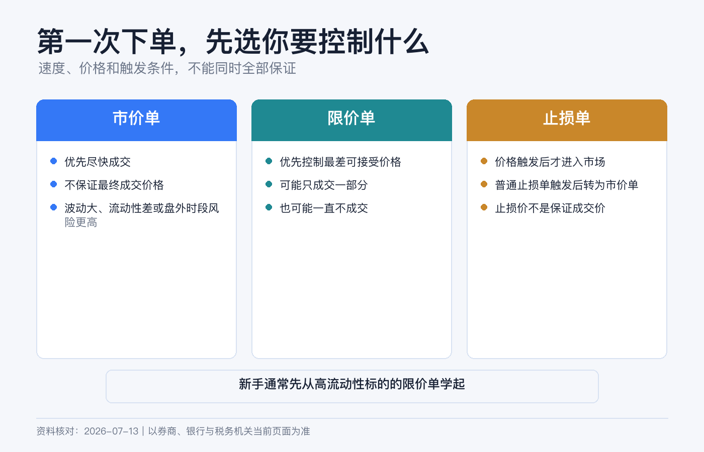
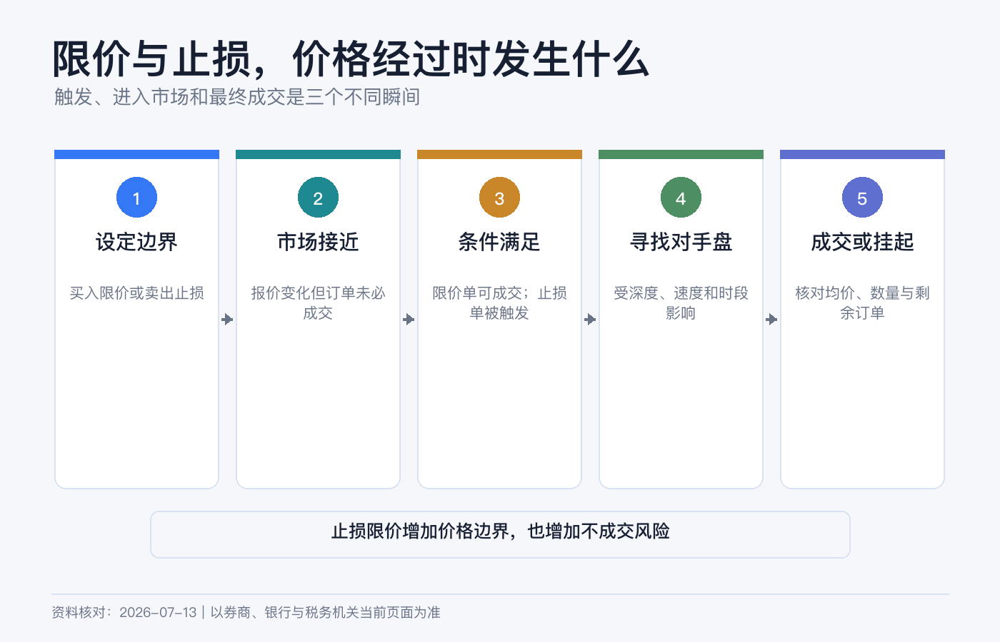
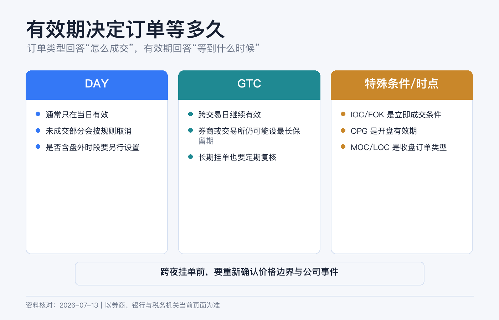

# 第一次下单怎么选：市价单、限价单、止损单和有效期

第一次下单，真正要选的不是一个“最好的订单类型”，而是你愿意承担哪一种风险：为了尽快成交，接受价格不确定；为了锁定最差价格，接受可能不成交；还是等价格触发后，再在成交确定性和价格保护之间取舍。

把这三个问题想清楚，市价单、限价单和止损单就不再是一排陌生缩写。

> 本文为个人经验记录和股票/ETF 基础订单教育，不构成投资、税务或法律建议，也不构成证券推荐、交易或止损建议。订单类型、触发方法、可用交易时段和有效期会因券商、市场、产品和路由而不同。界面入口以当前 Client Portal、App 或桌面端为准，提交前以订单预览和合约规则为准。资料核对日期：2026-07-14。

## 下单前先看三种价格

假设一只 ETF 页面显示：

| 报价 | 价格 |
|---|---:|
| Bid / 买方最高报价 | 99.90 美元 |
| Ask / 卖方最低报价 | 100.10 美元 |
| Last / 最近一笔成交价 | 100.00 美元 |

你现在要买，真正能立即与你成交的参考是 Ask，不是 Last；你要卖，参考是 Bid。Bid 与 Ask 的差额叫买卖价差。Last 只是过去发生的一笔交易，在快速波动、盘前盘后或行情延迟时，可能早已不能代表可成交价格。

第一次下单前，至少确认行情是否实时、买卖价差是否正常、当前是否处于常规交易时段。否则即使订单数量填对，也可能在错误的价格环境中执行。

## 四种订单，一张表看懂

| 订单 | 何时进入市场 | 价格保护 | 主要风险 |
|---|---|---|---|
| Market / 市价单 | 立即按当时可得价格寻求成交 | 没有 | 滑点，可能分多档成交 |
| Limit / 限价单 | 只在限价或更优价格成交 | 有 | 可能一直不成交或只成交一部分 |
| Stop / 止损单 | 触及止损价后变成市价单 | 触发后没有 | 成交价可能远离止损价 |
| Stop Limit / 止损限价单 | 触及止损价后变成限价单 | 有 | 价格跳过限价后可能完全卖不掉 |

## 市价单：优先成交，不保证价格

市价单的目标是尽快与市场上可用报价成交。IBKR 和 SEC 的投资者资料都强调：它提高成交概率和速度，但不提供价格保护，最终价格可能高于或低于当前显示的买卖报价。

继续使用上面的例子。你提交小额市价买单，若盘口稳定，可能接近 100.10 美元成交。但如果你一次买很多、卖盘很薄，第一部分可能在 100.10，剩余部分继续吃到 100.20、100.40；若出现新闻、停牌后复牌或行情故障，偏差会更大。

市价单并非永远不能用。对于常规时段内、流动性充足、价差很小、数量相对盘口很小的证券，投资者可能更看重立即成交。但你必须接受“我控制速度，不控制最终价格”。

以下场景尤其不适合轻率使用市价单：盘前盘后、冷门股票、低价股、期权、盘口很薄、重大新闻前后，以及订单相对成交量很大时。

## 限价单：控制最差价格，不保证成交

限价买单规定“最多愿意付多少”，限价卖单规定“最低愿意收多少”。买入限价 100.05，意味着只能在 100.05 或更低成交；卖出限价 100.05，则只能在 100.05 或更高成交。

这也解释了两个常见误解：

1. 限价 100.10 的买单不是“必须按 100.10 买”，有更低报价时可以获得更优价格。
2. 市价碰到 100.05 不等于你的订单必然成交。你前面可能已有排队订单，市场也可能只短暂成交很少数量。

第一次买一只流动性好的股票或 ETF，如果目标是先熟悉流程，我更倾向于小额、常规时段、DAY 限价单。限价可参考实时 Ask 和自己能接受的最高价，而不是为了省几分钱把价格挂得很远，最后误以为系统坏了。

## 止损单：止损价只是开关

持有一只股票，现价 100 美元，你设置 95 美元的卖出止损单。市场达到券商规定的触发条件后，系统会提交市价卖单。

关键句是：**95 美元是触发价，不是保证成交价。**

如果股票隔夜从 100 直接跳空到 92，止损单触发后可能在 92 附近甚至更低成交。SEC 还提醒，不同券商和交易场所可能使用最新成交、Bid、Ask 或其他方法判断是否触发；IBKR 也会根据产品采用不同触发方式，并可能模拟某些止损订单。

所以止损单解决的是“达到条件后尽快退出”，不是“最多只亏到某个数字”。短暂波动也可能触发订单，随后价格又反弹。

## 止损限价单：避免卖得太低，但可能卖不掉

还是持有现价 100 美元的股票，你设置：

- Stop 触发价：95 美元；
- Limit 最低卖价：94.50 美元。

价格触及 95 后，系统生成一张最低 94.50 才卖的限价单。若市场在 94.80 有足够买盘，可能成交；若直接跳到 92，订单会留在场内但无法成交，亏损可能继续扩大。

止损单与止损限价单没有谁绝对更安全：

- 止损单承担**成交价格不确定**，换取更高退出概率；
- 止损限价单承担**可能无法退出**，换取价格下限。

第一次下单若只是买入长期持有的 ETF，不必为了“功能完整”同时上止损、跟踪止损和括号单。先在模拟账户理解触发、部分成交和撤单，再决定真实账户是否需要。

## 有效期决定订单能活多久

订单类型决定“用什么价格规则成交”，Time in Force / TIF 决定“这张订单保留多久”。二者要一起设置。

### DAY：当前交易日有效

DAY 订单在当前交易日未成交部分会被取消。它适合“今天没买到就重新判断”的第一笔交易。

DAY 不自动等于盘前盘后也有效。是否允许 Outside Regular Trading Hours 通常是单独选项，且不同订单类型未必支持扩展时段。

### GTC：取消前有效，但不是永久有效

GTC 会跨交易日继续工作，直到成交或取消，但券商通常有最长保留期限和自动取消规则。

IBKR 当前公开规则写得更细：股票 GTC 订单带有 Do Not Reduce（DNR）属性。普通股息不超过前一日收盘价 3% 时，订单通常不会被取消，订单价格也不会自动下调；股息超过 3%，或属于额外、特别股息时，GTC 通常会被取消。拆股、换股和股份分配等公司行动也会触发取消，但 IBKR 说明相关处理是 best efforts，不能把系统取消当作自己无需监控的保证。

此外，账户 90 天未登录，或订单到达 Auto Expire 日期时也会取消。Auto Expire 通常设在订单所在季度之后的那个日历季度末；修改订单会重新分配到期日。

因此挂出 GTC 后仍要定期复查。公司行动、分红、基本面变化和你自己的资金计划，都可能让旧价格失去意义。

### GTD、IOC 和 FOK：知道用途即可

- **GTD / Good-Til-Date**：到指定日期或时间前有效，适合有明确截止日的计划；可用平台因产品而异。
- **IOC / Immediate-or-Cancel**：立即成交能成交的部分，其余取消。
- **FOK / Fill-or-Kill**：必须立即全部成交，否则整单取消。

后两种更偏执行约束。第一笔普通股票交易通常不需要为了显得专业而使用。

## 盘前盘后不是一个普通复选框

IBKR 订单票据可能显示 Fill Outside RTH。开启后，符合条件的订单可以在常规交易时段之外触发或成交，但这会改变你的成交环境：参与者更少、价差更宽、价格更容易跳动，且并非所有订单和产品都支持。

FINRA 提醒，扩展时段可能有更低流动性和更高波动。IBKR 也特别提示在盘前盘后谨慎使用市价单。对第一次真实下单，我会把范围收窄到常规交易时段，并使用实时 Bid/Ask 做判断。

## 在 IBKR 完成第一张订单

当前 Client Portal 官方教程的路径是 Trade > Order Ticket。App 或桌面端布局会变化，但订单票据的核心字段相同。

### 第一步：选对合约

用代码或公司名搜索后，核对资产类型、上市市场和交易货币。名称相同、代码相近或不同交易所的证券，可能不是同一张合约。

### 第二步：先看 Bid、Ask 和行情状态

确认行情是否实时、当前交易时段、价差和大致盘口。只有 Last 而没有可靠的 Bid/Ask 时，不要急着用市价单。

### 第三步：填写方向和数量

检查 Buy / Sell，以及单位是股数还是金额。若使用碎股或按金额下单，还要确认该证券和账户是否支持。

### 第四步：选订单类型与有效期

新手练习路径可以是：流动性较好的股票或 ETF、小额、Limit、DAY、不开 Outside RTH。限价写下自己能接受的最高买价或最低卖价。

### 第五步：必须 Preview

当前 Client Portal 的 Preview 可显示交易后的账户余额预测。核对：方向、数量、限价或止损价、TIF、交易时段、预计金额、佣金、货币和保证金影响。

### 第六步：提交后继续看状态

Submitted 不是 Filled。到 Orders & Trades 检查是否已成交、部分成交、被拒绝或仍在等待；部分成交后，剩余数量可能继续挂单。若不再需要，主动取消并确认状态变成 Canceled。

## 第一次下单的判断路径

可以把选择压缩成四句话：

1. **必须尽快成交，并接受价格不确定**：才考虑市价单。
2. **最高买价或最低卖价不能突破**：使用限价单，并接受可能不成交。
3. **到某个价格才启动退出，退出优先**：理解滑点后再考虑止损单。
4. **到某个价格才启动，但成交下限更重要**：考虑止损限价单，并接受可能卖不掉。

如果你对第三、四句仍犹豫，先用模拟账户测试跳空、触发和撤单，不要用真仓位来理解定义。

## 八项提交前检查清单

- 代码、资产类型、交易所和货币都正确。
- Buy / Sell 没有选反。
- 数量单位是股数还是金额已经确认。
- 我看的是实时 Bid/Ask，而不只看 Last。
- 我能说清这张单优先成交还是优先价格。
- DAY、GTC 或其他有效期符合计划。
- Outside RTH 是否开启是有意选择。
- Preview 中费用、现金和保证金影响可接受。

最后记住：**市价单承诺尽力成交，不承诺价格；限价单承诺价格边界，不承诺成交；止损价承诺触发，不承诺退出价。**

## 参考资料

- U.S. SEC Investor.gov, [Investor Bulletin: Understanding Order Types](https://www.investor.gov/introduction-investing/general-resources/news-alerts/alerts-bulletins/investor-bulletins-14).
- FINRA, [Trading Terms: Time Parameters and Qualifiers on Stock Orders](https://www.finra.org/investors/insights/time-parameters-qualifiers-stock-orders).
- FINRA, [How Online Stock Trading Works](https://www.finra.org/investors/insights/online-trade-lifecycle).
- Interactive Brokers, [Order Types and Algos](https://www.interactivebrokers.com/en/trading/ordertypes.php).
- Interactive Brokers, [Client Portal – Enter a Trade](https://www.interactivebrokers.com/campus/trading-lessons/client-portal-order-entry/).
- Interactive Brokers, [Outside Regular Trading Hours](https://www.interactivebrokers.com/campus/glossary-terms/outside-rth/).
