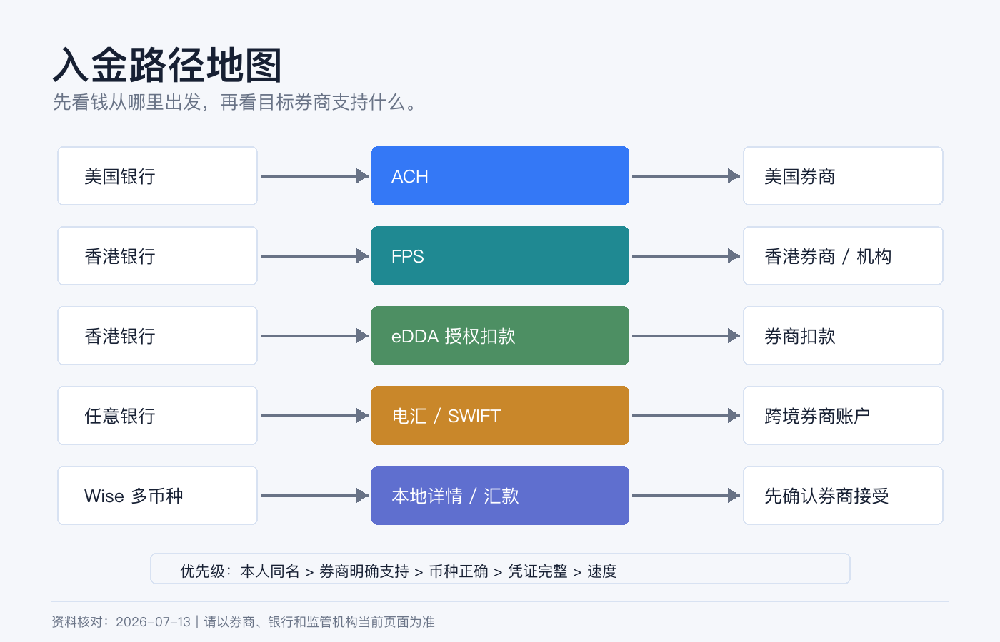
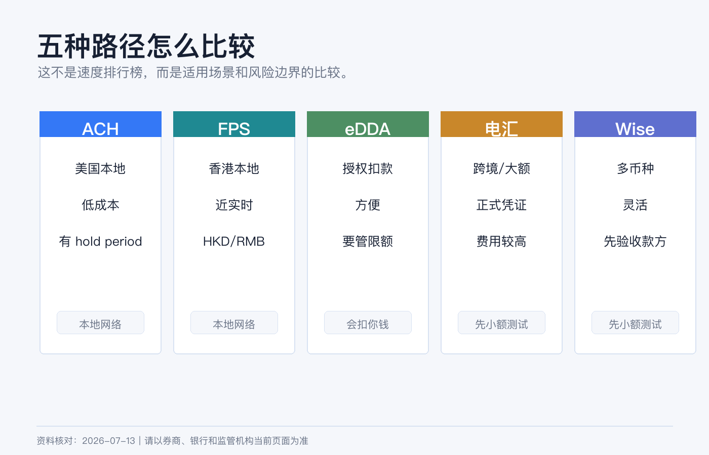
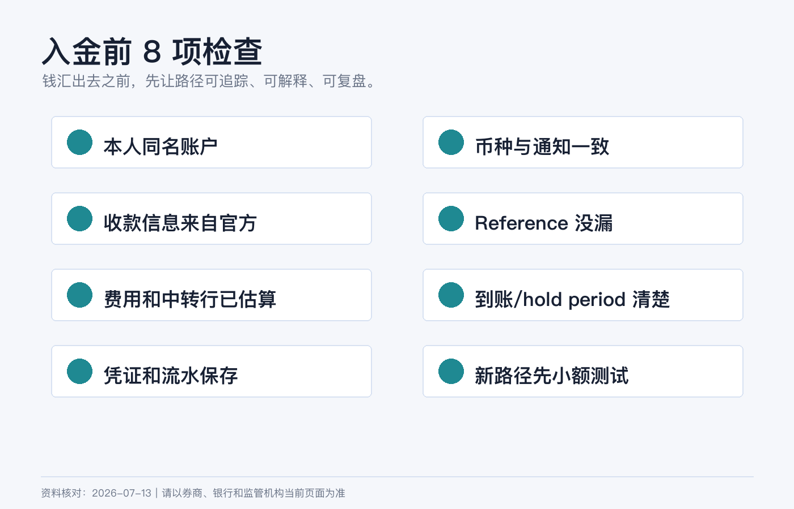

# 入金路径怎么选：ACH、FPS、eDDA、电汇和 Wise 的区别

开户之后，新手最容易卡在入金。

很多人会直接问：“哪条路径最快、最便宜？”但券商入金不是外卖下单。真正该问的是：**我的钱从哪个账户出发，最终要到哪个券商实体，币种是否匹配，账户名是否一致，中间费用和凭证能不能解释清楚。**

ACH、FPS、eDDA、电汇和 Wise 不是同一类东西。把它们硬放在一个速度排行榜里，很容易选错。

> 本文为个人经验记录和资金路径认知框架，不构成投资、税务或法律建议，也不是换汇或跨境汇款建议。不同银行、券商、居住地、资金来源和用途会触发不同限制。实际操作前以银行、券商、支付机构和监管机构当前规则为准。资料核对日期：2026-07-14。

## 先给结论

| 路径 | 本质 | 最适合什么情况 | 最容易误解什么 |
|---|---|---|---|
| ACH | 美国本地银行间电子转账网络 | 美国银行账户和美国券商之间低成本转账 | 不是国际汇款，也不是所有人都有美国 ACH 账户。 |
| FPS | 香港本地实时支付系统 | 香港银行/钱包之间 HKD 或 RMB 转账 | 不是跨境电汇，也不自动等于券商可入金。 |
| eDDA | 电子直接扣账授权 | 授权券商或机构从香港银行账户扣款 | 它是授权机制，不是“免费无限入金按钮”。 |
| 电汇 | 银行间 wire/SWIFT/Fedwire 等转账 | 大额、跨境、需要明确汇款凭证的资金 | 费用、路径和中转行扣费可能不透明。 |
| Wise | 多币种账户和跨境汇款服务 | 小额测试、多币种换汇、本地账户详情收付款 | 不是银行，也不保证所有券商接受。 |

如果你只记一条原则：**券商入金优先选择本人同名、币种正确、券商明确支持、凭证完整的路径。**

## ACH：美国本地低成本通道

ACH 是美国银行和信用合作社之间常用的电子支付网络。Nacha 对 ACH 的说明里提到，Direct Deposit 和 Direct Payment 通过 ACH Network 在美国银行和信用合作社账户之间发送和接收款项；ACH 可以在同一工作日数小时内处理，也可以安排在之后一两个工作日。

ACH 的优点很清楚：

1. 成本通常低。
2. 适合美国银行账户和美国券商之间反复入出金。
3. 对工资、账单、券商扣款和本地美元账户很友好。

但 ACH 也有边界：

1. 你通常需要真正的美国银行账户和 routing number。
2. 不适合把中国内地、香港、新加坡账户里的钱直接“ACH 到美国券商”。
3. 券商可能设置入金可交易时间和出金 hold period。
4. ACH pull 授权错误或账户名不匹配，可能失败或触发风控。

所以 ACH 适合“我已经有美国本地银行账户，并且券商支持 ACH”的人。它不是跨境资金路径的万能替代。

## FPS：香港本地近实时转账

FPS 是香港金管局推动的快速支付系统。HKMA 官方说明里写到，FPS 连接银行和储值支付工具，支持个人转账、电子钱包充值和网上支付；它可以跨银行/钱包、近实时结算、24x7 运作，并支持港币和人民币。

FPS 的优势是本地支付体验：

| 优点 | 对入金有什么意义 |
|---|---|
| 24x7 | 非银行营业时间也可能完成转账，实际到账以银行和券商为准。 |
| 近实时 | 适合香港本地银行到支持 FPS 的机构。 |
| 支持 HKD/RMB | 对香港本地现金管理更方便。 |
| 可用手机号/邮箱/FPS ID | 个人转账简单，但券商入金仍要按券商指定资料。 |

FPS 也有两个常见坑：

**第一，FPS 是香港本地支付网络，不是国际汇款。**  
你不能把它理解成从任何国家到任何券商的免费快线。

**第二，给券商入金时不要只看 FPS ID。**  
券商可能要求先创建入金通知、填写特定备注、使用同名银行账户，或者只接受指定币种。少一个备注，钱可能到账但无法自动匹配。

HKMA 也提醒，FPS 付款类似现金，资金会即时转到收款账户，因此付款前必须核对收款人和金额。

## eDDA：不是转账，是授权扣款

eDDA 常见于香港银行和券商之间。你在券商或银行端完成电子直接扣账授权后，券商可以按你授权的账户、限额和规则向银行发起扣款。

它和 FPS 的关系可以这样理解：

| 项目 | FPS | eDDA |
|---|---|---|
| 你做的动作 | 主动转账给对方 | 授权对方从你的银行账户扣款 |
| 适合场景 | 手动入金、付款、转账 | 绑定券商、自动/快速扣款 |
| 风险重点 | 收款人和金额是否正确 | 授权对象、限额和撤销方式是否清楚 |

eDDA 的便利性很高，但不要把它当成“无脑入金”。你要确认：

1. 授权对象是不是你真实开户的券商或金融机构。
2. 单笔和每日限额是多少。
3. 扣款失败会不会产生费用或影响账户。
4. 如何暂停、修改或撤销授权。
5. 银行账户名、券商账户名和证件信息是否一致。

对新手来说，第一次用 eDDA 前，最好先小额测试，确认券商到账、记录和银行流水都能对上。

## 电汇：最传统，也最需要细节

电汇适合跨境、大额、需要正式汇款凭证的场景。美国本地大额 wire 可能走 Fedwire；跨境美元则常见 SWIFT 和中转行。

Federal Reserve 对 Fedwire Funds Service 的说明是：它是银行、企业和政府机构用于关键、同日交易的电子资金转账服务，参与者可以获得记入其 Federal Reserve Bank master account 的付款最终性。

但普通投资者最需要关心的不是 Fedwire 的底层结算，而是这几件事：

| 检查项 | 为什么重要 |
|---|---|
| 收款银行名称和地址 | 错一个字段可能退汇或人工处理。 |
| ABA / Routing / SWIFT / IBAN | 不同币种和地区字段不同。 |
| 收款人名称 | 券商通常要求写指定实体或 FBO 信息。 |
| 备注 / Reference | 用来匹配你的券商账户，漏填可能延迟。 |
| 中转行费用 | 到账金额可能少于汇出金额。 |
| 汇款用途 | 银行可能要求说明资金用途和来源。 |

IBKR 入金页面也提醒，电汇的 routing instructions 会因币种而不同，客户应通过 Client Portal 创建入金通知后使用对应指示；如果把钱汇到不适合该币种的银行账户，可能被拒收或被银行自动转换。

电汇的优点是正式、适合大额、可跨境；缺点是费用和时间不一定最优，出错后排查成本高。

## Wise：好用，但不是所有券商都接受

Wise 的价值在于多币种账户、换汇和本地账户详情。Wise 官方帮助说明，用户可以获得多个币种的 account details，把它们分享给付款方；收到的钱会进入对应币种余额，再用于持有、兑换或转到外部银行账户。Wise 也说明，很多币种的本地收款没有收款费，但美元国内 wire 和多数 SWIFT 收款可能有费用。

Wise 适合这些情况：

1. 小额测试跨币种路径。
2. 收到某些本地付款后换成目标币种。
3. 把多币种现金先放在一个过渡账户里。
4. 需要用本地账户详情收款，而不是每次走国际电汇。

但 Wise 用来给券商入金时，要非常谨慎：

1. Wise 不是传统银行账户，券商可能把它视为第三方或金融科技机构账户。
2. 有些券商不接受来自 Wise、Revolut 或类似机构的入金。
3. 即使账户名相同，底层付款方名称、银行名称和实际汇款路径也可能影响匹配。
4. 大额、频繁或用途不清的资金流，可能触发 Wise、银行或券商审查。
5. 你需要确认 Wise 支持的币种、付款类型、费用和限额。

所以 Wise 更适合做“资金路径工具”，不适合被当成绕过银行审查或券商规则的办法。

## 我会怎么选

**场景一：我有美国银行账户，要给美国券商入金。**  
优先看 ACH。金额大、时间紧或券商要求时，再考虑 wire。

**场景二：我有香港银行账户，要给香港券商或香港收款机构入金。**  
优先看 FPS 或 eDDA。手动转账用 FPS，长期绑定扣款用 eDDA。第一次都要小额测试。

**场景三：我从境外银行给美国券商汇美元。**  
通常看电汇。先在券商创建入金通知，复制对应币种的收款信息，再让银行汇款。

**场景四：我需要先换汇或中转多币种。**  
Wise 可以作为候选，但先确认目标券商是否接受、账户名是否匹配、费用和凭证是否完整。

**场景五：我不知道哪条路径合规。**  
先不要转。问银行、券商和必要的专业人士。能汇出去不等于用途合规，到账成功也不代表长期没有问题。

## 入金前的最小安全清单

每次入金前，我都会检查这 8 项：

1. 付款账户和券商账户是否本人同名。
2. 币种是否和券商入金通知一致。
3. 收款银行、账号、SWIFT / routing number 是否从官网或 Client Portal 复制。
4. Reference / 备注是否包含券商要求的信息。
5. 银行和中转行费用是否预估过。
6. 到账后多久可交易、多久可出金是否清楚。
7. 汇款凭证、银行流水、券商入金通知是否保存。
8. 第一次使用新路径时是否先小额测试。

路径选对了，入金只是普通流程。路径选错了，钱可能不是丢了，而是卡在银行、券商、支付机构和合规团队之间，排查起来非常费时间。

## 参考资料

- Nacha, [The ABCs of ACH](https://www.nacha.org/content/ach-network).
- Hong Kong Monetary Authority, [Faster Payment System (FPS)](https://www.hkma.gov.hk/eng/smart-consumers/faster-payment-system/).
- Hong Kong Interbank Clearing Limited, [FPS](https://www.hkicl.com.hk/eng/our_services/retail_payment/fps.php).
- Federal Reserve Financial Services, [Fedwire Funds Service](https://www.frbservices.org/financial-services/wires).
- Wise, [How do I receive money to my Wise account details?](https://wise.com/help/articles/2898124/how-do-i-use-my-usd-account-details).
- Interactive Brokers, [Fund Your Account](https://www.interactivebrokers.com/en/support/fund-my-account.php).
