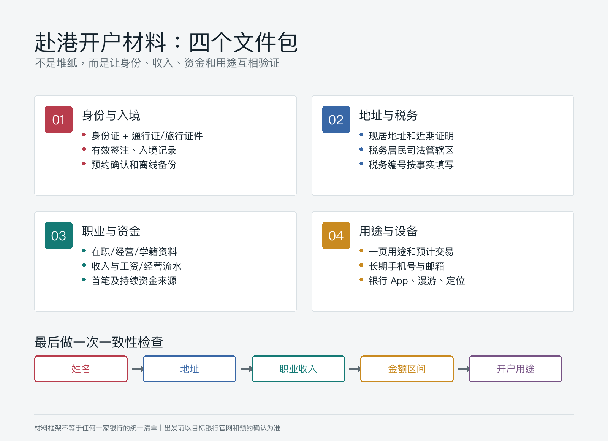
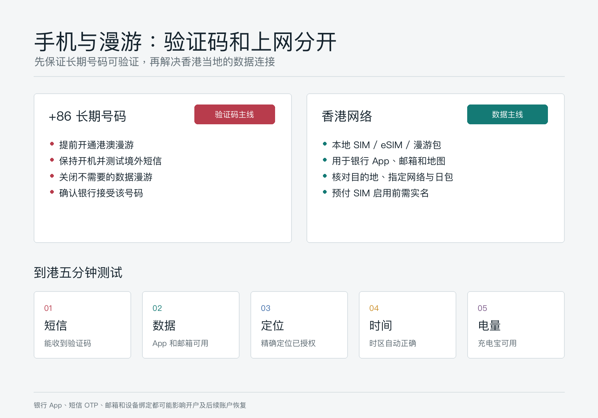
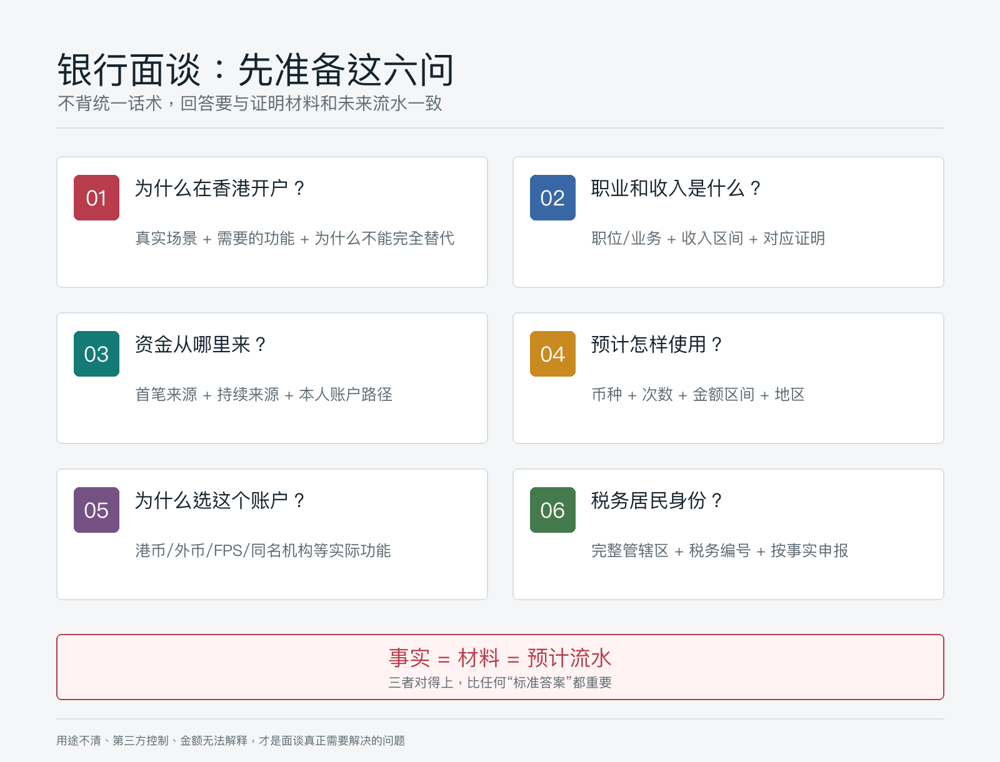

# 赴港办银行卡前准备什么：材料、预约、面谈和手机漫游清单

赴港办银行卡，真正容易出问题的通常不是“少带了一张复印件”，而是四件事没有互相对上：你是谁、钱从哪里来、为什么需要香港账户、账户以后会怎样使用。

银行看到的不是一叠材料，而是一条证据链。如果面谈说每月只会转入几千港元，收入证明和预计交易却写了几十万元；如果说为了香港日常消费，却只准备了复杂的证券交易安排，都会增加解释成本。

这篇文章以**内地居民赴香港申请个人银行账户**为主要场景。不同银行、账户类别、分行和申请人的要求会变化，预约和材料清单必须在出发前再次向目标银行确认。

> 本文为个人经验记录，不构成投资、税务或法律建议，也不是开户保证、外汇或跨境汇款建议。银行会根据客户尽职审查、内部政策和个案风险决定是否开户及是否补件。资料核对日期：2026-07-14。

## 结论先行：出发前准备四个文件包

不要把所有资料混在一个相册或文件夹里。建议按下面四类分别整理纸质原件、复印件和离线电子版：

| 文件包 | 核心内容 | 它回答的问题 |
|---|---|---|
| 身份与入境 | 身份证、往来港澳通行证或银行接受的旅行证件、有效签注、入境记录、预约确认 | 你是谁，是否本人到场，是否符合申请路径 |
| 地址与税务 | 住址资料、近期地址证明、税务居民司法管辖区、税务编号 | 银行如何联系你，怎样完成税务居民自我证明 |
| 职业与资金 | 在职/经营资料、收入证明、工资流水、资金来源凭证 | 钱从哪里来，收入和账户规模是否合理 |
| 用途与设备 | 一页开户用途说明、预计交易、手机号、银行 App、漫游与网络配置 | 为什么开户，如何使用，开户后能否长期维护 |

材料多不等于通过率高。真正有用的是：每个问题都有一份能核实的材料，而且不同材料中的姓名、地址、职业、收入和资金规模一致。

## 一、材料怎么准备：按证据链，不按“网红清单”

香港金融管理局说明，各银行不会使用完全相同的开户清单。银行会按自身业务策略、风险评估、总部及海外监管要求决定所需资料，也可能因为申请人的背景和所申请服务而要求 FATCA、自动交换财务账户资料（AEOI）等额外文件。

所以，下面是一个**覆盖常见核验问题的准备框架**，不是任何一家银行的最终清单。

### 1. 身份与入境文件

建议准备：

1. 中华人民共和国居民身份证原件。
2. 有效的往来港澳通行证，以及足以完成本次行程的有效签注。
3. 如果目标银行或申请路径要求，携带有效护照或其他旅行证件。
4. 入境记录的可下载版本或截图，尤其是银行 App 明确要求上传时。
5. 预约确认邮件、短信、二维码或预约编号。
6. 上述文件的复印件，以及保存在手机本地的 PDF/图片备份。

中银香港公开资料举例说明，内地居民亲临香港分行申请时，需要同时提交入境旅行证件。汇丰香港当前公开的通行证 App 开户路径则要求通行证在申请时具有一定有效期，并可能要求定位权限和出入境记录。它们说明的是两家银行各自的路径，不应外推为所有银行的统一规则。

一个细节常被忽略：**英文姓名要一致**。预约、证件、地址证明、收入证明和汇款账户中的拼音或英文姓名如有差异，提前准备解释材料，不要到柜台才第一次发现。

### 2. 住址资料与地址证明

金管局的通用口径是银行会收集住址资料，并可能因集团、法律或监管要求进一步核实地址。为减少补件，建议准备一份最近三个月内出具、同时显示本人姓名和完整现居地址的文件。

常见候选包括：

- 银行或信用卡月结单；
- 水、电、燃气、固定通信等公用事业账单；
- 政府机构发出的税务或其他正式通知；
- 银行明确接受的手机账单、保险或证券机构结单。

不要自行遮挡关键信息，也不要使用邮政信箱、朋友代收地址或无法解释的转交地址。文件不是中文或英文时，先向银行确认是否需要认证翻译。

注意，有些银行只在开投资账户或特定情况下要求地址证明，有些银行会在个人存款账户申请中同样要求。**带上不代表一定会收，但没带可能要再跑一次。**

### 3. 税务居民身份与税务编号

香港税务局说明，2017 年 1 月 1 日或之后开立的新账户，账户持有人需要提交税务居民自我证明。它不是“随便勾选一项”的表格，而是关于税务居民身份的正式声明。

出发前应明确：

- 自己属于哪些税务管辖区的税务居民；
- 每个管辖区对应的税务编号（TIN）是什么；
- 如果有多个税务居民身份，应该如何完整申报；
- 地址、长期居住地、工作地与税务居民身份之间是否需要解释。

如果不确定，应在开户前咨询合格税务专业人士，不要在柜台猜答案。香港税务局同时提醒，明知或罔顾实情而在自我证明中作出重大误导、虚假或不正确陈述，可能构成违法。

### 4. 职业、收入和资金来源

这是准备材料时最值得花时间的一组。

| 你的情况 | 建议准备的证明 |
|---|---|
| 受雇人士 | 在职证明、劳动合同关键页、近期工资单、工资入账流水、个税或社保资料（按银行要求） |
| 个体经营/企业主 | 营业执照、公司资料、业务合同、对公或个人经营流水、纳税资料、分红或薪酬证明 |
| 自由职业者 | 服务合同、发票/收款记录、项目说明、平台结算单、近几个月银行流水 |
| 学生 | 学籍资料、学费或生活费安排；由家人持续供款时准备供款人的关系和资金来源说明 |
| 退休人士 | 退休证明、养老金流水、既有存款或投资赎回凭证 |

银行可能问两种来源：

- **财富来源**：你目前资产是怎样逐步积累的，例如工资储蓄、经营所得、房产出售、继承等。
- **资金来源**：本次首笔入金及未来持续入金具体从哪个本人账户、哪类收入进来。

二者不要混为一句“都是我的钱”。最好能画出一条简单路径：`收入/资产处置 → 本人内地账户 → 合规换汇或汇款 → 本人香港账户 → 计划用途`。

### 5. 一页开户用途说明

在手机备忘录或纸上写一页，不需要写成商业计划书。至少包括：

- 为什么需要香港账户；
- 主要币种；
- 预计每月入账和出账的次数与金额区间；
- 资金主要来自哪里；
- 主要收款方、付款方或同名金融机构位于哪里；
- 是否需要借记卡、FPS、外币、定期存款或投资账户；
- 是否会有第三方定期供款。

金额区间应与收入和资产证明相匹配。不要为了“显得有实力”夸大，也不要把真实的大额用途故意说成偶尔小额消费。

## 二、怎么预约：先确认申请路径，再订车票酒店

很多人先买票，再开始找分行，顺序反了。更稳妥的做法是先确定目标账户和申请路径。

### 预约前先确认六件事

1. 你申请的是个人存款账户，还是连同投资账户一起申请。
2. 该银行当前是否接受你的证件、居住地和申请方式。
3. 可以 App 申请、电话预约，还是必须到指定分行。
4. 预约分行能否处理非香港居民或内地访港客户。
5. 最新材料清单、最低结余、月费及账户服务范围。
6. 借记卡是当场领取、后续到店领取，还是邮寄到登记地址。

不同银行正在不断调整线上开户。以汇丰香港当前公开信息为例，符合条件的往来港澳通行证持有人可通过 App 申请，并在规定期限内到香港通过 App 激活；其他银行或其他账户未必有同样安排。因此，不要用去年的攻略替代今年的银行官网。

### 预约时只用官方渠道

优先使用银行官网、官方 App 或官方客服电话。保存以下信息：

- 银行和账户名称；
- 分行中英文名称与完整地址；
- 日期、时间和预约编号；
- 预约服务类型；
- 官方材料清单页面；
- 分行电话与改约方式；
- 预约成功截图和确认邮件。

预约确认只代表银行为你安排了申请或会面时段，**不代表已经批准开户**。金管局说明，银行在提供账户服务前须进行客户尽职审查；是否能提供足够资料，会直接影响处理时间。

### 行程建议：给补件留出一天

如果时间允许，安排两天比当天往返更稳妥：

- 把首选预约放在第一天上午；
- 下午留给补打印、补充说明、App 激活或卡片处理；
- 第二天作为补件、回访或备用分行时间；
- 避开香港公众假期，并再次核对分行周末营业安排。

这不是鼓励同时“扫街开户”，而是给真实的补件和技术问题留出空间。

## 三、手机和漫游：把验证码与上网分开解决

赴港开户时，手机不是通讯配件，而是身份验证工具。短信验证码、银行 App、定位、邮件、电子签名和后续账户恢复都可能依赖它。

### 推荐思路：内地号码收验证码，香港网络负责数据

对于支持双卡或 eSIM 的手机，可以这样配置：

| 角色 | 建议设置 |
|---|---|
| 内地长期号码 | 保持开机，提前开通港澳漫游和境外短信接收，关闭不需要的数据漫游，用于银行登记和验证码 |
| 香港本地卡/旅行 eSIM/漫游数据包 | 作为主要移动数据，确保银行 App、邮件和地图可稳定使用 |
| Wi-Fi | 只作为补充；涉及开户和登录时优先使用自己可控的网络，不依赖陌生公共 Wi-Fi |

出发前做一次真实测试：确认手机号未欠费、漫游已开通、能接收短信、邮箱能登录、银行 App 已从官方渠道安装并更新。不要等坐在客户经理面前才开始找 Apple ID、应用商店地区或邮箱密码。

如果银行 App 需要定位或扫描证件，提前开启相机、通知和精确定位权限。汇丰香港的公开开户说明就明确提到，部分申请路径需要 GPS 定位和出入境记录。

### 是否一定要办香港手机号

不一定。要先问目标银行是否接受 `+86` 号码，以及该号码能否长期接收银行短信。香港号码只有在银行要求、你长期有香港使用场景，或需要本地通信服务时才值得办理。

如果购买香港本地预付 SIM 卡，香港通讯事务管理局规定，香港本地 SIM 服务计划和预付卡在启用前都要实名登记。没有香港身份证的个人，可以按规则使用有效旅行证件或护照办理。不要购买声称“已实名”的来路不明电话卡。

香港通讯事务管理局的漫游消费提示还建议：提前确认数据包覆盖的目的地和指定网络，了解“一天”的计费口径，关闭系统/应用自动更新，并正确配置双卡卡槽与数据线路。即使买了日包，连接到不在套餐内的网络仍可能产生额外费用。

### 到港后先完成这五个测试

1. 内地号码已成功注册香港漫游网络。
2. 内地号码可以收短信，且没有被系统误设为数据卡。
3. 数据卡可以打开银行官网、官方 App、邮箱和地图。
4. 手机时间和时区自动设置正常。
5. 充电宝、充电线和备用验证方式可用。

## 四、面谈怎么准备：不是背答案，而是保持一致

银行面谈的本质，是用几分钟核实你的背景、需要和预计账户行为。回答越具体、越能和材料相互验证，沟通成本越低。

### 高频六问及回答框架

| 银行可能问 | 回答时至少包含 |
|---|---|
| 为什么在香港开户 | 真实场景、主要功能、为什么内地账户不能完全替代 |
| 你的职业和收入是什么 | 职位/业务、雇主或经营主体、收入区间，与证明一致 |
| 首笔和后续资金从哪里来 | 本人哪个账户、工资/经营/资产处置等具体来源 |
| 每月预计怎样使用 | 币种、次数、金额区间、入账和付款地区 |
| 为什么选择这个账户 | 需要的实际功能，如港币、外币、FPS、同名券商或香港消费 |
| 税务居民身份是什么 | 所有相关税务管辖区和税务编号，按事实填写 |

一个合格的用途说明可以是：

> 我每年会到香港数次，账户主要用于香港本地消费、本人同名账户之间的资金管理，以及向本人名下的合规金融机构入出金。资金来自工资储蓄，预计每月 1 至 3 笔，金额与我的收入和现有资产相匹配。

这只是结构示例，不是可以照抄的“话术”。你没有对应场景，就不要使用其中的表述。

### 不要这样回答

- “朋友说这家最好开。”
- “先开了再说，以后可能什么都做。”
- “主要帮家人朋友转钱。”
- “金额不确定，可能几千也可能几百万。”
- “不清楚资金从哪里转，别人会安排。”
- “想把钱放在查不到的地方。”

这些回答的问题不在措辞，而在于用途不清、第三方控制、规模无法解释或合规风险明显。也不要临时购买保险、基金或承诺大额首存来换取所谓开户成功率。金管局明确表示，银行不应把购买财富管理产品、保险或大额首次存款作为开户条件，或将其与成功率和处理时间挂钩。

## 五、开户当天：别拿到账号就离开

即使账户获批，也可能还有 App 激活、卡片领取、转账限额和补件等待。离开分行前逐项检查：

| 项目 | 现场要确认什么 |
|---|---|
| 账户资料 | 中英文姓名、账户号码、支持币种、账户级别是否正确 |
| 联系方式 | 手机号、邮箱、通讯地址是否录入正确，境外是否能收到通知 |
| 手机银行 | 能否登录、绑定设备、开启生物识别和推送通知 |
| 验证方式 | 短信 OTP、App 内确认、保安编码或其他验证方式是否可用 |
| 借记卡 | 发卡时间、领取/邮寄方式、激活和设置密码的方法 |
| 转账 | FPS、同名转账、海外汇款、每日限额和新增收款人等待时间 |
| 费用 | 最低结余、低额结存费、卡费、跨境汇款费和账户降级规则 |
| 文件 | 电子月结单、账户证明、收费表和待补材料从哪里下载/提交 |

开户完成不等于当天一定能拿到实体卡；拿到卡也不等于所有转账功能已经开放。以账户和功能实际状态为准。

现场完成一次**小额、同名、可解释**的测试最有价值，例如确认本人账户转入路径和 App 入账通知。不要为了测试而带大量现金，也不要让中介或陌生人替你入金、保管手机、设置密码或操作账户。

## 六、如果被补件或拒绝，怎么处理

被要求补件时，先问清楚三件事：缺什么、接受什么格式、最迟什么时候提交。记录工作人员或申请编号，通过官方渠道上传或递交。

如果申请被拒，金管局在 2026 年 4 月更新的说明中提到：一般情况下，银行会提供不能开户的理由；银行也设有开户个案覆核机制，申请人可以要求重新审视申请。你也可以尝试其他银行，或向金管局反映意见和查询。

不要找人“包装用途”或修改流水。被拒后最有效的动作通常是补齐真实材料、修正前后矛盾，再选择与自身场景更匹配的账户。

## 七、可直接照着执行的行前清单

### 出发前 7 天

- [ ] 确定账户用途、账户类别和主要币种。
- [ ] 从银行官网核对当前资格、申请路径、材料和费用。
- [ ] 完成预约，保存分行、时间、编号和改约方式。
- [ ] 整理身份、地址、税务、职业、收入和资金来源文件。
- [ ] 写好一页用途和预计账户活动说明。

### 出发前 3 天

- [ ] 检查身份证、通行证/旅行证件、签注与行程有效性。
- [ ] 打印关键材料，并在手机本地保存离线 PDF。
- [ ] 安装并更新官方银行 App，测试邮箱和密码管理器。
- [ ] 开通港澳漫游，确认内地手机号可在境外收短信。
- [ ] 准备数据漫游包、香港本地卡或 eSIM，并检查计费规则。

### 到港当天

- [ ] 测试短信、数据、定位、相机权限和手机时区。
- [ ] 提前 15 至 20 分钟到达预约分行。
- [ ] 只按事实回答，确保口头信息与文件一致。
- [ ] 补件要求、申请编号和后续时点全部留痕。

### 离开香港前

- [ ] 手机银行和验证方式可以正常使用。
- [ ] 联系资料、账户名称、币种和收费方案已经核对。
- [ ] 借记卡领取/邮寄与激活方式已经确认。
- [ ] FPS、转账限额、月结单和账户证明入口已经找到。
- [ ] 完成一笔小额同名测试，保存回单。
- [ ] 手机号、邮箱和证件到期后的更新方式已经了解。

## 结尾：准备的目标，是让账户能长期使用

赴港办银行卡不是一次“抢名额”的旅行。开户当天顺利，只是第一步；几年后还能登录、收验证码、解释资金来源、更新税务和地址资料，才算真正办成。

最好的准备不是带最多的纸，而是把身份、地址、税务、职业、资金来源和账户用途连成一条真实、稳定、可验证的线。预约前确认路径，面谈时保持一致，离港前完成验收，后续才不会被一张卡反复牵着走。

## 参考资料

- 香港金融管理局，[开户及维持户口](https://www.hkma.gov.hk/gb_chi/smart-consumers/account-opening/)，修订日期 2025-07-10。
- 香港金融管理局，[所需资料](https://www.hkma.gov.hk/gb_chi/smart-consumers/account-opening/information-required/)及[开户流程](https://www.hkma.gov.hk/gb_chi/smart-consumers/account-opening/account-opening-process/)。
- 香港金融管理局，[被拒开户怎办？](https://www.hkma.gov.hk/gb_chi/smart-consumers/account-opening/what-if-the-application-is-rejected/)，修订日期 2026-04-29。
- 香港金融管理局，[银行不应……](https://www.hkma.gov.hk/gb_chi/smart-consumers/account-opening/banks-should-not/)及[网上银行](https://www.hkma.gov.hk/eng/smart-consumers/internet-banking/)。
- 香港税务局，[自我证明](https://www.ird.gov.hk/chs/tax/aeoi/self_cert.htm)。
- 香港汇丰，[如何开立香港户口](https://www.hsbc.com.hk/zh-hk/international/banking-in-hong-kong/)及[开户申请注意事项（PDF）](https://www.hsbc.com.hk/content/dam/hsbc/hk/docs/accounts/applyaccount-note-sc.pdf)。
- 中国银行（香港），[见证开户服务及开户所需文件](https://www.bochk.com/m/sc/crossborder/personal/financialservicehk/account.html)。
- 香港通讯事务管理局办公室，[电话智能卡实名登记制](https://www.ofca.gov.hk/simreg/)及[外游时的其他流动数据服务选择](https://www.ofca.gov.hk/en/consumer_focus/guide/general/smart_use/index.html)。
