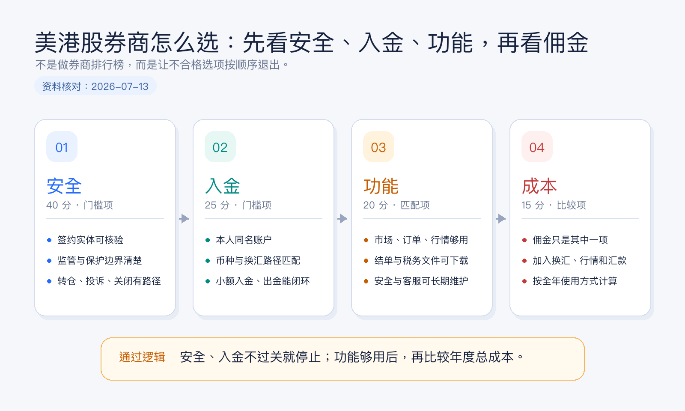
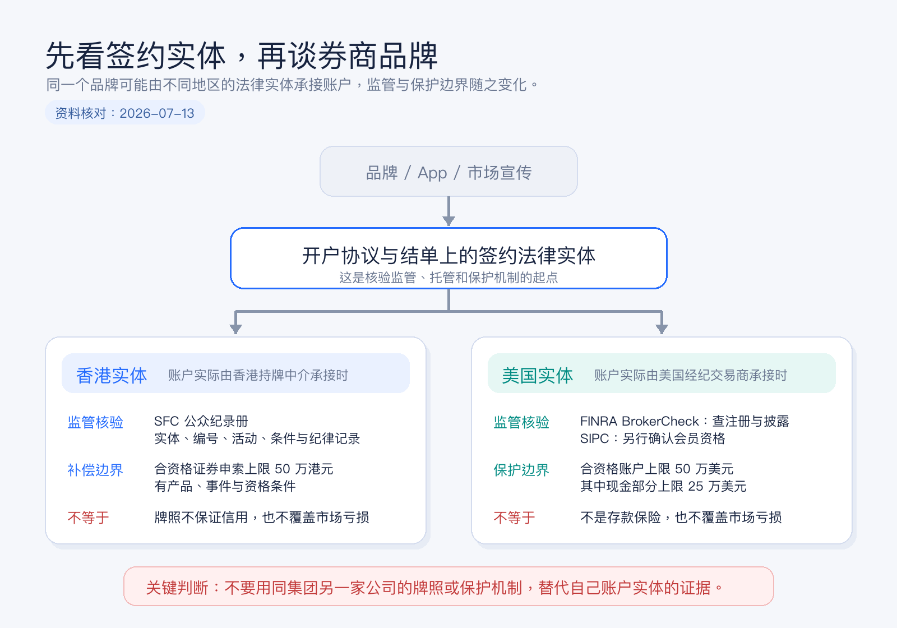
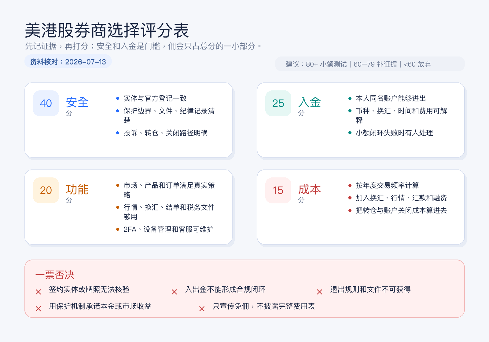

# 美港股券商怎么选：先看安全、入金、功能，再看佣金

很多人第一次选美港股券商，会先打开一张佣金对比表。

哪家免佣，哪家送行情，哪家开户奖励高，哪家 App 看起来更顺手。结果比较了半天，却没有回答几个更重要的问题：账户到底开在哪个法律实体名下？这个实体受谁监管？钱能不能从自己的银行账户稳定进出？需要的市场和报表是否真的支持？以后想转走资产时要付出什么成本？

券商不是一个交易 App，而是一整套账户、资金、交易、托管和退出安排。佣金只是其中最容易被看到的一行。

> 本文为个人经验记录和券商选择框架，不构成投资、税务或法律建议，也不是开户或跨境资金建议。券商服务范围会随居住地、身份、签约实体和监管要求变化，实际信息以开户协议、费用表及监管机构最新记录为准。资料核对日期：2026-07-14。



## 结论先行：按四道门来筛

我会按这个顺序选择券商：

1. **安全**：能否确认签约法律实体、监管状态、资产保护边界和退出机制。
2. **入金**：本人名下资金能否合规、稳定、低摩擦地完成入金和出金闭环。
3. **功能**：是否覆盖我真正会用的市场、产品、订单、换汇、报表和客服能力。
4. **成本**：在前三项都合格后，再比较交易佣金、平台费、汇兑、行情和转仓等全年总成本。

这四项不是平均重要。安全和入金属于门槛项：无法确认签约实体，或者出入金不能闭环，即使佣金为零，也不进入候选名单。

## 第一关：安全不是看品牌大不大，而是看账户落在哪个实体

同一个券商品牌，可能同时在香港、美国、新加坡或其他地区设有不同公司。你看到的是同一个名字和 App，但真正与你签约、接收资金、托管资产并出具结单的，可能是不同法律实体。

所以第一步不是搜索“某某券商安全吗”，而是从开户协议、客户协议、隐私政策、结单抬头或官网法律披露中找到以下信息：

| 必查信息 | 为什么重要 |
|---|---|
| 签约法律实体全称 | 决定账户受哪套法律和监管规则约束。 |
| 监管机构与登记编号 | 用于在官方登记系统中交叉核验，不只看官网自己写的“持牌”。 |
| 获准开展的业务 | 持牌不等于所有业务都获准，要看证券交易等相关活动及牌照条件。 |
| 客户资产与现金安排 | 了解证券和现金由谁持有、结单由谁出具、闲置现金如何处理。 |
| 投资者赔偿或保护机制 | 看适用对象、产品、触发条件和限额，而不是只记一个数字。 |
| 投诉、转仓与账户关闭路径 | 真正出现问题时，知道向谁提交材料、资产如何退出。 |

### 香港账户怎么核验

如果签约实体在香港，可以先到香港证监会的持牌人及注册机构公众纪录册查询。除了名称，还要核对中央编号、牌照状态、获准的受规管活动、牌照条件、营业地址和公开纪律处分记录。

香港证监会明确说明，公众纪录册用于核验持牌或注册状态，但登记本身不保证一家机构的表现或信用。换句话说，“查得到牌照”是起点，不是安全分析的终点。

香港投资者赔偿基金针对持牌中介人或认可财务机构违责造成、且属于适用范围的损失提供补偿。对于 2020 年 1 月 1 日或之后发生的违责，合资格证券申索的每名投资者补偿上限为 50 万港元；适用产品和情形有明确边界，并不是所有资产、所有交易和所有损失都自动覆盖。

### 美国账户怎么核验

如果签约实体是美国经纪交易商，可以在 FINRA BrokerCheck 查询公司报告，核对注册状态、业务信息和披露事项。然后再到 SIPC 官方渠道确认该实体是否为会员。监管登记和 SIPC 会员资格是两个不同问题，应分别核验。

SIPC 的作用也经常被误解。对于陷入财务困境的 SIPC 会员券商，在符合条件且客户账户中的证券或现金缺失时，保护上限通常为 50 万美元，其中现金部分上限为 25 万美元。它不赔偿证券价格下跌，也不是银行存款保险，更不为投资收益或投资建议兜底。



### 安全关的最低通过标准

我至少要做到这五件事，才会继续比较：

1. 能在协议或结单样本中写出签约实体全称。
2. 能在对应监管机构官网查到该实体，而不是只查到同集团另一家公司。
3. 能解释账户适用哪种投资者保护机制，以及它不保护什么。
4. 能下载费用表、客户协议、隐私条款和资产转移说明。
5. 能找到人工客服、正式投诉渠道和账户关闭方式。

## 第二关：入金不是“能转进去”，而是能形成闭环

一个可长期使用的券商账户，至少要同时解决入金和出金。只测试钱能不能进去，不测试钱怎么回来，是新手最常见的流程缺口。

我会把资金路径画成一条完整链路：

```text
本人收入或储蓄
-> 本人银行账户
-> 合规换汇与转账
-> 本人券商现金账户
-> 交易与持仓
-> 卖出后现金
-> 本人银行账户
```

然后逐项确认：

| 入出金问题 | 需要确认的细节 |
|---|---|
| 支持哪些同名银行账户 | 本地转账、电汇或其他方式分别需要什么账户信息。 |
| 支持哪些币种 | 入金币种、账户基础币种、交易币种和出金币种是否一致。 |
| 换汇在哪里发生 | 银行换汇还是券商换汇，采用什么价格和收费方式。 |
| 到账与可用时间 | “券商收到”不一定等于“立即可交易或可提现”。 |
| 入金识别方式 | 是否需要附言、虚拟账户号、汇款通知或资金来源文件。 |
| 出金限制 | 新增收款账户、修改银行信息、资金交收后提现分别要多久。 |
| 失败处理 | 退汇、姓名不一致、信息填错或合规复核时找谁处理。 |

对于涉及跨境换汇和转账的资金，券商愿意接收不等于资金路径自然合规。居住地、资金来源、银行政策和申报用途都可能影响实际可行性。不要把第三方代入金、虚构用途或绕过银行审核当作“入金技巧”。

更稳妥的做法，是先用一笔不影响生活的小额资金完成完整测试：入金、换汇、买入、卖出、等待交收、出金、下载结单。第一次操作的目标是验证流程，不是追求收益。

## 第三关：功能要按真实策略选，不按按钮数量选

功能越多不一定越好。对只准备长期买入宽基 ETF 的人，复杂期权策略、程序化接口和几十种高级订单，可能只增加学习成本。对需要同时管理港股、美股和多币种现金的人，市场覆盖、换汇、行情和报表反而是刚需。

我会从八个维度检查功能：

| 功能维度 | 新手要问的问题 |
|---|---|
| 市场与产品 | 港股、美股、ETF、债券、期权等，哪些是真正需要的？ |
| 账户类型 | 现金账户能否满足需求，是否真的需要融资融券或保证金账户？ |
| 订单能力 | 是否支持限价单、有效期设置、盘前盘后，以及清晰的订单状态。 |
| 行情质量 | 实时报价是否收费，免费行情是否延迟，交易前能否看清买卖价差。 |
| 多币种与换汇 | 港币、美元等余额是否分开记录，换汇成本和成交明细是否透明。 |
| 报表与税务文件 | 月结单、成交单、公司行动、利息、股息和税务文件能否下载。 |
| 客服与安全 | 是否支持双重验证、登录提醒、设备管理和可用的人工客服。 |
| 转仓与退出 | 能否转入转出证券，支持哪些市场，费用和处理时间如何。 |

交收周期也会影响功能体验。美国多数经纪交易商证券交易自 2024 年 5 月 28 日起采用 T+1 标准交收；香港交易所参与者与结算所之间的香港证券交易目前通常为 T+2。券商与客户之间的资金可用、提现和融资安排仍以账户协议为准，不能只凭“T+1”或“T+2”推断余额一定何时可取。

### 不同用户真正需要的功能不同

**长期定投美股 ETF**：优先看低额交易的收费、自动换汇或定投能力、股息和税务文件、碎股规则，以及长期不用时是否有账户维护成本。

**同时持有港股和美股**：优先看双市场覆盖、港币和美元换汇、公司行动处理、两地行情、结单一致性和跨市场现金管理。

**高频或期权交易**：优先看成交质量、订单类型、实时行情、保证金规则、风险控制、系统稳定性和专业客服，而不是只看每笔佣金。

**经常更换居住地的人**：优先看允许服务的国家和地区、地址与税务身份更新、银行卡变更、跨境客服，以及账户迁移到其他实体时会发生什么。

## 第四关：最后比较佣金，而且要比较总成本

“零佣金”不是“零成本”。一笔美港股交易的真实成本，可能同时来自：

```text
总成本
= 交易佣金与平台费
+ 交易所、监管及结算相关收费
+ 适用的印花税或其他税费
+ 换汇点差或换汇佣金
+ 入金、出金与中转银行费用
+ 实时行情订阅
+ 融资利息或融券成本
+ 资产转出与账户关闭费用
```

不同用户的成本重心完全不同。每月只买一次 ETF 的人，换汇和电汇成本可能高于佣金；频繁交易港股的人，按笔收费、平台费及市场相关费用更重要；需要融资的人，利率和计息方式可能远比“免佣”重要；未来可能换券商的人，则要提前看转仓费用。

### 用自己的交易习惯做一张年度成本表

不要直接抄别人算好的排名。先设定一组自己的假设：

- 每月交易次数；
- 港股和美股各自的平均单笔金额；
- 每年换汇金额和次数；
- 是否需要实时行情；
- 是否使用融资、期权或盘前盘后；
- 每年预计出金次数；
- 三年内是否可能转仓。

然后从券商最新费用表中填入：

| 成本项目 | 券商 A | 券商 B | 券商 C |
|---|---:|---:|---:|
| 年度交易佣金与平台费 |  |  |  |
| 市场及监管相关费用 |  |  |  |
| 年度换汇成本 |  |  |  |
| 入金与出金费用 |  |  |  |
| 行情与数据订阅 |  |  |  |
| 融资或其他功能成本 |  |  |  |
| 潜在转仓成本 |  |  |  |
| **预计年度总成本** |  |  |  |

如果一项费用写着“视情况而定”，不要直接填零。把触发条件、最低收费、第三方银行费用和汇率点差一起记下来。



## 一张 100 分评分表：佣金只占 15 分

为了防止自己被促销信息带偏，我会给候选券商做一个简单评分：

| 模块 | 权重 | 评分重点 |
|---|---:|---|
| 安全 | 40 | 实体与牌照可核验、保护边界清楚、文件完整、退出路径明确。 |
| 入金 | 25 | 同名账户可闭环、币种匹配、时间和费用可接受、失败可处理。 |
| 功能 | 20 | 覆盖真实需要的市场、订单、行情、换汇、报表和客服。 |
| 成本 | 15 | 按自己的频率计算年度总成本，而不是只看宣传佣金。 |

评分不是为了制造一个看似精确的排行榜，而是强迫自己把证据写下来。以下情况可以直接一票否决：

1. 找不到与你签约的法律实体，或官方登记信息与宣传不一致。
2. 入金依赖长期使用第三方账户，或无法说明合规资金来源。
3. 费用表、客户协议、结单或资产转出规则无法获得。
4. 客服无法解释账户归属、现金安排或退出路径。
5. 宣传把投资者赔偿机制说成对市场亏损或本金的保证。

## 开户前 30 分钟，我会这样做

**前 5 分钟：找实体。**  
打开客户协议或法律披露，记录实体全称、注册编号、注册地址和账户类型。

**第 6 到 10 分钟：查监管。**  
在香港证监会公众纪录册或 FINRA BrokerCheck 中核验，不依赖搜索引擎摘要；如涉及美国实体，再单独确认 SIPC 会员状态。

**第 11 到 15 分钟：画资金闭环。**  
写出入金币种、银行路径、预计时间、换汇位置、出金账户和失败处理方式。

**第 16 到 20 分钟：删掉不需要的功能。**  
只保留未来一年大概率会用到的市场、产品、行情、订单和报表要求。

**第 21 到 25 分钟：算年度总成本。**  
按自己的交易频率填费用表，把换汇、行情、汇款和转仓一起算进去。

**最后 5 分钟：先设计退出。**  
确认卖出后何时可出金、证券如何转出、账户如何关闭、历史文件能保留多久。

完成这 30 分钟后，候选券商通常会从一长串缩到两三家。真正开户后，再用小额资金跑一次完整闭环，通常比继续阅读几十篇“最低佣金排行榜”更有价值。

## 常见误区

### 误区一：大品牌等于所有地区的账户都一样安全

品牌属于集团层面，合同、监管和保护机制落在具体法律实体。要查的是你自己的开户协议和结单抬头。

### 误区二：有监管牌照就不会出问题

监管登记是必要条件，不是收益、本金或经营稳定性的保证。还要看牌照范围、条件、客户资产安排、纪律记录和退出机制。

### 误区三：有 SIPC 或香港投资者赔偿基金就不会亏钱

这些机制针对特定中介人违责或券商清算下的合资格资产缺失，不覆盖正常市场下跌，也有产品、身份、账户和金额边界。

### 误区四：免佣券商一定更便宜

换汇、平台费、行情、汇款、融资和转仓都可能改变最终结果。只有把自己的全年使用方式代入，成本比较才有意义。

### 误区五：功能越多，券商越专业

功能只有在你能理解并正确使用时才有价值。对新手而言，清楚的结单、稳定的限价单、可靠的双重验证和可联系的客服，往往比复杂衍生品入口更重要。

## 结尾：选券商，本质上是在选一套长期账户系统

一个适合长期使用的券商，不一定每个单项都最便宜，但它应该让你清楚知道：账户签在哪个实体，资产和现金怎么记录，钱如何进出，交易如何交收，费用从哪里产生，出问题找谁，想离开时怎么走。

先过安全关，再跑通入金关，然后只保留真正需要的功能，最后才在合格候选中比较总成本。

佣金决定一笔交易贵不贵。账户、资金和退出机制，决定这家券商能不能陪你用很多年。

## 参考资料

- 香港证券及期货事务监察委员会，[持牌人及注册机构的公众纪录册](https://www.sfc.hk/TC/Regulatory-functions/Intermediaries/Licensing/Register-of-licensed-persons-and-registered-institutions)。
- 香港证券及期货事务监察委员会，[Investor compensation](https://www.sfc.hk/en/faqs/Investor-compensation)。
- 香港投资者赔偿有限公司，[The Investor Compensation Fund](https://hkicc.org.hk/investor/fund_intro_e.htm)。
- FINRA, [About BrokerCheck](https://www.finra.org/investors/investing/working-with-investment-professional/about-brokercheck)。
- Securities Investor Protection Corporation, [What SIPC Protects](https://www.sipc.org/for-investors/what-sipc-protects)。
- Investor.gov, [Investor Bulletin: How to Open a Brokerage Account](https://www.investor.gov/introduction-investing/general-resources/news-alerts/alerts-bulletins/investor-bulletins-43)。
- U.S. Securities and Exchange Commission, [Statement on Upcoming Implementation of T+1 Settlement Cycle](https://www.sec.gov/newsroom/press-releases/2024-62)。
- Hong Kong Exchanges and Clearing Limited, [Settlement - Securities](https://www.hkex.com.hk/services/settlement-and-depository/settlement?sc_lang=en)。
