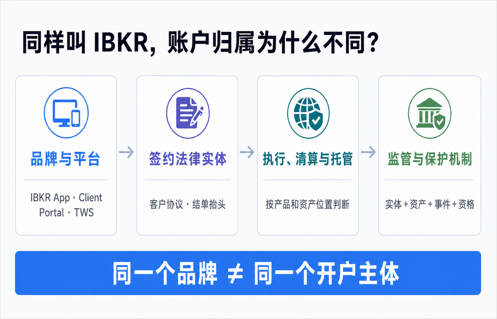
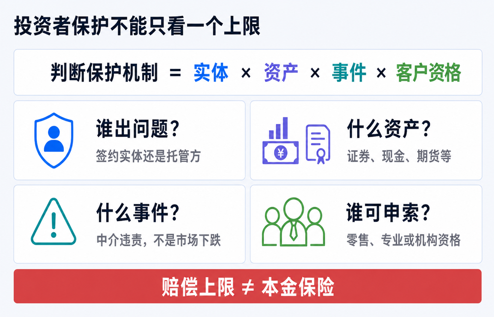
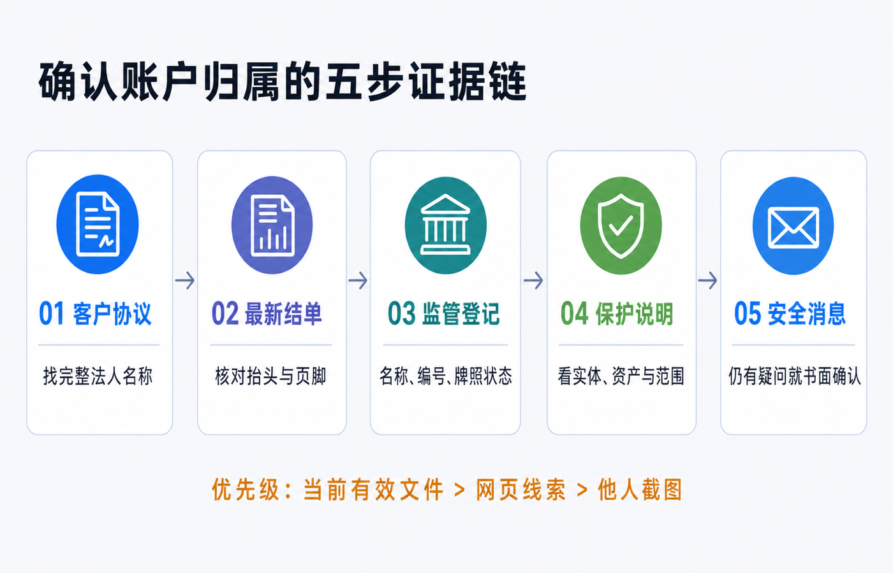

# 同样叫 IBKR，账户归属为什么不同：如何确认开户主体和监管地区

两个人都登录 IBKR，都看到相似的 Client Portal、TWS 和手机 App，也都能买美股，账户却可能不属于同一家公司。

原因很简单：IBKR 是品牌和技术平台，真正与你建立合同关系的是一家写在客户协议和正式结单上的法律实体。签约实体、执行方、清算方、托管方还可能不是同一家公司；监管机构和投资者赔偿机制也要沿着这条链条逐项判断。

因此，“我用的是 IBKR”只回答了品牌问题。你真正要确认的是：

1. 我当前与哪一家完整法定名称的公司签约？
2. 不同资产由谁执行、清算或托管？
3. 哪个监管机构管辖这家实体？
4. 如果中介人违责，哪些资产、哪些客户可能适用什么保护？

> 本文是账户结构与文件核验说明，不构成开户、投资、法律、税务、银行或跨境资金建议。开户分配、产品范围、托管安排和投资者保护可能随法律居住地、账户类型、客户分类、产品及集团调整而变化。请以你当前有效的客户协议、最新正式结单、监管登记和 IBKR 书面回复为准。资料核对日期：2026-07-15。

## 先记住一句话：品牌不是开户主体

IBKR 是集团品牌，Interactive Brokers LLC 只是集团中的一家法律实体，不是所有 IBKR 客户的当然签约方。

IBKR 当前的官方关联公司披露列出了美国、加拿大、英国、爱尔兰、澳大利亚、香港和新加坡等地的实体。它们有各自的完整名称、注册地址、监管机构、牌照和客户保护说明。

把一个账户说清楚，至少要分四层：

| 层级 | 它回答的问题 | 更可靠的证据 |
|---|---|---|
| 品牌与平台 | 我使用什么网站、App 和交易系统？ | IBKR、Client Portal、TWS 等界面名称。 |
| 签约法律实体 | 谁与我签订客户协议并提供经纪服务？ | 当前有效协议、开户确认、正式结单抬头。 |
| 执行、清算与托管 | 谁执行订单，谁记录或持有现金与证券？ | 结单附注、产品披露、客户资产与保护说明。 |
| 监管与保护机制 | 谁监管哪家实体，什么事件和资产可能获赔？ | 监管登记、对应实体的官方保护条款。 |

四层可能出现不同公司名称。某个地区实体与客户签约，同时由集团内另一实体清算或托管部分证券，并不矛盾；这只是合同层和资产层不同。

如果你通过第三方券商、顾问或介绍经纪商开立账户，还要再问一层：前台品牌、介绍方、签约券商、执行方和清算托管方分别是谁。能够登录 IBKR 软件，只能证明存在技术或账户连接，不能单独证明你是 Interactive Brokers LLC 的直接零售客户。

## 为什么同样开户，实体仍可能不同

### 法律居住地是重要资料，但不是一张公开分配表

IBKR 的账户资料会记录 Country of Legal Residence。不同司法辖区的准入、监管和产品规则不同，因此法律居住地可能影响开户或后续服务安排。

但不能把“居住在某地”机械地换算成“必然属于某实体”。IBKR 并未提供一张对所有账户永久有效的公开自动分配表；开户时间、账户类型、服务渠道、集团迁移和个案合规审查都可能改变结果。

旧教程常说“开户地区选定后永远不能改”。IBKR 2026 年的 Client Portal 指南明确显示，个人资料中可以更新 Country of Legal Residence；指南也提示，在新居住地不是受限地区时，客户可能仍留在原 IBKR 实体。这里的“可能”很重要：更新资料不等于一定迁移，也不等于一定不迁移，实际结果要看账户通知和正式文件。

### 税务居民、国籍和法律居住地不是同一个字段

护照、常住地址、法律居住地和税务居民身份回答的是不同问题。它们会影响身份核验、税务表格和合规判断，但不能用其中一个字段反推完整合同关系。

不要为了试图分配到某个实体而填写虚假地址、税号或税务居民身份。错误资料可能造成补件、税表错误、账户限制或迁移困难。

### 账户类型、客户分类和产品范围可能不同

个人、联名、公司、信托、顾问或介绍经纪商客户，现金账户、保证金账户，以及零售、专业或机构客户，适用的文件和服务边界可能不同。

某实体能提供股票交易，不代表所有客户都能获得相同的期权、融资、基金、差价合约、加密相关服务或地区产品。产品由谁承载，也可能改变资产的清算托管和保护判断。

### 开户时间和历史迁移会留下差异

监管结构和集团安排会变化。两个现在住在同一地区的人，可能因为开户时间不同、是否接受过实体迁移、账户类型或服务渠道不同，而继续处在不同安排下。

因此，别人的旧截图只能说明他的账户在某个时点显示了什么，不能替代你的当前协议和结单。

## 常见法律实体与监管地区：只用来识别名称

下表依据 IBKR 当前官方关联公司披露整理，只展示常见示例，不是开户分配表，也不是完整实体清单。

| 地区 | 法律实体示例 | 官方披露的主要监管或会员关系 |
|---|---|---|
| 美国 | Interactive Brokers LLC | SEC、CFTC 监管；FINRA、SIPC 等会员关系。 |
| 加拿大 | Interactive Brokers Canada Inc. | CIRO 与 Canadian Investor Protection Fund 会员。 |
| 英国 | Interactive Brokers (U.K.) Limited | FCA 监管，登记号 208159。 |
| 爱尔兰 | Interactive Brokers Ireland Limited | 爱尔兰中央银行监管，参考号 C423427；Irish ICS 成员。 |
| 澳大利亚 | Interactive Brokers Australia Pty. Ltd. | ASIC 监管，AFSL 453554。 |
| 香港 | Interactive Brokers Hong Kong Limited | 香港证监会监管；SEHK、HKFE 会员。 |
| 新加坡 | Interactive Brokers Singapore Pte. Ltd. | 新加坡金融管理局监管，CMS 牌照号 CMS100917。 |

这张表只能帮你识别“IBKR 不止一家公司”。它不能说明你的账户属于哪家，也不能说明全部资产由该签约实体直接持有。

## 投资者保护不能只背一个上限数字

讨论账户归属时，人们常立刻问：“我是 SIPC，还是香港 50 万港元保障？”这个问题仍少了至少四个条件：

1. **谁出问题**：签约实体、清算方还是托管方？
2. **什么资产**：证券、现金、期货、外汇或其他产品？
3. **什么事件**：中介人失败且客户资产缺失，还是普通市场下跌？
4. **谁可申索**：零售、专业、机构或其他客户分类是否合资格？

### Interactive Brokers LLC：SIPC 不是市场亏损保险

IBKR 的美国客户保护页列示，Interactive Brokers LLC 的证券账户适用 SIPC 最高 50 万美元，其中现金子限额 25 万美元。该页同时明确：期货和期货期权不在这项覆盖内，保护针对券商失败，不赔证券市值下跌。

SIPC 自己的说明也强调，它在 SIPC 会员券商财务失败、客户账户中的现金或证券缺失时介入。它不是对投资收益、本金或任何价格波动的保险。

### Interactive Brokers Hong Kong：本地基金与美国托管可能同时出现

IBHK 官方页面说明，香港投资者赔偿基金的范围限于在香港交易所交易的金融产品，以及经沪深港通北向交易的证券；证券交易和期货合约交易的赔偿上限分别为每名投资者、每宗个案 50 万港元。它针对中介人失败，不针对市场价值下跌。

同一页面还说明，IBHK 会把部分证券头寸托管在美国关联公司 Interactive Brokers LLC。只有对实际托管在 IBLLC、并符合页面所列条件的证券或相关现金，才继续讨论 SIPC；若需要在 IBLLC 的 SIPC 清算程序中提出申索，IBHK 表示会代表客户处理。

这正说明“账户属于 IBHK”和“部分资产由 IBLLC 托管”可以同时成立。

### Singapore、Ireland 和 U.K. 也要按层判断

IBSG 的官方页面说明，其部分证券头寸托管在 IBLLC；SIPC 的讨论只适用于该托管范围和页面条件，不等于 IBSG 账户的所有产品都自动获得同一保护。

IBIE 的官方页面说明，Irish Investor Compensation Scheme 面向部分合资格客户，不覆盖机构和专业客户；赔偿为损失的 90%，每名投资者最高 2 万欧元。该页面同时说明，部分由 IBLLC 托管的证券可能按所列条件涉及 SIPC。

IBUK 的官方披露说明，账户由 IBLLC 清算和承载，某些有限产品由 IBUK 承载；英国 FSCS 只在有限情形下覆盖产品。不能看到英国实体名称，就把所有持仓都套入一个 FSCS 上限。

这些数字和条件都可能变化。需要判断时，应重新打开与你实体完全对应的官方页面，而不是收藏一个旧截图。

## 如何确认自己的开户主体：按证据强度查五遍

### 第一步：生成带客户协议的账户确认函

IBKR 当前 Client Portal 指南提供了 Account Confirmation Letter with Customer Agreement。路径是 Performance & Reports > Other Reports > Supplemental > Account Confirmation Letter with Customer Agreement；选择账户和语言后运行报告。

优先看这份与你账户绑定的确认函、你实际接受的协议，以及后续迁移或修订通知，不要只打开官网通用模板。有多个 linked accounts 时应逐一生成；同一个登录入口不证明所有账户都归属同一实体。

记录这些字段：

- 完整法律实体名称，不要只记 IBKR；
- 注册地址、公司编号或监管编号；
- governing law、争议和投诉条款；
- 谁负责执行、清算或托管；
- 协议版本、接受日期及后续修订。

如果开户后收到过“迁移实体”“重新接受协议”或“服务条款更新”，要把新旧文件串起来判断当前版本。

### 第二步：下载最新完整 Activity Statement

IBKR 当前 Client Portal 指南给出的路径是 Performance & Reports > Statements；可运行 Activity Statement 并选择 PDF、HTML 等格式。

不要只看 App 首页。检查完整文件的：

- 首页抬头和页脚公司全称；
- Notes、Legal Notes 或监管披露；
- 账户号码、报告主体和账户类型；
- 现金、持仓与产品附注；
- 税务文件或交易确认由谁出具。

客户协议说明合同关系，最新结单帮助确认当前报告与承载安排。两者应该能互相解释；如果名称不一致，不要自行猜测，进入第五步书面询问。

### 第三步：拿完整名称到监管机构官网反向核验

建议按实体查，而不是只搜索“Interactive Brokers”：

- Interactive Brokers LLC：FINRA BrokerCheck，当前页面列出 CRD 36418、SEC 8-47257；
- Interactive Brokers Hong Kong Limited：香港证监会持牌人及注册机构公众纪录册；
- Interactive Brokers Singapore Pte. Ltd.：MAS Financial Institutions Directory；
- Interactive Brokers (U.K.) Limited：FCA Financial Services Register，FRN 208159；
- Interactive Brokers Ireland Limited：爱尔兰中央银行 Registers，参考号 C423427。

核对完整法定名称、编号、牌照状态、获准业务和限制条件。不要因为搜索结果里出现集团中任意一家，就停止核验。

### 第四步：阅读该实体自己的客户保护页面

继续回答：

- 哪类客户合资格？
- 哪些证券、现金或产品属于范围？
- 保护针对哪一家实体的什么失败事件？
- 是否由集团关联公司或第三方托管？
- 哪些资产明确不覆盖？
- 上限如何计算，账户是否合并？

如果一段宣传只说“客户资产受保护”，却没有说明实体、资产、事件和资格，信息仍不完整。

### 第五步：通过安全消息书面确认

仍有疑问时，在 Client Portal 的安全消息或正式工单中一次问清，并保留回复。可以使用这段模板：

> 请确认我的账户当前与哪一家 Interactive Brokers 法律实体签约；适用哪个监管地区；账户中的港股、美股、现金和其他产品分别由哪一实体执行、清算或托管；各类资产在中介人违责时可能适用哪些客户保护安排；如果我的法律居住地变化，是否需要迁移实体或重新签署协议。

在工单中使用系统已关联的账户即可。不要在公开论坛展示完整账户号、地址、税号、手机号或结单。

## 哪些信息只能当线索，不能当结论

| 线索 | 为什么不够 |
|---|---|
| U、F 等账户前缀 | 账号样式可能反映系统或账户结构，不能代替法定名称和协议。 |
| 网站域名 | 地区入口与合同主体不是同一概念，页脚还可能列出多家关联公司。 |
| App Store 地区或界面语言 | 同一个 App 可以服务多个实体。 |
| Profile 中显示的国家地区 | 它是账户资料字段，不等于结单上的签约法律实体。 |
| 入金银行或收款人 | 资金路径可能经过指定银行、虚拟账户或集团安排。 |
| 基础货币 | 它主要影响报表换算与显示，不会自动改变签约主体。 |
| 别人的截图或经验 | 居住地、开户时间、账户类型和迁移历史可能与你不同。 |

归档中的旧教程曾用账户前缀或设置页地区判断美国、香港等实体，也曾说地区一经选择就不能更新。按当前官方指南，这些方法至多是线索，不能作为结论。

## 账户归属不同，可能影响什么

| 影响项 | 可能出现的差异 |
|---|---|
| 监管与投诉 | 主管机构、投诉渠道、适用法律和争议处理路径不同。 |
| 投资者保护 | 触发事件、合资格客户、产品范围、托管层和上限不同。 |
| 产品与权限 | 市场、基金、衍生品、融资或地区产品可能不同。 |
| 执行、清算与托管 | 不同产品可能由不同实体或外部托管人处理。 |
| 现金与利息 | 闲置现金安排、利率门槛、币种和银行路径可能不同。 |
| 入金与出金 | 收款银行、转账网络、处理时间和费用可能不同。 |
| 税务和报告 | 税表、预扣、信息申报和结单格式可能不同。 |
| 迁移与转仓 | 搬家或资料变化后，可能需要补件、重签或迁移资产。 |

这不意味着某个实体天然“更高级”。首先要保证账户资料真实，并且符合该实体当前允许服务的范围。

## 搬家或身份变化后，要重新核验

长期搬到另一个国家或地区，或者税务居民、地址、账户结构发生变化时，按顺序处理：

1. 如实更新法律居住地、税务居民身份、地址和联系方式。
2. 阅读系统发出的补件、限制、重新签约或实体迁移通知。
3. 变化前后分别下载协议、完整结单、成本基础和税务文件。
4. 检查入金指令、收款银行、产品权限和保证金安排是否变化。
5. 完成后重新执行五步证据链。

不要预设“改地址一定换实体”或“账户号没变就一定没迁移”。以正式文件的完整法人名称为准。

## 一张可保存的确认清单

- [ ] 当前客户协议写明完整法定名称。
- [ ] 已记录协议版本、接受日期和适用法律。
- [ ] 最新完整结单的抬头、页脚和协议能够互相解释。
- [ ] 已在对应监管机构官网核对名称、编号和牌照状态。
- [ ] 已确认自己的客户分类，而不只记录账户类型。
- [ ] 已按港股、美股、现金、期货等分别记录清算和托管方。
- [ ] 已读对应实体的客户保护页面，并记录触发事件、范围与排除项。
- [ ] 没有把赔偿上限写成本金保险或市场亏损保障。
- [ ] 仍有冲突时，已通过安全消息取得书面答复。
- [ ] 搬家、税务身份或账户结构变化后会重新核验。

## 结尾：不要问“IBKR 属于哪里”，要问“我的账户现在属于谁”

IBKR 可以提供统一的品牌和技术体验，但你的合同与监管关系落在具体文件、具体实体和具体资产安排上。

最可靠的顺序是：**当前客户协议 → 最新完整结单 → 官方监管登记 → 对应实体的保护说明 → 安全消息书面确认。**

只要这五份证据能够互相解释，你就能回答：谁为我提供经纪服务，谁执行、清算或托管我的资产，谁监管相关实体，出现中介人违责时应沿哪条路径处理。

## 参考资料

- Interactive Brokers, [Disclaimers and information on IBKR affiliates](https://www.interactivebrokers.com/en/general/disclaimers.php)。
- IBKR Client Portal User Guide, [Profile](https://www.ibkrguides.com/clientportal/profile.htm)。
- IBKR Client Portal User Guide, [Account Confirmation Letter with Customer Agreement](https://www.ibkrguides.com/clientportal/performanceandstatements/acct-confirm-letter-cust-agreement.htm)。
- IBKR Client Portal User Guide, [How to Run a Statement](https://www.ibkrguides.com/clientportal/performanceandstatements/runstatement.htm)。
- Interactive Brokers, [IBKR entities and contractual responsibility disclosure](https://gdcdyn.interactivebrokers.com/Universal/servlet/Registration_v2.formSampleView?formdb=4176)。
- Interactive Brokers LLC, [Client Protection](https://www.interactivebrokers.com/en/general/security-investor-protection.php)。
- Interactive Brokers Hong Kong Limited, [Client Protection](https://www.interactivebrokers.com.hk/en/general/security-investor-protection.php)。
- Interactive Brokers Singapore Pte. Ltd., [Client Protection](https://www.interactivebrokers.com.sg/en/general/security-investor-protection.php)。
- Interactive Brokers Ireland Limited, [Client Protection](https://www.interactivebrokers.ie/en/general/security-investor-protection.php)。
- Interactive Brokers (U.K.) Limited, [Client Protection](https://www.interactivebrokers.co.uk/en/general/security-investor-protection.php)。
- FINRA, [Interactive Brokers LLC — BrokerCheck CRD 36418](https://brokercheck.finra.org/firm/36418)。
- Securities Investor Protection Corporation, [What SIPC Protects](https://www.sipc.org/for-investors/what-sipc-protects)。
- 香港证券及期货事务监察委员会，[持牌人及注册机构公众纪录册](https://www.sfc.hk/en/Regulatory-functions/Intermediaries/Licensing/Register-of-licensed-persons-and-registered-institutions)。
- Monetary Authority of Singapore, [Interactive Brokers Singapore Pte. Ltd. — Financial Institutions Directory](https://eservices.mas.gov.sg/fid/institution/detail/230005-INTERACTIVE-BROKERS-SINGAPORE-PTE-LTD)。
- Financial Conduct Authority, [Financial Services Register](https://register.fca.org.uk/s/)。
- Central Bank of Ireland, [Registers](https://registers.centralbank.ie/)。
