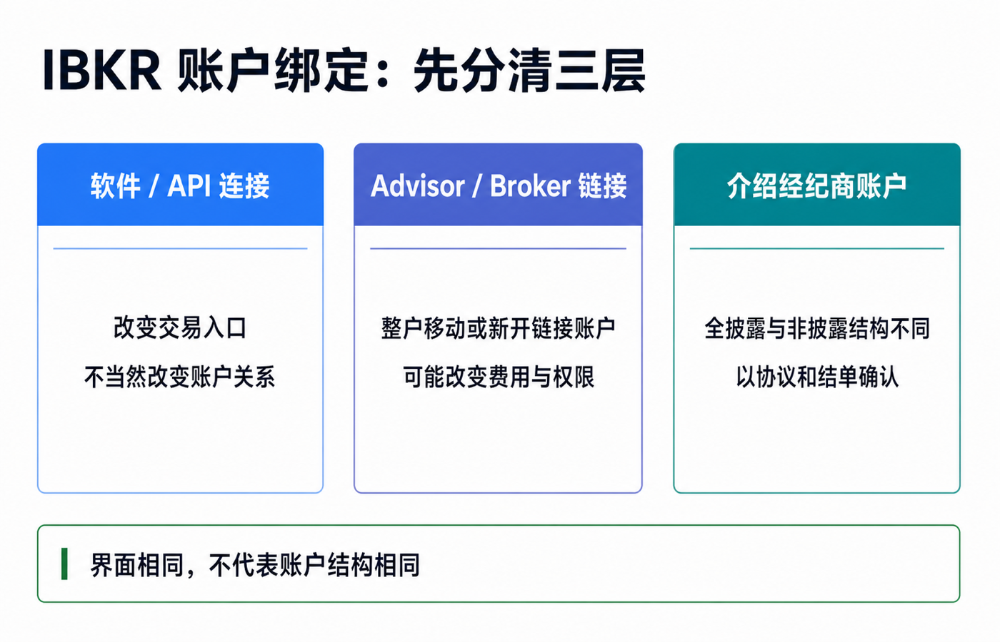
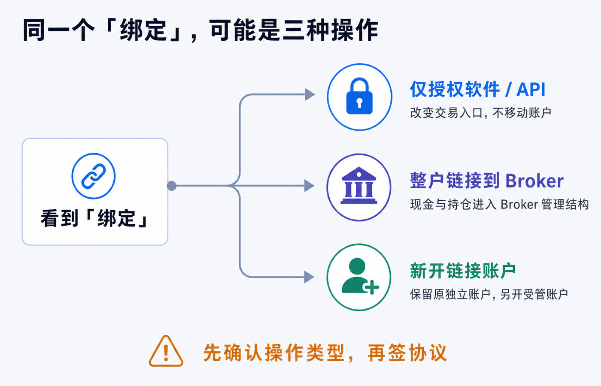
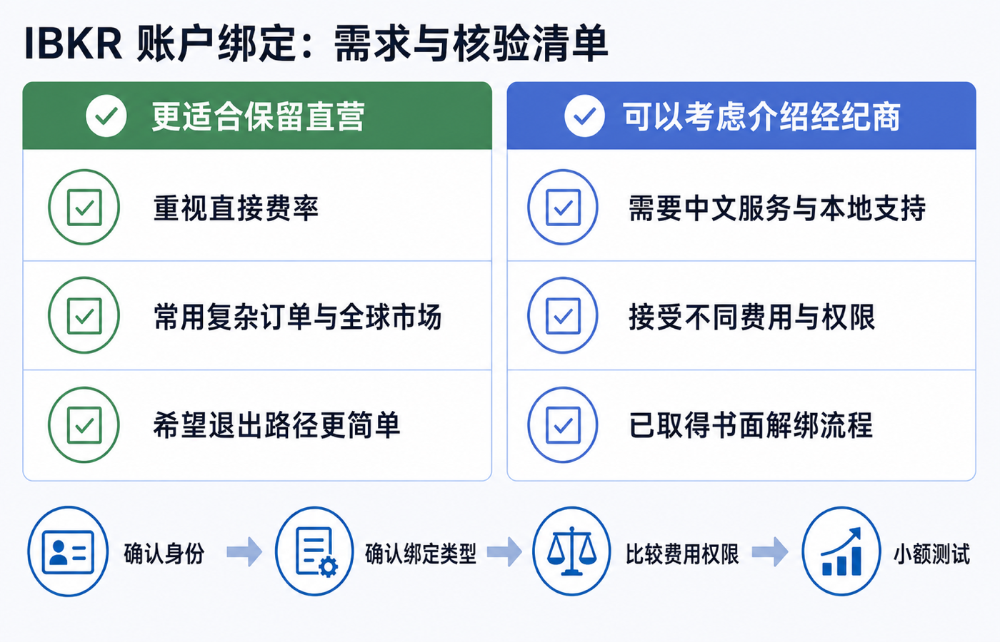

先说结论：**如果你只是觉得第三方 App 更容易用，不要立刻把现有 IBKR 账户整户绑定过去。先确认它究竟只是软件连接，还是会把账户移入介绍经纪商或顾问的主账户结构。**

这两种操作看起来都叫“绑定”，后果完全不同。

- 只授权第三方软件连接 IBKR，通常改变的是登录和交易入口，不当然改变签约实体、账户归属或收费关系。
- 把现有账户链接到 Advisor/Broker，IBKR 官方指南写的是移动整个账户，现金和持仓会进入 Advisor/Broker 管理的账户结构，之后还可能按对方设定扣费。
- 直接在第三方券商开户，还要继续区分全披露介绍经纪商、非披露或综合账户等结构，不能只凭“底层用了 IBKR”判断自己拥有哪一种账户。

对以自主交易、直接费率和长期可控为优先的人，保留 IBKR 直营关系通常更省心。对更看重中文服务、本地化界面、统一行情和操作支持的人，介绍经纪商账户也可能有价值，但要先接受它的费率、权限、服务责任和退出流程。

> 本文把直接面向 IBKR 开立并维护的客户账户简称为“直营账户”，这不是 IBKR 的正式账户类型名称。本文是账户结构和核验框架，不构成开户、投资、法律、税务、银行或跨境资金建议。具体结构会随平台、IBKR 签约实体、居住地、账户类型和协议变化。请以当前客户协议、完整结单、费用表和双方书面回复为准。资料核对日期：2026-07-16。

## “第三方平台”至少有三种，不要混为一谈

很多讨论把中文交易 App、量化软件、介绍经纪商和投资顾问都叫“第三方平台”。先拆成三类，后面的判断才有意义。

### 第一类：只是软件或 API 连接

第三方软件可以通过 IBKR 支持的连接方式读取行情、展示账户，甚至在授权范围内提交订单。IBKR 的 Trading Web API 文档明确区分：第三方软件供应商与客户没有正式账户管理关系；Advisor 或 Introducing Broker 则在 IBKR 内有正式账户结构并管理客户账户。

因此，**能在某个 App 里看见和交易 IBKR 账户，不等于账户已经挂到该公司的经纪商主账户下。**

这类连接的核心问题是授权范围和安全：它能否读持仓、读结单、下单或管理账户？IBKR 同时提醒，不要把用户名、密码和双重认证交给第三方。正规授权连接与“把密码发给别人代登”不是一回事。

### 第二类：把账户链接到 Advisor 或 Broker

这是账户结构变化，不只是换一个界面。

IBKR Client Portal 指南说明，选择“Link My Existing Account to an Advisor/Broker”会把整个账户移入 Advisor/Broker 管理结构：所有现金和持仓一起移动；移到 Broker 后仍可登录 TWS，现有行情订阅通常保留；移动完成后，可以按 Advisor 或 Broker 指定的方式从账户扣费；链接请求还要由对方批准。

IBKR 也提供另一条路：新建一个由 Advisor/Broker 管理的链接账户，同时保留原来的独立账户。两者可以用同一用户名访问，但资金要分别安排，权限也可能因为对方不具备相应资格而被移除。

所以看到“绑定”按钮时，先确认它是：

1. 整户移动；
2. 新开一个链接账户；
3. 只做软件授权。

### 第三类：一开始就在介绍经纪商体系下开户

介绍经纪商与客户建立直接服务关系，再把交易执行、清算、托管或技术能力的一部分交给 IBKR 或其他机构。IBKR 对 Introducing Broker 的定义也强调：介绍经纪商直接面对客户，但把场内操作和交易执行等工作委托给另一家公司。

这类结构还要继续分层。

| 结构 | IBKR 官方资料能确认什么 | 客户最该核对什么 |
|---|---|---|
| 全披露介绍经纪商 | 客户身份为 IBKR 所知；客户账户挂在 Broker 主账户下，客户可自行电子交易，也可能由 Broker 代为输入订单 | 客户协议抬头、IBKR 签约实体、Broker 的角色、费率和退出路径 |
| 非披露或综合结构 | 不是所有客户关系、开户和资金流程都与全披露结构相同；IBKR API 文档显示，非披露客户的入金可能要经由非披露主账户内部划转 | 自己是否有独立 IBKR 客户账户、谁接收资金、谁出具结单、谁负责客户资产和投诉 |
| 仅使用 IBKR 技术或 API | 使用 IBKR 的交易或技术能力，不等于客户与 IBKR 建立直接经纪关系 | 与哪家公司签约、订单交给谁、清算托管方是谁、能否登录官方 Client Portal |

“全披露”和“非披露”是账户与信息结构的区别，不是简单的安全评级。任何结构都要回到你自己的协议和结单，不能用平台宣传页替代。

## 直营账户和介绍经纪商账户，真正差在哪里

### 1. 客户关系和服务入口不同

直营账户通常由对应的 IBKR 法律实体直接受理开户、账户设置、结单和客户支持。介绍经纪商账户则多了一层面对客户的 Broker：它可能负责营销、中文支持、开户协助、界面和日常服务。

多一层服务并不天然是坏事。新手可能因此更容易上手，但遇到交易、出入金、权限和投诉问题时，要先知道该找 Broker 还是 IBKR，以及谁有权最终处理。

### 2. 佣金、融资利率和其他费用可能不同

这是最容易被忽略的差异。

IBKR 官方的 Broker Client Markups 页面列出，介绍经纪商可以设置交易佣金加价、借款利率加价、现金利息调低、借券费用加价，还可以提交电子账单。IBKR 的保证金融资页面也明确说明，公开利率适用于 IBKR 直营客户；由其他经纪商介绍的客户，融资利率可能由介绍经纪商选择而不同。

因此，即使你仍然使用 TWS、IBKR Mobile 或 Client Portal 下单，**也不能据此推断自己适用 IBKR 直营费率。**

比较费用时至少要看：

- 股票、期权、债券和外汇的最低佣金与平台费；
- 固定费率还是阶梯费率，是否有每笔最低收费；
- 融资利率、闲置现金利息和借券费；
- 行情订阅、顾问费、服务费和电子账单；
- 活动优惠结束后的常规费率。

### 3. 交易权限和产品范围可能被收窄

链接账户不保证原有功能全部不变。

IBKR 的链接账户指南说明，如果 Advisor 或 Broker 没有相应资格或权限，新链接账户中的某些交易权限会被移除；佣金计划不兼容也可能阻止链接。产品、市场、碎股、算法订单、融资和行情功能还可能受 Broker 结构、IBKR 实体和居住地共同影响。

不要只问“能不能买美股”。应该拿自己实际使用的功能逐项核对。

### 4. 入金、出金和结单路径可能不同

全披露客户与非披露客户的资金流程不应混写。IBKR 的账户管理 API 文档把 Fully Disclosed 和 Advisor 客户归入直接在子账户层发起入金的客户；非披露客户则通过非披露主账户进行内部资金划转。

这并不能替代你自己的银行指示和客户协议，但足以说明：**“底层接 IBKR，所以所有平台的入出金和托管都一样”是错误的。**

核对时看四份材料：

1. 入金指示中的收款人和最终入账账户；
2. 完整 Activity Statement 的抬头和法律脚注；
3. 客户协议中 execution、clearing、carrying、custody 的责任分配；
4. 出金由谁批准、可以转到哪些同名账户。

### 5. 退出和解绑不一定能恢复原样

IBKR 允许全披露介绍经纪商为客户开启自动 de-link；官方指南同时指出，开启后才可免去纸质表格、客户验证和 Broker 主账户另行同意。这意味着退出路径可能取决于 Broker 的设置和具体账户结构。

解绑前要问清：

- 能否在线发起，是否需要 Broker 同意；
- 是原账户脱离主账户，还是要新开账户再内部转移；
- 开放订单、行情、交易权限和费用计划会怎样处理；
- 碎股、成本基础、税务资料和历史结单能否完整保留；
- 处理期间能否交易和出金。

不要把“以后可以解绑”理解成“随时一键恢复到绑定前状态”。

## 三个常见误区

### 误区一：能用 IBKR 官方 App，就一定是直营账户

不一定。IBKR 明确允许全披露 Broker 客户电子交易，也允许整户移到 Broker 后继续使用 TWS。登录入口只能说明你能访问某套系统，不能单独证明收费关系和账户层级。

### 误区二：介绍经纪商绝对碰不到资金，所以结构都一样

这个说法太绝对。全披露和非披露的开户、资金与结单路径不同；经纪商还可能拥有费用扣取、客户支持、订单输入或账户管理权限。应以协议和结单确认责任，不要用一句口号概括所有平台。

### 误区三：绑定一定会让邀请奖励失效，解绑就一定恢复

IBKR 当前 Refer-a-Friend 条款列出了参与资格、入金、持有期和账户状态等条件，但没有在公开条款中给出一个可适用于所有 Broker 链接场景的简单结论。不要沿用旧经验直接下判断。

如果账户仍在奖励计算或股份锁定期内，绑定前应通过 IBKR 安全消息提供自己的账户类型、拟链接的 Broker 主账户和操作方式，要求书面确认奖励如何处理；同时让第三方平台书面说明其活动规则。

## 到底要不要绑定：用需求而不是宣传做决定

| 你的优先级 | 更倾向保留直营 | 可以考虑介绍经纪商 |
|---|---:|---:|
| 希望直接适用 IBKR 公布的客户费率 | ✓ | 先核对加价后再决定 |
| 经常使用复杂订单、全球市场和融资 | ✓ | 必须逐项核对权限与利率 |
| 最看重中文界面、本地服务和上手成本 |  | ✓ |
| 希望客户支持责任单一、退出路径简单 | ✓ | 先取得解绑书面流程 |
| 只想用更好看的第三方交易界面 | 优先考虑正规 API 连接 | 不必因此整户移动 |
| 想保留两套费率或做小额试用 | 保留原账户 | 新开链接账户比整户移动更便于隔离验证 |

没有一种结构对所有人更好。关键是第三方带来的服务价值，能否覆盖新增费用、权限限制和结构复杂度。

## 绑定前，向平台索要这十个答案

1. 你们只是第三方软件，还是 IBKR Advisor、Fully Disclosed Introducing Broker 或 Non-Disclosed Broker？
2. 绑定是整户移动、新开链接账户，还是仅做 API 授权？
3. 绑定后与我签约的完整法律实体分别是谁？
4. 谁负责客户服务、订单执行、清算、托管、结单和投诉？
5. 谁能看账户、输入订单、修改权限、提交收费或影响出金？
6. 请提供活动期和活动结束后的完整佣金、利率、行情与服务费表。
7. 我现有的市场权限、现金/保证金类型、碎股、算法订单和行情订阅会不会变化？
8. 入金收款人、出金审批和同名要求是否变化？
9. 解绑需要谁批准、处理多久、是否要新开账户或转移资产？
10. 未归属的开户链接奖励、税务资料、成本基础和历史结单如何处理？

把答案保存为邮件、协议或安全消息，不要只依赖客服聊天中的一句“都一样”。

## 如果已经绑定，做一次账户体检

绑定完成后不要只测试能否登录。建议在第一笔大额交易或入金前完成下面的核验：

1. 下载绑定前后的完整结单，对比抬头、账号、法律脚注和费用项目。
2. 在 Client Portal 查看账户配置、Pricing Plan、交易权限和市场数据。
3. 用一笔小额订单核对实际佣金，不要只看宣传费率。
4. 查看现金利息和保证金融资页面，确认账户实际适用利率。
5. 下载新的入金指示，确认收款人、备注和账户对应关系。
6. 向 Broker 与 IBKR 各发一条书面消息，确认解绑与投诉路径。
7. 开启并保留 IBKR 的双重认证；不要把密码或验证码交给平台人员。

## 最后的判断标准

绑定第三方平台不是一次普通的软件设置，而可能是客户关系、费用表和账户层级的变化。

如果第三方只能提供一个更顺手的界面，优先研究正规 API 授权，不必因此移动整个账户。如果它能提供你确实需要的中文支持、本地服务、行情或交易工具，就把新增价值与长期费用、权限和退出成本放在同一张表里比较。

最稳的决策顺序是：

**先确认第三方身份 → 再确认绑定类型 → 对照完整费用和权限 → 核验协议与结单 → 小额测试 → 最后才移动整户。**

平台名称会变，活动会结束，费率会调整。只要你能说清谁是合同相对方、谁能做什么、钱和证券经过谁、费用由谁设定、怎样退出，就不会被“底层是 IBKR”这句话带偏。

## 参考资料

- Interactive Brokers, [Broker Account and Fully Disclosed Broker Structure](https://www.interactivebrokers.com/en/accounts/broker.php)。
- IBKR Campus, [Introducing Broker](https://www.interactivebrokers.com/campus/glossary-terms/introducing-broker/)。
- IBKR Campus, [Fully Disclosed Broker](https://www.interactivebrokers.com/campus/glossary-terms/fully-disclosed-broker/)。
- IBKR Client Portal User Guide, [Link My Existing Account to an Advisor/Broker](https://www.ibkrguides.com/clientportal/moveaccounttoadvisorbroker.htm)。
- IBKR Client Portal User Guide, [Create a New Linked Account Managed By an Advisor or Broker](https://www.ibkrguides.com/clientportal/createlinkedaccountunderadvisorbroker.htm)。
- Interactive Brokers, [Broker Client Markups](https://www.interactivebrokers.com/en/pricing/broker-client-markups.php)。
- Interactive Brokers, [Margin Rates and Financing](https://www.interactivebrokers.com/en/accounts/fees/pricing-margin-rates.php)。
- IBKR Broker Portal User Guide, [Allow Client to Delink](https://www.ibkrguides.com/brokerportal/allow-clients-to-delink.htm)。
- IBKR Campus, [Account Management Web API — Client Types and Funding](https://www.interactivebrokers.com/campus/ibkr-api-page/web-api-account-management/)。
- IBKR Campus, [Trading Web API — Third-Party Access](https://www.interactivebrokers.com/campus/ibkr-api-page/web-api-trading/)。
- IBKR Campus, [Third Party Connections](https://www.interactivebrokers.com/campus/ibkr-api-page/third-party-connections/)。
- Interactive Brokers, [White Branding](https://www.interactivebrokers.com/en/trading/white-branding.php)。
- Interactive Brokers, [Refer-a-Friend Program Terms and Conditions](https://portal.interactivebrokers.com/Universal/servlet/Registration_v2.formSampleView?formdb=4051)。
- Interactive Brokers, [Phishing Scams and Account Access Safety](https://www.interactivebrokers.com/en/general/phishing-scams.php)。
