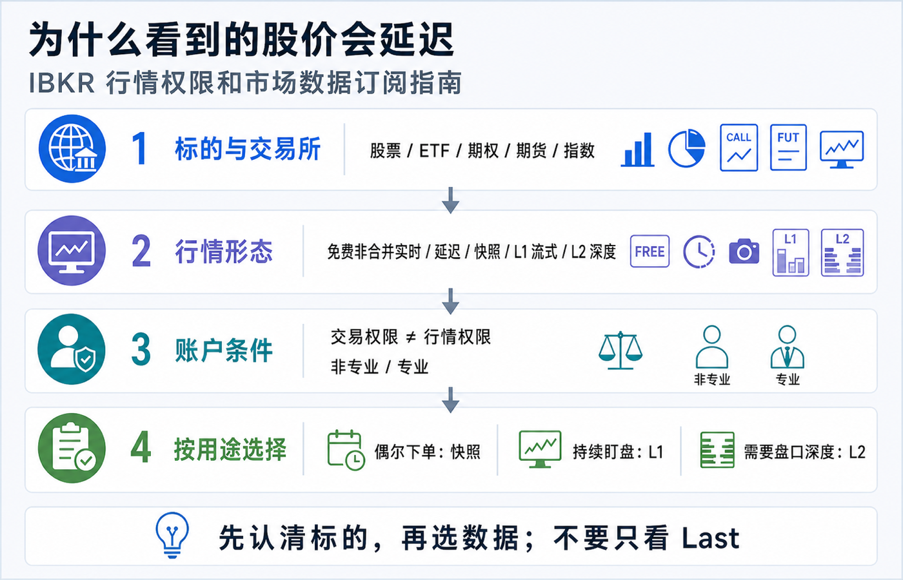
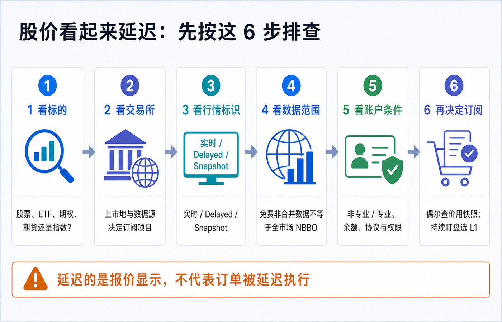
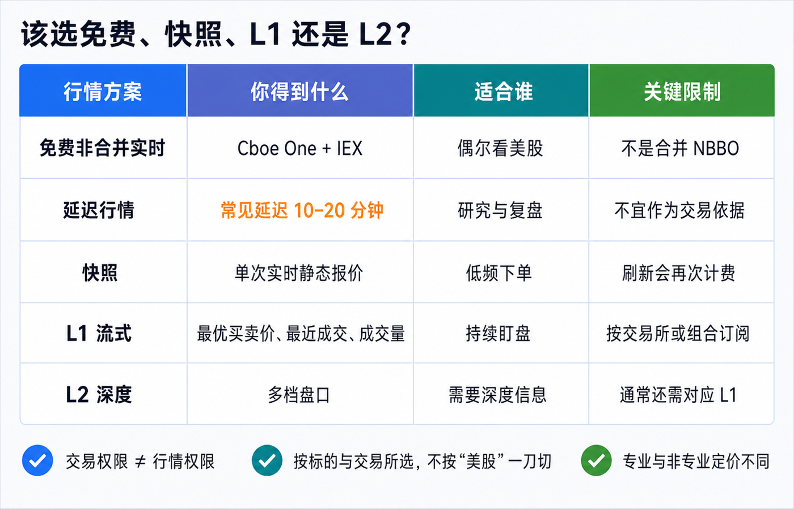

在 IBKR 里看到 `Delayed`、价格长时间不动，或者发现报价与另一个 App 不一样，通常不代表订单也被延迟了。更常见的原因是：你看的证券来自哪家交易所、账户拿到哪种数据、看到的是合并还是非合并行情，以及这份数据是否需要单独订阅。

先记住结论：**交易权限决定能不能下单，行情权限决定能看到什么数据；两者不是同一个开关。** 延迟报价只适合参考。订单仍会进入当时的市场，但如果你依据旧价格下单，限价可能离市场很远，市价单又可能以与你屏幕不同的价格成交。

> 本文是平台功能和市场数据教育，不构成投资、交易、开户、法律、税务或跨境资金建议。数据范围、费用、豁免门槛、账户最低资产、专业身份和菜单会因账户实体、居住地、用户名、平台与交易所规则变化。下单前请以本人 Client Portal、订单预览和 IBKR 当前官方定价页为准。资料核对日期：2026-07-16。

## 先把 4 件事拆开

| 项目 | 它回答的问题 | 常见误解 |
|---|---|---|
| 交易权限 | 账户能否交易某个国家、市场和产品？ | 能下单就一定自带实时行情。 |
| 行情订阅 | 用户名能接收哪些交易所、哪一级别的数据？ | 开了“美股权限”就覆盖所有美股、期权和指数。 |
| 数据形态 | 免费非合并、延迟、快照、L1 还是 L2？ | 只要数字在跳就是完整实时行情。 |
| 使用方式 | TWS、第三方显示、API 非显示使用属于哪一类？ | 一份订阅可以无条件共享给所有用户名和用途。 |

IBKR 的订阅页面会按平台与地区区分 TWS、Alternative Display 和 Non-Display。使用 NinjaTrader、Excel、API 或自建程序时，不能只确认 TWS 里有数据；相关交易所协议和 API 确认也可能不同。

反过来，某些账户即使没有相应交易资格，仍可能付费订阅数据。IBKR 定价页明确提醒：产品交易限制不会当然免除你主动订购的数据费用。美国期货等特定数据组合又可能把交易权限列为数据使用前提，所以应以具体订阅项目的脚注为准。

## 你可能看到的 5 种行情

### 1. 免费实时非合并数据：实时，但不是全市场

IBKR 当前为美国上市股票和 ETF 提供来自 Cboe One 与 IEX 的免费实时流式数据。它的关键词是：**实时、免费、非合并**。

非合并数据只来自部分交易场所，不会把所有交易所的报价合成全国最佳买卖价（NBBO）。因此，同一只美股在 IBKR 免费行情与另一家提供合并行情的平台上，Bid、Ask、Last 或成交量可能不同。这不一定是谁“慢了”，也可能是数据覆盖范围不同。

如果你只是偶尔查看流动性较好的美股，它可以提供有用的实时参考；如果你要根据全市场最优买卖价持续交易，就需要进一步看合并快照或相应的流式订阅。

### 2. 延迟行情：通常落后 10–20 分钟

IBKR 对可提供延迟数据的市场，常见延迟为 10–20 分钟。当前表格列出的例子包括：CME、CBOT 与 CFE 常见延迟 10 分钟，OPRA 美国期权常见延迟 15 分钟，部分股票或地区市场可能是 15 或 20 分钟。

延迟时长不是平台承诺的最大误差。IBKR 明确提示，延迟报价只应用于指示性参考，仍可能出现额外延迟；而且并非所有市场、实体和产品都会提供延迟数据。例如官方页面注明，出于监管要求，Interactive Brokers LLC 已不再向其客户提供美国股票延迟报价。

因此不要凭“看起来大约慢 15 分钟”判断数据状态。应看报价旁的 `Delayed`、时钟或其他行情标识，再查具体交易所。

### 3. Snapshot / 快照：按一次，取一次实时静态报价

快照不是连续更新的行情。你点击 Snapshot 后得到当时的一次实时报价；刷新就构成下一次请求。

IBKR 当前定价页列示，美国上市股票和 ETF 的快照为每次 0.01 美元，其他工具通常为每次 0.03 美元；账户每月有 1 美元的快照费用减免，等价于最多 100 次 0.01 美元请求。美国股票和 ETF 的快照可提供来自合并 Tapes A、B、C 的 NBBO 与 Last Sale 信息。

当某个市场当月的快照费用达到相应流式服务成本时，IBKR 可能把该市场升级为当月剩余时间的流式服务；月末再重置。低频下单可以利用快照，反复刷新则可能接近订阅成本。

### 4. L1 / Level 1：持续显示最优一档

L1 通常提供最优 Bid、最优 Ask、最近成交价和成交量，也就是 top of book。它适合需要持续盯盘、频繁查看自选列表或持续使用订单票据的人。

L1 仍要按市场选。不能只说“我要美股实时行情”，因为 NYSE、NYSE American/ARCA/BATS/IEX/区域交易所、NASDAQ、美国期权与指数采用不同数据源。

### 5. L2 / Level 2：多档盘口，不是“更准的最新价”

L2 展示多个买卖价位和挂单深度，适合确实需要观察订单簿的人。它不保证成交，也不能预测价格。

IBKR 当前说明还提醒，L2 服务通常不能代替相应 L1。以 NYSE ArcaBook 为例，查看 ARCA 深度仍需要对应 Network B 的 top-of-book 数据。新手如果只需要下普通股票或 ETF 订单，先确认可靠 L1，通常比直接购买 L2 更重要。

## 股价看起来延迟：按 6 步排查

### 第一步：确认你选中了哪一张合约

同一个代码可能对应股票、ETF、期权、期货、指数或不同上市地。先记录完整名称、资产类型、交易所和交易货币，不要只记代码。

### 第二步：找上市交易所和实际数据源

美国股票常按主要上市网络区分；ETF 又可能在 ARCA 等市场上市。期权的报价来自 OPRA，标的股票和指数可能另需数据。

### 第三步：看行情状态，而不是只看 Last

检查页面是否显示 `Delayed`、`Snapshot`、`Consolidated` 或其他标识，并同时看 Bid、Ask、Last 和时间戳。Last 只是最近发生的一笔成交，不是你现在可以买到或卖出的保证价格。

### 第四步：判断是“延迟”还是“非合并”

如果数字实时变化，但与其他平台不同，可能是 Cboe One + IEX 免费非合并数据与全市场合并 NBBO 的差异，而不是延迟。如果长时间不动并明确标记 Delayed，再继续查订阅。

### 第五步：检查用户名、专业身份、余额和协议

订阅按用户和用途计费。确认当前登录的是哪个真实或模拟用户名，Market Data Subscriber Status 是什么，计费账户有没有达到最低资产要求，交易所协议是否已接受。

IBKR 当前对普通个人账户列出的市场数据订阅最低净资产要求为 500 美元等值，且还要有足够资金支付订阅费用。它不是开户最低入金，而是激活和维持付费市场数据的条件。

### 第六步：用 Market Data Assistant 查具体标的

在 Client Portal 进入 `Get Help → Market Data Assistant`，输入具体证券。结果会按交易所、专业/非专业与深度版本列出可选项目。它比照抄别人的订阅截图更可靠。

## 美股、ETF 和期权分别对应什么

| 数据源 | 常见覆盖 | 官方示例 | 新手要注意什么 |
|---|---|---|---|
| NYSE / Network A / CTA | NYSE 上市证券的 L1 | F、LLY | 当前非专业价格示例为每月 1.50 美元。 |
| Network B | NYSE American、ARCA、BATS、IEX 与区域交易所 L1 | SPY、VXX、IBKR | 很多 ETF 在这一组，不要只按公司名字判断。 |
| NASDAQ / Network C / UTP | NASDAQ 上市证券 L1 | AAPL、MSFT、TSLA | 当前非专业价格示例为每月 1.50 美元。 |
| OPRA | 美国交易所挂牌期权 L1 | 美股与指数期权合约 | 当前非专业价格示例为每月 1.50 美元；期权 Greeks 还可能需要标的数据。 |
| Cboe Streaming Market Indexes | Cboe 指数 L1 | SPX 等 | 期权行情不当然包含对应指数现货值。 |

2026-07-16 查验时，Network A、B、C 的非专业 L1 均列为每月 1.50 美元，三项合计 4.50 美元；OPRA 非专业 L1 列为每月 1.50 美元。这个算式只说明当前单项标价，不代表每个账户都应全部订阅。

IBKR 也提供 `US Equity and Options Add-On Streaming Bundle`。当前页面列示非专业费用为每月 4.50 美元，但它要求先订阅 `US Securities Snapshot and Futures Value Bundle`。前置组合当前列示 10 美元基础费并可能按活动豁免；具体资格、地区可用性与佣金豁免不能只看组合名称，必须连同脚注和本人页面一起确认。

归档中的 2024 年旧文曾把“单订 A、B、C、OPRA”和“两组套餐”按当时门槛直接比较。当前免费非合并数据、组合资格与豁免说明已经变化，因此本文不沿用旧结论，只保留“按实际标的和交易频率计算”的方法。

## 该选免费、快照、L1 还是 L2

| 你的使用方式 | 更值得先考虑 | 原因 |
|---|---|---|
| 偶尔查看美国上市股票或 ETF，不依赖全市场最优价 | 先用免费非合并流式数据 | 已有实时变化，但要接受不是合并 NBBO。 |
| 每月只下少量订单，希望下单前看一次全市场报价 | Snapshot | 按次获得实时静态 NBBO，低频时可能更省。 |
| 持续盯盘、频繁刷新自选列表 | 对应市场的 L1 | 自动流式更新，避免不断请求快照。 |
| 同时交易 NYSE、ARCA/区域市场与 NASDAQ 股票 | A、B、C 单项或满足条件的组合 | 逐项比较总价、前置订阅和活动豁免。 |
| 交易美国期权 | OPRA，并核对标的股票或指数数据 | 期权价格、标的价格和 Greeks 的数据依赖不同。 |
| 真正需要看多档挂单 | 对应 L1 + 所需 L2 | L2 通常不是独立替代品。 |

最小订阅原则不是“什么都不买”，而是：先列出自己实际交易的 5–10 个标的，逐个查交易所，再购买能够覆盖这些标的和使用频率的最低层级。

## Client Portal 订阅操作路径

IBKR 2026 年更新的当前官方路径是：

1. 登录 Client Portal。
2. 进入 `Settings → Trading Platform → Market Data Subscriptions`。
3. 查看 Current Subscriptions、Market Data Subscriber Status 和 Billable Account。
4. 点击 Current Subscriptions 右侧齿轮。
5. 选择平台用途与地区，例如 TWS、Alternative Display 或 Non-Display。
6. 勾选要订阅或取消的项目，并阅读交易所协议和前置条件。
7. 点击 Continue，复核名称、专业身份、费用和计费账户。
8. 完成确认；正常情况下更新立即生效。

如果系统要求填写非专业问卷，应按真实职业、注册资格和使用目的回答。不要为了获得较低费用而选择不符合事实的身份。

## “非专业”不是 IBKR Pro，“专业”也不是交易水平

市场数据的 Professional / Non-Professional 由交易所和数据商规则决定，与 IBKR Pro / Lite 佣金计划不是同一个分类，也不表示你是否擅长交易。

IBKR 当前概括的非专业条件包括：自然人、未在证券或商品监管机构注册、不是投资顾问，也不是在金融机构从事原本需要注册资格的相关工作。公司、LLC、合伙企业等组织通常会被归为专业用户；个人如果把数据用于业务，也可能属于专业用户。

专业价格可能远高于非专业价格。职业、账户结构或用途发生变化时，应在订阅页面更新问卷，而不是继续沿用旧答案。

## 订阅前还要看 5 条计费规则

1. **通常不按天折算。** 月中订阅或取消，仍可能收取整月费用。
2. **从订阅日开始计费。** 只试用几分钟也不等于免费试用。
3. **按用户计费。** 同一账户有多个订阅用户时可能多次收费。
4. **活动豁免逐项计算。** 佣金不能当然同时抵扣所有服务，先应用哪个项目也有规则。
5. **长期不登录 TWS 可能终止订阅。** 当前指南说明，60 天未登录 TWS 后订阅会进入待终止流程；收到通知后仍有保留窗口，最终可能在当月末失效。

取消前先看当月是否已经计费，取消后再回到 Current Subscriptions 确认状态。不要只删除 TWS 自选列表，就以为数据订阅也被取消。

## 行情延迟会怎样影响下单

报价显示延迟，不等于 IBKR 把订单暂存 15 分钟后再发送。订单会按当时市场和你选择的路由、订单类型、交易时段处理。

真正的风险是信息错位：

- 延迟 Last 仍是 100 美元，实时 Ask 已经是 103 美元；市价买单可能接近当前 103 美元成交。
- 延迟 Bid 是 100 美元，你挂 99.50 美元限价买单；实时市场已经涨到 103 美元，订单可能长期不成交。
- 盘前盘后流动性较低，延迟报价和扩展时段价差会进一步放大误判。
- 期权只看合约 Last，不看当前 Bid/Ask 与标的价格，可能把很久以前的成交当成现价。

所以 IBKR 提醒延迟行情只用于指示性参考。需要真实交易时，至少在订单预览前取得适合该标的的当前 Bid/Ask 或实时快照，并使用能表达自己价格边界的订单类型。

## 8 个常见误区

1. **“开了美股交易权限，就有全部实时美股行情。”** 交易与数据是两套权限。
2. **“免费实时就是完整 NBBO。”** Cboe One + IEX 是非合并数据。
3. **“另一个 App 价格不同，IBKR 一定延迟。”** 可能是数据源、交易时段或合并范围不同。
4. **“L2 比 L1 的最新价更准确。”** L2 增加深度，不是另一套保证价格。
5. **“订了 OPRA，就有 SPX 指数和全部 Greeks。”** 指数或标的数据可能仍需单独订阅。
6. **“基础货币是 USD，所以行情费一定按同样方式显示和扣款。”** 基础货币是报表计量尺，订阅仍按适用费用和计费账户处理。
7. **“月中取消就只收半个月。”** IBKR 当前明确说明通常不按比例折算。
8. **“模拟账户会自动拥有独立实时行情。”** 数据可能来自真实账户共享，并受用户名和同时登录规则影响。

## 一张可保存的订阅清单

- [ ] 已记录实际交易标的、资产类型、上市交易所和交易货币。
- [ ] 已确认屏幕显示的是实时、非合并、延迟、快照还是合并行情。
- [ ] 已分清交易权限、行情订阅和 API/第三方显示用途。
- [ ] Market Data Subscriber Status 与真实职业和用途相符。
- [ ] 计费账户满足最低净资产与订阅费用要求。
- [ ] 已用 Market Data Assistant 查询每个核心标的。
- [ ] 知道所选项目是 L1、L2、快照还是指数数据。
- [ ] 已检查前置订阅、地区限制、交易权限和协议。
- [ ] 已比较单项订阅、组合、快照和免费非合并数据的实际月成本。
- [ ] 已理解整月计费、按用户计费和活动豁免规则。
- [ ] 下单前会看当前 Bid/Ask，而不是只看 Last。
- [ ] 订阅后会在报表中复核实际扣费，并设置取消或复查提醒。

## 结尾：先问“我看的是哪份数据”

IBKR 行情订阅看起来复杂，是因为“美股”并不是一个数据源，“实时”也不只有一种范围。

最稳的顺序是：**标的与交易所 → 行情标识 → 合并或非合并 → 快照、L1 或 L2 → 专业身份与计费条件 → 订单预览。**

只要按这个顺序排查，你就能分清：屏幕是真的延迟、只是非合并数据、缺少某个市场订阅，还是把期权、指数和标的行情误当成同一件事。

## 参考资料

- Interactive Brokers, [Market Data Pricing](https://www.interactivebrokers.com/en/pricing/market-data-pricing.php).
- IBKR Client Portal User Guide, [Subscribe to Market Data](https://www.ibkrguides.com/clientportal/usersettings/marketdatasubscriptions.htm).
- IBKR Client Portal User Guide, [Market Data Assistant](https://www.ibkrguides.com/clientportal/marketdataassistant.htm).
- IBKR Trader Workstation User Guide, [Consolidated / Snapshot Market Data](https://www.ibkrguides.com/traderworkstation/snapshot-market-data.htm).
- IBKR Trader Workstation User Guide, [Classic TWS Snapshot Quotes](https://www.ibkrguides.com/traderworkstation/classic-snapshot-quotes.htm).
- IBKR Campus, [Market Data Subscriptions](https://www.interactivebrokers.com/campus/ibkr-api-page/market-data-subscriptions/).
