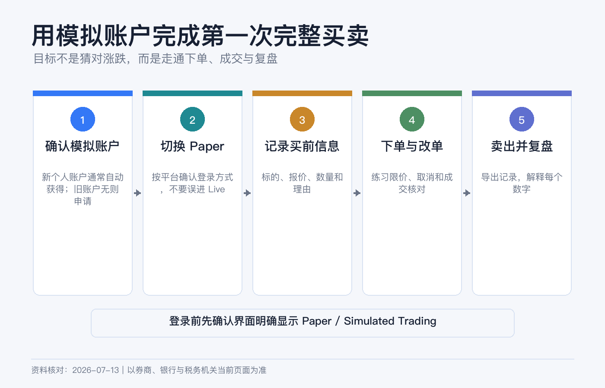
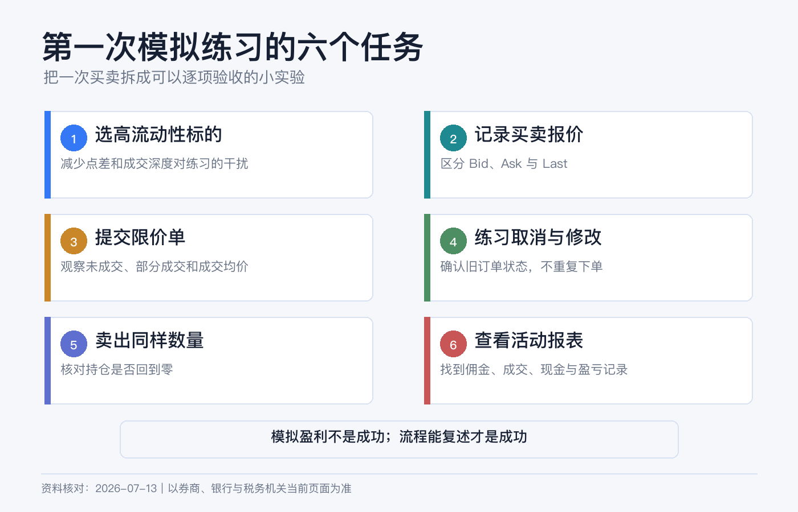
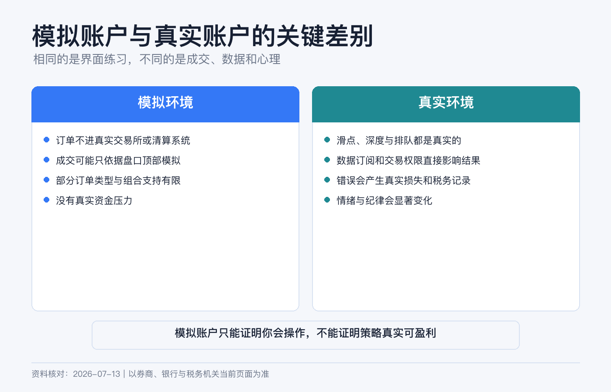

# 先别急着投入真金白银：用 IBKR 模拟账户完成第一次买卖

第一次打开 IBKR，最危险的通常不是“看不懂行情”，而是以为自己还在练习，实际却把订单发进了真实账户。

所以本文的目标非常具体：先进入 Paper Trading（模拟交易），用一笔买入和一笔卖出走完“搜索—预览—提交—成交—核对—平仓—下载记录”的闭环。你练的不是选股，而是账户操作。

> 本文是平台操作与风险教育，不构成投资、交易、税务或法律建议。IBKR 会按账户实体、地区、权限和软件版本调整入口；任何订单提交前，都要以当前页面的账户编号、币种、产品和风险提示为准。资料核对日期：2026-07-13。

## 先认清 5 个概念

| 概念 | 新手要记住什么 |
|---|---|
| Live / 真实账户 | 订单会进入真实市场，成交后产生真实资金和持仓变化。 |
| Paper / 模拟账户 | 订单由模拟器处理，不会在交易所成交，也不会在清算机构交收。 |
| 模拟资金 | IBKR 当前为新模拟账户提供 100 万美元的初始模拟权益；它不是赠金，也不能提取。 |
| 交易权限 | 模拟账户通常镜像关联真实账户的产品权限、账户类型和基础货币。没有某市场权限，模拟账户也未必能交易。 |
| 行情权限 | 没订实时行情时，模拟报价也可能延迟；“成交了”不代表你在真实市场也能以同价成交。 |

## 谁可以开模拟账户

IBKR 当前官方教程给出的核心条件是：先有一个已经批准的真实账户，再建立关联的模拟账户，**通常不要求先向真实账户入金**。新客户一般会自动获得模拟账户；较早账户可能需要在 Client Portal 里申请。正常情况下，创建可在 24 小时内完成。

官方不同页面仍能看到“approved and funded account”的旧式措辞，但同一套最新课程正文和测验都说明：真实账户需要获批，不是必须先入金。不同 IBKR 实体若没有显示入口，以本人 Client Portal 的要求为准，不要为了“解锁模拟”贸然汇款。

## 第一步：确认 Paper Trading 的登录方式

新个人账户当前通常会自动获得模拟账户；旧账户如果没有，可以先用真实账户登录 Client Portal，再到当前设置页查找 Paper Trading Account 并按提示申请。正常情况下，创建可在 24 小时内完成，但仍以本人账户提示为准。

登录凭证不能一概而论。IBKR 2026 年 1 月更新的 Client Portal 指南说明，已有模拟账户的普通个人客户可以在 TWS 使用真实账户凭证，再选择 production 或 paper；顾问、经纪商、对冲基金、管理员、推荐人，以及印度和日本居民等仍需使用独立的模拟账户凭证。查看模拟账户报表时，也可能需要用 Paper Trading 登录 Client Portal。

因此不要死记某一套用户名规则。先在本人使用的平台确认：模拟账户编号是什么、登录页如何切换、是否要求独立凭证。若平台要求两套用户名，都放进密码管理器并明确标注 `LIVE` 和 `PAPER`。

## 第二步：登录后做“三重确认”

Paper Trading 可用于 IBKR 的主要交易入口，具体登录方式随平台和账户类别而异。登录页若有 Live / Paper 开关，先选择 **Paper**，再使用页面要求的凭证。

进入后不要马上下单，先确认三处：

1. 页面明确显示 Paper、Simulated 或模拟环境标识。
2. 账户编号与刚才记录的模拟账户编号一致。
3. 权益大致是模拟初始金额，而不是你的真实入金与持仓。

只要其中一项对不上，立即退出。IBKR 官方特别提醒：如果界面没有清楚显示模拟环境，你可能正在真实账户中，并要对成交负责。

## 第三步：先看行情是不是延迟的

模拟账户的市场数据权限通常跟随真实账户。没有实时订阅时，IBKR 当前说明中美股和美股期权常见延迟 15 分钟、美国期货常见延迟 10 分钟；具体产品仍以报价旁的 `Delayed` 标识为准。

实时行情可从符合条件的真实账户共享给一个模拟账户，但共享数据时，真实与模拟用户名可能不能同时使用同一份数据。新手第一次练习不必为此购买行情：选择正常交易时段，先学会核对延迟标识、买卖价和订单状态即可。

## 第四步：完成第一次模拟买入

以下以 Client Portal 为例，手机端字段相近。练习标的选成交活跃、报价清楚的普通股票或宽基 ETF 即可；示例不代表推荐。

1. 进入 `Trade → Order Ticket`。
2. 搜索代码后，核对公司或基金全名、交易所、资产类型和计价货币。不要只看代码，因为不同市场可能有相似代码。
3. 选择 `Buy`，数量填 1 股；若使用碎股，要先确认标的与账户权限支持。
4. 第一次练习选择 `Limit` 限价单，在当前买卖价附近填一个你愿意接受的最高买价。
5. 有效期选择 `DAY`，先不勾选盘前盘后，避免把时段因素混进第一次练习。
6. 点击 `Preview`，核对方向、数量、限价、预计金额、佣金、币种和账户编号。
7. 确认仍是 Paper 账户后提交。

限价单不保证成交。价格没有到达你的限价时，订单停留在 Submitted / Working 很正常。不要为了看到“Filled”不断抬价；先去 `Trade → Orders & Trades` 找到订单，练习修改一次、取消一次，再重新提交合理价格。

成交后记录四个数字：成交数量、成交均价、佣金和成交时间。再到 Portfolio 查看持仓、现金、平均成本和未实现盈亏。行情延迟时，盈亏显示也可能与其他网站不同。

## 第五步：把同一持仓完整卖出

买入成交后，从 Portfolio 点开该持仓，选择 `Sell`：

1. 卖出数量不得超过当前持仓，避免把“平仓”变成“卖空”。
2. 继续使用 DAY 限价单，填你能接受的最低卖价。
3. Preview 时确认是 Sell、数量正确、账户仍为 Paper。
4. 提交后到 Orders & Trades 查看订单从 Submitted 到 Filled 的变化。
5. 成交后确认持仓归零，再核对已实现盈亏和现金变化。

最后下载当日 Activity Statement。订单页面是实时操作记录，Activity Statement 才更适合长期对账。把买入成交、卖出成交、佣金和最终现金逐项对应起来。

## 模拟成交为什么不能当作实盘承诺

| 模拟环境 | 真实环境 |
|---|---|
| 不进入交易所，也不实际清算。 | 要面对真实订单簿、路由、清算和交收。 |
| 成交主要依据最优一档报价模拟，不读取完整深度。 | 排队顺序、可成交数量、滑点和市场冲击都会影响结果。 |
| 止损等复杂订单由模拟器处理。 | 触发、路由和成交会受市场跳空与流动性影响。 |
| 部分订单类型、组合、共同基金不支持；IPO 也不可用。 | 是否可用取决于市场、权限、产品和账户。 |
| 部分股息、拆股等公司行动可能不处理。 | 公司行动会真实改变现金、成本和持仓。 |
| 没有真金白银，容易随意放大仓位。 | 情绪、损失承受力和操作压力都会出现。 |

IBKR 明确列出的模拟限制还包括：VWAP、Auction、RFQ、Pegged to Market 等部分订单不支持；组合交易有限；美股期权的 penny fill 不支持；交易所定向市价单部分成交后的剩余处理也可能不同。

因此，模拟账户适合验证“我会不会操作”，不适合证明“这个策略一定赚钱”或“真实订单一定按这个价格成交”。

## 把 100 万模拟资金缩回真实预算

100 万美元会让仓位错误看起来无关痛痒。IBKR 允许在当前规则范围内重置模拟现金权益，但重置上限会与真实账户价值关联，也可能到下一工作日才生效。即使不重置，也应在练习规则里只使用你未来真实准备投入的规模，并提前写下：单笔最大金额、是否允许碎股、是否只在常规时段交易、是否只用限价单。

在进入实盘前，至少完成下面这些动作：

- 能在 10 秒内确认自己处于 Live 还是 Paper。
- 会预览、提交、修改、取消订单，也看得懂 Filled、Partial Fill 和 Cancelled。
- 能从成交记录解释现金和持仓为什么变化。
- 能下载 Activity Statement 并对上每一笔成交与费用。
- 用接近真实预算的金额连续练习至少三次，没有误买、误卖或误用币种。

## 最容易犯的 6 个错误

1. 用真实账户用户名登录后，以为自己在模拟环境。
2. 看到 100 万美元购买力，就用不现实的仓位练习。
3. 用延迟行情提交订单，却拿其他网站的实时价格判断成交“异常”。
4. 只看订单提交成功，不看最终是成交、部分成交还是取消。
5. 卖出数量超过持仓，把平仓变成开空仓。
6. 把模拟盈利当作策略验证，忽略滑点、流动性、费用和情绪。

第一次模拟买卖的合格标准，不是赚了多少钱，而是每一步都能解释、每个数字都能对上、任何时候都知道自己在哪个账户。

## 参考资料

- Interactive Brokers, [Paper Trading Account](https://www.interactivebrokers.com/campus/glossary-terms/paper-trading-account/).
- IBKR Client Portal Guide, [About Paper Trading Accounts](https://www.ibkrguides.com/clientportal/aboutpapertradingaccounts.htm).
- Interactive Brokers, [How to Open an IBKR Paper Trading Account](https://www.interactivebrokers.com/campus/trading-lessons/how-to-open-an-ibkr-paper-trading-account/).
- Interactive Brokers, [Using IBKR’s Paper Trading Account](https://www.interactivebrokers.com/campus/trading-lessons/using-ibkrs-paper-trading-account/).
- Interactive Brokers, [Paper Trading vs Live Trading – What’s the Difference?](https://www.interactivebrokers.com/campus/trading-lessons/paper-trading-vs-live-trading-whats-the-difference/).
- IBKR Client Portal Guide, [Order Ticket](https://www.ibkrguides.com/orgportal/trade/trade-button.htm).
- IBKR Client Portal Guide, [Orders & Trades](https://www.ibkrguides.com/clientportal/trade/vieworders.htm).
- Interactive Brokers, [Paper Trader Delayed Data Information](https://www.interactivebrokers.com/en/trading/papertrader-delayed-data.php).
