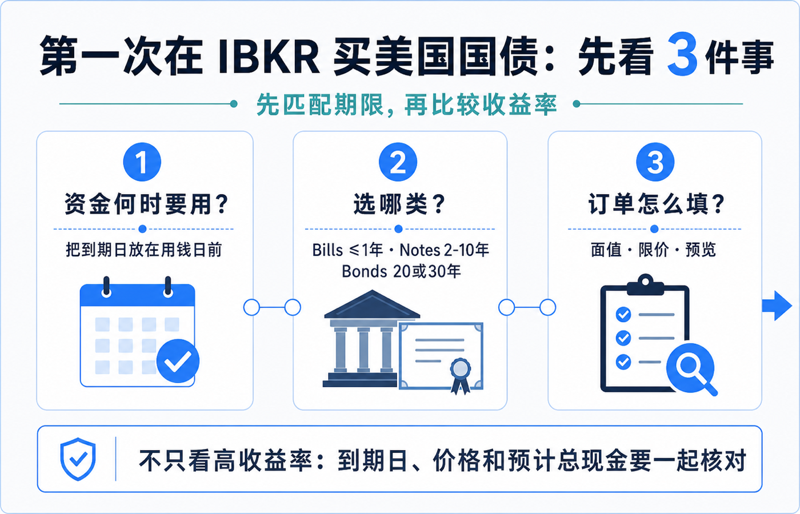
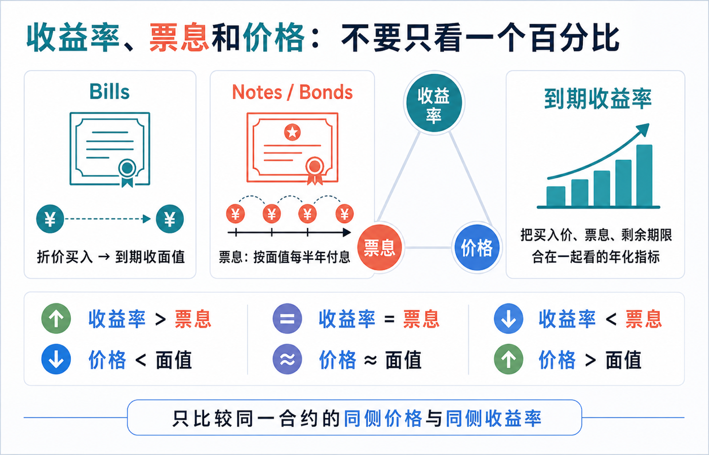
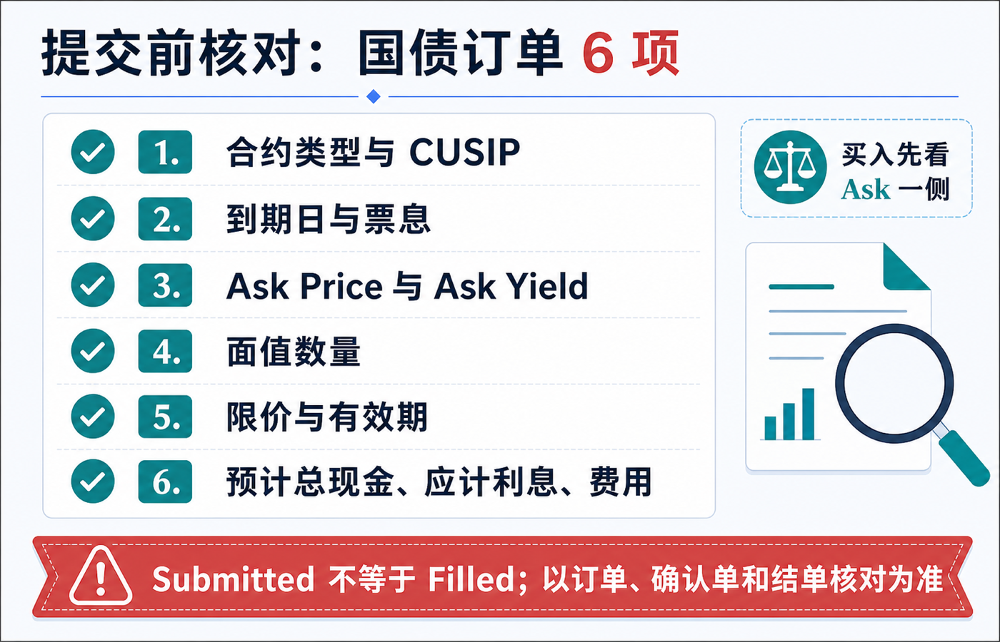

第一次在 IBKR 买美国国债，最容易踩的坑不是“不会点下单”，而是把不同概念看成同一个数字：期限、票息、到期收益率、买入价、面值和预计扣款彼此相关，却不相同。

先记住一个顺序：**先按资金何时要用来选到期日，再比较同一范围内的收益率和价格，最后只按订单预览里的预计扣款与费用提交。** 不要只看到一个高收益率，就跳过期限、流动性和价格核对。

> 本文是美国国债和 IBKR 下单界面的教育说明，不构成投资、交易、开户、税务、法律或跨境资金建议。债券报价、可交易合约、最低面值、交易权限、菜单、费用、应计利息和结算安排会随账户实体、市场、平台及交易时点变化。下单前请以本人账户可见的合约详情、订单预览、确认单和 IBKR 当前说明为准。资料核对日期：2026-07-16。

## 先选期限：把“何时用钱”放在收益率前面

美国财政部把可交易国债按期限分为几类：**Bills** 一般在一年以内，到期按面值兑付；**Notes** 常见为 2、3、5、7 或 10 年；**Bonds** 常见为 20 或 30 年。Notes 和 Bonds 通常每半年付息一次；Bills 则通常以折价买入、到期收回面值，而不是靠半年票息收款。[美国财政部：国债定价与期限](https://www.treasurydirect.gov/marketable-securities/understanding-pricing/?os=win)

对第一次下单的人，期限不是“越短越安全、越长越划算”的二选一。更实际的问题是：这笔现金大致在哪个日期可能要用？如果你预计在某个日期取用资金，就不应把“到期日前卖出也许能成交”当作与“持有到期”完全相同的事情。提前卖出时，成交价会受当时利率、剩余期限和买卖价差影响，可能高于也可能低于你的买入价。

可以先把选择拆成三步：

1. 写下大致用钱日期，而不是先挑收益率最高的一行。
2. 在这个日期附近筛选 Bills、Notes 或 Bonds，并确认具体合约的 `Maturity Date`（到期日）。
3. 只有在期限、币种和资金用途接近的候选之间，再比较收益率、价格、价差与预计成本。

这一步也能避免把“美国国债”当成单一产品。它是多个到期日、票息、发行批次和流动性条件不同的合约集合；名称相同，不代表订单风险和现金流相同。

## 收益率、票息和价格：屏幕上的百分比分别在说什么

### Bills：通常看折价与到期金额

Bill 没有常规半年票息。你看到的回报主要来自买入金额与到期面值之间的差额，因此不要把它和“票息 4% 的 Note”按同一种现金流去理解。

### Notes 和 Bonds：票息不是你此刻买入的回报率

`Coupon`（票息）是债券按面值计算的固定利息规则；Notes 与 Bonds 通常每半年支付一次。你在二级市场买入时，实际支付的价格可能高于、等于或低于面值，所以仅看票息不能代表今天买入后的回报。[美国财政部：术语表](https://www.treasurydirect.gov/help-center/glossary-for-ms-td-accounts/)

`Yield to Maturity`（到期收益率，常写作 YTM）则把**当前买入价、未来票息和剩余期限**放在一起，描述在特定假设下持有到期的年化回报指标。它不是保证收益，也不是账户马上到账的利息金额。美国财政部对价格与收益率关系的概括是：收益率高于票息时，价格通常低于面值；收益率低于票息时，价格通常高于面值；两者相等时价格接近面值。[美国财政部：价格、票息与收益率](https://www.treasurydirect.gov/marketable-securities/understanding-pricing/?os=win)

| 看到的字段 | 它回答什么 | 第一次下单该怎么用 |
|---|---|---|
| Type | 是 Bill、Note 还是 Bond？ | 先判断现金流结构和期限区间。 |
| Maturity Date | 哪一天到期？ | 与资金用途日期对照。 |
| Coupon | 按面值计算的票息规则 | 不把它当作当前买入收益率。 |
| Bid / Ask Price | 市场当前愿买、愿卖的价格 | 买入优先看 Ask 一侧，并留意价差。 |
| Bid / Ask Yield | 与对应 Bid 或 Ask 价格匹配的收益率 | 必须和同侧价格、同一合约一起看。 |
| Face Value / Quantity | 你买入的面值或数量 | 用订单预览确认最小单位和预计现金。 |

同一张报价表里，`Ask Yield` 与 `Bid Yield` 也可能不同，因为它们分别对应卖方要价和买方出价。不要把一边的收益率和另一边的价格拼在一起比较。

## IBKR 下单界面：先找“可交易的具体合约”

IBKR 的界面会随 TWS、Client Portal、账户权限和版本变化。下面写的是阅读顺序，不把旧截图里的某个菜单位置当作永久规则。

在 TWS 中，IBKR 当前教学示例使用 `US-T` 搜索美国国债，再在合约选择器中筛选 `Government Bonds`、`Tradable`、`Type`、到期日、发行日和票息。选中具体债券后，可以把 Bond 专用的 Bid Yield / Ask Yield 等列加入报价窗口。[IBKR Campus：在 TWS 输入美国国债订单](https://www.interactivebrokers.com/campus/trading-lessons/enter-us-treasury-orders-in-tws/?ibban=1&src=lin399op)

在 Client Portal 中，先确认账户已具备相应的交易权限；其订单票可从交易入口选择 Bonds。Bond Scanner 可用于按 CUSIP、到期日、Yield to Worst 或票息等条件缩小范围。[IBKR Campus：Client Portal 研究工具](https://www.interactivebrokers.com/campus/trading-lessons/client-portal-research-tools/?retakeFinal=1) [IBKR Campus：Client Portal 订单票](https://www.interactivebrokers.com/campus/trading-lessons/client-portal-order-entry/?retakeFinal=1)

无论用哪一个界面，第一次下单都先确认这一行是不是你要的合约：

- 类型：Bill、Note 或 Bond；
- 到期日和票息；
- CUSIP 或平台给出的唯一合约标识；
- 是否标为可交易，以及报价是否为当前可用报价；
- 报价的买卖两侧：`Bid` 是市场买方，`Ask` 是市场卖方。买入时不能只看 Bid Yield。

IBKR 的 Bond Scanner 教学也显示，选中债券后会把类型、票息、到期日和标识带入订单行，再从订单区设置买卖方向、数量和订单类型。[IBKR Campus：Bond Scanner 布局](https://www.interactivebrokers.com/campus/trading-lessons/the-bond-scanner-layout/)

## 第一次下单：按这个顺序填，不要跳到 Transmit

### 1. 先看 Ask，不是先看“最高 Yield”

买入者面对的是卖方报价。先把 `Ask Price`、`Ask Yield`、到期日、票息和可交易数量放在同一行核对；如果报价空白、时间不清楚或价差很宽，先不要根据一张静态截图猜成交结果。

### 2. 以面值填写数量，并核对最小单位

IBKR 的 TWS 教学说明，债券通常以 1,000 美元面值为常见基数；但具体合约的最小交易单位、可用数量和碎额规则仍要以当时订单票为准。[IBKR Campus：美国国债订单输入](https://www.interactivebrokers.com/campus/trading-lessons/enter-us-treasury-orders-in-tws/?ibban=1&src=lin399op)

因此，填写 `Quantity` 后，不要只用“数量 × 1000”心算账户会扣多少钱。订单预览里的预计成本才是核对现金是否足够的依据。

### 3. 新手优先理解 Limit，而不是假定 Market 一定可用

IBKR 的教学提示，部分交易场所不接受市价单，并建议为债券输入限价及可接受的最高价格。限价单并不保证成交；它的作用是为可接受的价格设上限或下限。[IBKR Campus：美国国债订单输入](https://www.interactivebrokers.com/campus/trading-lessons/enter-us-treasury-orders-in-tws/?ibban=1&src=lin399op)

对买入而言，限价应当是你愿意支付的最高价格。不要把屏幕上的 Ask、Mid、Yield 或 Coupon 直接当成限价栏必填值；先看订单票当前接受的是价格还是收益率输入，再看预览如何解释该订单。

### 4. Preview 要核对的是“总现金”，不只是债券价格

提交前至少逐项看：

| 预览项目 | 为什么要看 |
|---|---|
| 合约名称、CUSIP、类型、到期日 | 防止买到相近但不同发行批次的债券。 |
| 买卖方向与面值数量 | 防止 Buy / Sell 或数量单位填反。 |
| 限价与订单有效期（TIF） | 明确可接受价格和订单何时失效。 |
| 预计成交金额 / 预计扣款 | 不把报价数字误认为实际现金支出。 |
| 应计利息（如适用） | 二级市场买入有票息债券时，可能影响结算现金。 |
| 佣金、费用与可用现金 | 以预览显示为准，不依赖旧教程的费率截图。 |

美国财政部也说明，Notes、Bonds、TIPS 与 FRNs 的二级市场或再发行交易可能涉及应计利息；Bills 不按同样方式支付应计利息。[美国财政部：购买可交易证券](https://www.treasurydirect.gov/marketable-securities/buying-a-marketable-security/)

### 5. Submitted 不等于 Filled

点 `Preview`、`Submit` 或 `Transmit` 后，订单可能仍在等待、部分成交、被取消或被拒绝。成交结果要回到 Orders / Trades，并在后续确认单和结单中核对。限价单未成交不是系统故障，也可能只是你的价格尚未与市场匹配。

## 一个可执行的“3 个数字”检查法

第一次买入前，把下面三项写在同一行：

1. **到期日**：它和我的资金使用日期是否匹配？
2. **同侧报价**：我看到的是 Ask Price 与 Ask Yield 这一对，还是混用了 Bid 和 Ask？
3. **预览总额**：面值、价格、应计利息（如有）、佣金和可用现金是否都在订单预览中对得上？

如果其中任一项解释不清，就停在预览页，不急着提交。第一次的小额模拟阅读，通常比在快速变动报价里反复改单更能帮助你理解界面。

## 最容易误解的 5 件事

1. **“收益率高”不等于“更适合我”。** 它可能对应更长的剩余期限、不同的价格、不同的票息或不同的流动性条件。
2. **票息不是今天买入的到期收益率。** 对溢价或折价买入的 Notes / Bonds，二者会不同。
3. **持有到期与提前卖出不是同一件事。** 市场价格随利率和剩余期限变动，提前出售可能产生盈亏。
4. **截图上的菜单不是永久说明书。** 账户实体、权限、平台版本和产品范围都可能改变可见入口。
5. **订单预览不是装饰。** 它是识别合约、现金、应计利息和费用的最后一道核对。

## 提交前 30 秒清单

- [ ] 这个合约的到期日与资金用途匹配。
- [ ] 我知道它是 Bill、Note 还是 Bond，也知道是否有半年票息。
- [ ] 我没有把 Coupon、Yield、Bid 与 Ask 混为一谈。
- [ ] 我确认了 CUSIP 或唯一合约标识、买卖方向和面值数量。
- [ ] 我知道订单票输入的是价格还是收益率，并理解限价代表什么。
- [ ] 我在 Preview 中核对了预计总现金、应计利息（如有）、费用、可用现金和订单有效期。
- [ ] 提交后我会回到订单状态、确认单和结单核对实际结果。

## 参考资料

- [U.S. Treasury：Understanding Pricing](https://www.treasurydirect.gov/marketable-securities/understanding-pricing/?os=win)
- [U.S. Treasury：Glossary for Marketable Securities](https://www.treasurydirect.gov/help-center/glossary-for-ms-td-accounts/)
- [U.S. Treasury：Buying a Marketable Security](https://www.treasurydirect.gov/marketable-securities/buying-a-marketable-security/)
- [IBKR：Bonds 产品页](https://www.interactivebrokers.com/en/trading/products-bonds.php)
- [IBKR Campus：Enter US Treasury Orders in TWS](https://www.interactivebrokers.com/campus/trading-lessons/enter-us-treasury-orders-in-tws/?ibban=1&src=lin399op)
- [IBKR Campus：The Bond Scanner Layout](https://www.interactivebrokers.com/campus/trading-lessons/the-bond-scanner-layout/)

写作取材归档：`innomad-archive/articles/how-to-buy-bonds-with-ibkr/article.md`（仅用于旧版字段与常见误解的交叉核对；当前菜单和费用以文中链接的官方资料及账户预览为准）。
