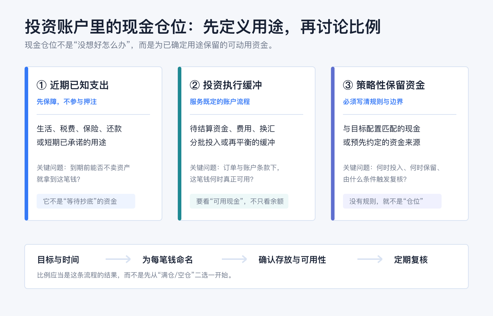

先说结论：**没有一个适合所有人的“现金应占 X%”答案。** 对个人投资者，更有用的顺序是先把钱按用途和时间分开：近期确定要用的钱、投资账户执行所需的缓冲、以及策略上明确要保留的资金。比例应是这套分类的结果，而不是从“要不要满仓”的情绪里猜出来的答案。

“满仓”“空仓”和“留现金”说的都是某个时点的资产状态，不是看多、看空、勇敢或保守的道德标签。把生活应急金、短期支出、税费和交易资金混在一个余额里，再讨论仓位，最容易让一笔本来不能承受波动的钱，被误当成“错过机会的现金”。

> 本文用于一般投资教育，不构成任何投资、交易、税务、法律、开户、银行或跨境资金建议。不同国家和地区、账户实体、币种、券商、银行、产品和税务身份下的可用性、收益、费用、保障与规则都不同；操作前请以本人机构的当前协议、费用表、订单预览和账户页面为准。资料核对日期：2026-07-23。

## 先把“现金仓位”定义清楚：它不是所有余额的总和

资产配置通常会把股票、债券和现金（或现金等价物）看作不同资产类别。美国 SEC 的投资者教育材料也强调，适合个人的配置取决于投资期限和风险承受能力，而不是一张固定比例表。[Investor.gov：资产配置与分散化](https://www.investor.gov/introduction-investing/getting-started/asset-allocation)

放到实际账户中，“现金仓位”至少要区分三种用途：

| 资金角色 | 它解决什么问题 | 不应该被误当成什么 |
|---|---|---|
| 近期已知支出 | 让你在需要用钱时，不必因市场下跌被迫卖出资产 | 等待更好买点的交易筹码 |
| 投资执行缓冲 | 覆盖待结算、费用、换汇、分批投入或再平衡等流程 | 可以忽略账户条款的“闲钱” |
| 策略性保留资金 | 与自己的目标配置和书面规则相匹配 | 对市场涨跌的确定预测 |

这三个篮子都可以使用“现金”这个词，但它们的期限、容忍的波动和可以放在哪里，未必相同。最简单的自查是：**如果今天市场下跌、我又需要这笔钱，我是否会被迫在不想卖的时候卖出风险资产？** 如果答案是“会”，这笔钱优先属于支出或应急安排，而不是可随时投入的投资仓位。

归档中的《理解现金仓位的以不变应万变》给出了一个值得保留的经验提示：持有现金不自动等于看空市场。这里把它进一步落到可复核的账户规则上；关于个人资产按不同账户和目的分层记录的实践，也参考了归档《2025 我的资产配置调整》。旧文中的产品、收益和市场判断均不作为本篇当前事实或建议。

## 满仓、空仓和现金仓位分别是什么意思

### 满仓：可投资部分已投入，不是“所有钱都能承受风险”

通常说“满仓”，是指你定义为可投资的那部分资产，已按既定配置投入风险资产。它不应该把本月生活费、近期税费、还款资金或未完成的交易义务一起算进去。若这些资金被一并投入，表面上是“高效率”，实际是在把流动性风险藏进仓位定义里。

还要确认账户本身的边界。以美国券商常见定义为例，现金账户要求投资者全额支付买入证券的金额；保证金账户则允许向券商借款，并会产生利息和追加保证金、强制卖出的风险。[Investor.gov：现金账户与保证金账户](https://www.investor.gov/introduction-investing/investing-basics/how-stock-markets-work/types-brokerage-accounts) 因此，页面上的“购买力”不必然等于你真正拥有、无负债且随时可用于生活的现金。

### 空仓：没有风险资产，不等于没有风险或不需要计划

“空仓”常指没有风险资产持仓，或资金暂时集中在现金和现金类安排中。它可能是为短期目标留出的资金，也可能只是尚未形成可执行计划。两种情况不能混为一谈。

现金与现金等价物通常波动较低，但并非永远没有风险。Investor.gov 提醒，现金等价物的核心问题之一是通胀可能侵蚀实际购买力；不同产品也会有不同的信用、流动性、利率、币种和费用安排。[Investor.gov：资产配置、分散化与再平衡入门](https://www.investor.gov/additional-resources/general-resources/publications-research/info-sheets/beginners-guide-asset) 所以，空仓后应写下的是“这笔钱什么时候、为哪个目标、在什么条件下复核”，而不是只盯住下一次涨跌。

### 现金仓位：预先保留、用途明确、能解释存放位置的资金

现金仓位既不是把所有账户余额简单相加，也不是“永远等回调”的同义词。它至少应能回答四个问题：

1. 这笔钱服务于什么目标？
2. 最早可能在哪个时间点需要动用？
3. 什么条件下会投入、继续保留或转作支出？
4. 它现在具体放在哪里，何时真的可用？

最后一个问题尤其不能省略。券商的未投资现金可能参加自动转存（sweep）安排，自动转入一家或多家银行的存款账户；具体安排、关联关系和适用条款需要以本人券商披露为准。[Investor.gov：开立证券账户时的现金与自动转存选择](https://www.investor.gov/introduction-investing/general-resources/news-alerts/alerts-bulletins/investor-bulletins-43) 银行存款、券商账户中的现金余额、货币市场基金和其他现金类产品不是同一个法律或风险类别，不能只看名称相近就认为保障、到账时间或本金风险相同。

若使用的是美国的受保存款，FDIC 的标准保障是每位存款人在每家受保存款机构、每个账户所有权类别至少 250,000 美元；它只覆盖受保存款账户，并不覆盖股票、债券、共同基金或加密资产等非存款投资产品。[FDIC：存款保险](https://www.fdic.gov/resources/deposit-insurance) 这只是美国制度的说明，不可直接外推到其他地区或其他账户安排。

## 不要从“市场会怎样”开始，从“这笔钱何时要用”开始

一笔钱的时间边界，通常比对短期行情的判断更可靠。你可以用下面的顺序把抽象的现金比例变成具体记录：

1. **先列用途。** 分开生活应急、已知支出、税费、账户费用、计划中的投资和真正可自由调整的资金。
2. **再列期限。** 每一笔钱写下最早可能使用的日期；不要用“以后”“机会来了”代替日期或条件。
3. **确认可用性。** 看清资金是否已结算、是否需要换汇、是否受账户限制、转出要多久，以及使用它会不会触发借款或费用。
4. **把比例写成规则。** 例如用“维持某项未来支出的可动用资金”和“每次再平衡时复查目标配置”描述，而不是靠临时情绪把余额全投或全撤。
5. **约定复核事件。** 收入、支出、目标日期、账户条款、币种安排或实际配置发生明显变化时，再重新计算；不要让每个交易日的涨跌自动改写计划。

这种方法并不保证投资收益，也不能消除市场风险；它的作用是让“需要用的钱”和“愿意承担波动的钱”不再争夺同一个余额。

## 下单前：余额、已结算现金、购买力不是同一个字段

投资账户里最容易造成误判的，不是是否“满仓”，而是把不同字段当成同一笔钱。下单前至少检查：

| 页面字段或概念 | 需要追问什么 |
|---|---|
| 账户余额 | 是否包含待处理入金、待结算交易、自动转存或其他限制？ |
| 已结算/可用现金 | 这笔钱是否已按券商规则可用于目标市场、币种和订单？ |
| 购买力 | 是否因为保证金或其他授信而高于你实际拥有的现金？ |
| 订单预览 | 预计金额、费用、换汇、利息、有效期与现金影响是否都能解释？ |

当这些字段的含义不清楚时，不要用一笔真实交易“测试”。先查协议、费用表和订单预览；仍不明确就联系机构确认。尤其在保证金账户中，借款、利息和追加保证金的规则会改变“可买多少”与“风险能否承受”之间的关系。[Investor.gov：保证金账户风险](https://www.investor.gov/introduction-investing/investing-basics/how-stock-markets-work/types-brokerage-accounts)

## 一个不依赖固定比例的最小模板

把下面这段写进自己的投资记录即可；金额、币种和日期由本人填写：

> 我的现金安排分为：___（近期支出）/ ___（账户执行缓冲）/ ___（策略性保留资金）。每一部分的用途、最早使用日期、存放账户、币种、可用条件和下一次复核日期分别是：___。如出现 ___（收入或支出变化、目标到期、账户规则变化、配置明显漂移等），我会先复核，再决定是否调整；不会仅因日内行情改变计划。

这段记录最重要的不是写得多复杂，而是下次看到市场波动时，你仍能回答“这笔钱是谁的、什么时候要用、为什么现在放在这里”。能回答这三个问题，现金仓位才是风险管理的一部分，而不是焦虑的临时停靠点。

## 常见误区

**误区一：现金越少，资金效率越高。**

如果减少现金让你在支出到期或账户变化时被迫卖出，所谓效率只是把流动性风险推迟显现。

**误区二：有现金就一定是在等待市场。**

现金可能服务于近期支出、结算、费用、再平衡或已经写好的目标；它不必代表对市场方向的预测。

**误区三：空仓没有风险。**

空仓仍要面对购买力、通胀、币种、账户规则和目标错配等问题；关键是这些风险是否与你的期限和用途匹配。

**误区四：券商余额就是能随时花的钱。**

账户余额、已结算现金、购买力、借款额度和自动转存后的资金安排可能不同。下单或转出前，应看本人机构的实时页面和条款。

**误区五：现金替代品都和银行存款一样。**

产品名称相似不表示保障、发行主体、到账时间、费用或本金风险相同；必须分别查看产品文件和账户披露。

## 最后的原则：把现金视作一项有任务的资产

投资账户是否“该满仓”，无法脱离你还有哪些账户、何时需要现金、能承受多大波动、是否使用保证金、以及是否已写下执行规则来回答。对大多数人，更好的起点是：**先让每一笔现金有任务，再让每一次投入有条件。**

满仓可以是一个执行后的状态，空仓可以是一个阶段性安排，现金仓位可以是风险管理的工具；只有把用途、期限、账户位置和复核规则写清楚，它们才不会被市场情绪随意重新定义。

## 官方资料

- [Investor.gov：Asset Allocation and Diversification](https://www.investor.gov/introduction-investing/getting-started/asset-allocation)
- [Investor.gov：Beginners’ Guide to Asset Allocation, Diversification, and Rebalancing](https://www.investor.gov/additional-resources/general-resources/publications-research/info-sheets/beginners-guide-asset)
- [Investor.gov：Types of Brokerage Accounts](https://www.investor.gov/introduction-investing/investing-basics/how-stock-markets-work/types-brokerage-accounts)
- [Investor.gov：Investor Bulletin: How to Open a Brokerage Account](https://www.investor.gov/introduction-investing/general-resources/news-alerts/alerts-bulletins/investor-bulletins-43)
- [FDIC：Deposit Insurance](https://www.fdic.gov/resources/deposit-insurance)

资料以 2026-07-23 可访问的官方页面为准。现金、自动转存、保证金、存款保障、资金可用性和费用均可能变化；实际操作前，请再次查看本人账户和产品的最新文件。
