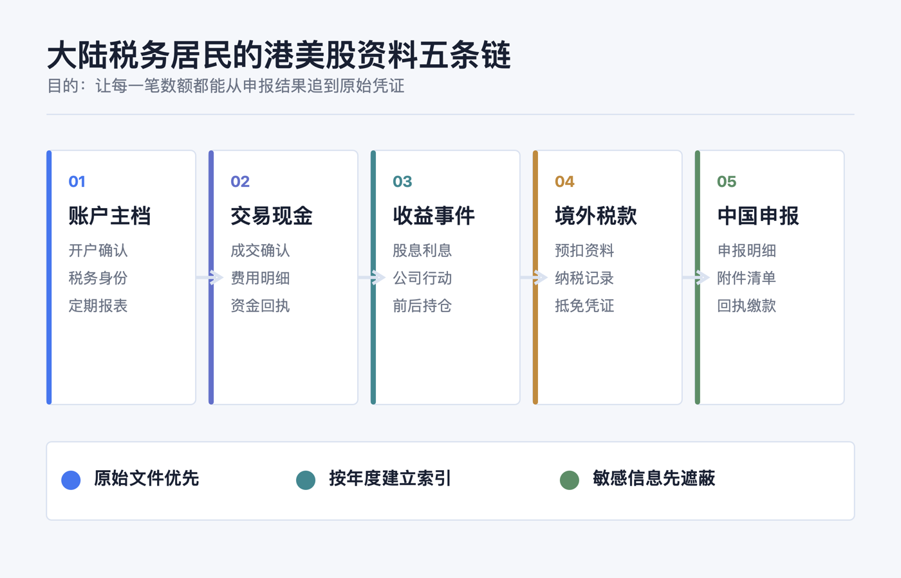
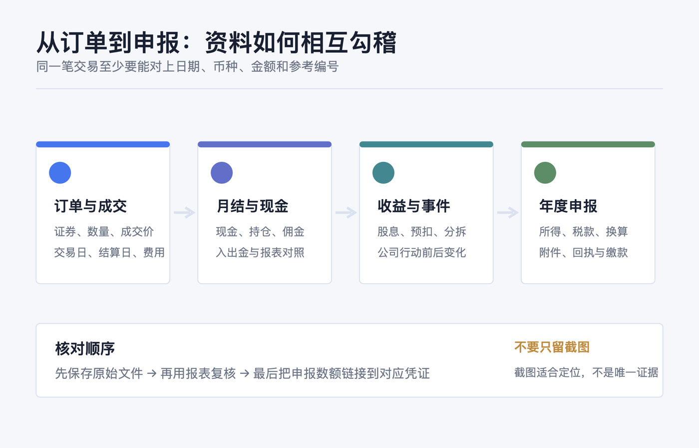
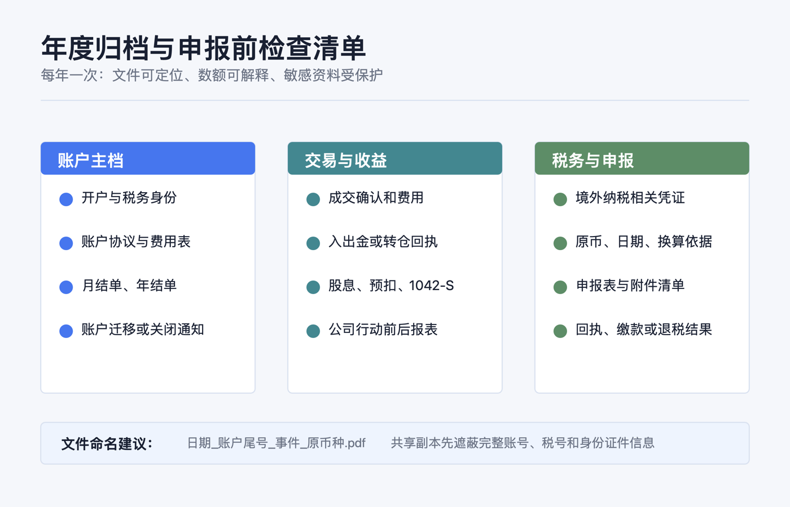

先说结论：**不要等到卖出、收到股息或准备申报时，才翻券商 App 找截图。** 对大陆税务居民而言，更稳妥的做法是从开户起就把资料整理成五条能相互勾稽的链：账户是谁开的、钱怎样进出、证券怎样买卖、持仓怎样因分红或公司行动变化、税款和申报怎样对应。

这不是要求把每个页面都打印出来，而是要保留能够回答三个问题的原始资料：**这笔资产是什么、这笔金额从哪里来、为什么年末记录会变成现在这样。** 香港或美国市场只是交易场所的一部分；不能只凭券商 App 的所在地、币种或一张收益截图判断所得性质、来源地或申报处理。

> 本文仅提供一般性的资料整理与核对框架，不构成投资、税务、法律、开户、银行、换汇或跨境资金建议。是否属于中国居民个人、境外所得的具体归类、税额计算、税收协定待遇和抵免资料要求，都取决于个人事实与主管税务机关的认定；有疑问请向主管税务机关或具备相应资格的专业人士确认。资料核对日期：2026-07-23。



## 先定边界：为什么“资料齐全”不是多存几张截图

《个人所得税法》以是否为居民个人作为起点：在中国境内有住所，或无住所而一个纳税年度内在中国境内居住累计满 183 天的个人，为居民个人；居民个人从中国境内和境外取得的所得，依照该法缴纳个人所得税。[国家税务总局：中华人民共和国个人所得税法](https://www.chinatax.gov.cn/chinatax/n810219/n810744/n3752930/n3752974/c3970366/content.html)

对境外证券相关资料，关键不是给每一笔贴上“港股”或“美股”的标签，而是把下列事实留完整：

| 要解释的事实 | 最有力的原始资料 | 只靠什么通常不够 |
|---|---|---|
| 账户由谁、在哪个法律实体开立 | 开户确认、税务居民自证、账户协议、账户年度报表 | 一张登录后的账户首页 |
| 某笔证券何时、以什么价格和币种买卖 | 成交确认单、订单/成交导出、月结单 | 盈亏曲线或“已成交”截屏 |
| 现金为何增加或减少 | 现金流水、入出金回执、股息/利息/费用明细 | 只看期末现金余额 |
| 持仓数量或成本为何变化 | 公司行动通知、配股/拆并股/合并/派息资料、前后报表 | 只保存最新持仓页 |
| 境外已缴税和中国申报是否对应 | 境外税务记录、预扣资料、申报表与回执 | 只保存券商显示的“税后到账” |

国家税务总局 2020 年第 3 号公告将来自境外企业、组织或非居民个人的利息、股息、红利，以及转让对境外企业和组织投资形成的股票、股权等权益性资产等，列入境外所得规则所说明的情形；具体事实仍需逐笔判断。[国家税务总局：关于境外所得有关个人所得税政策的公告](https://www.chinatax.gov.cn/chinatax/n810219/n810744/n3752930/n3752974/c5143076/content.html)

所以，资料整理的目标不是自行给交易“定性”，而是把定性和计算需要的事实留住。若账户跨券商转仓、持有多市场同名证券，或有期权、基金分配、员工股权计划等情况，建议在交易发生时就备注，别在多年后靠记忆补档。

## 第一类：账户主档——证明“这是哪个账户、由谁运营”

每个券商或托管账户建立一份不随交易频率变化的“主档”，至少包含：

1. **开户与账户身份文件。** 开户成功通知、账户号（保存副本时可遮蔽中间位）、账户持有人姓名、账户类型、开户/关闭日期，以及税务居民自证或券商要求提交的税务表格。
2. **运营主体与条款。** 券商实际签约法律实体、客户协议、费用表、托管/清算披露和重要条款变更通知。品牌名称相同，不代表签约实体、适用规则或报表格式相同。
3. **定期账户报表。** 月结单、季结单或年结单（以账户实际提供为准），保留 PDF 原件和下载日期；它们通常同时显示现金、持仓、未结算项目、费用和期末价值。
4. **账户变更轨迹。** 账户迁移、合并、转仓、关闭、税务居民信息更新或更换开户实体的通知。这些文件往往解释了“为什么同一账户后来换了编号、报表币种或资产列示方式”。

美国来源的股息等款项，可能涉及受益所有人向扣缴义务人提交的 Form W-8BEN；IRS 说明该表用于向扣缴义务人表明外国身份，并在适用时主张协定下的预扣待遇。[IRS：Form W-8BEN 说明](https://www.irs.gov/instructions/iw8ben) 因此，保留已提交版本、到期/更新通知和券商确认很有价值；但它是账户税务身份资料，不等同于中国的纳税申报或已缴境外税款凭证。

## 第二类：成交和现金链——把“买了什么”与“付了什么”接起来

对每一次买入、卖出、换汇、费用扣取和现金划转，优先保存券商可下载的原始文件，而不是只留图片。一个可复核的成交记录至少应能识别：

- 证券全名、代码、市场或合约标识；
- 买卖方向、成交数量、成交价、成交日期与结算日期；
- 原始交易币种、佣金、税费或其他单列费用；
- 订单号、成交号或确认单编号（如券商提供）；
- 同期现金余额和持仓数量的变化。

把“成交确认单”和“月度/年度报表”成对保存很重要。前者更适合还原单笔交易，后者更适合核对一个期间的现金、持仓和费用是否能加总对上。美国 SEC 的投资者教育资料也建议投资者将交易确认与账户报表相互比较，并在发现错误、缺失资产或不认识的交易时尽快联系券商。[Investor.gov：理解券商账户报表](https://www.investor.gov/better-understanding-your-brokerage-account-statement)



这里的“现金链”只指记录与核对，不是在建议任何入金、出金或跨境资金路径。可按账户保存入出金通知、银行/支付机构回单、券商到账或退回通知，并记录日期、币种、金额、对方账户名称和参考编号；发布或共享副本时应遮蔽完整账号、身份证件号、地址、手机号和验证码。现金链的作用是解释券商现金为何变化，不能替代对任何资金安排的合规判断。

## 第三类：公司行动和收益链——别让“期末持仓”掩盖中间变化

只保存买卖单，仍可能无法解释年末持仓。股息、利息、基金分配、股票拆分/合并、配股、并购换股、分拆、退市或转仓，都可能改变现金、数量、证券代码或成本列示方式。

建议每个年度按证券建立“事件索引”：日期、事件类型、券商通知文件名、影响前后的数量/现金、是否有预扣税或费用、以及是否需要与后续报表核对。这样做的目的不是自行计算税额，而是防止后来把“数量变化”误认为一笔普通买卖，把“净到账股息”误当作税前金额。

特别要把以下三份文件放在一起：

| 收益或事件 | 应并排留存的资料 | 用途 |
|---|---|---|
| 股息、利息、基金分配 | 公司/基金通知（如有）、券商收入明细、现金流水、预扣资料 | 区分税前金额、实际到账、预扣和支付日期 |
| 拆并股、换股、分拆、并购 | 公司行动通知、券商处理说明、事件前后报表 | 解释代码、数量、成本列示为何改变 |
| 转仓或账户迁移 | 转出/转入确认、两端持仓报表、成本基础随附资料（如有） | 保持批次和时间序列不断裂 |

我国个人所得税法实施条例将转让有价证券列为财产转让所得的一种情形，并规定财产转让所得按一次转让收入减除财产原值和合理费用后的余额计算；未能提供完整、准确原值凭证时，主管税务机关可核定原值。[国家税务总局：个人所得税法实施条例](https://www.chinatax.gov.cn/chinatax/n810219/n810744/n3752930/n3752974/c3963364/content.html) 这也是为什么买入确认、卖出确认、费用明细和公司行动资料不能只留“最近一年”。具体可扣项目和计算方式应以适用规定及主管税务机关意见为准。

## 第四类：境外税款链——把“已预扣”与“可抵免”分开

最容易混淆的一点是：券商界面显示“已扣税”，不自动等于在中国申报时一定能够抵免。国家税务总局 2020 年第 3 号公告规定，居民个人申报境外所得税收抵免时，除另有规定外，应提供境外征税主体出具的税款所属年度完税证明、税收缴款书或纳税记录等纳税凭证；未提供符合要求的凭证，不予抵免。确实无法提供时，公告还列出境外所得纳税申报表（或征税主体确认的缴税通知书）及对应银行缴款凭证的处理路径。[公告第十条](https://www.chinatax.gov.cn/chinatax/n810219/n810744/n3752930/n3752974/c5143076/content.html)

因此可以分两层建档：

1. **收入和预扣的对账层：** 券商股息明细、扣缴明细、年度税务汇总、Form 1042-S（如适用）、现金入账记录。IRS 说明，对非居民支付的美国来源股息在适用预扣规则下会由扣缴义务人在 Form 1042/1042-S 报告；这类资料有助于还原收入和预扣事实。[IRS：向非居民支付美国来源收入的预扣与报告](https://www.irs.gov/individuals/international-taxpayers/federal-income-tax-withholding-and-reporting-on-other-kinds-of-us-source-income-paid-to-nonresident-aliens)
2. **抵免凭证层：** 由境外征税主体出具的纳税凭证、相关纳税申报表/缴税通知书、银行缴款凭证，以及必要的说明文件。不要自行假定某一种券商税务汇总或 1042-S 必然满足抵免凭证要求；应根据个人情形向主管税务机关确认。

公告还规定，居民个人从中国境外取得所得，应在取得所得的次年 3 月 1 日至 6 月 30 日内申报纳税；超过抵免限额的部分在符合条件时可在以后五个纳税年度结转抵免。[公告第六、七条](https://www.chinatax.gov.cn/chinatax/n810219/n810744/n3752930/n3752974/c5143076/content.html) 所以，年度文件夹至少应分开记录“收入所属年度”“境外税款所属年度”“文件出具日期”和“实际下载日期”，避免把晚到的税务文件错放进收到邮件的年度。

## 第五类：中国申报链——保存自己提交了什么、依据了什么

当个人需要办理境外所得申报或抵免时，除了境外资料，还应留存自己向中国税务机关提交和取得的记录：申报表/明细表、补充说明、上传附件清单、受理或回执、缴款凭证、退税或补税结果、与主管税务机关的书面沟通（如有）。这条链能让“境外券商报表”与“国内申报数字”在同一年度对应起来。

建议每年另做一张**不含完整敏感信息的资料索引**，而不是另造一套税务账：

| 索引字段 | 示例写法 |
|---|---|
| 年度/国家或地区/账户 | 2026 / 美国来源收入 / 券商 A（尾号遮蔽） |
| 所得或事件类别 | 股息、利息、卖出、公司行动、费用、税款 |
| 原始文件 | `2026-04-12_dividend_statement.pdf` |
| 核对关系 | 对应月结单页码、现金流水编号、申报表项目 |
| 待确认事项 | 例如“境外完税凭证是否可取得” |

所有金额先保留原始币种、日期和原始文件，不要只写一行自行换算后的人民币结果。公告要求人民币以外币种取得的境外所得或已缴税额，按实施条例规定折合计算；将原币数据和采用依据留存，才能在需要复核时回到原始事实。[公告第十二条](https://www.chinatax.gov.cn/chinatax/n810219/n810744/n3752930/n3752974/c5143076/content.html)



## 一套低负担、可持续的年度归档法

不必等到年度结束才开始。可以按“账户/年度”建立只读归档，再用索引连接文件：

```text
2026/
├── 01-账户主档/      开户、条款、税务表格、账户迁移通知
├── 02-月结与成交/    月结单、成交确认、年度交易导出
├── 03-现金与收益/    入出金回执、股息、利息、费用、公司行动
├── 04-境外税务/      预扣资料、税务汇总、完税/纳税记录
└── 05-中国申报/      申报表、附件清单、回执、缴款或退税结果
```

每次发生交易或公司行动，只做两件小事：下载原始文件，写一行索引。每月或每季再用账户报表复核一次“现金、持仓、收入、费用、税款”是否能与索引对应。不要把浏览器历史、聊天记录或单一截图当作唯一凭证；也不要为整理方便把完整账户号、税号或身份证件发到非受控表格、群聊或云盘。

## 申报前 10 项检查

1. 我是否先按本人居住天数、住所等事实确认了税务居民身份，而不是按券商所在地猜测？
2. 每个账户是否都有开户/税务身份文件、定期报表和账户变更通知？
3. 每笔卖出能否找到买入、卖出、费用和中间公司行动的连续记录？
4. 每笔股息或利息能否区分税前金额、预扣、净到账和支付日期？
5. 入出金或转仓能否与券商现金和持仓变化对应？
6. 涉及美国来源收入时，W-8BEN、1042-S 或券商年度税务文件（如适用）是否已归档？
7. 若考虑境外税收抵免，是否另行取得或确认了符合要求的境外纳税凭证？
8. 是否保留了原始币种、日期、文件来源和换算依据，而不是只保留一个换算结果？
9. 中国申报表、附件清单、回执和缴款/退税结果是否在同一年度文件夹？
10. 分享给他人的副本是否已遮蔽完整账号、税号、身份证件、地址、手机号和验证码？

最好的资料系统，不是文件最多，而是任何一笔数额都能从申报结果一路追到报表、成交、公司行动和原始凭证。**先保存原始文件，再做索引；先核对事实，再处理税务。**

## 官方资料

- [国家税务总局：中华人民共和国个人所得税法](https://www.chinatax.gov.cn/chinatax/n810219/n810744/n3752930/n3752974/c3970366/content.html)
- [国家税务总局：中华人民共和国个人所得税法实施条例](https://www.chinatax.gov.cn/chinatax/n810219/n810744/n3752930/n3752974/c3963364/content.html)
- [国家税务总局：财政部 税务总局关于境外所得有关个人所得税政策的公告（2020 年第 3 号）](https://www.chinatax.gov.cn/chinatax/n810219/n810744/n3752930/n3752974/c5143076/content.html)
- [上海税务：居民个人取得境外所得（抵免资料问答，2025-06-30）](https://shanghai.chinatax.gov.cn/tax/hdjl/lygk/202506/t476700.html)
- [IRS：Form W-8BEN Instructions](https://www.irs.gov/instructions/iw8ben)
- [IRS：Federal income tax withholding and reporting on U.S. source income paid to nonresident aliens](https://www.irs.gov/individuals/international-taxpayers/federal-income-tax-withholding-and-reporting-on-other-kinds-of-us-source-income-paid-to-nonresident-aliens)
- [Investor.gov：Better Understanding Your Brokerage Account Statement](https://www.investor.gov/better-understanding-your-brokerage-account-statement)

资料以 2026-07-23 可访问的官方页面为准。税务居民身份、所得来源、成本和费用扣除、协定待遇、境外抵免及文件可接受性都高度依赖个人事实；在提交申报前，请以主管税务机关和适格专业人士的意见为准。
