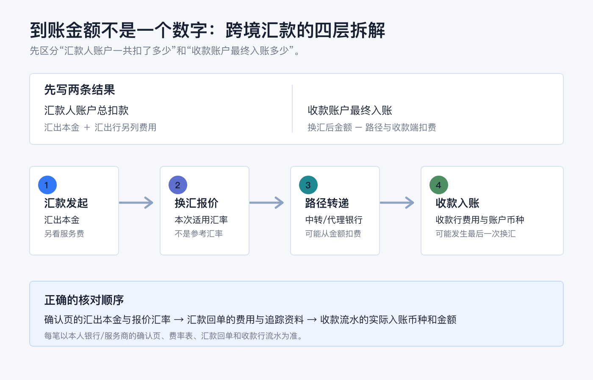
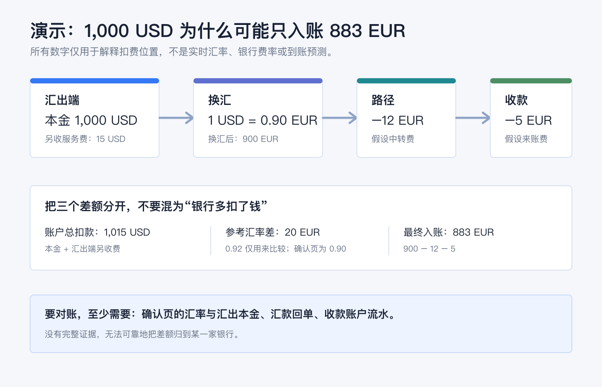
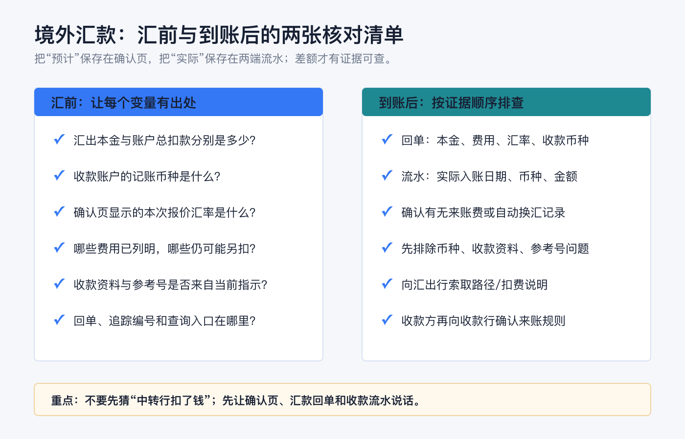

先说结论：**收款方到账比你预想少，不必然是钱“丢了”，但也不能只用“中转行扣了”一句话结束核对。** 一笔跨境汇款至少要把四件事分开：汇出本金、换汇时采用的报价汇率、汇出行单独收取的费用，以及可能在路径上或收款端扣除的费用。

最稳妥的比较方式不是只看“手续费多少”，而是同时写下两个结果：**汇款人账户一共扣了多少**，以及**收款账户最终入账了多少目标币种**。这两个数字之间可能隔着换汇、多个银行和不同的扣费位置。

> 本文仅用于一般性的跨境汇款与账户记录教育，不构成银行、换汇、支付、税务、法律、开户、投资或跨境资金建议。汇率、费用、可选收费方式、到账时间、适用规则和披露义务会因国家/地区、汇款币种、银行、账户类型、收款路径和监管要求而变化；操作前请以本人银行或汇款服务商的确认页、费率表、汇款回单及收款行规则为准。资料核对日期：2026-07-23。



## 先把两个问题分开：账户扣了多少，收款人拿到多少

很多误会来自把“我支付的总成本”和“对方账户入账金额”当成同一个数字。它们不是。

| 要看的数字 | 它回答什么 | 常见组成 |
|---|---|---|
| 汇款人账户总扣款 | 这次汇款一共花了多少 | 汇出本金 + 汇出行服务费/处理费 + 可能另列的换汇费用或税费 |
| 收款人最终入账 | 对方账户实际增加了多少 | 换汇后的金额 - 路径上扣除的费用 - 收款行费用 - 可能适用的税费 |

费用的位置会改变两个数字的外观。比如，汇出行可能把一笔服务费**单独**记在汇款人的账户上；中转行或收款行的费用则可能从传递中的金额或收款端金额中扣除。于是，即使你看到自己账户额外被扣了费用，收款方仍可能拿到比“汇出本金换算后的理论金额”更少的钱。

美国消费者金融保护局（CFPB）给跨境汇款消费者的提示，也是把这几个项目并列展示：汇率、费用和税费、预计收款金额；同时提示，收款银行费用和境外税费可能让收款方拿到更少。[CFPB：更有把握地向境外汇款](https://www.consumerfinance.gov/consumer-tools/money-transfers/send-money-abroad-with-more-confidence/)

## 第一层：汇率差不是只有“市场波动”

当汇出币种与收款币种不同，到账金额首先会受**实际用于这笔汇款的报价汇率**影响。它不应和新闻里的即期汇率、搜索引擎换算器，或你记忆中的上次汇率直接画等号。

可以这样理解：

```text
换汇后的金额 ≈ 汇出本金 × 本次确认页显示的汇率
```

这里的“≈”不是让你自行估价，而是在提醒你核对单位和方向：页面究竟写的是 `1 USD = x EUR`，还是 `1 EUR = x USD`；是把美元换成欧元，还是收款行到帐前又进行了一次换汇。比较时要把**同一时间、同一币种对、同一金额**下的报价汇率和最终到账金额放在一起看。

“免汇款费”也不自动等于“没有换汇成本”。某些银行会把国际外币汇款的电汇手续费设为零、但仍在汇率中包含加点；例如，美国银行在其汇款说明中将“无电汇费用”和“适用汇率加点”并列说明。这只是该行页面的产品披露，不是其他银行的通用价格。[Bank of America：在线与移动端电汇说明](https://info.bankofamerica.com/en/digital-banking/wire-transfers?request_locale=en_US)

对你来说，更有用的问题是：**这笔汇款按确认页的汇率换完以后，原本应有多少目标币种？** 算出这一步，再讨论后续扣费，才能避免把汇率差和中转费混在一起。

## 第二层：汇出行费用，可能不在收款金额里出现

汇出行可能收取电汇费、服务费、处理费、加急费或与换汇相关的费用。它们有时会和汇出本金一起从账户扣走，有时会作为单独账项显示。因此看银行流水时，至少找出：

1. **汇出本金（Transfer Amount）**：实际进入付款路径的本金是多少；
2. **汇出行收取的费用**：它是另扣，还是已经从本金中扣了；
3. **总扣款（Total）**：你的账户最终减少了多少；
4. **收款币种与收款账户币种**：它们是否一致。

不要用“银行扣了 20 美元”倒推出“对方一定少收 20 美元”。只有当回单明确显示扣费方式和汇出本金，才知道这笔费用在计算链路里的位置。

## 第三层：中转行为什么会从路上扣钱

跨境电汇并不总是从汇出行直接到收款行。若两家银行没有直接结算关系，款项可能经过一家或多家中转/代理银行。中转行处理这段路径时，可能收取费用；费用可能从正在传递的金额中扣除，所以收款方看到的金额会更少。

Chase 的消费者说明同样提示，国际电汇通常会经过一家或多家中转行，这些银行处理款项时可能收费，并可能从汇款金额中扣除。[Chase：电汇费用说明](https://www.chase.com/personal/banking/education/basics/wire-transfer-fees)

这也是为什么“同样汇 1,000 单位货币”并不保证每次都少同样的数额。中转路径、币种、收款行、对应银行关系和收费约定都可能不同。**无法在确认页预先看到某项路径费用时，不要把它当作零；把它记为待核对的变量。**

有些银行或汇款服务商会提供由谁承担费用的选项；不同地区、币种和清算路径对这些选项的支持与实际结果并不相同。若收款方必须拿到精确金额，应在汇前让服务商明确说明：预计或保证的收款金额是多少、哪些第三方费用已包含、哪些仍可能由收款行或路径扣除。不要只凭一个“费用由汇款人承担”的标签推断结果。

## 第四层：收款行与账户币种，可能是最后一道差额

收款行也可能对入账、来账电汇或币种转换收费。尤其要确认收款账户的记账币种：若你汇的是一种币、收款账户只接受另一种币，收款行可能按其规则自动兑换。这样，最终差额里就同时混入了收款端费用和收款端汇率。

收款方应提供的不是“一个看起来像账号的号码”，而是完整、当前、适配币种的收款指示。对于券商等机构，更要从其账户内页面复制本次币种的收款资料，并按要求填写参考号或附言。归档中的旧入金流程也反复强调，收款资料、币种和入金通知必须与实际路径匹配；其中的历史账户资料、费用和时效不作为本篇当前事实。

## 用一个演示算式看清差额来自哪里

下面所有数字都只是演示，**不是实时汇率、银行费率、报价或对任何路径的预测**。它的目的只是把扣费位置拆开。



假设汇款人发起一笔 **1,000 USD** 的跨境汇款：

| 环节 | 演示数字 | 如何理解 |
|---|---:|---|
| 汇出行另收的服务费 | 15 USD | 汇款人账户总扣款可显示为 1,015 USD；这并不表示收款人必然少收 15 USD。 |
| 本次确认页汇率 | 1 USD = 0.90 EUR | 汇出本金换算成 900 EUR。若只拿 0.92 的参考汇率比较，会得到 920 EUR；两者的 20 EUR 是比较基准与确认汇率的差，不是中转行费用。 |
| 假设路径费用 | 12 EUR | 若从传递金额中扣，900 EUR 变为 888 EUR。 |
| 假设收款行入账费 | 5 EUR | 收款账户最终入账 883 EUR。 |

这个例子揭示三件事：

1. **汇出行费用、汇率差和路径费用的币种可能不同**，不能简单相加后说“少了 XX”。
2. **参考汇率只用于比较**；真正能对账的是确认页采用的汇率和回单中的汇出本金。
3. **没有完整回单和收款流水，就无法可靠地把差额归到某一家银行。**

## 汇前怎样把“未知扣费”变成可核对字段

第一次使用一条新路径，先做符合本人规则的小额测试，并保存确认页。汇前不要只截“预计到账时间”，还要抄下下表的字段。

| 汇前核对项 | 要问清什么 |
|---|---|
| 汇出本金与总扣款 | 哪个是实际发送金额？服务费是否另扣？ |
| 汇出币种、收款币种、账户记账币种 | 是否会在汇出端、途中或收款端发生换汇？ |
| 本次报价汇率 | 这是这笔交易锁定/适用的汇率，还是仅为估算？有效到什么时候？ |
| 汇出行费用 | 电汇、服务、加急、换汇或其他费用分别是多少？ |
| 第三方费用 | 已包含、可估算、还是可能由中转行/收款行另扣？ |
| 收款资料 | 收款人名称、账户/IBAN、SWIFT/BIC、收款行和参考号是否都来自最新官方指示？ |
| 收款金额要求 | 对方需要的是“尽量到账”，还是“必须收到某个精确金额”？ |
| 凭证与查询入口 | 完成后在哪里下载回单、追踪编号与付款状态？ |

如果收款方必须收到精确金额，先让对方确认收款行是否另收来账费；再让汇款服务商说明可预见的第三方费用如何处理。**不要为了凑足预计到账金额自行多汇或拆分汇款**，因为这会改变费用、限额、合规审查与对账复杂度；应先从服务商取得明确的路径说明。



## 到账后怎么排查：按证据顺序，不要先猜原因

发现到账少时，按以下顺序对照，通常比先问“是不是被中转行扣了”更快：

1. **看汇出确认页/回单。** 记下汇出本金、总扣款、汇率、汇款费用、收款币种、预计收款金额和可见的第三方费用提示。
2. **看收款账户流水。** 确认实际入账日期、入账币种、金额、是否有单独的收款行费用或自动换汇记录。
3. **先排除资料或币种不匹配。** 检查收款账户是不是目标币种账户，参考号/附言是否漏填，收款人信息是否与指示一致。
4. **向汇出行发起查询。** 提供回单和追踪资料，问清汇出本金、费用承担方式、实际发送金额及可提供的路径/扣费信息。
5. **让收款方询问收款行。** 收款行更接近最终入账，能确认是否收取来账费、是否发生自动换汇或是否有待补资料。

若回单上披露的预计到账金额与实际不一致，不要只凭聊天记录判断。保存确认页、回单、收款流水、银行往来和日期时间；再按所用服务的错误处理/投诉渠道提交查询。CFPB 的相关规则也将“收款人收到的金额与披露金额不同”列为特定条件下需要处理的错误情形，但这套美国规则的覆盖范围和例外并不当然适用于所有国家/地区与所有汇款方式。[CFPB：12 CFR §1005.33 错误处理程序](https://www.consumerfinance.gov/rules-policy/regulations/1005/33/)

## 四个常见误区

**误区一：汇款手续费为零，到账就不会少。**<br>
汇款端的服务费为零，只回答了一个收费项目；汇率、收款行费用和路径费用仍要分别看。

**误区二：账户扣了多少，对方就应该收到多少。**<br>
账户总扣款通常包括汇出本金和可能另列的费用；收款入账还会受到收款币种和后续费用影响。

**误区三：每次少的钱一样，就一定是固定中转费。**<br>
固定差额只是线索，不是证据。路径、汇率、收款行和扣费币种都可能变化；用两端凭证核对才有结论。

**误区四：看到熟悉的“参考汇率”就能判断银行多扣了钱。**<br>
参考汇率只能帮助比较。最终应以确认页的实际报价、汇出本金、收款币种和到账流水构成同一条计算链。

## 一张最小对账表，留给下一次汇款

每次汇款后，用一行记录留住这些原始事实：

| 日期 | 汇出本金/币种 | 总扣款 | 确认页汇率 | 汇出行费用 | 预计收款金额 | 实际入账/币种 | 收款行或路径说明 | 回单链接/编号 |
|---|---|---:|---|---:|---:|---|---|---|
|  |  |  |  |  |  |  |  |  |

这张表不帮你预测下一次汇率，却能让你在余额不对时把问题缩小到一个具体字段：是汇出本金、报价汇率、费用位置、收款账户币种，还是银行信息本身。对跨境资金流来说，**可解释、可追溯**比只追求某一次看起来最低的费用更重要。

## 官方资料

- [CFPB：更有把握地向境外汇款](https://www.consumerfinance.gov/consumer-tools/money-transfers/send-money-abroad-with-more-confidence/)
- [CFPB：12 CFR §1005.31 汇款披露](https://www.consumerfinance.gov/rules-policy/regulations/1005/31/)
- [CFPB：12 CFR §1005.33 错误处理程序](https://www.consumerfinance.gov/rules-policy/regulations/1005/33/)
- [Chase：电汇费用说明](https://www.chase.com/personal/banking/education/basics/wire-transfer-fees)
- [Chase：电汇常见问题](https://www.chase.com/digital/wire-transfer/faqs)
- [Bank of America：在线与移动端电汇说明](https://info.bankofamerica.com/en/digital-banking/wire-transfers?request_locale=en_US)

资料以 2026-07-23 可访问的上述官方页面为准。请在提交每笔跨境汇款前重新查看本人服务商的确认页、费率表与收款指示；同一条路径在不同币种、银行、金额和时间下的报价与扣费可能不同。
