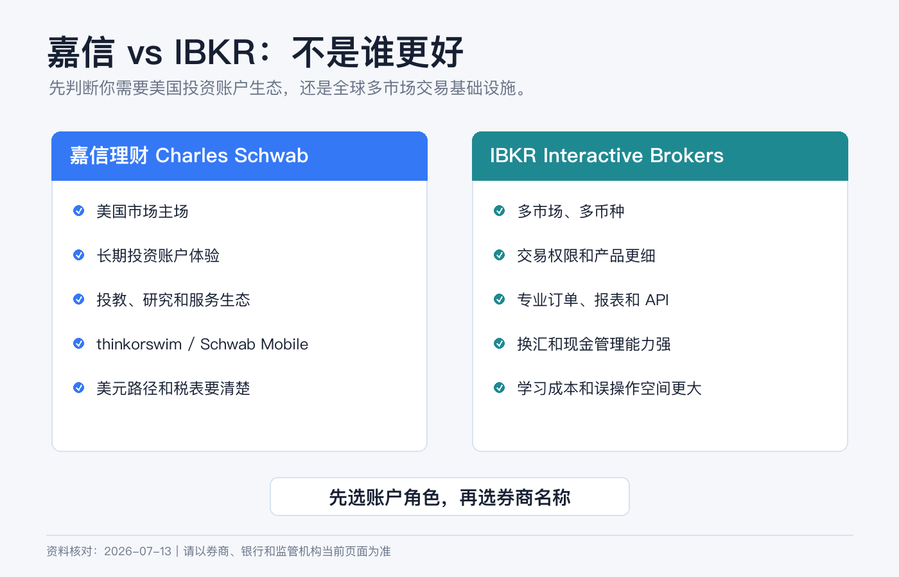
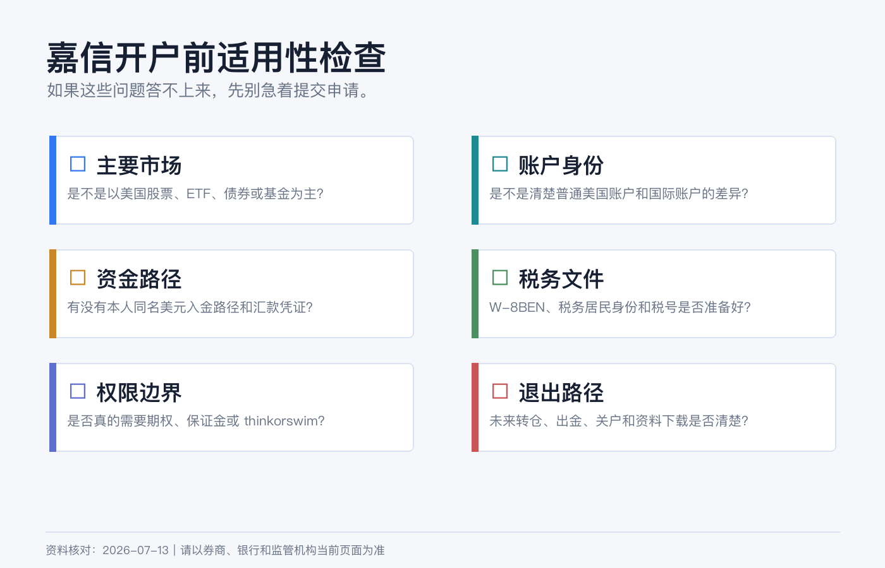
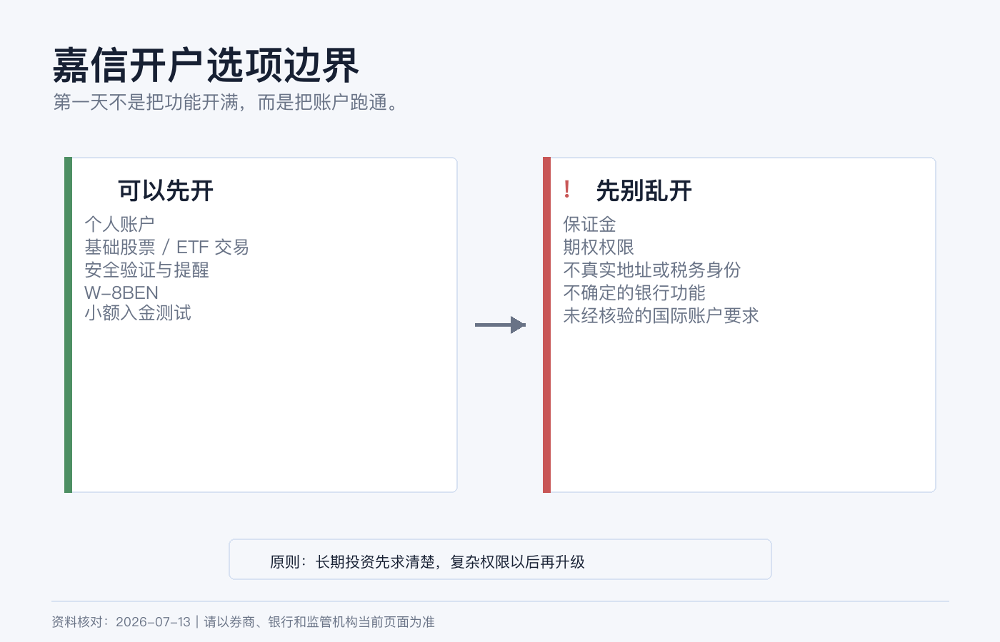

# 嘉信理财开户前认知：和 IBKR 有什么不同，新手要准备什么

很多人在比较嘉信理财和 IBKR 时，会直接问：哪个更好？

这个问题太粗。更准确的问法应该是：**我需要一个美国市场为主的长期投资账户，还是一个多市场、多币种、专业交易工具更强的账户？**

嘉信理财不是 IBKR 的简化版，IBKR 也不是嘉信的高级版。它们背后是两套不同的产品取向。选错了，不一定是钱的损失，更多是后续使用摩擦：入金路径不顺、权限不匹配、报表看不懂、想买的市场不支持、或者根本不适合你的身份和居住地。

> 本文为个人经验记录和开户前认知清单，不构成投资、税务或法律建议，也不是开户、换汇或跨境汇款建议。嘉信国际账户的开户资格、最低资金和可用功能会因居住地及政策变化而变化，提交申请前请以 Charles Schwab / Schwab International 当前页面和客服确认为准。资料核对日期：2026-07-14。

## 一句话区别

**嘉信更像“美国投资账户生态”，IBKR 更像“全球交易基础设施”。**

这句话背后有几个具体差别：

| 维度 | 嘉信理财 | IBKR |
|---|---|---|
| 核心主场 | 美国股票、ETF、共同基金、期权、账户服务和投资者教育 | 多国家市场、多币种、低成本交易、专业订单和报表 |
| 适合的新手 | 主要买美股/美债/ETF，偏长期持有，希望界面和服务更稳 | 愿意学习交易权限、币种、市场数据和入出金细节 |
| 多币种能力 | 以美元账户体验为主，国际账户可用功能要看地区 | 多币种现金和跨市场交易是核心能力之一 |
| 市场覆盖 | 强在美国市场和相关工具 | 覆盖更广，适合多市场配置 |
| 操作复杂度 | 对美国市场投资者更友好 | 功能多，学习成本更高 |
| 权限风险 | 期权、保证金等仍需审批 | 权限更细，产品更多，也更容易乱开 |

如果你只打算买美国上市 ETF，嘉信可能更贴近“长期投资账户”。如果你还想处理港股、欧洲市场、多币种换汇、复杂订单和更细的交易报表，IBKR 的优势会更明显。

## 嘉信适合谁

嘉信更适合这些人：

1. 主要投资美国上市股票、ETF、共同基金或债券。
2. 想要相对成熟的美国券商账户体验，而不是多市场交易终端。
3. 希望使用 Schwab Mobile、网页端和 thinkorswim 等工具。
4. 更看重账户服务、投教内容、报表和美国市场生态。
5. 能接受账户主要围绕美元运行，且资金路径能稳定解释。

嘉信不太适合这些人：

1. 需要频繁交易多个国家本地交易所。
2. 需要在券商内做多币种现金管理和低成本换汇。
3. 资金量很小，但准备申请国际账户且不确定最低资金要求。
4. 想用同一个账户同时解决港股、新加坡市场、外汇和复杂衍生品。
5. 不愿意处理 W-8BEN、美元电汇、账户安全和税务文件。

这里有一个容易误会的点：嘉信美国主站普通 brokerage account 页面写明，标准账户没有开户费、维护费，也没有最低开户资金；但这不能自动套用到 Schwab International。国际账户可能有不同资格、资金要求、材料和功能限制。开户前一定要看你所在地区对应的国际开户链接，而不是只看美国本土账户页面。

## 和 IBKR 最大的不同，不是佣金

新手喜欢比较佣金，但嘉信和 IBKR 真正的区别不止佣金。

**第一，市场范围不同。**  
嘉信的强项是美国市场和美国投资账户生态。IBKR 的强项是跨市场、跨币种和专业交易工具。如果你未来会买港股、欧洲股票、不同货币债券或需要更广泛交易所接入，IBKR 更像底层平台。

**第二，币种体验不同。**  
嘉信账户体验主要围绕美元展开。IBKR 支持多币种入金和交易，官网也写到可以用多种交易货币入金。多币种不是“越多越好”，但如果你的资金和资产天然跨多个币种，IBKR 的现金和报表体系会更有用。

**第三，账户保护要分清。**  
嘉信官方账户保护页面说明，券商账户里的证券和现金属于 SIPC 保护范围，SIPC 上限为 500,000 美元，其中现金限额 250,000 美元；银行存款则属于 FDIC 保险，通常按每位存款人、每家受保银行、每个所有权类别 250,000 美元计算。  

这不是“所有余额都无风险”。证券价格下跌、基金净值波动、期权亏损和投资判断错误，都不是 SIPC 或 FDIC 负责的范围。

**第四，工具取向不同。**  
嘉信的长期投资、教育、研究、客服和 thinkorswim 生态更适合美国市场投资者。IBKR 的订单、算法、市场覆盖、保证金、外汇和 API 能力更像专业交易基础设施。新手不要把“功能更多”自动理解为“更适合我”。

## 新手开户前要准备什么

如果你准备申请嘉信，先把这些东西整理好：

| 模块 | 准备内容 |
|---|---|
| 身份证明 | 护照或当前接受的身份证明，姓名拼写要和银行账户一致。 |
| 地址证明 | 居住地址文件，最好能和申请表中的英文地址一致。 |
| 税务信息 | 税务居民身份、税号、W-8BEN 所需信息。 |
| 资金路径 | 本人同名美元入金路径；如果用电汇，要能保存汇款凭证。 |
| 职业和资金来源 | 工作、收入、资产来源、投资目的，按真实情况填写。 |
| 联系方式 | 稳定手机号、邮箱、登录设备和安全验证方式。 |
| 交易计划 | 先确定是长期 ETF/股票，还是还要申请期权、保证金、thinkorswim 等功能。 |

对非美国个人来说，W-8BEN 很重要。IRS 说明，外国个人作为相关收入的受益所有人，在扣缴义务人或付款方要求时提交 W-8BEN；即使不申请优惠税率，也应在被要求时提交。它通常不是寄给 IRS，而是交给券商或付款方留档。

## 哪些选项不要乱填

**1. 不要把自己填成美国居民。**  
如果你不是美国税务居民、没有真实美国居住地址，不要为了开户方便随便填写美国地址或身份。地址、税务、电话和银行资料后面都可能互相校验。

**2. 不要默认申请保证金。**  
保证金账户不是长期投资的必要条件。它会增加融资、强平和误操作风险。先用现金账户把入金、下单、报表、税表跑通，比一开始追求“功能完整”更重要。

**3. 不要为了试试而申请期权。**  
嘉信定价页面提醒，期权有高风险，并非适合所有投资者，交易期权需要满足特定要求。你能申请，不代表你应该申请。

**4. 不要以为嘉信银行功能一定对国际用户开放。**  
美国本土 Schwab Bank、checking、debit card 等功能，和 Schwab International brokerage 不是同一个问题。国际用户能不能用，要看居住地、账户类型和当前政策。

**5. 不要只看“零佣金”。**  
嘉信主站显示，美国上市股票和 ETF 网上交易为 0 美元佣金，期权为 0 美元基础佣金加每张合约 0.65 美元；但 OTC、交易费基金、固定收益、外汇市场、直接在外国交易所下单、经纪协助交易、行业费、ADR 费、借券费等可能另有费用。真实成本不是一个“0”字。

## 我会怎么选：嘉信还是 IBKR

如果你主要目标是美国市场长期配置，并且希望账户体验更接近传统大型美国券商，我会优先研究嘉信。

如果你已经知道自己需要港股、美股、多个币种、不同交易所、低成本换汇或更细的交易权限管理，我会优先研究 IBKR。

如果你还没想清楚自己要买什么，只是看到别人说“嘉信稳”或“IBKR 强”，我会先不开户。先写一张表：

| 问题 | 你的答案 |
|---|---|
| 未来 12 个月主要买什么市场 | 美股、港股、债券、ETF、期权还是其他 |
| 账户主币种是什么 | USD、HKD、CNY 或其他 |
| 入金路径是什么 | 同名银行、电汇、ACH、FPS、Wise 或其他 |
| 是否需要保证金 | 不需要、以后再说、现在明确需要 |
| 是否需要期权 | 不需要、学习中、已经有经验 |
| 税务资料是否准备好 | W-8BEN、地址、税号、报表保存 |

这张表填完，答案通常会自己浮出来。

## 结尾：先选账户角色，再选券商名称

嘉信和 IBKR 都不是“万能海外账户”。嘉信更像美国市场长期投资账户，IBKR 更像全球交易系统。它们都可以很好，也都可能不适合你。

开户前最重要的不是谁的名气更大，而是你能不能说清楚：

1. 我的账户主要服务哪个市场；
2. 我的资金如何同名、合规、可追溯地进出；
3. 我的税务身份和 W-8BEN 是否准备好；
4. 我是否真的需要保证金、期权和复杂权限；
5. 如果账户被限制、换券商或关户，资料和资金能不能顺利迁移。

把账户当工具，而不是当身份标签。工具选对了，后面每一步都会省很多力。

## 参考资料

- Charles Schwab, [Open a Brokerage Account Online](https://www.schwab.com/brokerage).
- Charles Schwab, [Pricing](https://www.schwab.com/pricing).
- Charles Schwab, [Account Protection](https://www.schwab.com/legal/account-protection).
- Charles Schwab, [Security](https://www.schwab.com/security).
- Interactive Brokers, [Personal Brokerage Accounts](https://www.interactivebrokers.com/en/accounts/individual.php).
- Interactive Brokers, [Trading and Market Data](https://www.interactivebrokers.com/en/accounts/trading-and-market-data.php).
- Interactive Brokers, [Fund Your Account](https://www.interactivebrokers.com/en/support/fund-my-account.php).
- IRS, [About Form W-8 BEN](https://www.irs.gov/forms-pubs/about-form-w-8-ben).
