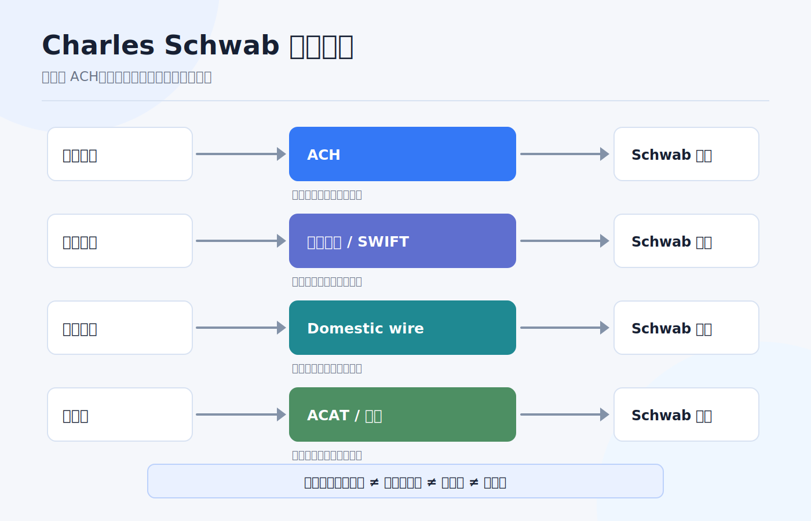
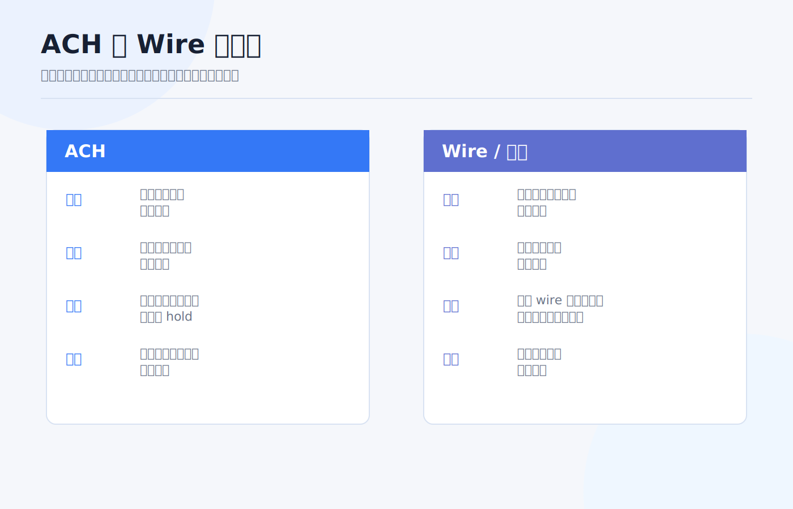

# Charles Schwab 入金路径整理：电汇、ACH 与到账时间

嘉信账户开好以后，第一笔入金最容易让人紧张。

很多人会问：“ACH 快还是电汇快？多久能到账？到账后能不能马上买？” 这些问题要拆开看。**到账、可交易、可转出、可撤回、银行扣费** 是不同层面的状态，不是一件事。

如果你把它们混在一起，就会出现几个典型误会：页面显示钱到了，但暂时不能提现；电汇当天到达，但中转行扣了费用；ACH 看起来免费，但并不适合跨境美元入金；国际账户能不能用某个功能，还要看账户实体和居住地。

> 本文为个人经验记录和嘉信入金路径认知框架，不构成投资、税务或法律建议，也不是开户、换汇或跨境汇款建议。Schwab International 与美国本土账户的可用功能可能不同，实际操作前请以账户内 Transfers & Payments 页面、客服和官方费用表为准。资料核对日期：2026-07-14。

## 先分清三种“到”

入金讨论里，最重要的是把三个时间点拆开：

| 状态 | 含义 | 你该检查什么 |
|---|---|---|
| 银行已汇出 | 你的银行已经把钱发出 | 汇款凭证、金额、币种、收款银行、备注。 |
| 嘉信已入账 | Schwab 账户里出现现金余额 | 是否匹配账户、是否有中转扣费、是否显示 hold。 |
| 可交易 / 可转出 | 这笔钱可用于下单或转走 | 可用现金、可提款现金、资金可用日期。 |

新手最常见的问题，是看到第二个状态就以为第三个状态也完成了。尤其是 ACH 和部分电子转账，券商可能先显示余额，但仍有清算、退回或出金限制。

## ACH：适合美国本地银行和嘉信之间

ACH 是美国本地银行间电子支付网络。Nacha 官方说明里提到，ACH Network 用于 Direct Deposit 和 Direct Payment，可以在美国银行和信用合作社账户之间发送和接收款项；ACH 支付可以在同一工作日数小时内处理，也可以安排在之后一两个工作日。

对嘉信用户来说，ACH 适合这些情况：

1. 你有美国本地银行账户。
2. 银行账户和嘉信账户是本人同名。
3. 你计划长期、反复、小额或中等金额入出金。
4. 你能接受银行工作日、清算和可能的 hold period。

ACH 不适合这些情况：

1. 你只有香港、新加坡、中国内地或其他非美国银行账户。
2. 你想把跨境电汇伪装成本地 ACH。
3. 你急着当天大额到账并立即转走。
4. 账户名、地址、税务身份或资金来源解释不清。

ACH 的重点不是“最便宜”，而是“美国本地账户之间最顺手”。如果你没有美国本地银行关系，ACH 通常不是你的第一条路径。

## Wire / 电汇：适合跨境或较大金额

Wire 更适合跨境美元、较大金额或需要正式银行凭证的场景。美国本地 wire 可能使用 Fedwire；跨境美元常见 SWIFT 和中转行。

Federal Reserve 对 Fedwire Funds Service 的说明是：它是银行、企业和政府机构用于关键、同日交易的电子资金转账服务，付款记入 Federal Reserve Bank master account 后具有最终性。

对个人投资者来说，电汇要关注这些字段：

| 字段 | 为什么重要 |
|---|---|
| 收款银行 | 不同账户、不同币种可能有不同收款银行。 |
| ABA / routing number | 美国本地 wire 或 ACH 可能用不同 routing。 |
| SWIFT / BIC | 跨境美元电汇常见字段。 |
| 收款人名称 | 可能是 Charles Schwab & Co., Inc. 或指定 FBO 结构，以页面为准。 |
| 账号 / For further credit | 用来匹配你的个人嘉信账户。 |
| 备注 / Reference | 漏填可能导致人工匹配或延迟。 |

电汇的优势是正式、适合大额、跨境可用性更强；缺点是费用更高，且中转行、汇出行、收款行都可能影响最终到账金额和时间。

## 嘉信费用表里能确认什么

Charles Schwab 官方 Pricing Guide for Individual Investors 写明：

| 项目 | 费用口径 |
|---|---|
| Incoming wire transfer | No fee |
| Outgoing wire transfer | $25 per transfer；线上提交为 $15 per transfer |
| Transfer out of assets | $50 per account |
| 外汇换算 | USD 与外币互换时，Schwab 可收取最高 3% 的 markup；不包括中介金融机构可能收取的额外费用 |

这几个数字解决的是“嘉信收费”问题，不等于你的全链路成本。跨境电汇时，汇出银行、中转行和收款路径都可能产生费用；如果涉及换汇，还要看汇率点差和用途申报。

另外，嘉信主站普通 brokerage account 的定价页面写明标准账户没有开户费、维护费和最低开户资金，但国际客户和特定账户可能有不同适用规则。国际账户尤其不要只看美国本土账户页面。

## 到账时间怎么理解

我不会把到账时间写成一个绝对数字，因为它取决于账户类型、汇出银行、付款网络、币种、时间点、节假日和风控审核。但可以用这个框架判断：

| 路径 | 常见节奏 | 主要变量 |
|---|---|---|
| ACH pull / push | 工作日批量处理，可能同日或 1-2 个工作日，也可能有 hold | 银行 cutoff、ACH 规则、账户验证、退回风险。 |
| 美国本地 wire | 通常适合当天处理的付款 | 银行 cutoff、收款信息是否正确、人工审核。 |
| 国际电汇 / SWIFT | 常见为 1-5 个工作日 | 汇出行、中转行、收款行、合规审核、节假日。 |
| 账户转仓 ACAT | Schwab 页面提到开户后选择 investment account transfer，账户通常在 5 个工作日内获批并可继续操作；实际转移时间看资产和对手方 | 原券商、资产类型、是否全仓、是否有不支持资产。 |

更实用的做法是：第一次使用某条路径时，做一笔小额测试，把“提交时间、银行扣款时间、嘉信入账时间、可交易时间、可转出时间、费用”全部记下来。你的真实记录比网上任何人的截图都有用。

## 入金前检查清单

电汇或 ACH 前，我会检查 9 件事：

1. 付款账户是否本人同名。
2. 账户类型是否支持当前路径。
3. 币种是不是 USD，是否需要先换汇。
4. 收款信息是否从 Schwab 当前页面复制。
5. routing / SWIFT / 账号 / reference 是否完整。
6. 汇出银行是否会收手续费。
7. 中转行是否可能扣费。
8. 到账后可交易和可转出时间是否清楚。
9. 汇款凭证、银行流水和嘉信入账记录是否保存。

如果是国际账户，还要额外确认：所在地区是否支持 ACH、wire instructions 是否与美国本土账户相同、是否有最低资金或账户维护要求、客服是否要求补充资金来源文件。

## 我会怎么选

**有美国银行账户、常规小额入出金：**  
优先 ACH。成本低，长期维护方便，但不要把它当成跨境路径。

**没有美国银行账户、从境外汇美元：**  
优先看国际电汇。先在嘉信账户内确认 wire instructions，再从本人同名银行汇出。

**金额较大或时间敏感：**  
倾向 wire，但要在银行截止时间前操作，并预留人工审核空间。

**第一次入金：**  
不管用 ACH 还是 wire，都先小额测试。测试成功后再放大金额。

**路径解释不清：**  
先停。能汇出去不等于以后不会被审查，能到账不等于资金用途没有问题。

## 结尾：入金不是转钱，是建立资金链路

嘉信入金真正要做的是建立一条长期可复用的资金链路：同名、清晰、可追溯、可解释。

ACH 解决美国本地银行和券商之间的低成本转账；电汇解决跨境、大额和正式凭证；到账时间则要拆成“银行汇出、券商入账、可交易、可转出”四个状态。

第一笔不要追求最快，追求可验证。等你用小额测试跑通一遍，再把这条路径写进自己的账户手册。以后每次入金，只需要按清单执行，而不是重新在各种帖子里找答案。

## 参考资料

- Charles Schwab, [Pricing](https://www.schwab.com/pricing).
- Charles Schwab, [Charles Schwab Pricing Guide for Individual Investors](https://www.schwab.com/legal/schwab-pricing-guide-for-individual-investors).
- Charles Schwab, [Transfers: Moving Accounts to Schwab](https://www.schwab.com/transfer-to-schwab).
- Nacha, [The ABCs of ACH](https://www.nacha.org/content/ach-network).
- Federal Reserve Financial Services, [Fedwire Funds Service](https://www.frbservices.org/financial-services/wires).
