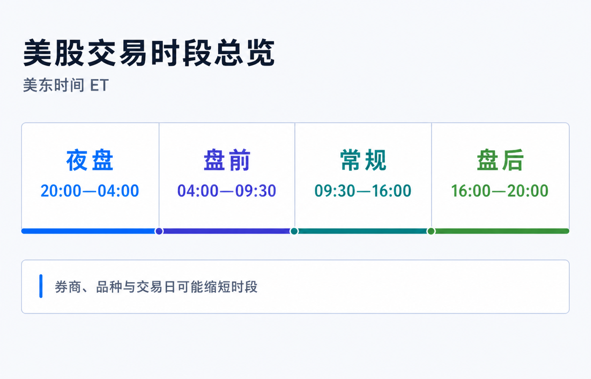
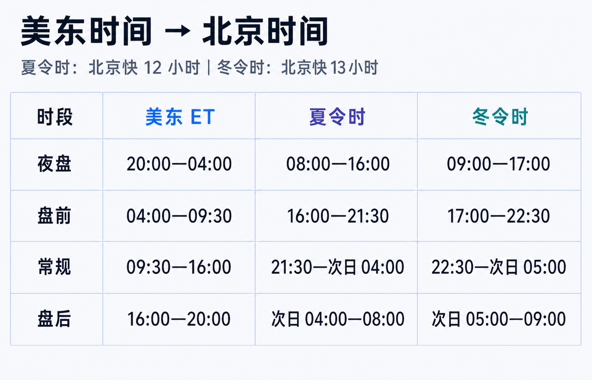
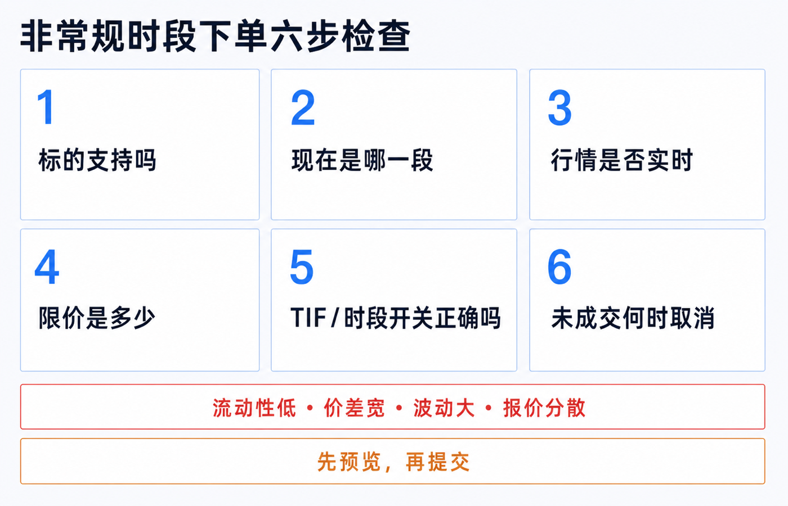

美股不是只有纽约时间 9:30 开盘、16:00 收盘。对一部分股票和 ETF 来说，一天可以被拆成夜盘、盘前、常规和盘后四段；但四段并不等价，也不是每家券商、每只证券、每种订单都能无缝交易。

先记住最实用的结论：

- **常规时段固定是美东时间 09:30—16:00。** 这是流动性最集中、官方开收盘价形成、报价保护相对完整的一段。
- **盘前最早可从 04:00 开始，盘后最晚可到 20:00。** 你的券商可能只开放其中一部分，例如盘前从 07:00 才开始。
- **零售夜盘目前常见约为 20:00—次日 04:00。** 它多由券商接入 ATS 等交易场所实现，不应直接理解成 NYSE 或 Nasdaq 的常规交易所已经整夜开门。
- **“24 小时”通常是营销简称。** 周末、休市日、券商维护、品种资格和交易时段切换都可能造成空档。

> 本文是股票与 ETF 交易时段和订单机制教育，不构成投资、交易、开户、税务或法律建议。实际开放时间、可交易证券、订单类型、行情和费用取决于券商、账户实体、交易场所与交易日。下单前以合约详情、订单预览和官方交易日历为准。资料核对日期：2026-07-16。

## 一张表看懂四个时段

下面先采用股票交易系统常见的最宽窗口。所有美国时间都写作 **ET（Eastern Time，美东时间）**，不要全年固定写成 EST，因为纽约会切换夏令时。

| 时段 | 美东时间 ET | 北京时间：美东夏令时 | 北京时间：美东冬令时 | 新手要点 |
|---|---|---|---|---|
| 夜盘 Overnight | 前一日 20:00—当日 04:00 | 08:00—16:00 | 09:00—17:00 | 常经 ATS 或券商指定场所；品种和订单限制最多。 |
| 盘前 Pre-market | 04:00—09:30 | 16:00—21:30 | 17:00—22:30 | 有的券商从 07:00 或更晚才开放。 |
| 常规 Regular | 09:30—16:00 | 21:30—次日 04:00 | 22:30—次日 05:00 | 流动性通常最好；09:30 和 16:00 有开收盘机制。 |
| 盘后 After-hours | 16:00—20:00 | 次日 04:00—08:00 | 次日 05:00—09:00 | 财报常在此时发布，价格可能快速跳动。 |

美东处于夏令时（EDT，UTC-4）时，北京快 12 小时；冬令时（EST，UTC-5）时，北京快 13 小时。美国现行规则是从 3 月第二个星期日到 11 月第一个星期日采用夏令时；2026 年对应 3 月 8 日至 11 月 1 日。最省事的办法不是背每年的日期，而是在日历里同时显示 `New York` 和 `Beijing` 两个时区。

### 为什么盘前有人写 04:00，有人写 07:00

因为“市场技术上能接单”和“你的券商让零售客户交易”不是一回事。

Nasdaq 当前系统时间是 04:00—20:00 ET；NYSE Arca 的早盘为 04:00—09:30，常规为 09:30—16:00，晚盘为 16:00—20:00。FINRA 面向个人投资者的说明则把常见盘前概括为 07:00—09:30，并提醒券商可设置自己的开放时间和产品范围。

所以，04:00 是常见场所能够覆盖的最早起点，不是对所有账户的承诺。看到两个教程写出不同盘前时间，先检查它们说的是交易所、交易系统还是某家券商。

## 四段交易背后，不是同一个市场

### 常规时段：报价和成交最集中

09:30—16:00 ET 是上市股票的常规交易时段。开盘价和官方收盘价由交易所的开、收盘机制形成；多数成交、做市和机构订单也集中在这一段。

这并不保证常规时段一定平稳，但对新手而言，它通常更容易看到窄价差、更多挂单和更完整的价格竞争。第一次买卖普通股票或 ETF，默认选择常规时段的小额限价单，往往最容易解释成交结果。

### 盘前和盘后：交易所与电子场所继续撮合

04:00—09:30 和 16:00—20:00 统称延长时段的一部分。订单可能在交易所的早晚盘、ECN 或其他电子场所成交，具体路由由券商和你的订单设置决定。

财报、并购、监管消息和经济数据经常在常规时段之外发布，因此价格会先反应。但 FINRA 明确提醒：延长时段的市场可能没有充分连接，同一证券在不同场所同时出现不同报价；常规时段发布的 NBBO 保护也不能简单照搬到延长时段。

### 夜盘：目前主要仍是 ATS 或券商网络

当前零售夜盘常见窗口约为 20:00—次日 04:00 ET。Blue Ocean ATS 的官方时段是星期日至星期四 20:00—次日 04:00，并把星期日晚上视为星期一交易时段的开始。IBKR 当前公布的美股与 ETF 隔夜时段为 20:00—03:50 ET，星期日晚上开始，最后一段在星期五清晨结束。

这十分钟差异已经说明：夜盘没有一个对所有券商都完全相同的时间。即使上游场所允许较多 NMS 股票，零售券商仍可缩短时段、只开放部分证券、限制卖空或只接受特定限价单。

## 2026 年的新变化：规则获批，不等于已经上线

2026 年，NYSE Arca、Nasdaq、Cboe EDGX 和 24X 的 23/5 或夜盘规则都已有监管进展或获批。但截至 2026-07-16，SEC 的最新文件仍说明，这些交易所参与者尚未在新增的 Exchange Extended Hours 开始交易，因为合并行情处理系统（SIP）还要先具备相应的隔夜数据能力。

NYSE Arca 当前把目标上线时间写为 2026 年底，拟议结构是 21:00—次日 04:00 的夜盘、04:00—09:30 的早盘、09:30—16:00 的常规和 16:00—20:00 的晚盘，中间保留一小时技术暂停。

因此，今天在券商 App 看到“夜盘”时，应先确认实际交易场所，不要因为交易所规则已经获批，就假定订单已经进入 NYSE Arca 或 Nasdaq 的未来夜盘。

## “24/5”最容易误解的五件事

### 1. 不是周末也能连续交易

Blue Ocean 的最后一段在星期五清晨结束，星期五 20:00 不会再开下一段；下一次通常要到星期日 20:00。美国休市日和上游报告系统不可用时也会停盘。

### 2. 不是所有股票、ETF、期权和碎股都支持

券商会按交易场所、流动性、合规和技术能力建立可交易清单。FINRA 提醒，股票期权通常不在延长时段交易，只有有限合约例外；碎股也经常只在常规时段可用。搜索到报价，不等于该账户能下夜盘订单。

### 3. 勾选 Outside RTH 不一定包含夜盘

以 IBKR 为例，`Fill Outside RTH` 用于让符合资格的订单在常规时段之外激活或成交；夜盘还可能需要选择独立的 Overnight 或 Overnight + Day 有效期。别把“允许盘前盘后”和“进入夜盘”当成同一个开关。

### 4. DAY、GTC 和时段选择是三件事

订单类型回答“按什么价格规则成交”，Time in Force 回答“订单活多久”，交易时段设置回答“在哪些时段工作”。一张 DAY 限价单如果没有开启扩展时段，可能只在 09:30—16:00 尝试成交；一张夜盘订单未成交，也未必自动带到第二天常规开盘。

### 5. 盘后价格不是当天官方收盘价

交易所 16:00 形成的价格仍是当天官方收盘价。盘后和夜盘即使继续成交，也不会重写这个官方收盘价；次日开盘价会根据开盘附近的供需重新形成，不保证承接夜盘最后一笔。

## 非常规时段的风险，不只是“成交量小”

| 风险 | 实际会发生什么 | 下单前怎么处理 |
|---|---|---|
| 流动性较低 | 对手少，订单可能部分成交或完全不成交。 | 先看 Bid、Ask、挂单量与近期成交。 |
| 价差更宽 | 买入立刻接近较高 Ask，卖出只能碰较低 Bid。 | 使用限价单，明确可接受的最差价格。 |
| 波动更大 | 一条财报或新闻可能让价格快速跳档。 | 缩小数量，不追逐瞬时价格。 |
| 报价分散 | 一个场所的最优价可能不等于另一场所的最优价。 | 确认行情来源、路由和券商披露。 |
| 开盘重新定价 | 夜盘价格不保证成为次日开盘价。 | 不把夜盘最后一笔当成开盘承诺。 |
| 技术与规则差异 | 改单、撤单、止损、卖空或碎股可能受限。 | 在预览页确认订单类型、时段和 TIF。 |

市价单在流动性稀薄时最危险，因为它控制的是尽快成交，不控制最终价格。很多券商在非常规时段只接受限价单；即便券商允许其他订单，也应先理解触发和路由规则。限价单能限定最差价格，但不能保证成交。

## 下单前按这六步检查

1. **确认证券。** 核对代码、全名、上市地、币种和产品类型；查看是否有 Overnight、24H 或 Outside RTH 资格。
2. **确认当前时段。** 平台显示的是夜盘、盘前、常规还是盘后？不要只看北京时间钟点。
3. **确认行情。** 报价是否实时，属于哪个场所，Bid/Ask 和价差是多少？
4. **确认价格边界。** 非常规时段优先使用限价单，并接受不成交或部分成交。
5. **确认 TIF 与开关。** DAY、GTC、Outside RTH、Overnight、Overnight + Day 分别会让订单在哪段工作？
6. **确认退出方案。** 未成交订单何时取消，是否会带入下一时段，改撤单失败时怎么处理？

如果预览页不能清楚回答这六个问题，就先取消，不要靠“提交后看看会怎样”理解规则。

## 哪个时段更适合新手

| 你的需求 | 更稳妥的起点 |
|---|---|
| 第一次买普通股票或 ETF | 常规时段、小额、DAY 限价单。 |
| 财报盘后发布，必须立即处理 | 先看价差与成交量；使用限价单并缩小数量。 |
| 身在亚洲，只能白天操作 | 先确认夜盘资格、实时行情和路由；不因时间方便而忽略流动性。 |
| 冷门股、低价股或盘口很薄 | 等常规时段，仍要谨慎。 |
| 期权或碎股 | 默认按常规时段规划，再查券商是否有明确例外。 |

夜盘和盘前盘后提供的是额外选择，不是更好的成交保证。对大多数长期投资者，知道这些时段存在、会检查订单是否意外跨时段工作，比每天真的去夜盘交易更重要。

## 最后记住四句话

1. **先用美东时间 ET 判断时段，再换算北京时间。**
2. **常规交易是 09:30—16:00 ET；04:00—20:00 是常见扩展窗口，不是每家券商的承诺。**
3. **夜盘目前多经 ATS 或券商网络，交易所未来 23/5 的规则获批不等于已经上线。**
4. **非常规时段先看资格、行情、限价、TIF 和退出规则，不要只看“能不能点提交”。**

## 参考资料

- FINRA, [Extended-Hours Trading: Know the Risks](https://www.finra.org/investors/insights/extended-hours-trading).
- FINRA, [Extended Hours Trading Risk Disclosure — Rule 2265](https://www.finra.org/rules-guidance/rulebooks/finra-rules/2265).
- NYSE, [Holidays and Trading Hours](https://www.nyse.com/markets/hours-calendars).
- Nasdaq Trader, [Nasdaq Systems Hours of Operation](https://www.nasdaqtrader.com/content/technicalsupport/nasdaq_sys_hours.pdf).
- Blue Ocean ATS, [BOATS Offering and Session Hours](https://my.blueocean-tech.io/faq/boats-offering).
- Interactive Brokers, [Overnight Trading](https://investors.interactivebrokers.com/en/trading/us-overnight-trading.php).
- Interactive Brokers, [Outside Regular Trading Hours](https://www.interactivebrokers.com/campus/glossary-terms/outside-rth/).
- U.S. Department of Transportation, [Daylight Saving Time](https://www.transportation.gov/regulations/daylight-saving-time).
- U.S. SEC, [2026 Equity Data Plan Filing for Overnight Hours](https://www.sec.gov/files/rules/sro/nms/2026/34-105779.pdf).
- NYSE, [Extended Hours Trading Plan](https://www.nyse.com/trade/equities/extended-hours-trading).
