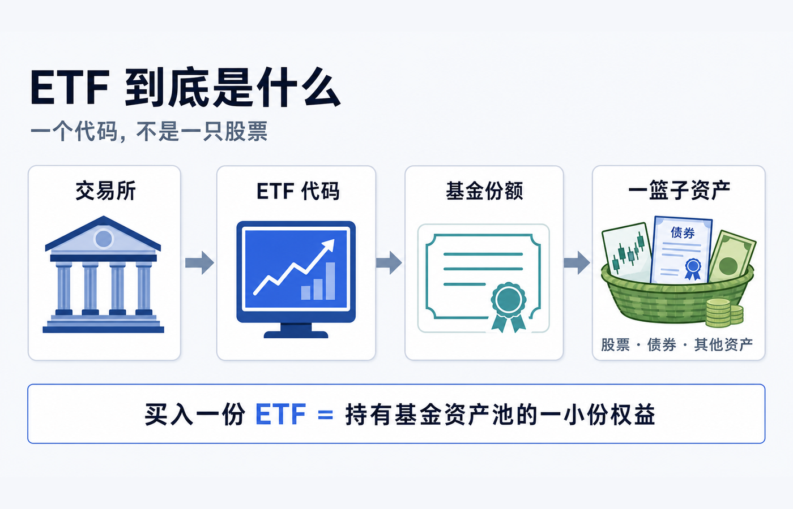
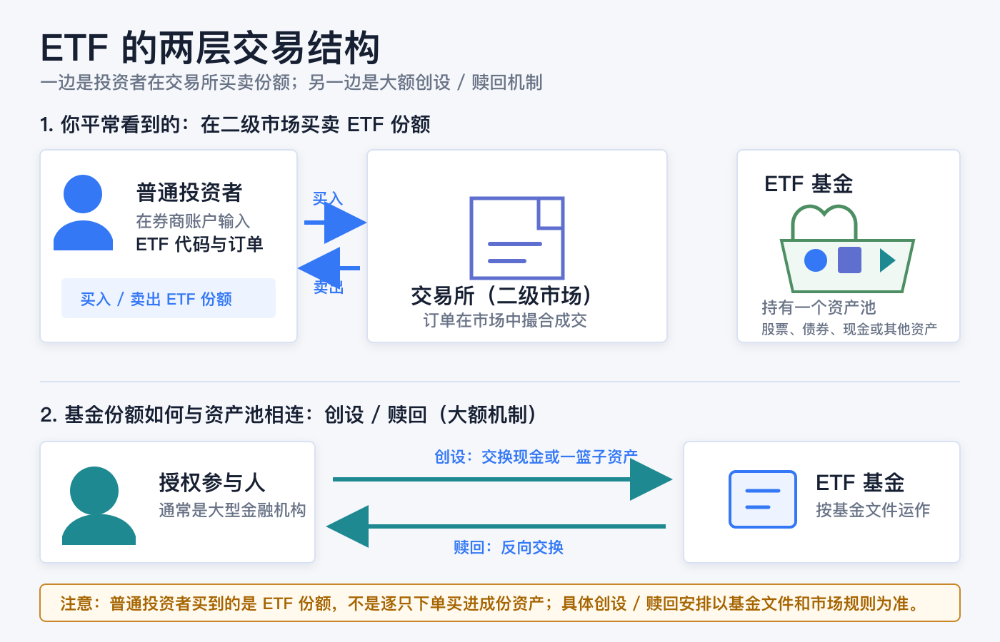
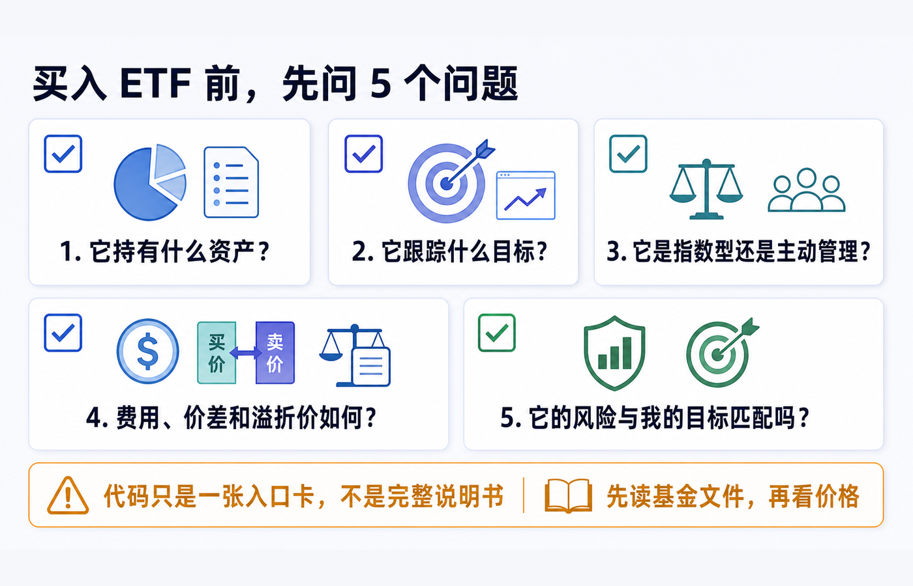

先说结论：**ETF 的代码不是一只股票的身份证，而是一只基金份额在交易所里的交易入口。** 你买入一份 ETF，通常买到的是该基金资产池的一小份权益；基金再按照自己的目标、规则和文件，持有股票、债券、现金或其他资产。于是，一次下单可以让你间接参与一组资产的表现，但这不代表你逐只买进了里面的每一项资产，也不代表它必然分散、必然跟踪指数或必然适合你。

把它想成一个已经装好的“资产篮子”会很直观：基金负责按规则管理篮子，交易所让基金份额像股票一样在盘中买卖，代码则让你在券商界面找到这份基金。你输入代码、价格和数量时，通常是在二级市场买卖**ETF 份额**；基金资产池本身不会因为每一笔普通投资者订单就即时逐只重组。

> 本文仅用于一般投资教育，不构成投资、交易、税务、法律、开户、银行或跨境资金建议。ETF 的法律结构、可投资资产、交易规则、申购赎回安排、费用、报价、最低交易单位与投资者适当性要求，都会因市场、基金文件、券商实体和账户地区而不同。实际交易前，请阅读目标基金的当前说明书、产品页、交易所披露与本人券商的订单页面。资料核对日期：2026-08-13。

## 先拆开四个词：代码、份额、基金和资产池

这四个词在交易 App 里常常挤在同一行，容易被误当成同一件事；其实它们分属不同层次。

| 你看到的东西 | 它实际指什么 | 最容易误会的地方 |
|---|---|---|
| ETF 代码 | 交易所和券商用来识别某只产品的简称或标识 | 代码本身不会告诉你完整持仓、风险、费用和策略。 |
| ETF 份额 | 你在账户中买卖、持有的单位 | 它代表对基金资产池的按比例权益，不等于每一只成份股各买一股。 |
| ETF 基金 | 有既定投资目标、管理人和披露文件的基金产品 | 它可以是指数型，也可以是主动管理；不一定只持有股票。 |
| 资产池 / 投资组合 | 基金实际持有或按规则配置的资产与现金 | “一篮子”可能很分散，也可能集中在少数行业、单一股票或其他特定风险上。 |

美国 SEC 的投资者教育材料把 ETF 描述为一种让多人资金汇集到同一基金、再投资于股票、债券、其他资产或其组合的产品；每一份基金份额代表投资者对该组合及其收益的一定比例权益。[Investor.gov：ETF 投资者公告](https://www.investor.gov/introduction-investing/general-resources/news-alerts/alerts-bulletins/investor-bulletins-24)

这也是标题里“一篮子股票怎么买进一个代码里”的真正答案：**不是代码把股票压缩进去了，而是基金先形成了资产池，再把可交易的基金份额挂牌；代码只是找到这份额的入口。** 如果目标 ETF 持有的是债券、货币市场工具、商品相关资产或其他安排，篮子里也就不只是股票。

## 指数、ETF 和代码：像路线图、交通工具和车牌

为了不把“指数基金”“ETF”和“某个代码”混为一谈，可以用一个不完全但实用的比喻：

- **指数**像一份规则或路线图：它描述哪些资产按什么规则、什么权重被纳入和调整。指数本身不是你可以直接放进账户里的基金份额。
- **ETF**像执行这套规则的一种基金载体：很多 ETF 会追踪指数，也有 ETF 由管理人主动选择和调整投资组合。两者不能画等号。
- **代码**像交易所给这辆“载体”贴上的车牌：它帮助你下单，却不能替代说明书。

上交所的 ETF 介绍也指出，ETF 是跟踪标的指数变化、并在证券交易所上市交易的基金；同时，上交所把股票 ETF、债券 ETF、跨境 ETF、商品 ETF 和交易型货币基金列为不同类型。[上海证券交易所：ETF 专栏](https://www.sse.com.cn/assortment/fund/etf/)

因此，看到“ETF”三个字时，第一步不是假定它一定是“几百只股票的低费率指数基金”，而是先问：**它究竟持有什么、想实现什么目标、用什么方式实现？** 美国 SEC 也提醒，ETF 可以是指数型或主动管理型；同样带有 ETF 名称的交易所交易产品，法律结构也未必相同，不能只从名称判断。[Investor.gov：共同基金与 ETF 的特点](https://www.investor.gov/introduction-investing/general-resources/news-alerts/alerts-bulletins/characteristics-mutual-funds-exchange-traded-funds)

## 普通投资者点击“买入”时，发生了什么

如果你通过券商买入一份 ETF，常见流程可以理解为四步：

1. 你在券商账户中选择目标 ETF，填写买入/卖出、数量、订单类型和价格条件；
2. 订单被送往可交易该份额的市场；
3. 市场按当时可用的报价和订单规则撮合；
4. 成交后，你的账户增加 ETF 份额，现金和成交记录按券商及市场规则更新。

这叫**二级市场交易**。对普通投资者而言，ETF 份额通常是在交易所内、以市场价格买卖；你不是直接拿着一笔小额现金向基金管理人逐只购买篮子里的底层资产。SEC 的说明明确区分了这一点：普通投资者在市场交易中买卖 ETF 份额，而不是由 ETF 直接向每位普通投资者逐份发行或赎回。[Investor.gov：ETF 如何运作](https://www.investor.gov/introduction-investing/general-resources/news-alerts/alerts-bulletins/investor-bulletins-24)

这也解释了一个常见困惑：你按下“买入”后，为什么持仓里显示的是一个代码和若干份额，而不是几十只、几百只股票？因为你账户持有的是**基金份额**，基金层面才持有或配置那组资产。

## 基金份额为什么能和“篮子”保持连接

普通投资者的二级市场买卖之外，很多 ETF 还存在面向授权参与人的大额创设/赎回机制。授权参与人通常是大型金融机构或券商；它们可以按基金规则，用现金、指定资产组合或两者的安排，与基金交换大额 ETF 份额。这个过程与普通投资者在 App 里买 1 份、10 份 ETF 是不同层次的事。

以美国注册 ETF 的一般框架举例：授权参与人可向基金交付指定的一篮子证券和现金，获得大额“创设单位”；赎回时则反向交换。由于授权参与人既能与基金直接按净值层面交易，也能在市场上交易 ETF 份额，这一机制会形成套利动机，通常有助于让 ETF 市场价格靠近每份净值（NAV），但并不保证两者时时完全相同。[Investor.gov：ETF 的创设、赎回与溢折价](https://www.investor.gov/introduction-investing/general-resources/news-alerts/alerts-bulletins/investor-bulletins-24)

要注意两个边界：

- **不是所有市场、所有基金都使用完全相同的现金/实物和结算安排。** 具体以目标基金说明书、交易所规则和基金公告为准。
- **“通常靠近”不是“永远相等”。** 市场价格会随着买卖需求和资产价格变动；当市场价格高于 NAV 时叫溢价，低于 NAV 时叫折价。流动性紧张、底层资产不易实时估值或市场波动较大时，差异可能更明显。

所以，ETF 的巧妙之处不在于“代码里真的塞进了股票”，而在于它同时有一套**基金资产池**和一套**可在市场上流通的份额**，再用大额创设/赎回把两者相连。

## ETF 和直接买股票、场外基金有什么不同

下面这张表只帮助你认识交易结构，不是在评价哪一种一定更好。

| 问题 | 直接买单只股票 | ETF | 典型场外共同基金 |
|---|---|---|---|
| 账户里持有什么 | 某家公司的股票 | 一只基金的份额 | 一只基金的份额 |
| 投资组合由谁形成 | 你自己逐只选择 | 基金按目标和规则管理 | 基金按目标和规则管理 |
| 盘中如何成交 | 交易所市场价 | 交易所市场价 | 常按基金计算后的净值处理，具体规则看产品文件 |
| 是否天然分散 | 不分散，除非你自己持有多只 | 不一定；要看实际持仓和集中度 | 不一定；要看实际持仓和集中度 |
| 下单前最该读什么 | 公司披露、业务和风险 | 说明书、策略、持仓、费用、NAV 与价差 | 招募说明书、策略、费用和申赎规则 |

SEC 对共同基金与 ETF 的比较特别强调：ETF 投资者通常在交易所按市场价格买卖，市场价格可能高于或低于 NAV；共同基金的交易定价方式则不同。两类产品都会有费用，费用会减少投资回报。[Investor.gov：共同基金与 ETF 的特点](https://www.investor.gov/introduction-investing/general-resources/news-alerts/alerts-bulletins/characteristics-mutual-funds-exchange-traded-funds)

“可以像股票一样交易”是 ETF 的交易方式，不是风险标签。它不会自动把基金变成一只股票，也不会自动消除底层资产、行业、利率、汇率、杠杆、衍生品或流动性风险。

## 再往下一层：同时看“主要资产”和“实现机制”

“ETF”只说明它是一种交易入口，不能单独说明风险来自哪里。读一只产品时，我会同时写下两条线：它主要让持有人暴露于什么资产，以及它用什么机制实现目标。

| 先问什么 | 可能答案 | 下单前继续核对 |
|---|---|---|
| 主要持有什么 / 暴露于什么 | 股票、债券、商品、现金工具或它们的组合 | 国家、行业、期限、信用质量、集中度和主要持仓 |
| 怎样实现目标 | 指数跟踪、主动管理、实物持有、期货、期权、每日杠杆或反向 | 基准、复制方式、展期、对手方、每日重置、费用与主要风险 |

这能避免把“股票 ETF”“债券 ETF”“商品相关 ETP”和“收益策略 ETF”误当成互斥分类。比如一只产品可以是“股票敞口 + 主动管理 + 期权策略”；一只商品相关交易所交易产品也可能使用实物、期货或其他结构。名称、分配率和代码都不能替代说明书。

- **股票 ETF**：先确认它是宽基、行业、国家、主题还是单一股票相关敞口；“一篮子”不等于集中度一定低。
- **债券 ETF**：持有的是会按规则调整的债券组合，不等于自己直接持有一张固定到期日的债券；需要看久期、信用质量和期限规则。
- **商品相关产品**：先确认法律结构和主要资产。美国市场的 ETF、商品信托与 ETN 可能并非同一种结构；如果使用期货，还需要理解展期和衍生品风险。[Investor.gov：交易所交易产品](https://www.investor.gov/introduction-investing/investing-basics/glossary/exchange-traded-products-etps)
- **策略、杠杆或反向产品**：名称里的“收益”“防御”“每日倍数”描述的是目标或机制，不是结果保证。美国 SEC 提醒，杠杆和反向 ETF 通常追求每日结果，持有期变长时的表现可能与直觉不同。[Investor.gov：杠杆与反向 ETF](https://www.investor.gov/introduction-investing/general-resources/news-alerts/alerts-bulletins/investor-alerts/sec)

用一句完整的话描述产品会比只记代码可靠：**它主要持有什么、按什么规则实现、我承担的主要风险是什么。** 这也是把“ETF 是什么”落实到真实产品前最短的检查路径。

## 为什么代码旁边还要看 NAV、Bid 和 Ask

在交易界面上，你可能同时看到三个不同的价格概念：

| 名称 | 它回答的问题 | 不能把它当成什么 |
|---|---|---|
| NAV（每份净值） | 基金资产减负债后、按份额计算的价值衡量 | 不是每一秒都等于你能立刻成交的价格。 |
| Bid（买价） | 当前买方愿意买入的较高报价 | 不是买入者一定支付的价格。 |
| Ask（卖价） | 当前卖方愿意卖出的较低报价 | 不是卖出者一定收到的价格。 |
| Last（最新成交） | 最近一笔实际成交发生在什么价格 | 不是你的新订单必然复制到的成交价。 |

Bid 与 Ask 的差是买卖价差。SEC 的 ETF 公告把它视为会影响潜在回报的一项交易摩擦，并建议投资者在基金网站查看包括中位价差、历史溢折价和持仓在内的公开资料。[Investor.gov：ETF 的费用、价差与溢折价](https://www.investor.gov/introduction-investing/general-resources/news-alerts/alerts-bulletins/investor-bulletins-24)

因此，理解 ETF 不能停在“这个代码对应一篮子股票”这句话：你还需要知道，这个代码在市场上的即时交易价格，可能与基金披露的 NAV 不同；而你自己的实际成交，还取决于订单类型、报价、流动性与交易时段。

## “一篮子”不等于“什么风险都被分散掉了”

ETF 的确可以让小额资金参与一个基金资产池，但“篮子”有大有小、有宽有窄。至少要避开四个误解：

1. **不是每只 ETF 都追踪广泛指数。** 有些基金聚焦一个国家、行业、主题、期限、商品或单一证券相关策略。
2. **不是每只 ETF 都持有很多股票。** ETF 也可能以债券、现金工具、衍生品、商品相关资产或其他结构为主。
3. **不是持仓数量多就等于风险低。** 成份资产之间可能高度相关，也可能集中在少数发行人、地区或风险因子上。
4. **不是“ETF”三个字就能说明法律结构。** 先阅读产品的投资目标、主要策略、风险、费用和当前披露；不要只根据名称、代码或社交媒体截图判断。

以美国市场为例，SEC 提醒某些 ETF 甚至可能追踪单一股票，因而分散程度会很低；基金名称也不总能让你判断它是共同基金、ETF 还是其他交易所交易产品。[Investor.gov：共同基金与 ETF 的特点](https://www.investor.gov/introduction-investing/general-resources/news-alerts/alerts-bulletins/characteristics-mutual-funds-exchange-traded-funds)

## 买入前，用五个问题把代码翻译成事实

你不需要在第一次接触 ETF 时背下所有术语，但至少要能把代码转成下面五个可核对的问题：

1. **它持有什么资产？** 看主要持仓、资产类别、地区和货币，而不是只看基金名称。
2. **它跟踪什么目标？** 如果是指数型，确认基准指数和复制方式；如果是主动管理，确认管理人依据什么策略调仓。
3. **它是指数型还是主动管理？** 两者都可能是 ETF，但风险来源、换手和跟踪方式不同。
4. **费用、价差和溢折价如何？** 费用率不是全部成本；还要看买卖价差、可能的券商收费和价格相对 NAV 的情况。
5. **它的风险和我的目标匹配吗？** 想解决的是长期配置、短期现金管理、行业暴露还是其他目标？自己能否承受相应波动、亏损和流动性风险？

美国 SEC 建议在投资前阅读基金的概要说明书和完整说明书，核对投资目标、主要策略、风险、费用和历史表现，并在基金官网查看 NAV、收盘市场价格、溢折价、持仓和中位价差等资料。[Investor.gov：投资 ETF 前应查看什么](https://www.investor.gov/introduction-investing/general-resources/news-alerts/alerts-bulletins/investor-bulletins-24)

把最后一句记住就够了：**代码是一张入口卡，不是完整说明书。** 看懂这张卡后面的基金、份额、资产池和交易结构，才知道自己真正买的是什么。

## 官方资料

- [Investor.gov：Updated Investor Bulletin: Exchange-Traded Funds (ETFs)](https://www.investor.gov/introduction-investing/general-resources/news-alerts/alerts-bulletins/investor-bulletins-24)
- [Investor.gov：Characteristics of Mutual Funds and Exchange-Traded Funds](https://www.investor.gov/introduction-investing/general-resources/news-alerts/alerts-bulletins/characteristics-mutual-funds-exchange-traded-funds)
- [上海证券交易所：ETF 专栏](https://www.sse.com.cn/assortment/fund/etf/)
- [Investor.gov：Exchange-Traded Products (ETPs)](https://www.investor.gov/introduction-investing/investing-basics/glossary/exchange-traded-products-etps)
- [Investor.gov：Updated Investor Bulletin: Leveraged and Inverse ETFs](https://www.investor.gov/introduction-investing/general-resources/news-alerts/alerts-bulletins/investor-alerts/sec)

资料核对日期：2026-08-21。基金持仓、费率、净值、溢折价、交易规则与券商支持情况会变化；在实际下单前，请再次以目标基金和本人账户可见的当前资料为准。
