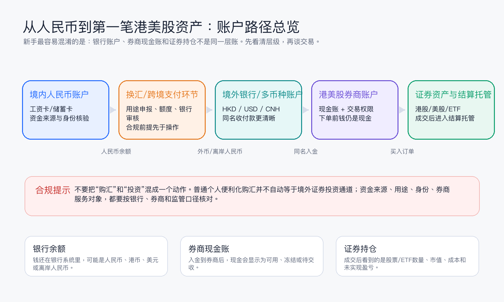
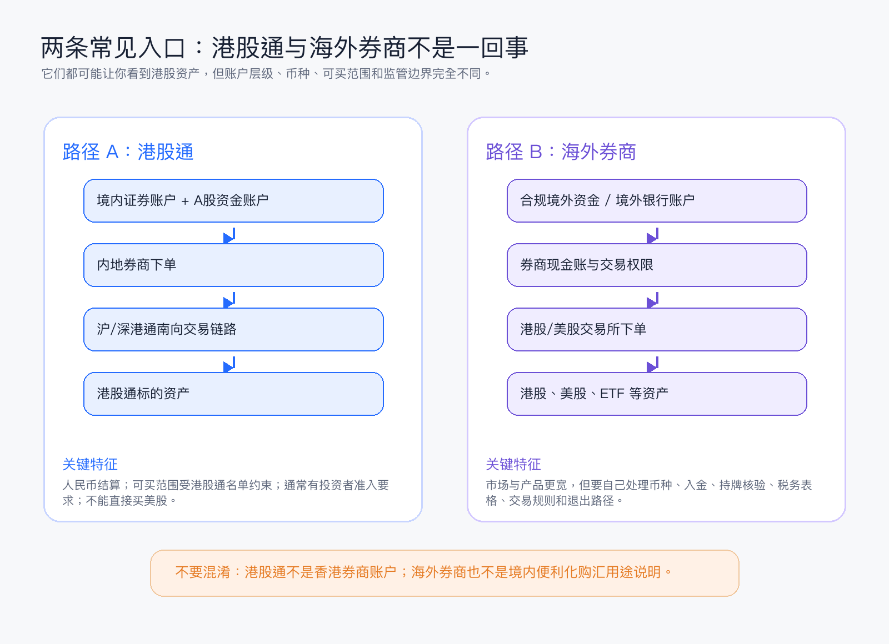
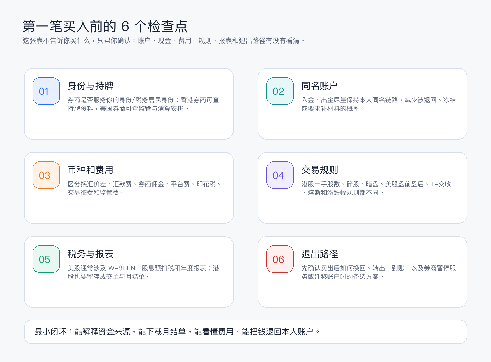

# 新手第一张图：从人民币到第一笔港美股资产，中间到底经过哪些账户

很多新手第一次接触港美股时，脑子里只有一条线：人民币 -> 换成港币/美元 -> 买腾讯或苹果。  

真实世界不是一条线，而是一串账户和账本。你看到的“买到一只股票”，背后至少要分清三层东西：银行里的钱、券商里的现金、结算系统里的证券。

> 本文是账户结构科普，不是开户、换汇、跨境汇款或投资建议。不同身份、居住地、资金来源和券商服务范围会触发不同规则，实际操作前以银行、券商和监管机构的当前口径为准。

## 一句话先讲清楚

从资产视角看，路径大致是：

**境内人民币账户 -> 合规换汇/跨境支付环节 -> 境外银行/多币种账户 -> 券商现金账 -> 港股/美股证券持仓。**

这里每一层都不是摆设。银行账户管的是“钱在哪里”；券商现金账管的是“可不可以下单、用什么币种下单”；证券持仓管的是“成交后你拥有多少股、由谁结算托管、报表如何证明”。

## 你真正会遇到的几类账户

**1. 境内人民币银行账户**  
这是资金起点，但它不是港美股交易账户。它负责记录人民币余额、资金来源、身份信息和银行风控。涉及购汇、跨境付款或资金用途时，银行会看用途、材料和当前政策要求。

**2. 换汇/跨境支付环节**  
这一层最容易被写得过于轻巧。换汇不是“把钱变成美元就万事大吉”，跨境支付也不是“只要能汇出就适合拿来投资”。对境内个人来说，普通个人便利化购汇不应被理解为自动可用于境外证券投资的通道；资金用途、申报和后续去向要按监管与银行要求处理。

**3. 境外银行或多币种账户**  
如果走海外券商路径，通常会先有一个境外银行或多币种账户，用来承接港币、美元或离岸人民币。这个账户的重点不是“看起来离投资更近”，而是让现金、入金、出金和税务记录更清楚。多数券商也更偏好或要求本人同名账户入金。

**4. 港美股券商账户**  
券商账户内部又分两层：现金账和证券持仓。钱刚进券商时，它仍然只是现金，不是股票。下单成交后，现金会被占用或扣减，股票进入持仓，并按港股、美股各自的交收规则更新。

**5. 结算与托管体系**  
新手通常看不到这一层，但它决定了股票成交后如何完成交收。港股通涉及内地与香港市场的交易和清算连接；香港本地券商通常连接香港结算体系；美股则通常通过美国券商、清算商和存管体系完成交收。你日常最该保存的是成交单、月结单、资金流水和税务表格。

## 港股通和海外券商：不要混成一条路

如果目标只是买部分港股，很多内地投资者接触到的第一条路径是港股通。它和“开一个香港券商账户”不是同一件事。

| 维度 | 港股通 | 海外券商 |
|---|---|---|
| 账户入口 | 境内证券账户和 A 股资金账户 | 境外银行/多币种账户 + 港美股券商账户 |
| 常见币种 | 人民币结算 | 港币、美元、离岸人民币等，视券商而定 |
| 可买范围 | 港股通名单内的港股/ETF，范围有限 | 视券商和交易权限，可能覆盖港股、美股、ETF 等 |
| 是否能买美股 | 不能 | 取决于券商、身份、权限和当地规则 |
| 核心限制 | 标的范围、额度、准入、交易日历 | 资金路径、持牌核验、税务表格、汇率和出入金 |
| 适合理解为 | 境内账户买部分港股的连接机制 | 境外现金进入券商后参与多个市场 |

港股通的好处是账户层级相对简单：钱仍在境内券商资金体系里，人民币结算，适合先理解港股交易规则。但它不是离岸银行账户，也不能拿它去买美股。

海外券商路径的自由度更高，但你要自己承担更多“非交易问题”：资金是否合法合规到达境外、券商是否持牌并服务你的身份、现金是否受银行存款保障、证券如何托管、股息如何扣税、以后如何把钱转回。

## 第一笔买入发生时，账本怎么变化

假设你在券商里已经有 1,000 美元现金，想买一只美股 ETF。下单前，这 1,000 美元显示在券商现金账里。你提交限价单后，券商会按订单预占现金或购买力。订单成交后，持仓里出现 ETF 数量，现金减少，但这并不代表所有结算都立刻完成。

所以你会在券商里看到几个容易混淆的数字：

- **可用现金**：当前可以继续下单或转出的现金，可能会被未成交订单占用。
- **待交收现金**：交易已经发生，但还在交收周期里。
- **持仓市值**：股票或 ETF 按市场价格估算的价值，会随价格波动。
- **总资产**：现金加持仓市值，不等于你今天一定能马上转出的金额。

这也是为什么“我明明卖出了，为什么不能提现”是新手常见问题：卖出和现金可出金之间，可能隔着交收、币种、券商风控和银行到账时间。

## 买第一笔前，先做这 6 个检查

**1. 查身份与持牌**  
香港券商可核对香港证监会持牌资料；美国券商也应核对监管、清算和客户资产保护安排。不要只看 App 是否好用。

**2. 保持同名资金链路**  
入金、出金尽量使用本人同名账户。第三方账户、代付代收和解释不清的资金来源，都会增加风控成本。

**3. 先算币种和费用**  
交易成本不只佣金。港股可能涉及印花税、交易征费、交易费、平台费；美股可能涉及佣金、监管费、汇率点差和股息预扣税。

**4. 看懂市场规则**  
港股有一手股数和碎股问题，美股有盘前盘后和不同订单有效期。不同市场的交收、休市、涨跌限制和熔断机制也不同。

**5. 留存税务与报表**  
美股常见 W-8BEN、股息预扣税和年度报表；港股也要保存成交单、月结单和资金流水。不要等到报税、转仓或券商审查时才找记录。

**6. 先确认退出路径**  
买入前就要知道卖出后资金如何回到现金账、如何换币、如何出金、多久到账。如果券商暂停服务、账户被限制或你要换券商，是否能转仓也要提前知道。

## 最容易踩的 5 个误区

**误区一：有港股账户就等于能买美股。**  
不一定。市场权限、币种、券商服务范围和监管要求都可能不同。

**误区二：券商现金和银行存款一样。**  
不一样。券商现金通常不是普通银行存款，保障机制、托管安排和风险边界要看券商所在司法区和具体条款。

**误区三：买入价就是全部成本。**  
不是。汇率、佣金、平台费、印花税、交易征费、监管费、股息税都会改变真实成本。

**误区四：能汇出去就一定合规。**  
不成立。合规要看资金来源、用途、申报、接收账户、服务对象和后续交易行为。

**误区五：港股通就是香港券商账户。**  
不是。港股通是内地与香港市场互联互通机制下的交易路径；香港券商账户是另一个账户体系。

## 结尾：先把账户图画对，再谈买什么

新手的第一课不是挑股票，而是分清楚“钱在哪一层账上”。  

当你能把这五句话说清楚，第一笔港美股资产才算真的入门：

1. 我的人民币资金来源是什么；
2. 我使用的跨境或投资路径是否符合当前规则；
3. 我的现金现在在银行账户还是券商现金账；
4. 我买入后证券由哪套结算/托管体系记录；
5. 我卖出后钱如何回到本人账户。

把这张图存下来。每次看到一个“超低费率开户”“一键入金”“快速买美股”的广告，都先拿它对照一遍：对方到底在帮你解决哪一层账户问题，又把哪一层风险轻描淡写了？

## 参考资料

- HKEX, [Stock Connect FAQ](https://www.hkex.com.hk/-/media/HKEX-Market/Mutual-Market/Stock-Connect/Getting-Started/Information-Booklet-and-FAQ/FAQ/FAQ_En.pdf), version date 2026-07-06.
- 香港证监会，[Public Register of Licensed Persons and Registered Institutions](https://www.sfc.hk/publicregWeb?locale=en).

