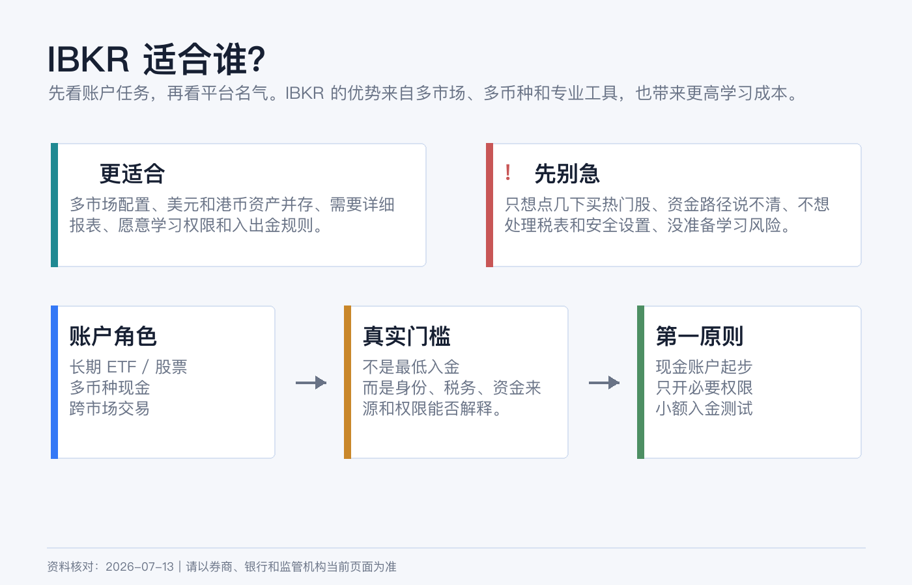
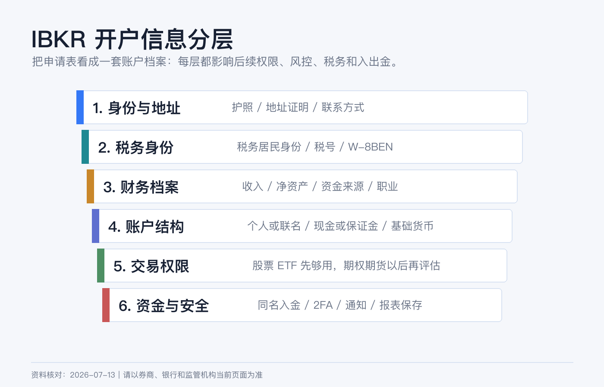
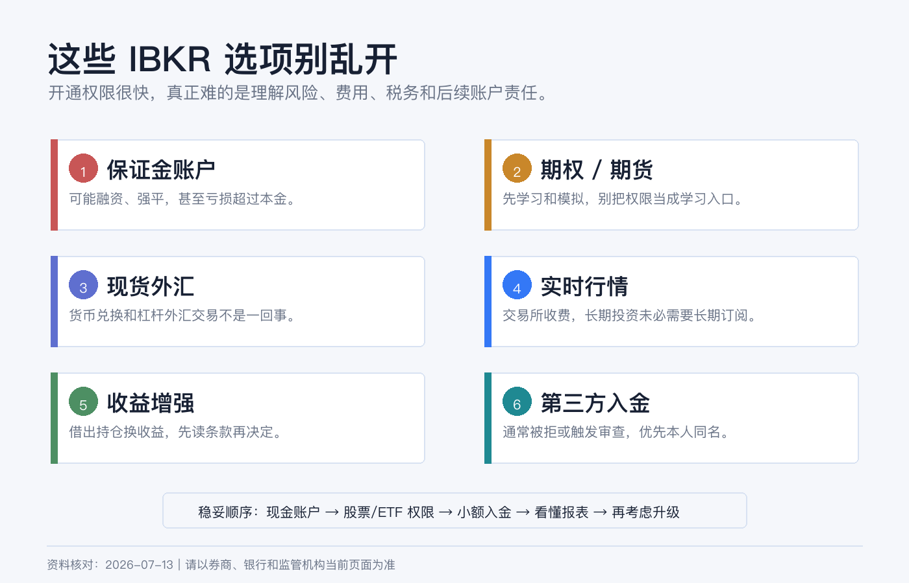

# IBKR 开户前先搞懂：适合谁、准备什么、哪些选项别乱填

IBKR 很容易被新手想成“能买全球资产的券商 App”。这个理解只说对了一半。

它真正强的地方，是把多市场、多币种、订单工具、保证金、报表和机构级功能放在同一个账户体系里。好处是自由度高，坏处是你会在开户时遇到一堆看似可以随便选、实际会影响风险和合规的问题。

> 本文是开户前认知清单，不是开户、税务、换汇、跨境汇款或投资建议。不同居住地、税务身份、资金来源和 IBKR 实体会触发不同规则。资料核对日期：2026-07-13。

## 结论先行

如果只讲一句话：**IBKR 适合愿意把券商当成“长期账户系统”来管理的人，不适合只想点几下就买热门股的人。**

更具体一点：

| 你是哪类人 | IBKR 是否适合 |
|---|---|
| 想长期配置美股 ETF、部分港股、债券或多市场资产 | 适合，但先从现金账户和基础权限开始。 |
| 经常需要多币种现金、换汇、跨市场下单和详细报表 | 比较适合，IBKR 的优势会更明显。 |
| 只想买几只美股，完全不想研究权限、税表和入出金 | 未必适合，简单平台可能更省心。 |
| 想一上来做期权、期货、杠杆、外汇交易 | 先停一下，开户通过不等于你理解了风险。 |
| 资金路径、资金来源或税务居民身份说不清 | 不建议急着申请，先把文件整理好。 |

IBKR 官网显示，个人、联名、信托和机构相关账户中的个人/联名等常见账户最低开户资金要求为 USD 0；但这不代表“没准备好也能开”。真正的门槛不是最低入金，而是你能不能诚实、稳定、可解释地完成身份、税务、资金和权限配置。

## 你开户前至少要准备什么

开户不是只填姓名和邮箱。按新手最容易卡住的顺序，我会先准备这几类资料：

| 模块 | 要提前准备什么 |
|---|---|
| 身份 | 护照或其他 IBKR 当前接受的身份证明，姓名拼写要和银行、税务资料一致。 |
| 居住地址 | 最近的银行账单、水电账单、政府文件或其他可证明居住地址的材料，具体以申请页面要求为准。 |
| 税务信息 | 税务居民身份、税号或无法提供税号的原因；非美国个人通常会遇到 W-8BEN。 |
| 财务状况 | 年收入、净资产、流动净资产、资金来源、就业状态、雇主或职业信息。 |
| 投资经验 | 股票、ETF、期权、期货、外汇等经验年限和交易频率。不要为了开权限而夸大。 |
| 入金账户 | 本人同名银行账户或可解释的资金路径；第三方入金很容易被拒绝或触发审查。 |
| 安全设置 | 稳定手机号、邮箱、密码管理器、备用设备和 2FA 准备。 |

这里最值得强调的是：**财务状况和投资经验不是装饰字段。** 它们会影响交易权限、风险揭示、合规审查和后续账户行为。如果你把“没做过期权”填成“多年经验”，短期可能只是多开了一个按钮，长期是把风险和责任都推给了自己。

## 现金账户和保证金账户，不要随手选

很多人看到 “Margin” 会觉得这是高级账户，默认应该开。其实新手第一账户更应该先理解现金账户和保证金账户的差别。

| 账户类型 | 你该怎么理解 |
|---|---|
| Cash Account | 用账户里已交收现金交易。限制更多，但边界清楚。适合新手、长期 ETF、低频交易。 |
| Margin Account | 可以使用保证金和更复杂的交易能力，可能发生强平和超过本金的损失。适合真正理解杠杆、保证金规则和风险的人。 |

IBKR 个人账户页说明，现金账户最低年龄要求为 18 岁，保证金账户为 21 岁。这不是唯一门槛，但说明平台本身就把保证金视为更高风险能力。

如果你只是准备买美股 ETF、少量港股或做长期配置，第一步没有必要为了“以后可能用得上”而直接选择保证金。以后需要时再评估升级，通常比一开始就把风险开大更稳。

## 基础货币不是“我只能用这个币交易”

IBKR 会让你选择 Base Currency。这个字段容易被误解。

基础货币更像是账户报表、资产汇总和风险展示的主计价单位，不等于你只能持有这个币，也不等于所有交易都会自动用这个币完成。IBKR 支持多币种入金和交易，官网入金页面也写到可以用多种交易货币入金。

我会这样选：

| 情况 | 基础货币思路 |
|---|---|
| 主要看美元资产和美元报表 | USD 更直观。 |
| 主要生活、记账和复盘在港币 | HKD 可能更方便看总资产，但美股成本仍要单独记录美元。 |
| 主要用人民币衡量家庭资产 | 不要以为选了 CNY 就解决汇率风险，跨币种记录仍要自己做。 |

基础货币选错不是灾难，但会让报表、盈亏和汇率判断变得不顺手。新手最重要的是保持一致：你用什么货币做家庭资产复盘，就尽量让账户报表和自己的记账体系能对上。

## 交易权限只开当前真的会用的

IBKR 的交易权限按资产类别和国家/市场拆分。官网说明，交易权限可以在申请时选择，也可以之后通过 Client Portal 升级；升级会经过监管审查。

所以不要在开户时把所有市场、所有产品都勾上。

我会按这个顺序开：

1. 先开股票和 ETF 所需市场。
2. 保留货币兑换能力，用于实际投资币种转换。
3. 等你真的理解风险后，再考虑期权、期货、复杂杠杆产品或现货外汇权限。

IBKR 官网还特别区分了 Currency Conversion 和 Spot Currencies：所有 IBKR 账户都有货币兑换权限，用于不加杠杆地把一种货币换成另一种；Spot Currencies 是可选的外汇交易权限，需要额外申请。新手经常把这两个混在一起。

## 哪些选项别乱填

**1. 不要为了开权限夸大收入和经验。**  
收入、净资产、流动净资产、投资目标和交易经验会被用于判断你是否适合某些产品。填得越激进，不代表账户越高级，只代表你承担的解释责任越重。

**2. 不要一上来申请期权、期货和杠杆产品。**  
期权和期货不是“多一个按钮”。IBKR 官网风险披露也明确提醒，期权、期货、外汇、保证金和固定收益等产品可能有重大损失风险，保证金交易可能亏损超过初始投资。

**3. 不要把基础货币当作自动换汇设置。**  
基础货币主要影响显示和报表。你下单时资金在哪个币种、是否需要换汇、是否产生融资或负现金，仍然要自己检查。

**4. 不要随便开 Market Data 实时行情。**  
IBKR 说明实时行情费用由交易所收取并传递给客户，专业用户和非专业用户通常有不同价格。长期投资者用延迟行情、ETF 官网报价或交易前临时订阅，往往比长期挂着一堆实时行情更合理。

**5. 不要随便参加股票收益增强计划。**  
这类计划通常涉及借出你持有的股票来换取收益。它不是存款利息，也不是无风险补贴。先读条款，理解借券、投票权、税务和极端情况，再决定是否启用。

**6. 不要用第三方账户入金。**  
IBKR 入金页面明确写到，强烈不鼓励并通常会拒绝第三方入金，因为这类入金在金融行业和监管视角下容易涉及欺诈和洗钱风险。最稳的做法是本人同名账户，按 Client Portal 生成的币种和路径创建入金通知。

## 一个更稳的开户顺序

我会把第一次 IBKR 开户拆成 6 步：

1. 先确定用途：买什么市场、持有多久、是否只做 ETF/股票。
2. 准备文件：身份证明、地址证明、税务信息、资金来源说明。
3. 选择账户：新手优先现金账户，除非你明确需要保证金。
4. 选择基础货币：按你的长期记账和复盘币种来选。
5. 只开必要权限：股票/ETF 和必要市场先够用。
6. 入金前检查路径：本人同名、币种正确、先生成入金通知，再小额测试。

开户完成不是终点。真正的账户质量，要看你后面能不能安全登录、顺利入出金、看懂报表、保存税务资料，并且在市场波动时不被多余权限诱导去做自己不理解的交易。

## 参考资料

- Interactive Brokers, [Personal Brokerage Accounts](https://www.interactivebrokers.com/en/accounts/individual.php).
- Interactive Brokers, [Required Minimums](https://www.interactivebrokers.com/en/accounts/required-minimums.php).
- Interactive Brokers, [Trading and Market Data](https://www.interactivebrokers.com/en/accounts/trading-and-market-data.php).
- Interactive Brokers, [Fund Your Account](https://www.interactivebrokers.com/en/support/fund-my-account.php).
- Interactive Brokers, [Warning on Frauds and Scams](https://www.interactivebrokers.com/en/general/warnings-on-frauds-and-scams.php).
- IRS, [About Form W-8 BEN](https://www.irs.gov/forms-pubs/about-form-w-8-ben).
