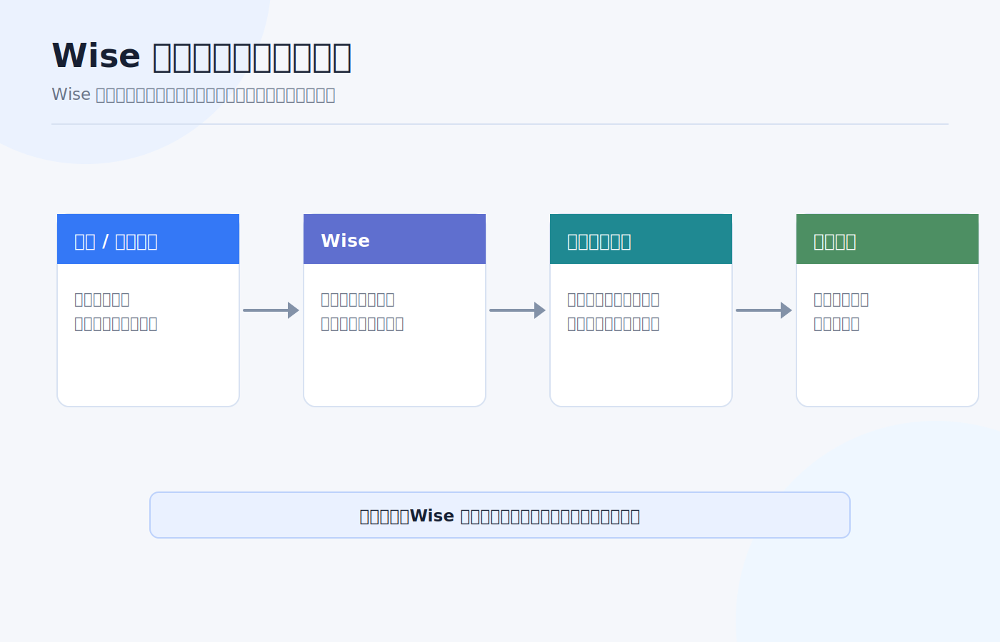
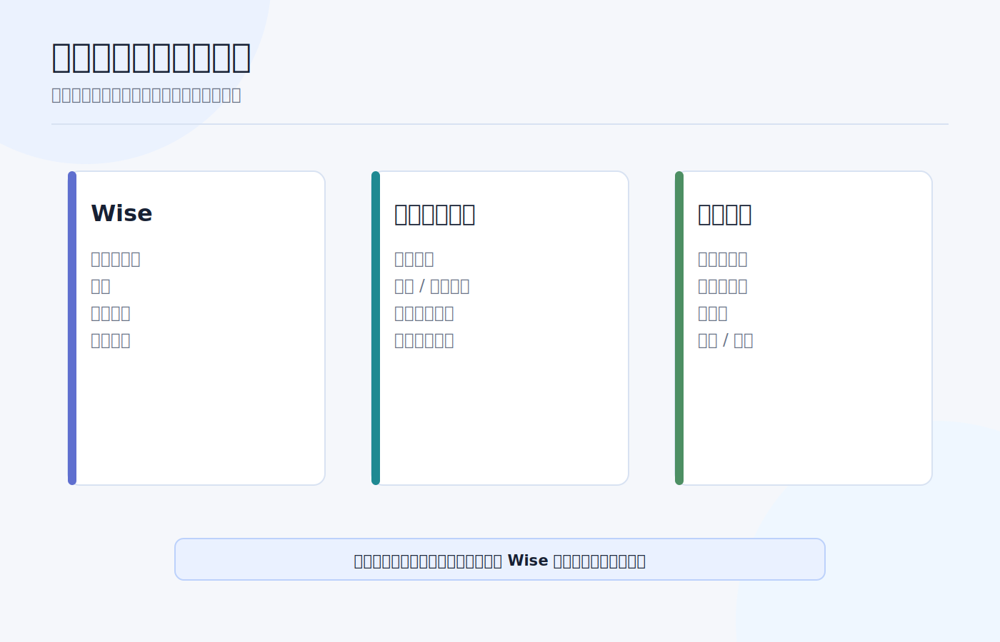
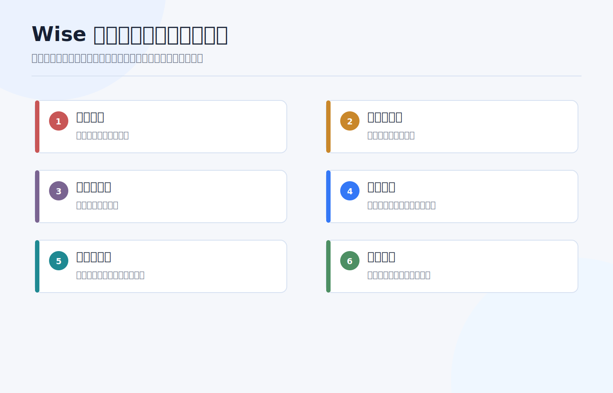
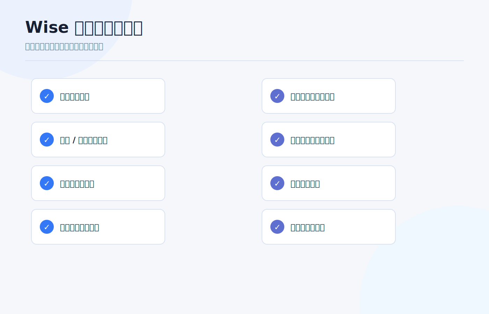

# Wise 与海外银行卡：资金流转路径和风控注意事项

Wise 和海外银行卡经常被放在一起讨论：一个能收多币种、换汇、转账；一个能连接本地银行网络、刷卡、入金券商。看起来都在解决“钱怎么跨境流动”的问题。

但它们不是同一种账户。

Wise 更像多币种资金工具和支付机构账户；海外银行卡背后是某个银行账户、本地支付网络和存款保障体系。两者都能好用，也都可能因为用途、金额、交易对手和资料不完整而触发风控。

> 本文是资金流转和风控认知框架，不是换汇、跨境汇款、税务、法律或投资建议。不同国家、账户实体、客户身份、币种和用途会触发不同规则，实际操作前以 Wise、银行、券商和监管机构当前口径为准。资料核对日期：2026-07-13。

## 先讲结论

Wise 和海外银行卡的关系，可以用一句话概括：

**Wise 适合做多币种收款、换汇和中转；海外银行卡适合做本地银行身份、长期资金留存和券商同名入出金。**

它们的边界大致是：

| 工具 | 更像什么 | 适合做什么 | 不适合做什么 |
|---|---|---|---|
| Wise | 支付机构 + 多币种账户详情 | 收本地付款、换汇、小额中转、跨境转给本人银行 | 当作长期银行存款、规避银行或券商审查、频繁大额不解释资金来源 |
| 海外银行卡 | 银行账户 + 本地支付网络 | 工资/租金/账单、券商同名入出金、长期流水和资金来源证明 | 只为绕路入金、不维护资料、混用个人/商业用途 |
| 券商账户 | 投资和交易账户 | 持有现金和证券、交易、生成税表和报表 | 当作收款账户或第三方资金中转站 |

最稳的结构不是“所有钱都先进 Wise”，也不是“有海外卡就随便转”。最稳的结构是每个账户都有清楚角色：谁负责收款，谁负责换汇，谁负责长期留存，谁负责投资。

## Wise 的账户详情是什么

Wise 官方帮助说明，用户可以获得 account details，并把这些信息提供给付款方；付款方可以直接从银行向你付款。Wise 支持多个币种的账户详情，包括 USD。收到的钱会进入对应币种余额，然后你可以持有、换成其他币种，或转到外部银行账户。

这意味着 Wise 的“账户详情”很像本地收款信息：

| 字段 | 常见用途 |
|---|---|
| Account number | 标识你在对应收款安排下的账户。 |
| Routing number | 美国本地 ACH 或 wire 可能用到。 |
| IBAN | 欧洲等地区常用。 |
| Swift/BIC | 国际汇款常用。 |

Wise 也提醒，国内本地付款通常更便宜更快；多数币种本地收款没有收款费，但 USD domestic wire 和多数 SWIFT 收款可能有费用。它还明确不接受现金或支票付款。

所以 Wise 的价值在于：你可以像本地账户一样收某些币种，再用 Wise 做换汇或转出。但这不等于 Wise 就是传统银行账户，也不等于所有券商都会接受 Wise 入金。

## 海外银行卡解决的是另一个问题

海外银行卡背后通常是银行账户。它更适合做长期金融身份：

1. 工资、租金、账单、学费、保险等本地生活收支。
2. 和券商、税务、雇主、学校或房东形成稳定流水。
3. 作为本人同名入出金账户。
4. 提供银行账单、地址证明和资金来源记录。
5. 使用本地支付网络，比如美国 ACH、香港 FPS、新加坡 PayNow。

和 Wise 相比，海外银行卡通常更适合作为“最终资金账户”。原因不是银行永远更好，而是长期流水、账户证明、存款保障和券商同名匹配往往更清楚。

但海外银行卡也有维护成本：地址、手机号、证件、税务居民身份、最低余额、月费、睡眠账户、合规审查都可能影响使用。开了卡不等于可以长期不管。

## 三条常见资金路径

**路径一：海外银行卡 -> 券商。**  
这是最清楚的路径。本人同名银行账户给本人券商账户入金，券商最容易匹配，后续出金也更顺。

**路径二：Wise -> 海外银行卡 -> 券商。**  
Wise 负责收款或换汇，海外银行卡负责长期留存和券商入金。这个路径比直接 Wise 入券商更稳，因为最终入金账户是银行账户。

**路径三：Wise -> 券商。**  
有些券商可能接受，有些不接受。即使账户名相同，底层付款方、银行名称、支付机构类型和备注字段也可能影响匹配。第一次必须先问券商或小额测试。

我更倾向第二条：Wise 做工具，海外银行卡做账户底座，券商做投资账户。角色越清楚，风控解释越容易。

## Wise 的保障边界要看清

Wise 官方“money safe”页面写到，Wise 获许可持有客户资金，并按运营所在国家监管要求执行；Wise 不像银行那样把客户钱贷出去，而是通过 safeguarding 方式把客户资金和自有资金分开，并确保客户需要时可用。Wise 还说明，不同国家/实体下资金持有方式可能不同，资金可能以现金、安全流动资产或可比保障形式持有。

这说明两件事：

**第一，Wise 不是传统银行。**  
它不应被简单理解成“海外银行账户”。存款保险、账户保护和资金持有方式，要看你所在地区对应 Wise 实体和产品。

**第二，safeguarding 不等于投资无风险或无限制可用。**  
你的账户仍可能因为资料、交易、制裁、监管、付款方或异常行为被要求补充文件、延迟处理或限制功能。

如果你要长期放较大余额，应先看清自己所在地区 Wise 实体、资金如何保管、是否有持有限额、是否有利息/资产产品，以及它和传统银行存款保险的区别。

## 哪些行为容易触发风控

Wise 官方验证说明里提到，作为金融机构，它需要知道谁在使用服务，以帮助打击洗钱并保护资金安全；通常会要求身份证明、地址证明，较大金额时可能要求证明资金来源；有时会要求重新验证。

结合银行和券商常见风控，下面这些行为要特别小心：

| 行为 | 风险点 |
|---|---|
| 个人账户收商业款 | Wise 可接受使用政策明确提示个人 Wise 账户不得用于接收商业付款。 |
| 第三方频繁转入转出 | 资金来源、用途和受益人不清楚。 |
| 刚开户就大额跨境流转 | 缺少历史流水和资金来源解释。 |
| Wise 直接给券商入金 | 券商可能不接受支付机构账户或认为付款方不匹配。 |
| 多人共用账户或代收代付 | 容易被视为 money service 或第三方资金处理。 |
| 用 Wise 处理不支持或受限行业 | Wise acceptable use policy 对部分金融服务、加密货币、无牌金融服务等有明确限制。 |
| 地址、姓名、税务身份不一致 | Wise、银行、券商之间资料校验失败。 |

风控不是“平台故意为难你”。金融机构必须知道客户是谁、钱从哪里来、要去哪里、用途是什么。你越早把文件准备好，越少在关键时刻卡住。

## 我会怎么设计路径

如果我是新手，我不会把 Wise 当主账户，而是这样分工：

| 任务 | 推荐账户 |
|---|---|
| 收海外平台小额付款 | Wise 或本地银行，取决于付款方支持什么。 |
| 长期持有现金 | 海外银行账户，先看存款保障和费用。 |
| 换汇和中转 | Wise 可以作为工具，但不要长期堆大额不动。 |
| 给券商入金 | 优先本人同名银行账户。 |
| 保存资金证明 | 银行流水 + Wise 交易记录 + 券商入金记录一起保存。 |

更稳的路径通常是：

**收入或原始资金 -> 本人银行账户 -> Wise 换汇/中转（如需要） -> 本人海外银行账户 -> 本人券商账户。**

如果中间某一步说不清楚，就不要继续放大金额。

## 使用前检查清单

每次用 Wise 或海外银行卡做资金流转前，我会检查这些问题：

1. 这笔钱的来源文件能不能拿出来。
2. 付款方、收款方和账户名是否一致或可解释。
3. 这是不是个人用途，是否误用个人账户收商业款。
4. Wise 是否支持该币种、付款方式、金额和收款地区。
5. 是否会触发持有限额、转账限额或额外验证。
6. 目标券商是否接受 Wise 或该海外银行入金。
7. 汇率、手续费、到账时间和可能的中转扣费是否记录。
8. 交易记录、银行流水、券商入账截图是否保存。

如果是第一次使用某条路径，先小额测试。小额测试不是为了省钱，而是为了确认账户名、备注、到账路径和平台记录都能对上。

## 结尾：Wise 是工具，海外银行卡是底座，券商是投资账户

跨境资金最怕账户角色混乱。

Wise 很适合做多币种收款、换汇和短期中转；海外银行卡更适合做长期银行关系、本地支付网络和券商同名入出金；券商账户则应该服务投资和报表，而不是当成收款中转站。

路径清楚，风控就容易解释。路径混乱，哪怕每一步都能点成功，后面也可能因为资料不一致、资金来源不清、账户用途不匹配而被卡住。

先设计路径，再转钱。先保存凭证，再放大金额。先确认账户角色，再追求速度和费率。

## 参考资料

- Wise, [How do I receive money to my Wise account details?](https://wise.com/help/articles/2898124/how-do-i-use-my-usd-account-details).
- Wise, [How Wise keeps your money safe](https://wise.com/help/articles/2949821/how-wise-keeps-your-money-safe).
- Wise, [Guide to getting verified](https://wise.com/help/articles/2949782/guide-to-getting-verified).
- Wise, [Acceptable Use Policy](https://wise.com/acceptable-use-policy).
