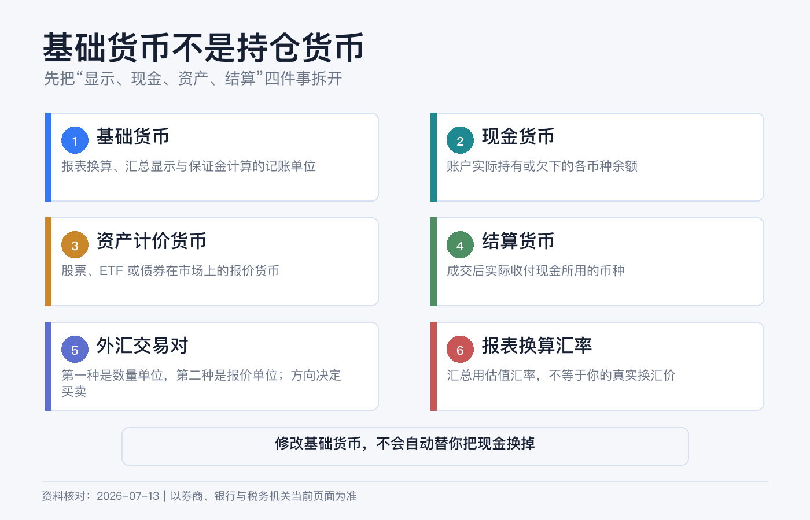
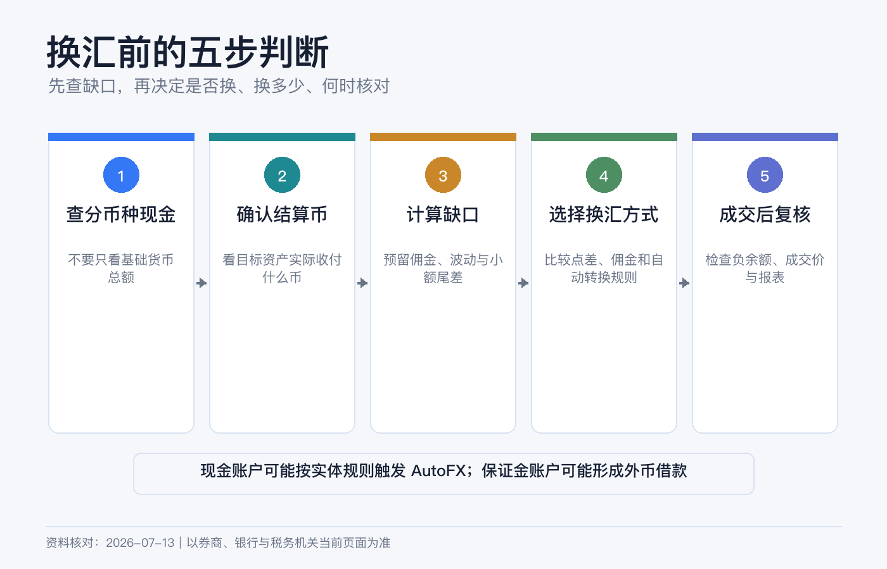
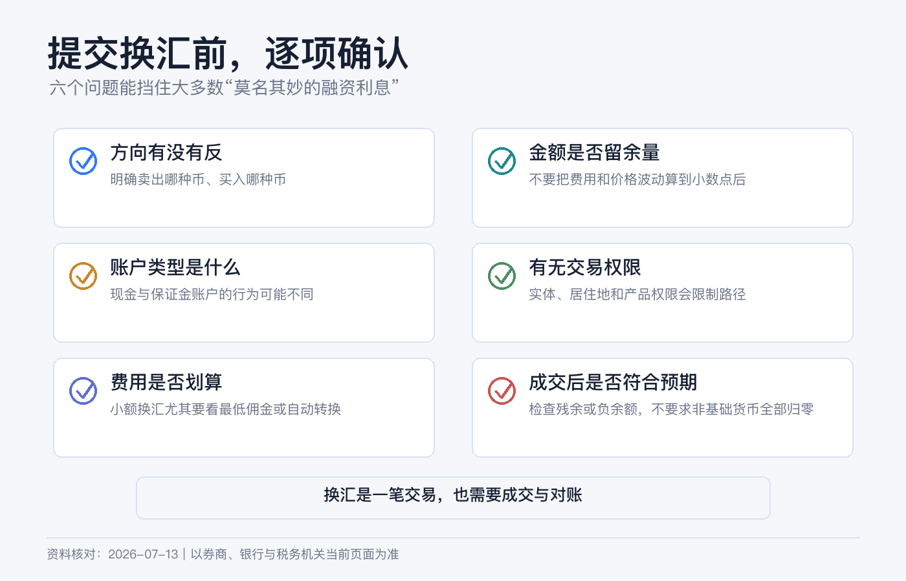

# 基础货币不是持仓货币：IBKR 换汇前必须懂的几个概念

很多 IBKR 新手都会遇到同一种困惑：账户基础货币明明设成 USD，入金后为什么还是 HKD？买了美股后为什么出现负的 USD？把基础货币改成美元，为什么港币没有自动消失？

答案很简单：**基础货币是账户的计量尺，不是装现金的钱包。** IBKR 是多币种账户，计量单位、实际现金、证券交易货币和外汇交易方向是四件不同的事。

> 本文是 IBKR 多币种账户和换汇操作说明，不是外汇交易、跨境汇款、税务或投资建议。自动换汇能力会因开户实体、账户类型、地区、产品和使用平台而不同，费用也会调整。操作前以当前账户预览页、协议和官方费率为准。资料核对日期：2026-07-13。

## 六个概念先分开

| 概念 | 它是什么 | 它不是什么 |
|---|---|---|
| 账户基础货币 / Base Currency | 报表换算、账户汇总和部分保证金、收费的计量货币 | 不代表所有现金都已换成该币种 |
| 分币种现金 / Cash Balance | 账户真实记账的 USD、HKD、EUR 等余额 | 不是基础货币合计行 |
| 已结算现金 / Settled Cash | 已完成交收的该币种现金 | 不等于所有场景下都可立即提取 |
| 证券交易货币 | 股票或 ETF 报价、成交与结算所用货币 | 不一定与账户基础货币相同 |
| 外汇货币对 | 一种货币相对另一种货币的报价和交易工具 | 不是“基础货币设置” |
| 负现金余额 | 该币种欠款或待处理差额，保证金账户中常意味着借款 | 不会必然被另一种正现金自动抵销 |

这里还有一个术语陷阱：外汇货币对也有“基准货币”和“报价货币”。例如 EUR/USD 中，EUR 是货币对前面的币，USD 是报价币。这和“我的账户基础货币是 USD”没有直接关系。

## 基础货币到底影响什么

IBKR 当前 Client Portal 指南说明，Base Currency 用于报表换算、保证金要求的计量，以及部分研究、行情和外汇佣金的收费口径；现金账户可交易产品的货币规则也会受账户设置和实体规则影响。

它最直观的作用是把不同资产换算到同一个单位。假设你持有：

- 5,000 美元现金；
- 30,000 港元现金；
- 2,000 欧元市值的 ETF。

基础货币为 USD 时，账户首页会用当时汇率把港元和欧元折成美元，给出一个美元口径的总值。基础货币改成 HKD 后，同一批资产会换成港币口径展示，但那 5,000 美元和 2,000 欧元资产并没有被卖掉或换走。

当前官方路径是 Client Portal 右上角用户菜单 > Settings > Account Reporting > Base Currency。官方指南注明，变更通常到下一交易日生效。界面可能改版，但无论入口在哪，**修改基础货币都不是换汇指令**。

## 买入前真正要核对的是交易货币与资金处理方式

买纽约上市的美元证券，成交和结算通常使用 USD；买香港上市、以港币交易的股票，通常使用 HKD。证券属于哪家公司、你的税务居民身份是什么，都不会改变这张具体合约的交易货币。

因此下单前要问的不是“我的基础货币是什么”，而是：

1. 这张证券合约在哪个市场、以什么货币交易？
2. 我的该币种现金是多少，其中多少已经交收？
3. 账户会拒单、自动换汇，还是产生该币种负余额？

第三个问题没有一个适用于所有 IBKR 客户的统一答案。某些现金账户、地区或 GlobalTrader 流程支持交易时自动换汇；另一些现金账户需要先有已结算的目标货币。保证金账户往往可先借入交易货币，从而留下负现金并开始承担融资成本。

所以不要凭网友截图推测。最可靠的做法是查看自己账户的订单预览和披露，并在成交后立即检查按币种现金。

## 一个最常见的“我明明有钱”案例

假设账户基础货币为 USD，实际持有 100,000 HKD，没有 USD，准备买 5,000 USD 的美股。

从净资产看，你当然“有钱”；但从现金账看，你只有 HKD。提交订单后可能出现三种结果：

| 账户实际规则 | 可能结果 |
|---|---|
| 要求先有目标货币的现金账户 | 订单被拒，需先换成已结算 USD |
| 支持自动换汇的流程 | 系统把所需 HKD 自动换成 USD，并按适用汇率加减点差 |
| 可借款的保证金账户 | 买入成交，同时出现约 -5,000 USD；HKD 仍为正 |

第三种尤其容易漏看。账户总净值可能正常，甚至还有很高购买力，但负 USD 是一笔美元借款。除非你主动换汇偿还，不能因为同时有正 HKD 就假设两者自动相抵。

## 新手最稳的换汇路径

如果目标只是准备买一笔外币证券，而不是交易外汇，我会使用“从哪种现金换到哪种现金”的 Currency Conversion 工具，而不是先研究货币对的买卖方向。

以当前 Client Portal 官方教程为准，路径是 Trade > Convert Currency：

### 第一步：先查现金，不要先点兑换

在 Portfolio 的现金汇总中展开各币种，确认要卖出的货币有多少、是否已交收，以及账户是否已有目标货币负余额。

如果已有 -2,000 USD，而你又准备买 3,000 USD 证券，实际需要考虑的美元需求不只是新订单金额，还包括是否先偿还旧借款。

### 第二步：算出目标金额并留出余量

把证券价款、佣金、税费和价格小幅波动都考虑进去。不要把一种货币精确换到零，再让几美元费用把余额打成负数。

### 第三步：用 From / To 表达方向

在 Convert Currency 中：

- From 选择你已有、准备卖出的货币；
- To 选择你需要、准备买入的货币；
- 可按卖出货币金额或目标货币金额输入；
- Preview 后核对预计汇率、金额、费用与成交方式。

IBKR 当前教程明确说明，这个转换工具会建立一张**市价外汇单**。市价单提高成交概率，但最终汇率不是预览数字的绝对保证；大额、非主要货币或波动时段更要关注价差。

### 第四步：提交后查成交，不只看“已发起”

在 Orders & Trades 中确认订单状态、成交金额和汇率。部分货币不能直接互换，可能需要经过中间货币；不要自己连续点击，先看平台给出的支持货币对和预览。

### 第五步：检查分币种现金与交收

换汇后回到 Portfolio：卖出币种应减少，目标币种应增加。再查看 Settled Cash；外汇交收日会受货币对、时区和假日影响，“成交”与“已交收”仍要分开。

## 手动换汇、自动换汇和外汇交易不是一回事

**手动 Currency Conversion** 适合“我需要一笔目标货币现金”的场景，方向直观，但本质仍是一笔外汇市价交易。

**自动换汇** 是特定账户和平台为完成证券交易而提供的服务，并非所有客户都能自由选择。IBKR 现行公开费率页写明，自动换汇通常会在适用汇率上加或减 0.03%，不另收一笔佣金。

**手动现货外汇交易** 按货币对下单，适合已经理解交易方向、数量、路由和交收的人。IBKR 公开的最低一档现货外汇佣金为成交额的 0.20 个基点，最低每单 2 美元等值；小额兑换时，最低佣金占比可能很明显。费率可能变化，直接客户、介绍经纪账户和不同实体也可能不同。

不能只比较“0.03% 和 2 美元谁小”，还要先确认你的账户究竟能否使用自动换汇、手动订单是否产生价差，以及是否会因为等待或余额不足形成融资。

## 四种情况分别怎么判断

### 只有现金账户，准备买外币股票

先看目标币种 Settled Cash。若订单预览要求先换汇，就先转换并等待满足交收要求；不要根据其他地区用户的自动换汇经验冒险。

### 保证金账户，正好有另一种货币现金

不要默认券商会替你卖掉那笔现金。若成交后目标币种为负，应判断是立即手动换汇偿还，还是明确接受该币种融资成本。

### 卖出外币资产

卖出所得通常先回到该证券的交易货币。基础货币为 USD，并不代表卖掉欧元资产后必然直接得到 USD。

### 收到外币股息或利息

它们通常增加相应币种现金。金额很小可以暂时保留，但要定期检查零碎负余额、费用和换汇最低佣金，不要为了“页面整齐”频繁做极小额交易。

## 六个常见误区

**误区一：把 Base Currency 改成 USD 就完成换汇。** 你只改变了显示和计量口径。

**误区二：账户总净值为正，所以没有借款。** 必须逐币种查是否存在负现金。

**误区三：保证金账户会自动卖出正 HKD 偿还负 USD。** 多币种现金通常分开记账，不能假设自动抵销。

**误区四：卖出美股后会得到基础货币。** 证券卖出款通常先以交易货币记账。

**误区五：换汇预览的汇率就是保证成交汇率。** Currency Conversion 当前使用市价单，存在价差与滑点。

**误区六：已成交就等于已交收。** 下单、交收和可出金是不同状态。

## 换汇前后检查清单

换汇前：

- [ ] 确认证券的市场、合约和交易货币。
- [ ] 展开所有分币种现金，检查正负余额。
- [ ] 确认账户类型、开户实体和是否支持自动换汇。
- [ ] 目标金额包含价款、费用和小额缓冲。
- [ ] Preview 中的 From、To 和方向没有填反。

换汇后：

- [ ] Orders & Trades 显示实际成交，而不是仍在等待。
- [ ] 卖出币种减少、目标币种增加。
- [ ] 没有意外留下或扩大负现金。
- [ ] 交收状态满足下一笔交易或出金要求。
- [ ] 在活动报表中能找到汇率、佣金和现金变化。

最后再重复一次：**基础货币决定你用什么尺子看账户，分币种现金才决定钱包里真正装了什么。**

## 参考资料

- Interactive Brokers, [Base Currency](https://www.ibkrguides.com/clientportal/basecurrency.htm).
- Interactive Brokers, [Client Portal Portfolio](https://www.ibkrguides.com/clientportal/portfolio.htm).
- Interactive Brokers, [Client Portal – Enter a Trade and Convert Currency](https://www.interactivebrokers.com/campus/trading-lessons/client-portal-order-entry/).
- Interactive Brokers, [Converting Currency in GlobalTrader](https://www.interactivebrokers.com/campus/trading-lessons/converting-currency/).
- Interactive Brokers, [Spot Currency Commissions](https://www.interactivebrokers.com/en/pricing/commissions-spot-currencies.php).
- Interactive Brokers, [Market Value – Real FX Balances](https://www.ibkrguides.com/ibkrdesktop/market-value.htm).
