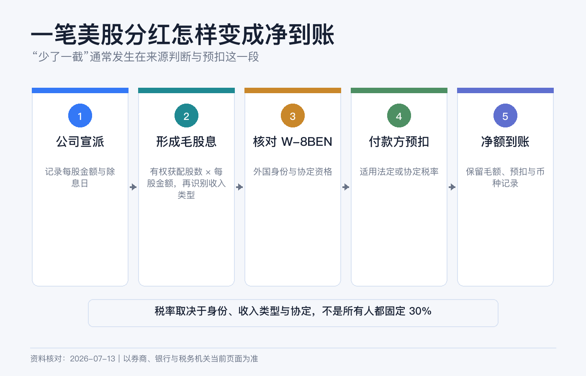
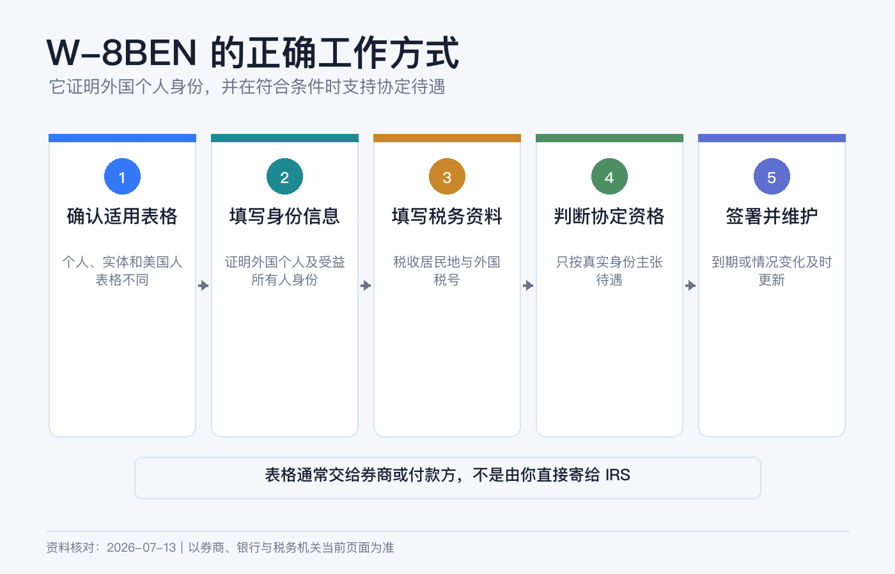
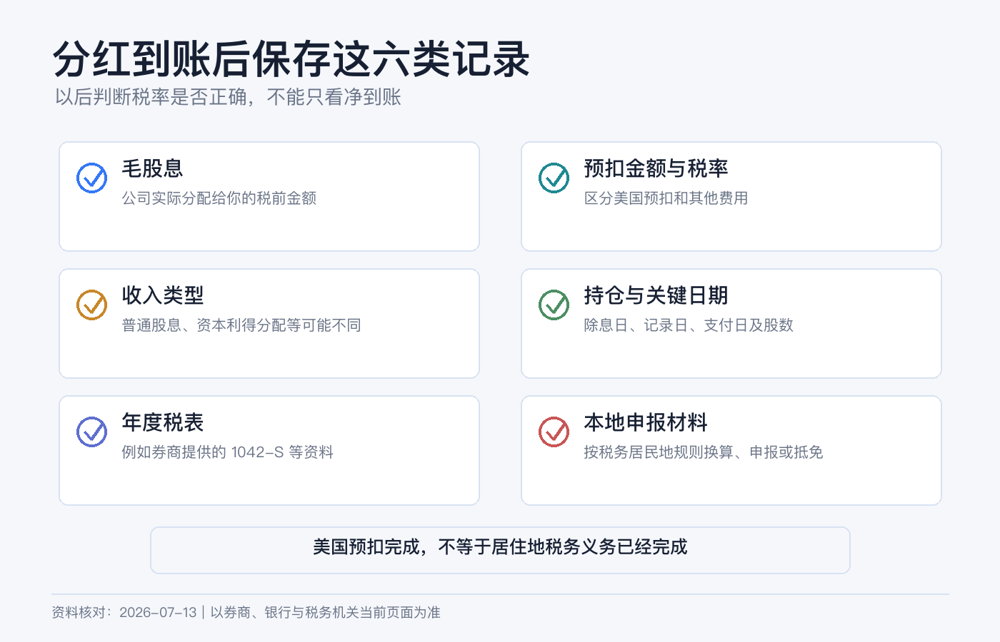

# 美股分红为什么少了一截：W-8BEN 与预扣税新手说明书

公司公告每股分红 1 美元，100 股理论上应收到 100 美元，账户却只增加了 70、85 或 90 美元。少掉的那一截，通常不是券商佣金，而是付款环节先扣走的美国税款。

但“美股分红一律扣 30%”也不对。正确顺序是先判断你是谁、收入从哪里来、它是什么性质、有没有适用的税收协定，最后才得到预扣率。W-8BEN 的作用，是把这些身份信息交给扣缴义务人，不是一张免税证。

> 本文只做一般税务教育，不构成美国、中国或其他司法辖区的个性化税务、法律或投资建议。税务居民身份、账户持有人、产品结构和协定资格会改变结论；复杂情形应咨询跨境税务专业人士。资料核对日期：2026-07-13。

## 先认清 8 个词

| 概念 | 新手解释 |
|---|---|
| Gross Dividend | 公司或基金宣告并分配的毛股息。 |
| Withholding Tax | 付款时由扣缴义务人先扣下并缴给税务机关的税，不等于你全球税务义务已经全部结清。 |
| Net Dividend | 毛股息减预扣税及其他适用调整后，实际进入账户的金额。 |
| W-8BEN | 外国个人用来证明非美国身份、受益所有人身份，并在符合条件时主张协定待遇的表格。 |
| Beneficial Owner | 真正享有该收入的人，不只是代持、代理或中间人。 |
| Tax Residence | 税务居民所在地；它不必然等同国籍、护照签发地或券商开户地址。 |
| Source of Income | 收入来源地。股息通常看付款公司是美国公司还是外国公司，不只看在哪个交易所上市。 |
| Form 1042-S | 扣缴义务人向非美国人报告美国来源收入与预扣税的年度资料表。 |

## 先用一个公式对账

`净到账 = 毛股息 − 美国预扣税 − 其他适用扣款或调整`

假设毛股息为 100 美元：适用 30% 时，净额通常为 70 美元；适用 15% 时约为 85 美元；适用 10% 时约为 90 美元。这里的数字只展示计算，不代表你一定适用其中任何税率。

## 第一层：是不是美国来源股息

IRS 的一般来源规则是：美国公司支付的股息通常是美国来源，外国公司支付的股息通常是外国来源，但外国公司存在与美国业务实质关联等例外。

因此要看发行人与分配性质，不能只看这四件事：

- 在纽约或纳斯达克交易，不自动决定所有分配都是美国来源。
- 使用美国券商，不会把所有外国股票股息变成美国来源。
- 代码以美元报价，不等于付款人是美国公司。
- ETF 的“分红”可能在年末被重新分类为普通股息、资本利得分配、利息相关分配或资本返还。

来源地决定哪个国家先有征税权，收入性质决定用哪套规则。两步不能合并。

## 第二层：股息不等于卖股票的资本利得

对典型的非美国居民外国个人，未与美国贸易或业务实质关联的美国来源股息，法定规则通常是按毛额 30% 征税，税收协定可能降低税率。

普通股票卖出的资本利得则是另一类。IRS 说明，非居民外国个人在一个日历年内在美国停留少于 183 天时，资本利得通常不征美国税，但有重要例外，包括：与美国贸易或业务实质关联、达到相关在美天数条件、美国不动产权益、某些 REIT / QIE 分配、公开交易合伙企业或合伙权益等。

所以，W-8BEN 可能让券商正确处理普通经纪交易，不代表所有产品的卖出所得都免税。尤其是名称里带 Partnership、LP、MLP、REIT 或地产结构的产品，下单前要单独查税务规则。

## 第三层：30% 是默认法定率，不是人人固定税率

IRS 对非居民外国人的美国来源 FDAP 收入，通常适用 30% 毛额税率，或者适用税收协定规定的更低税率。能否用协定，关键是**税收协定意义上的居民身份与资格**，不是“拿哪本护照”。

举例说，中美所得税协定第 9 条规定，若收款人是中国税收居民、为股息受益所有人并满足协定条件，美国对相关股息征税一般不超过毛额的 10%。这不是“中国公民自动 10%”：居住在第三地、双重居民、代持、身份资料不一致或不符合协定的人，结论可能不同。

香港、澳门和台湾不适用中美这份所得税协定。香港税务居民不能仅因为“中国”字样就勾选中国协定待遇；在没有其他适用协定或法定例外时，美国来源普通股息通常回到 30% 规则。

## W-8BEN 到底交给谁

IRS 的指示非常明确：**不要把 W-8BEN 寄给 IRS**。应把它交给要求表格的扣缴义务人或付款方，通常就是券商、托管人或其他掌控付款的人。IBKR 也说明，客户提交的 W-8 表格由其留档，并不直接递交 IRS。

外国个人通常使用 W-8BEN；外国实体通常使用 W-8BEN-E；美国公民、绿卡持有人和其他美国税务居民通常使用 W-9。把表格选错，比漏填一格更严重。

填写时重点核对：

1. 姓名与账户法定姓名一致。
2. 国籍与永久居住地址如实填写。
3. 税务居民国家和外国税号真实、可证明。
4. 只有确实符合协定时才填写协定国家与条款，不照抄网友模板。
5. 出生日期、邮寄地址和账户资料保持一致。
6. 签字代表你在伪证处罚约束下确认资料正确。

W-8BEN 一般从签署日起有效至第三个后续日历年的 12 月 31 日。例如 2026 年签署，通常有效至 2029 年 12 月 31 日；若地址、税务居民身份或其他资料发生变化，不能等到期。IRS 要求在导致信息不正确的情况变化后通常 30 天内提供新表。特殊条件下有效期规则可能不同，以券商提示为准。

## 在 IBKR 更新 W-8 的路径

当前 Client Portal 指南给出的入口是：

`右上角用户菜单 → Settings → Account Profile → Profile → 对账户实体点铅笔图标 → Tax Forms`

进入后按顺序完成资料更新、税表填写、信息复核和确认。若没有使用 Secure Login System，页面可能通过邮件发送确认码。

提交后做三件事：保存完成页面，记录提交日期，检查税务居民国家和永久地址。不要等到收到第一笔股息才发现表格过期；IBKR 通常会发续期邮件，但维护身份资料最终仍是账户持有人的责任。

## 分红到账后怎么核对

先打开 Activity Statement，找到 Dividends 与 Withholding Tax 两部分，按证券和支付日配对：

1. 记录代码、ISIN、支付日、毛股息和币种。
2. 找到同日或相关日期的预扣税金额。
3. 用 `预扣税 ÷ 毛股息` 计算实际税率。
4. 核对该证券的发行地、分配性质和你的 W-8 状态。
5. 年后进入 `Performance & Reports → Tax Documents` 下载 Form 1042-S 和 Dividend Report。

IBKR 指南说明，非美国、非加拿大个人通常会收到 1042-S；该表报告美国来源收入和预扣，包括利息、股息及 payment in lieu 等。发行人可能在年末重新分类分配，券商也可能出 corrected form，所以不要只凭某一天的现金流水完成年度申报。

## 税率看起来不对时，按这个顺序排查

1. W-8BEN 在**支付日**是否有效，而不是只看除息日。
2. 税务居民国家、地址和外国税号是否一致。
3. 你是否真的符合所主张协定，而不只是拥有该国国籍。
4. 这笔钱是普通股息、payment in lieu、REIT / QIE 分配、PTP 分配，还是资本返还。
5. 实际付款人是否为美国公司，产品是否有特殊税务结构。
6. 1042-S 的收入代码、毛额和预扣额是否与报表匹配。

仍有差异时，向 IBKR 工单提供账户号、证券代码或 ISIN、支付日、毛额、预扣额、W-8 提交日期和你认为适用的依据。若扣缴义务人不能更正，IRS 说明某些情况下需要提交 Form 1040-NR 申请退款或补税；这一步适合交给专业人士处理。

## 美国扣完税，不等于居住地不用申报

跨境投资至少有两层税务：美国作为收入来源地的预扣，以及你作为某地税务居民的申报和最终纳税。W-8BEN 只处理前一层的身份与预扣，不替代后一层。

以中国内地为例，若你依法属于中国居民个人，个人所得税法规定居民个人就境内、境外所得纳税；取得境外所得需要依法申报。财政部、税务总局 2020 年第 3 号公告还规定，境外已实际缴纳的所得税可在限额内抵免，境外所得通常在次年 3 月 1 日至 6 月 30 日申报，并要保存完税证明、1042-S、券商报表和银行记录。

这仍不是对所有“中国籍投资者”的统一结论：是否为居民个人、所得来源如何认定、协定居民冲突、抵免限额和申报口径都要看个人事实。香港、新加坡、加拿大或其他地区的税务居民，应按当地规则判断是否申报、能否抵免，不能拿 IBKR 已扣税当作当地完税证明的全部答案。

## 5 个常见误区

- **“填了 W-8BEN 就不扣税。”** 错。它可能让正确的默认率或协定率生效，不保证零税率。
- **“所有分红都是 30%。”** 错。协定、收入性质和特殊产品会改变结果。
- **“中国护照就是 10%。”** 错。协定看税务居民身份、受益所有人和其他条件。
- **“卖股票也一定扣 30%。”** 错。资本利得和股息是两套规则，但资本利得存在重要例外。
- **“美国已经扣了，居住地不用管。”** 错。还要判断当地申报、补税或抵免义务。

真正可靠的做法，是把身份、来源、性质、协定、预扣和本地申报六件事逐层核对，并把每年的 W-8、Activity Statement、1042-S 和完税凭证放在同一个税务档案夹里。

## 参考资料

- IRS, [Instructions for Form W-8BEN](https://www.irs.gov/instructions/iw8ben).
- IRS, [About Form W-8BEN](https://www.irs.gov/forms-pubs/about-form-w-8-ben).
- IRS, [Publication 519: U.S. Tax Guide for Aliens](https://www.irs.gov/publications/p519).
- IRS, [Publication 515: Withholding of Tax on Nonresident Aliens and Foreign Entities](https://www.irs.gov/publications/p515).
- IRS, [Tax Treaty Tables](https://www.irs.gov/individuals/international-taxpayers/tax-treaty-tables).
- IRS, [U.S.–China Income Tax Convention](https://www.irs.gov/pub/irs-trty/china.pdf).
- Interactive Brokers, [Tax Information and Reporting for Non-US Persons](https://www.interactivebrokers.com/en/support/tax-nonus-initial.php).
- IBKR Client Portal Guide, [Update Tax Forms](https://www.ibkrguides.com/clientportal/updatetaxform.htm).
- IBKR Client Portal Guide, [Tax Forms](https://www.ibkrguides.com/clientportal/performanceandstatements/taxform.htm).
- 国家税务总局，[中华人民共和国个人所得税法](https://www.chinatax.gov.cn/n810219/n810744/n3752930/n3752974/c3970366/content.html)。
- 财政部、国家税务总局，[关于境外所得有关个人所得税政策的公告（2020 年第 3 号）](https://fgk.chinatax.gov.cn/zcfgk/c102416/c5207136/content.html)。
