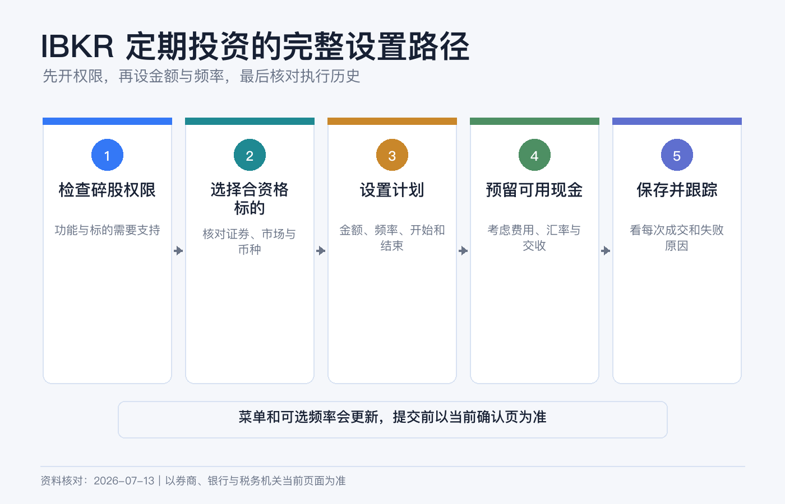
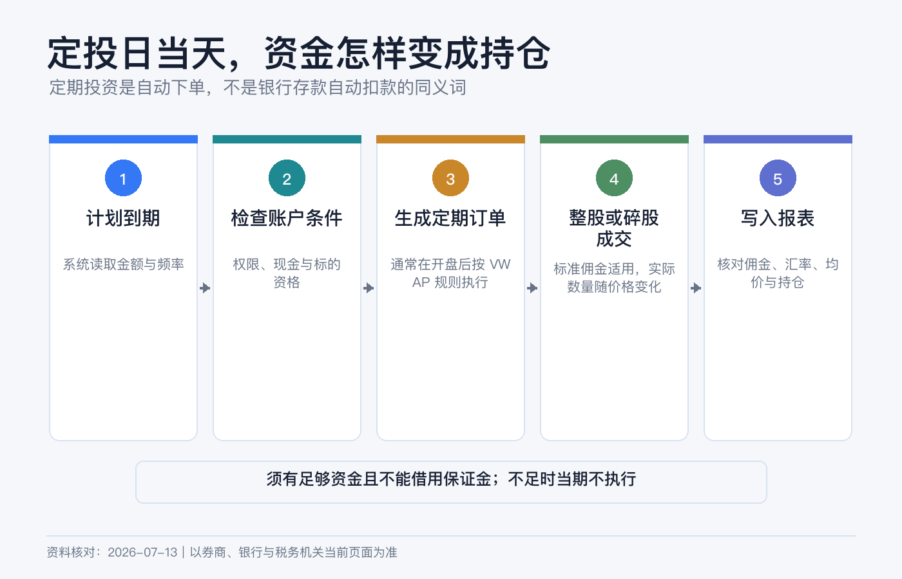
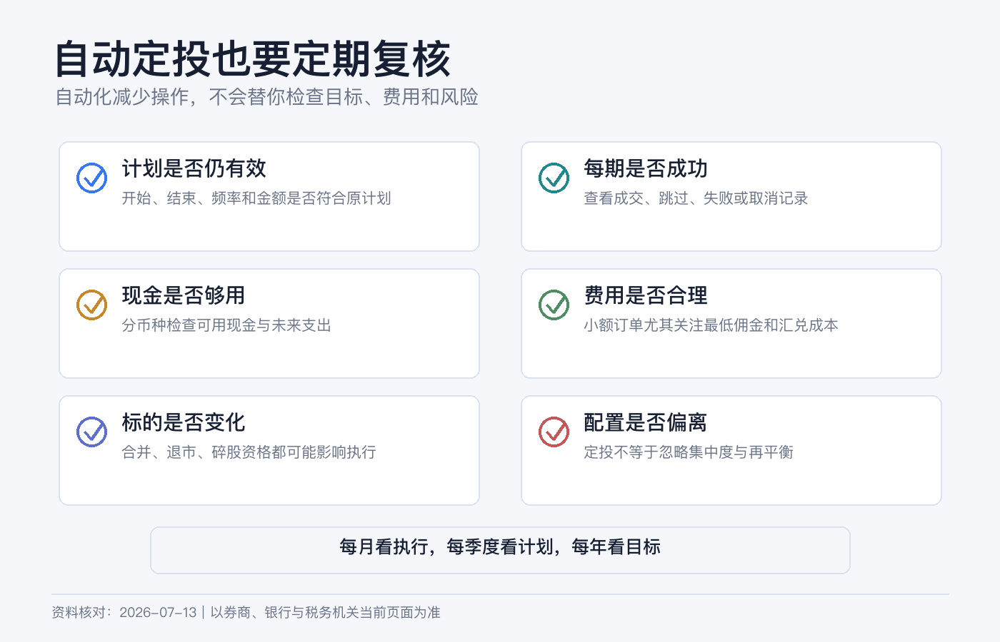

# 小额定投怎么设置：IBKR 定期投资的完整操作路径

小额定投看起来只需要选一只 ETF、填一个金额、按下保存。真正容易出错的，却是另外几件事：账户没有碎股权限、买错同名证券、计划日没有足够现金、误把基础货币当成付款货币，或者以为“自动”就等于“保证成交”。

IBKR 把这项功能称为 Recurring Investments。它会按预先设置的金额和周期生成买入，而不是替你判断资产是否值得买。第一次设置的目标，应当是建立一条自己能解释、能核对、也能随时停下来的流程。

> 本文是平台功能和账户操作说明，不构成投资、税务、法律或外汇建议。证券价格可能上涨或下跌，定投不会保证盈利，也不会消除本金损失。IBKR 的适用实体、菜单、最低金额、可选频率、费用和 AutoFX 规则可能变化，请以你账户当日的预览页、协议和费率页为准。资料核对日期：2026-07-13。

## 先分清三种“自动”

| 功能 | 自动做什么 | 不会自动做什么 |
|---|---|---|
| 定期投资 | 按金额和日期重复买入指定证券。 | 不会替你选标的，也不保证某个价格成交。 |
| 定期入金 | 按银行和券商支持的方式重复转入资金或建立入金通知。 | 不等于资金一定在定投日前可交易。 |
| 股息再投资（DRIP） | 把符合条件证券派发的股息再买回该证券。 | 不等于每月固定投入，也不使用你另行设定的工资现金流。 |

这三件事可以组合，但不是同一个开关。最常见的失败是只建了定投，却没有安排资金提前到账；计划存在，执行日却没有足够可用现金。

## 设置前先过 5 个条件

### 1. 你的账户能看到这项功能

IBKR 当前官方资料列出的适用范围包括多个主要实体，但地区、账户类型和监管限制会影响资格；例如官方资料明确列出部分地区例外。最可靠的判断不是照搬网友截图，而是登录自己的 Client Portal，查看 Trade 菜单里是否有 Recurring Investments。

### 2. 已启用碎股交易

定期投资依赖 fractional shares。进入账户设置检查股票交易权限，并确认碎股交易已经启用。即使某市场整体支持碎股，也不代表每一只股票或 ETF 都符合资格。

### 3. 标的本身符合资格

IBKR 当前将功能用于符合碎股资格的美国、加拿大和欧洲股票或 ETF。搜索时核对：

- 完整名称、代码、交易所和上市地；
- 交易币种，而不是只看代码；
- 产品类型确实是股票或 ETF；
- 页面允许按现金金额创建计划。

同一个代码可能出现在不同市场，同一家公司的普通股、ADR 和其他上市线路也可能不是同一证券。第一次不要靠搜索结果第一行直接保存。

### 4. 账户里有足够现金

IBKR Campus 当前说明，定期投资要求账户有足够资金，且不能在借用保证金的状态下使用。也就是说，保证金账户里出现很高的 Buying Power，不代表这笔计划会靠借款完成。

最好在执行日前留出“计划金额 + 预估佣金 + 少量汇率缓冲”。如果证券以美元交易，而账户只有其他货币，不要依据 Base Currency 猜测付款方式。不同账户实体和类型的 AutoFX 规则不同：有的现金账户可能自动换汇，有的场景需要先换汇。预览页没有把换汇成本和资金来源说清楚时，先手动准备交易币种。

### 5. 小额也要考虑最低佣金

IBKR 官方课程当前把多数币种的定投最低金额描述为 10 个货币单位，SEK 为 100；具体输入框会给出你账户的有效下限。标准股票佣金仍可能适用。若每次只投很小金额，最低佣金占比可能很高，因此“拆得越细”不一定“成本越低”。

## Client Portal 完整操作路径

界面名称会改版，但当前网页端主路径是：

1. 登录 Client Portal。
2. 进入 Trade。
3. 选择 Recurring Investments。
4. 点击 Create Recurring Investment。
5. 搜索并选中证券，核对名称、交易所和币种。
6. 输入每次投入的现金金额。
7. 选择 Start Date、Frequency，并按需要设置 End Date。
8. 点击 Continue，进入预览页。
9. 再次核对账户、证券、金额、周期、下一次日期和预计费用。
10. 点击 Save Investment，并完成身份确认。

当前官方课程展示的周期可能包括 Daily、Weekly、Biweekly、Monthly、Quarterly 和 Yearly；官方产品页则以 daily、weekly、monthly 为例。你能选择的项目以当前账户页面为准，不必为了复制某篇教程而强求一个没有显示的频率。

IBKR Mobile 或 GlobalTrader 也可能提供 Recurring 入口，但菜单会随版本移动。新手第一次建议用网页端创建，因为字段和复核信息更完整。以后再用 App 查看、编辑或取消。

## 日期和频率怎么填

不要先问“每周还是每月收益更高”，先把频率和自己的真实现金流对齐。

| 现金流情况 | 更容易维护的做法 |
|---|---|
| 每月固定发薪 | 发薪到账、换汇和入金完成后，再留几个工作日设置月度计划。 |
| 收入不固定 | 先用较低频率，并在每次执行前主动确认余额。 |
| 多只证券分配 | 把总预算、每只金额和佣金一起核算，避免计划金额合计超过现金。 |
| 近期可能用钱 | 不要把应急金纳入定投，也不要用保证金维持计划。 |

如果计划日遇到周末或休市，官方说明通常会顺延到下一个开市日；若所选月度日期在某个月不存在，Portal 指南说明会使用该月最后一天。顺延可能让成交跨月，也可能和下一次入金错开，所以日历提醒仍然有用。

## 它是怎样成交的

Recurring Investments 不是你手动挂的一张限价单。IBKR 当前课程说明，这类订单可能与其他客户指令聚合，在开盘附近以 best-effort VWAP 方式执行，同日参与者获得相同的加权平均价。

这意味着：

- 你不能预先锁定一个成交价；
- 开盘跳空或波动较大时，成交价可能明显不同于前收盘价；
- 流动性不足、休市或订单未能完成时，执行可能移到下一交易日；
- 标准佣金及适用的监管、交易或换汇成本仍要核对；
- 碎股数量由实际投入金额和成交结果计算，通常不会是整数。

“按时生成订单”和“当天必定成交”是两件事。不要把定投当成对成交时间和价格的承诺。

## 创建后去哪里查看

保存成功后，回到 Recurring Investments 页面，逐项确认：

1. 状态是否为 Active；
2. 下一次执行日期是否正确；
3. 金额和币种是否正确；
4. 是否设置了结束日期；
5. 有没有重复创建同一证券。

IBKR 当前课程还提醒，开放的定投指令未必出现在 TWS 或 IBKR Mobile 的普通订单屏幕；可在 Client Portal 的 Recurring Investments 和 Orders & Trades 中查看。成交后再检查 Trade Confirmation 与 Activity Statement，不要只看持仓数量变多。

## 第一次执行日，照这张表复盘

| 要核对的项目 | 正常时应看到什么 | 异常时先查什么 |
|---|---|---|
| 计划状态 | Active，下一日期已向后滚动。 | 是否被暂停、到期或手动取消。 |
| 资金 | 有足够可用现金且币种处理符合预期。 | 入金是否仍在 hold、是否发生 AutoFX、是否有其他订单占用现金。 |
| 成交 | Orders & Trades 或成交确认里有记录。 | 当天是否休市、订单是否顺延或未成交。 |
| 费用 | 佣金、换汇和其他费用能在报表中解释。 | 当前定价计划和最低佣金。 |
| 持仓 | 增加的整股或碎股与实际净投入大致对应。 | 证券代码、成交均价和费用。 |

如果计划没有执行，不要立刻重复新建。先确认旧计划状态，否则下一周期可能出现两笔买入。

## 修改、暂停和取消

收入变化、标的失去资格、交易权限关闭或现金用途变化时，应主动编辑或取消计划。操作前先看“下一次执行日期”和是否已经生成当日订单；临近开盘才修改，不能假定一定来得及阻止当次成交。

取消自动计划只会停止未来指令，不会自动卖出已经买到的持仓。关闭碎股权限后，已有碎股的处置和后续计划也可能改变，应先阅读页面提示，再决定是否修改权限。

## 6 个常见误区

1. **“定投一定比一次性买入好。”** 不一定。它主要解决执行纪律和入场时点分散，不保证更高回报。
2. **“基础货币是人民币，就会用人民币扣款。”** 基础货币主要影响汇总显示；证券交易币种和 AutoFX 规则要另看。
3. **“有购买力就有现金。”** 购买力可能包含保证金融资，定投要求足够资金，不能靠借款维持。
4. **“自动买入没有佣金。”** 定期功能本身不等于免除交易、换汇和第三方费用。
5. **“计划日一定按昨收成交。”** 实际是开盘附近的 best-effort VWAP 机制，不锁价。
6. **“设置一次就不用再看。”** 资金、资格、费用、税务和资产配置都会变化，至少每季度复核一次。

## 保存前检查清单

- [ ] 账户能看到 Recurring Investments，碎股权限已启用。
- [ ] 核对了证券全名、交易所、币种和碎股资格。
- [ ] 金额高于页面最低要求，并计算了最低佣金占比。
- [ ] 执行日前有足够可用现金，没有依赖保证金购买力。
- [ ] 已确认是否会发生 AutoFX 及其成本。
- [ ] 周期与入金节奏匹配，休市顺延也不会造成资金短缺。
- [ ] 保存后核对了 Active 状态和下一执行日期。
- [ ] 设置了季度复盘提醒，并知道如何暂停或取消。

## 参考资料

- Interactive Brokers, [Recurring Investments](https://www.interactivebrokers.com/en/trading/recurring-investments.php).
- IBKR Client Portal User Guide, [Create a Recurring Investment](https://www.ibkrguides.com/clientportal/trade/recurringinvestments.htm).
- IBKR Campus, [IBKR’s Recurring Investments Feature](https://www.interactivebrokers.com/campus/trading-course/ibkrs-recurring-investments-feature/).
- IBKR Campus, [Dollar Cost Averaging and Current Recurring-Investment Parameters](https://www.interactivebrokers.com/campus/glossary-terms/dollar-cost-averaging-dca/).
- IBKR Campus, [Fractional Shares](https://www.interactivebrokers.com/campus/glossary-terms/fractional-shares/).
