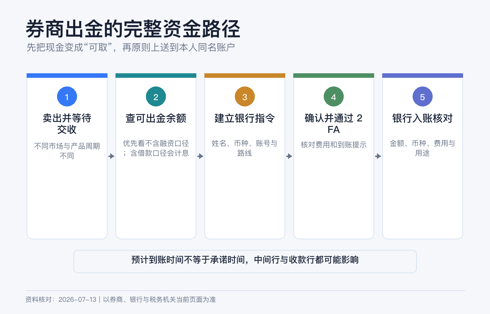
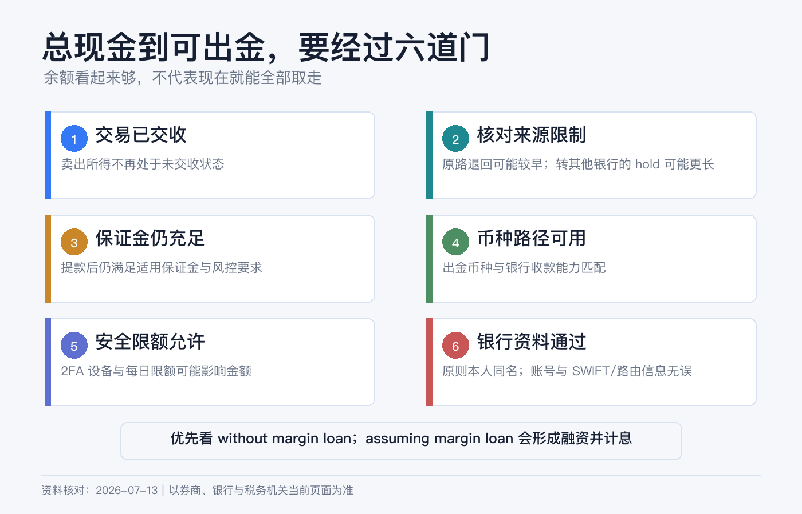
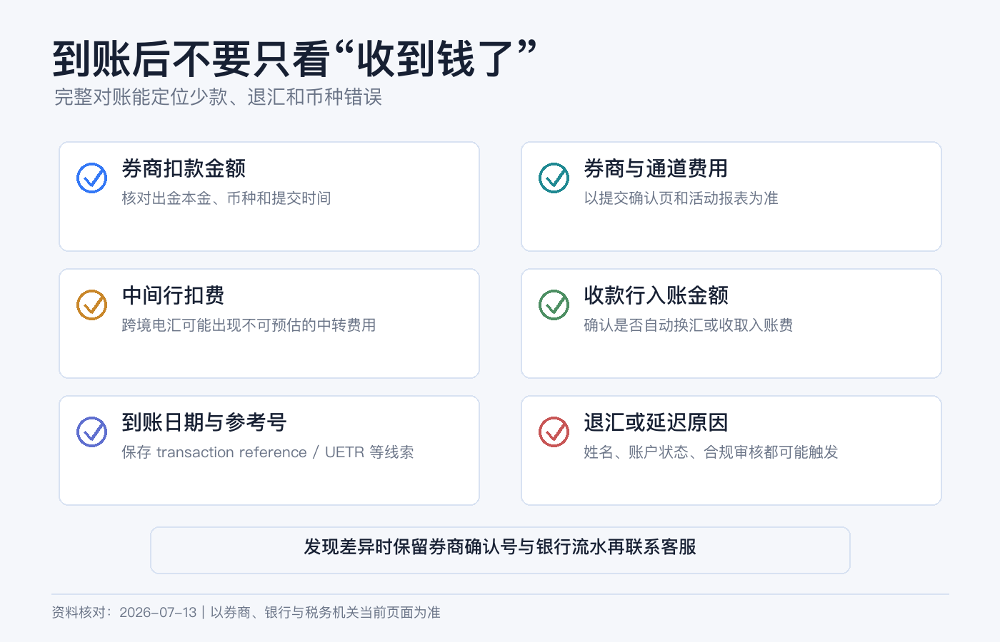

# 钱准备取回来时怎么走：券商出金、同名账户和到账核对

买股票时，券商页面会把“现金”“净资产”“购买力”放在一起展示。等你真要把钱转回银行，若不想额外借款，真正要看的却是：**不含保证金融资的可出金现金**。

你刚卖出的股票可能尚未交收，刚入金的款项可能仍在 withdrawal hold，保证金账户里的现金可能正在支持持仓。银行账号少一个数字、账户名不一致或 SWIFT 路径填错，也可能让钱被退回。

所以出金不是“点击 Withdraw，等到账”这么简单。稳妥的路径是：先把证券变成已结算、可提取的现金，再建立经过核对的同名银行指令，最后用券商和银行两边的记录完成对账。

> 本文是券商出金的一般操作说明，不构成银行、外汇、税务或法律建议。不同 IBKR 实体、账户类型、币种和出金方式的限额、费用、cut-off、hold 与处理时间不同；中间行和收款行也可能另行收费或审核。请以提交当日的 Client Portal、确认页和收款银行官方指令为准。资料核对日期：2026-07-13。

## 先分清 6 个余额

| 页面概念 | 它回答的问题 | 能否直接出金 |
|---|---|---|
| Total Cash / Cash Balance | 账户各币种现金合计是多少？ | 不一定。 |
| Settled Cash | 已完成交收的现金是多少？ | 仍要看 hold 和保证金占用。 |
| Cash Available for Withdrawal | 此刻系统允许申请提取多少？ | 最关键，但保证金账户还要区分是否包含新增借款。 |
| Buying Power | 还能买多少资产？ | 不能当作可出金现金，可能包含融资能力。 |
| Net Liquidation Value | 假设按当前价值清算，账户大致值多少？ | 不是银行可收款金额。 |
| Withdrawal Hold / Origination Restriction | 某笔入金在何时、可向哪里转出？ | hold 解除或符合原路退回条件后才确定。 |

IBKR 对 Cash Available for Withdrawal 的说明明确指出：它可能低于总现金。现金账户里，尚未交收的卖出款不能算作可提取现金；保证金账户里，现金还可能被用于满足保证金要求。

保证金账户尤其要看页面是否同时显示 `assuming margin loan` / `with margin loan` 与 `without margin loan` / `without borrow`。前者可能允许你通过新增券商贷款把钱提走，并产生融资利息；若目标只是取回自有现金，应优先使用不含新增借款的口径，而不是机械地选择最大的数字。

## 第一步：先把“能卖”变成“能提”

### 等待交易交收

美国多数股票、ETF 和债券交易目前使用 T+1，也就是成交后的下一个工作日交收。周末、市场假日、不同产品和异常交收会影响日期。卖出当天看到现金增加，不等于当天就能出金。

如果刚卖出多只资产，先到 Activity Statement 或 Trade Confirmation 核对每笔 Settlement Date。不要为了赶汇款而在预计交收日前提交一笔超过可用额度的指令。

### 清理未成交订单和账户占用

开放订单会占用资金；保证金负债、空头、期权和其他持仓也可能限制能提取的金额。出金后还要满足适用的初始、维持、券商自有保证金与实时风控要求。系统显示的数字只是当时快照，市场波动后可能变化；包含 margin loan 的额度更不是“无成本提款上限”。

新手不要把“最大可提金额”全部取尽。若账户还保留持仓，给佣金、市场数据费、利息调整、股息预扣和价格波动留缓冲。

### 检查最近入金的 hold

IBKR 对不同入金方式设置不同 credit period 和 withdrawal hold。它们不是同一件事：

- Credit period 决定资金何时记入并可用于交易；
- Withdrawal hold 决定这笔资金何时可以离开券商；
- Origination restriction 还可能限制资金只能退回原始入金银行或原始方式。

IBKR 当前资料说明，某些 origination hold 在资金退回原始账户、银行和入金方式时可能不适用。但不要据此自行推断：以出金页面显示的可用金额和目的地限制为准。

## 第二步：决定币种和路径

先回答三个问题：

1. 我希望银行最终收到什么币种？
2. 收款银行是否真的能收这个币种？
3. 这条路径会不会经过中间行或自动换汇？

基础货币不是强制出金币种。账户里有美元，可以在支持的条件下发起美元出金；银行若只接受本币，可能拒收或自动转换。券商换汇、汇出行换汇和收款行自动换汇的报价与费用并不相同。

我更建议在券商内先把币种余额整理清楚，再申请出金。不要同时留下多个很小的负余额，也不要假定“系统会自动帮我换成最划算的币种”。

## 第三步：准备同名银行账户

同名的核心不是“拼音差不多”，而是券商账户实际拥有人与银行账户持有人能够被合规系统识别为同一人或同一实体。

| 券商账户 | 更容易通过的收款账户 |
|---|---|
| 个人账户 | 本人名下的个人银行账户。 |
| 联名账户 | 按券商和银行规则，账户名及共同持有人关系能对应的联名或本人账户。 |
| 公司、信托等实体账户 | 同一法律实体名下的银行账户，并能提供所需证明。 |

IBKR 的资金转移指南写明，账户 title 需要匹配；另一个官方案例也指出，IBKR 与收款银行账户名称不一致可能被银行视为第三方转账并退回。平台可能提供 third-party withdrawal 入口，但这类请求不等于普通同名出金，通常要额外审查、解释关系和提交文件，也可能被拒绝。

新手不要为了“收款方便”直接填配偶、朋友、公司老板、换汇商或支付平台给出的陌生账户。

## 银行指令要从哪里抄

不要从历史聊天记录或搜索引擎摘要复制。登录收款银行官网或 App，找到该币种的官方 incoming wire / receive money instructions，再逐项填写：

- Bank / Institution Account Holder；
- 银行名称和地址；
- Account Number 或 IBAN；
- ABA / Routing Number（适用时）；
- SWIFT / BIC；
- 收款账户币种与账户类型；
- Correspondent / Intermediary Bank（银行明确要求时）；
- For Further Credit、分行代码或附言（银行明确要求时）。

同一家银行的本地转账、美国国内 wire、ACH 和国际 SWIFT 可能使用不同号码。也不要把“向券商入金时的 IBKR 收款银行资料”反过来当作自己的出金资料。

IBKR 可以保存 Bank Information / Bank Instruction。保存只代表信息进入账户，不代表收款银行已经验证。新建或大幅修改银行指令时，券商可能要求 2FA、邮件确认、电话验证或证明文件；在急需用钱前才创建，会把审核时间也叠加进去。

## Client Portal 的完整操作路径

当前网页端路径如下：

1. 登录 Client Portal。
2. 进入 Transfer & Pay > Transfer Funds。
3. 选择 Withdraw Funds / Make a Withdrawal。
4. 若有多个账户，先选正确的出金账户。
5. 选择要提取的币种。
6. 选择已有银行指令，或创建新的 withdrawal method。
7. 按收款银行官方资料填写并保存银行信息。
8. 输入金额，区分含融资与不含融资的可出金余额，再查看限额、费用和预计处理信息。
9. 逐项核对账户名、账号末位、银行代码、币种和金额。
10. 完成 2FA 或邮件确认，提交 Create Withdrawal。
11. 保存确认页、Reference / Transaction ID 和提交时间。
12. 到 Transaction Status & History 跟踪状态。

App 的入口和字段可能不同。第一次跨境出金更适合网页端，因为更容易同时打开收款银行官方指令逐项核对。

## 费用和时间为什么不能抄一个固定数字

一笔出金可能经过四个环节：

| 环节 | 可能产生的时间或成本 |
|---|---|
| 券商审核 | cut-off、2FA、人工合规检查、账户限制。 |
| 券商汇出 | 不同实体、币种和方式的出金费及免费次数。 |
| 中间行 | 国际 SWIFT 可能被扣 intermediary / correspondent fee。 |
| 收款银行 | 入账费、币种转换、来源证明或人工审核。 |

IBKR 的公开 funding 页面和不同费率资料，对免费申请次数的表述可能因实体、产品接口或页面版本而不同。因此不要在脑中记一个“每月固定免费几次”的数字。提交前看当前确认页和你所属实体的 fee schedule，才是对这一次出金有效的信息。

同理，“当天到账”“一到两个工作日”只能是特定方式在正常情况下的参考。周末、节假日、时区、cut-off、中间行、姓名核验和银行合规都会改变结果。要用钱时至少预留多个工作日，不要把交房、学费、税款或信用卡还款的最后期限押在最快案例上。

## 第一次先做小额测试

在没有验证过的新路径上，先用足以被银行清楚识别、但即使退回也不影响生活的小额测试：

1. 券商显示 Sent / Completed 后，记录日期和净汇出金额；
2. 银行入账后核对实际收到的币种和金额；
3. 计算券商费、中间行扣费和收款行费；
4. 保存银行流水中的汇款人名称、reference 和附言；
5. 确认这条 saved instruction 可继续使用，再决定大额出金。

“小额”不是为了绕过审核，更不能拆单规避报告或限额。它只是验证技术路径；资金来源、用途和税务义务仍要如实处理。

## 钱没到时按什么顺序查

先不要同时向三方重复发起新汇款。按以下顺序定位：

1. **券商端：** 请求是否仍在 Pending、被 Cancelled / Rejected，还是已经 Sent / Completed？
2. **指令端：** 收款人名称、账号、银行代码和币种是否与确认页一致？
3. **交收端：** 卖出款是否已交收，最近入金是否仍在 hold？
4. **银行端：** 银行是否看到待入账、退回或需要补充来源证明的款项？
5. **追踪端：** 向券商索取可用的 wire trace、payment reference 或 SWIFT 报文信息，再交给银行查询。

如果款项被退回，先确认退回原因和扣费，再修改指令。常见原因包括账户名不匹配、账号关闭、银行不支持该币种、路由代码错误或合规资料不足。不要原样重提。

## 7 个常见误区

1. **“Total Cash 就是能提现的金额。”** 应看可出金口径；保证金账户还要优先确认 without margin loan。
2. **“卖出成交后立刻能汇走。”** 成交与交收不是同一天；美国多数证券当前为 T+1。
3. **“刚入金、刚交易也不影响出金。”** 入金方式可能有 withdrawal hold 或原路限制。
4. **“Buying Power 很高，所以能取更多。”** 购买力可能含融资，不能提走券商授信。
5. **“亲属账户也算同名。”** 不一定；不同实际持有人通常会进入第三方转账审查。
6. **“券商显示完成就代表银行已入账。”** Completed 通常只说明券商已处理，银行仍可能在途或审核。
7. **“公开页面写免费，就不会被扣钱。”** 中间行和收款行费用不一定包含在券商费里。

## 提交前检查清单

- [ ] 已取消不需要的开放订单，并确认卖出款完成交收。
- [ ] 以可出金字段为准；保证金账户没有误用包含新增 margin loan 的额度。
- [ ] 检查最近入金的 withdrawal hold 和 origination restriction。
- [ ] 账户仍有持仓时，给保证金和后续费用留了缓冲。
- [ ] 收款银行支持该币种和该汇款方式。
- [ ] 银行账户与券商账户实际拥有人一致，名称和实体类型可匹配。
- [ ] 所有银行代码来自收款银行当前官方指令。
- [ ] 提交页的限额、费用、免费次数和预计时间已重新核对。
- [ ] 2FA 正常，保存了 Transaction ID 和确认页。
- [ ] 新路径先小额测试，到账后完成券商—银行双向对账。

## 参考资料

- Interactive Brokers, [Fund Your Account — Credit and Withdrawal Hold Periods](https://www.interactivebrokers.com/en/support/fund-my-account.php).
- IBKR Client Portal User Guide, [Enter Withdrawals](https://www.ibkrguides.com/clientportal/transferandpay/enterwithdrawal.htm).
- IBKR Client Portal User Guide, [Withdraw Funds](https://www.ibkrguides.com/clientportal/transferandpay/withdrawfunds.htm).
- IBKR Funding Reference, [USD Deposits and Withdrawals](https://www.ibkrguides.com/fundingreference/usd.htm).
- IBKR Campus, [Cash Available for Withdrawal](https://www.interactivebrokers.com/campus/glossary-terms/cash-available-for-withdrawal/).
- IBKR Web API, [Withdrawable Amount With and Without Margin Loan](https://www.interactivebrokers.com/campus/ibkr-api-page/web-api-account-management/).
- IBKR Campus, [Withdrawable Cash Subject to Origination Restriction](https://www.interactivebrokers.com/campus/glossary-terms/withdrawable-cash-subject-to-origination-restriction/).
- Interactive Brokers, [Other Fees — Withdrawals](https://www.interactivebrokers.com/en/pricing/other-fees.php).
- FINRA, [Understanding Settlement Cycles: What Does T+1 Mean for You?](https://www.finra.org/investors/insights/understanding-settlement-cycles).
