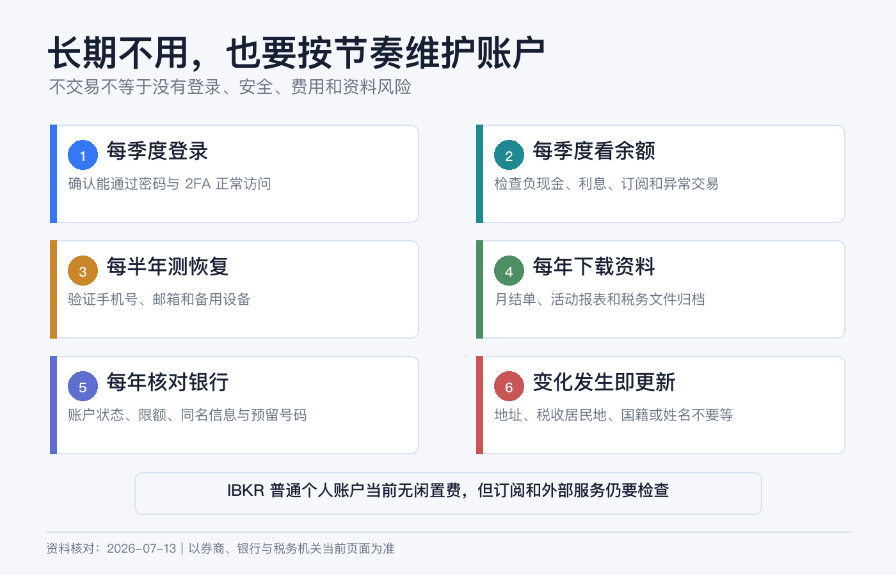
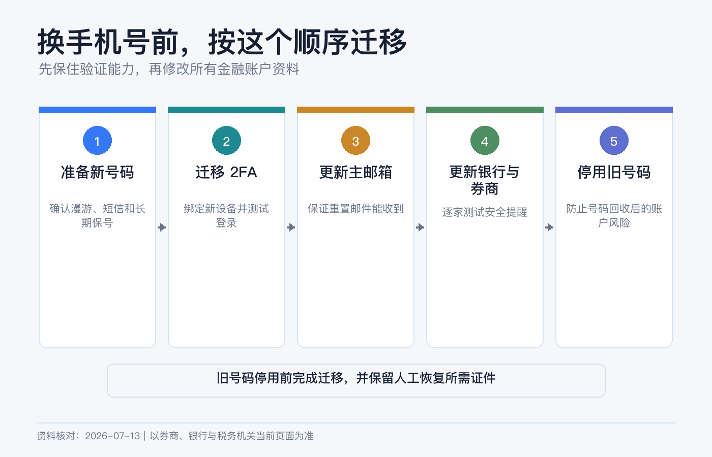
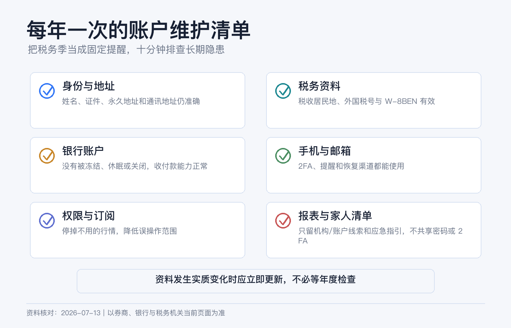

# 账户长期不用会怎样：银行卡、券商、手机号和税务资料维护清单

长期投资最容易出现一种错觉：不交易，就不用管账户。

实际情况正相反。股票不动，股息、公司行动、税务文件和账户通知仍在发生；银行卡过期，不代表底层银行账户一定关闭；手机号停用，却可能让 2FA、密码重置和大额出金一起失效；W-8BEN 没有交易，也可能因为到期或税务居民身份变化而需要更新。

长期持有可以低频操作，但不能长期失联。你至少需要让银行、券商和税务资料一直能回答三件事：你是谁、怎样联系你、资金应该去哪里。

> 本文是跨境金融账户的一般维护说明，不构成银行、税务或法律建议。银行休眠政策、无人认领财产期限、券商费用和税表规则因国家、州、账户实体与产品而异。不要为了制造“活跃”而做无真实目的的拆单或虚假交易；所有更新应基于真实情况。资料核对日期：2026-07-13。

## 长期不用，不等于一定被收费

先纠正一个常见说法：**IBKR 目前并没有对普通个人账户普遍收取 inactivity fee。**

截至本文核对日，IBKR Required Minimums 页面把 Individual、Joint、Trust 和 Organization 账户的 IBKR Pro / Lite 账户最低金额和闲置费都列为 0。不要继续传播过去版本的“每月必须产生多少佣金”规则。

但“闲置费为 0”不等于“什么成本都没有”。以下费用仍可能存在：

- 实时行情订阅、保证金利息和借券费；
- 特定市场的托管、ADR、基金或公司行动费用；
- 顾问、介绍经纪商或第三方服务费用；
- 银行端的最低余额、账户管理、卡片或休眠费用。

因此，判断账户会不会持续扣费，要看 Activity Statement 和当前 fee schedule，不能只搜“Inactivity Fee”一个词。

## 真正的风险是“账户还在，联系断了”

长期失联可能带来四类后果：

| 层级 | 常见问题 | 可能结果 |
|---|---|---|
| 银行和银行卡 | 卡片到期、地址过期、账户长期无活动、最低余额不达标。 | 卡无法使用、账户被限制或关闭、资金进入无人认领流程。 |
| 券商 | 通知未读、资料过期、公司行动无人处理、账户被风控复核。 | 交易或出金受限、错过选择权、补件延迟。 |
| 手机号和邮箱 | 号码回收、无法漫游、邮箱停用、2FA 留在旧手机。 | 无法登录、重置密码或确认资金转移。 |
| 税务资料 | W-8BEN 到期、地址或税务居民身份变化未更新。 | 预扣处理改变、账户被要求补件、税务申报记录不一致。 |

美国银行或券商账户长期失联，还可能触及 unclaimed property / escheatment。FDIC 说明，移交期限和“活动”定义因州而异；应每年更新真实联系方式并回应通知。

## 银行卡过期，底层账户未必消失

银行卡只是访问银行账户的一种工具。卡片到期、损坏或停用，并不能单独证明存款账户已经关闭；反过来，手机 App 还能登录，也不能保证银行卡、国际收款和出金路径都正常。

每年检查一次：

1. 银行记录的居住地址、税务地址和证件是否仍有效；
2. 卡片到期日，新卡寄送地址是否正确；
3. 网上银行、App、短信和推送能否正常使用；
4. 账户最低余额、月费、休眠政策和关闭条件；
5. 需要的币种和 SWIFT / ACH / 本地转账是否仍可用，汇款代码有无变化；
6. 是否有不再需要的自动扣款、订阅或旧收款人模板；
7. 最近一期 statement 能否下载。

CFPB 指出，银行或信用合作社可能关闭多年没有活动的休眠账户；具体做法取决于机构合同和当地规则。需要保留账户时，按银行自己的政策完成真实、合理的使用或身份确认，而不是靠极小额循环转账规避风控。

还要区分“银行账户仍有效”和“券商保存的 Bank Instruction 仍有效”。换卡通常不一定改变银行账号，但迁居、换分行、银行合并或账户升级可能改变汇款指令。真正需要出金前，重新从银行官方页面核对。

## 券商账户每年要查什么

### 1. 登录和安全

至少每季度登录一次官方 Client Portal：

- 查看最近登录、消息中心和安全通知；
- 确认 IBKR Mobile / IB Key 或其他 2FA 正常；
- 检查邮箱和手机号码；
- 查看是否有待签协议、补件或身份验证；
- 核对没有陌生订单、转仓或银行指令。

IBKR 当前要求账户加入 2FA，并说明手机丢失或更换时可通过自助方式恢复，必要时联系 Client Services。能恢复不代表应该等旧手机丢失后才处理。换机、换号前先确认新设备已激活，再注销旧 SIM 和旧设备。

### 2. Profile 信息

IBKR 当前 Profile 页面允许更新姓名、出生信息、居住地址、法定居住国、婚姻和受抚养人、手机号、就业、税号等资料。只有真实发生变化时才修改，但发生后不要拖。

网页端常见路径是：

User menu > Settings > Account Profile > Profile > Edit

迁居到另一个国家不只是改邮编。它可能影响服务实体、可交易产品、投资者保护、税务文件和银行路径。先阅读页面说明，需要时让券商和税务专业人士确认。

### 3. 账户权限和持续收费

长期只持有股票 ETF，却还保留不需要的期权、期货、外汇权限或实时行情订阅，既增加误操作面，也可能增加费用。每年对照实际用途：

- 取消不再需要的市场数据；
- 检查 margin debit 和应计利息；
- 检查定期投资、DRIP、证券借贷和顾问授权；
- 确认受益人、继承安排或账户登记仍符合意愿；
- 下载年度 Activity Statement 和税表。

## 手机号和邮箱是金融账户的一部分

很多人把手机号当成通讯工具，却忘了它同时是登录、身份恢复和资金确认的安全凭证。

### 换号前

1. 登录银行和券商，把新号码添加并验证；
2. 在新设备上完成 IB Key / 2FA 激活；
3. 测试一次网页登录和安全通知；
4. 更新密码管理器中的恢复信息；
5. 确认旧号码不再被用作唯一恢复方式；
6. 再注销旧 SIM。

### 长期在境外时

确认号码能漫游收短信、不会因欠费被回收，并保留不依赖短信的券商认证方式。邮箱也要启用 2FA，金融账户和日常注册最好不要共用一个弱密码。

IBKR 官方密码重置页面明确提示，无法使用登记手机或安全设备时，可能需要联系当地 Client Service Center 进行身份验证。护照、地址证明和账户号也应放在安全、可访问的位置，但不要与密码和验证码存放在一起。

## W-8BEN 不是填完永久有效

IRS 的一般规则是：W-8BEN 从签署日起有效，到第三个后续日历年的 12 月 31 日止，除非适用特殊的持续有效条件，或更早发生 information incorrect 的 change in circumstances。

例如，2026 年任意一天签署的表格，一般有效到 2029 年 12 月 31 日。不要简单写成“有效三年”，因为实际可能覆盖签署当年的剩余时间加三个完整日历年。

更重要的是，**变化不会等到到期日**。IRS 指引要求，如果情况变化让原表信息不正确，应在变化后 30 天内通知扣缴义务人、付款方或金融机构，并提交新的 W-8BEN 或其他适当表格。

需要立即复核的事件包括：

- 永久居住地址或税务居民国变化；
- 原先主张税收协定待遇的国家发生变化；
- 税号新增、失效或变更；
- 成为美国公民或美国税务居民；
- 姓名、国籍或账户实际受益所有人变化；
- 券商要求重新完成 FATCA / CRS 自我证明。

成为美国税务居民后，可能需要改用 W-9，而不是继续刷新 W-8BEN。税务居民判断涉及居住天数、身份和当地法律，不确定时不要只按护照国籍选择。

IBKR 当前常见更新路径是：

User menu > Settings > Account Profile > Profile > Edit > Tax Forms

W-8BEN 交给券商或付款方，不是自行寄给 IRS。更新后保存确认记录，并在下一次股息和年度税表中检查预扣是否符合预期。

## 哪些变化不能等年度复盘

| 事件 | 立即处理的账户 |
|---|---|
| 搬家或跨国迁居 | 银行地址、券商 Profile、税务居民资料、实体可用性。 |
| 更换姓名或证件 | 银行、券商、税表、同名入出金指令。 |
| 更换手机号或手机 | 银行登录、券商 2FA、邮箱恢复方式。 |
| 银行账户关闭或合并 | 券商保存的入出金指令、自动扣款。 |
| 就业、收入、净资产或投资目标明显变化 | 券商 KYC、适当性资料和交易权限。 |
| 成为或不再是美国税务居民 | W-8BEN / W-9 及相关申报。 |
| 婚姻、死亡、失能或继承安排变化 | 联名登记、受益人、遗产文件、trusted contact。 |

资料更新不是“越多越安全”。只在真实变化时更新，并确保银行、券商和税务文件之间互相一致。

## 可以设置 trusted contact，但别误解权限

FINRA、SEC 和 NASAA 鼓励投资者考虑添加 trusted contact。它像紧急联系人：当券商联系不到你、怀疑账户受骗或需要确认监护人等有限情况时，可以联系这个人。

trusted contact 不能查看余额、下单、取钱，也不会因为被登记就自动成为受托人、监护人、遗嘱执行人或授权代理。它不能替代遗嘱、受益人登记或正式授权文件。

## 一套不费力的维护节奏

### 每季度：10 分钟轻检查

- 能否正常登录银行和券商；
- 2FA、手机号、邮箱是否正常；
- 是否有陌生活动、未读重要通知和持续收费；
- 定投、市场数据和银行指令是否仍符合用途。

### 每年：一次完整归档

选择固定月份，最好在年度税表基本齐全后：

1. 下载银行年结单、券商年度 Activity Statement 和 tax forms；
2. 导出持仓、现金、成本基础和入出金历史；
3. 核对银行账户政策、卡片到期日和收款指令；
4. 核对券商 Profile、交易权限、trusted contact 和受益安排；
5. 记录 W-8BEN 签署日、一般到期日和税务居民身份；
6. 检查市场数据、保证金利息和特殊托管费；
7. 用加密备份保存文件，并更新“家人如何找到这些账户”的说明。

### 发生变化时：不要等

搬家、换号、换银行、改名、税务身份或婚姻变化，应立即更新。年度清单只负责发现遗漏，不负责延后真实变化。

## 如果以后真的不想用了

“放着不管”和“正式关闭”是两种状态。决定关闭前：

- 取消定投、开放订单、行情和第三方授权；
- 转走或卖出持仓并等待交收，处理多币种余额和未决公司行动；
- 建立有效的同名银行指令；
- 下载历史报表和税表；
- 记录账户关闭确认，并在之后一段时间复查迟到的股息、利息或调整。

不要先关闭银行账户，再要求券商把余额打过去。IBKR 官方案例显示，收款银行账户关闭或名称不匹配会导致款项退回；关闭后的残余资产处理会更麻烦。

## 8 个常见误区

1. **“IBKR 长期不用一定收闲置费。”** 当前普通个人等账户的公开闲置费为 0，仍要检查其他费用。
2. **“银行卡过期，银行账户也自动消失。”** 两者不是同一个概念，要向银行确认。
3. **“没有交易，就没有税务文件。”** 股息、利息、预扣和公司行动仍可能产生记录。
4. **“W-8BEN 固定三年。”** 一般到签署年后第三个日历年年末，情况变化可能使它更早失效。
5. **“搬家等券商提醒再改。”** 税务和身份变化有自己的通知期限。
6. **“换号以后再恢复 2FA。”** 先在新设备测试成功，再停旧号码。
7. **“trusted contact 可以替我取钱。”** 它没有交易或提款权限。
8. **“每年登录一下就不会进入无人认领流程。”** 各地对活动和联系的定义不同，应按机构和适用法律确认。

## 年度维护检查清单

- [ ] 银行、券商、邮箱和 2FA 都能正常登录。
- [ ] 地址、手机号、证件、税号和就业资料真实且一致。
- [ ] 银行卡到期日、新卡邮寄地址和银行休眠政策已确认。
- [ ] 券商保存的同名银行指令仍有效。
- [ ] 没有不需要的市场数据、定投、DRIP 或第三方授权。
- [ ] 没有未解释的 margin debit、费用、陌生订单或转仓。
- [ ] W-8BEN 签署日和一般到期日已记录；变化已在期限内更新。
- [ ] trusted contact、受益人和遗产安排仍符合意愿。
- [ ] 年度报表、税表、成本基础和入出金记录已加密备份。
- [ ] 家人知道账户存在，但拿不到你的密码和验证码。

## 参考资料

- Interactive Brokers, [Required Minimums](https://www.interactivebrokers.com/en/accounts/required-minimums.php).
- Interactive Brokers, [Other Fees](https://www.interactivebrokers.com/en/pricing/other-fees.php).
- IBKR Client Portal User Guide, [Profile](https://www.ibkrguides.com/clientportal/profile.htm).
- IBKR Client Portal User Guide, [Update Tax Forms](https://www.ibkrguides.com/clientportal/updatetaxform.htm).
- IBKR Client Portal User Guide, [Secure Login System](https://www.ibkrguides.com/clientportal/sls/secureloginsystem.htm).
- IRS, [Instructions for Form W-8BEN](https://www.irs.gov/instructions/iw8ben).
- FINRA, SEC and NASAA, [Why You Should Consider Adding a Trusted Contact](https://www.finra.org/investors/insights/trusted-contact).
- FDIC, [How to Find a Long Lost Bank Account or Safe Deposit Box](https://www.fdic.gov/resources/consumers/consumer-news/2020-12.html).
- CFPB, [Can a Bank or Credit Union Close a Dormant Checking Account?](https://www.consumerfinance.gov/ask-cfpb/the-bankcredit-union-closed-my-checking-account-even-though-i-did-not-want-them-to-can-the-bankcredit-union-do-that-en-959/).
