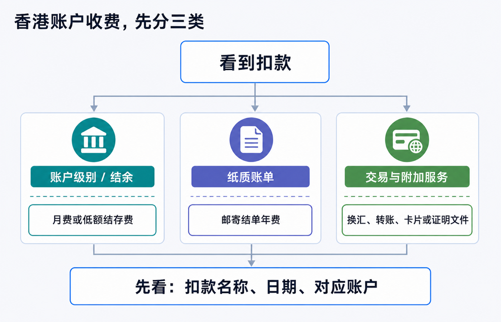
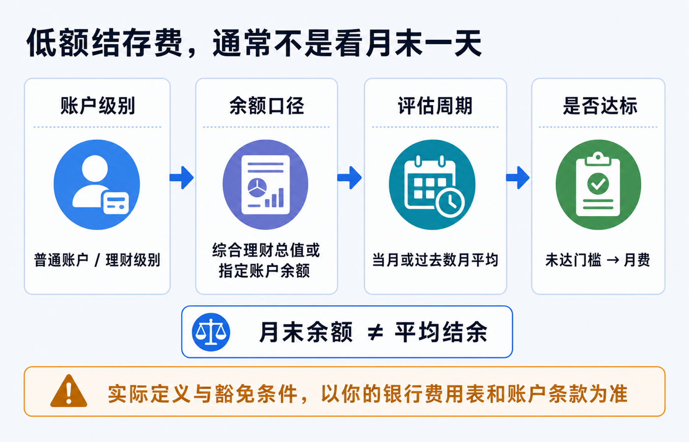
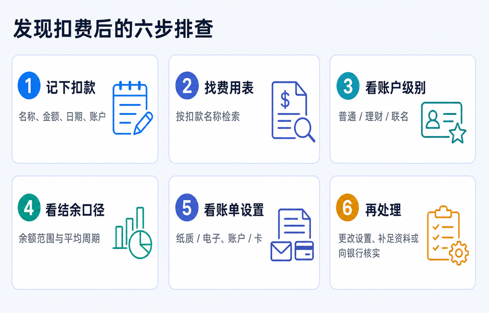

# 香港银行卡没怎么用，为什么仍然被收费：账户级别、结余和账单设置

香港银行卡“没怎么用”却仍有扣费，通常不是银行把“没有刷卡”当成违约，而是费用根本不按刷卡次数计算。最常见的三类是：**账户级别对应的低额结存/月费、纸质账单年费，以及转账、换汇、卡片或证明文件等附加服务费。**

先不要急着往账户里补一笔钱，也不要仅凭“这个月末余额够了”就判断扣错。先确认扣款名称、扣款日期和被扣的是哪一个账户或卡，再回到这份产品的费用表和账户条款核对。

> 本文是香港个人银行账户费用和结单设置的教育说明，不构成银行、开户、跨境资金、税务、法律或投资建议。银行会按账户产品、开户时间、客户身份、持有地区、联名关系和服务设置适用不同条款。文中汇丰香港、恒生银行的金额和周期仅为截至 2026-07-18 可查的官方示例；处理自己的费用时，请以账户内通知、当期费用表和客服书面答复为准。

## 先给结论：低频使用不等于零成本

先用下面这张表，把问题分开。它能避免把一笔年度纸质账单费误认为“账户月费”，也避免把外汇或汇款费用误认为“余额不够”。

| 你看到的扣款特征 | 更可能属于什么 | 首先要查什么 |
|---|---|---|
| 每月或固定周期出现，名称含 service fee、monthly fee、low balance 等 | 账户级别、最低/平均结余相关费用 | 账户产品名称、余额口径、评估周期、豁免条件 |
| 一年一次或在固定月份出现，名称含 statement、paper、mailing 等 | 邮寄纸质账单年费 | 账单投递方式、账户和信用卡是否分别设置、豁免资格 |
| 紧跟某笔转账、换汇、取现、补发卡或文件申请出现 | 交易或附加服务费 | 该笔交易、所用渠道、币种、卡种和服务项目 |

这里的关键不是猜“银行喜不喜欢沉睡账户”，而是找到**费用的触发条件**。同一张香港银行卡背后可能连着综合账户、港元储蓄/往来账户、外币账户、信用卡、投资或保险服务；扣款主体不同，费用表也不同。

## 先查谁被扣了钱：卡片不是账户的全部

“香港卡”是日常说法，但查费用时要把下面四层分开：

1. **银行卡或信用卡本身**：可能有年费、补发卡、海外交易或现金透支等规则。
2. **存款账户**：可能有账户服务费、低额结存费、账单或证明文件费用。
3. **综合理财账户/客户级别**：可能把多个同名或联名账户的资产合并计算，也可能按每个综合账户计费。
4. **具体服务**：汇款、换汇、柜台、纸质结单、证券、保险或贷款服务通常各有独立收费。

因此，打开银行 App 或结单后，至少记下这四项：

- 扣款原文（不要只凭中文翻译猜含义）；
- 金额、扣款日期和对应的周期；
- 被扣的账户末四位或卡类别；
- 当时是否刚做过转账、换汇、取现、申请文件或收到纸质邮件。

保留截图时请遮住完整账号、证件号、地址、二维码和一次性验证码。你需要的是费用描述和时间线，不是把完整银行资料发送给第三方。

## 账户级别和结余：为什么月末补钱也未必能豁免

低额结存费真正容易误解的地方在于：银行可能看的是**平均结余、综合理财总值或指定账户组合**，不是你在结单日看见的一天余额。

以香港汇丰当前公开页面为例：汇丰卓越理财要求最低全面理财总值为港币 1,000,000 元，未达门槛的低额结存服务费为每月港币 380 元；页面同时说明，低额结存按过去三个月的平均“全面理财总值”厘定，并适用于每个综合理财账户。该“总值”可包括存款、部分投资、已动用信贷和符合条件的保险/强积金余额，个人和符合条件的联名账户也可能一并计算。[香港汇丰：银行账户产品及服务](https://www.hsbc.com.hk/zh-cn/accounts/)

同一页面也显示，汇丰 One 与卓越理财的规则不同：香港身份证持有人及 2026 年 1 月 1 日前开户的非香港身份证持有人，在该页面列示的低额结存服务费为无；2026 年 1 月 1 日或之后新开的非香港身份证持有人汇丰 One 账户，则列有港币 10,000 元最低全面理财总值和未达标时月费港币 100 元。**这不是“所有内地客户都会被收 100 元”的结论，而是账户产品、开户日期和身份都会改变适用条款的例子。**

### 核对低额结存费时，按这五个问题问

1. 我持有的准确产品名称是什么，而不是卡面上写的银行品牌是什么？
2. 费用是按单一港元账户、所有币种，还是“综合理财总值”计算？
3. 它看当月、上月、过去三个月，还是别的平均周期？
4. 个人和联名账户、存款和投资余额是否合并计算？哪些项目不计入？
5. 豁免是自动生效，还是需要满足客户类别、雇员计划、年龄或其他条件？

只有前四项都清楚，才知道“补钱”是否有用、需要补到何时、下一期是否才会反映。不要为了造出“活跃”或“有余额”的表象去做无真实目的的小额循环转账；这既不能替代账户条款，也可能增加自己解释流水的成本。

## 纸质账单：没有动账，也可能在下一年扣一笔年费

纸质账单是另一种典型的“低频却固定”费用。它通常取决于投递偏好，而不取决于你有没有刷卡。

香港汇丰的电子结单页面说明：自 2023 年起，若适用账户在同一年度选择收取任何邮寄结单，会划一收取港币 60 元邮寄结单年费，费用在翌年第一季从相关账户扣除；页面也列出部分年龄、社会保障和伤残相关豁免。[香港汇丰：电子结单及电子通知书](https://www.hsbc.com.hk/zh-cn/accounts/estatement/)

恒生银行的现行电子账单说明则采用不同设计：个人银行账户在每年 7 月至翌年 6 月的周期内，如按每个账户计发出超过两份邮寄结单，年费为每个账户港币 60 元，通常在翌年 7 月至 8 月支账；指定个人信用卡的费用和币种又可能不同。[恒生银行：e-Statement / e-Advice 服务](https://www.hangseng.com/zh-hk/e-services/personal-ebanking/hk-personal-ebanking/e-statement-e-advice/)

这两个例子说明三件事：

- **年费不等于月费**：扣费可能相隔很久才出现；
- **银行账户和信用卡可能分别计费**：只把存款账户改成电子结单，不一定改到了信用卡或其他账户；
- **“已开电子结单”不等于所有新旧账户都自动切换**：应逐个确认账户、卡和通知书的投递方式。

在修改设置后，保留成功页面或确认通知，并在下一期结单再次检查。电子结单也不是“不留记录”：香港汇丰说明，综合账户、港元往来和港元储蓄账户的电子结单可查阅最多 84 个月，但不同账户的可查期限并不完全相同；对长期税务、签证或资金来源用途，仍应自行保留下载副本。[香港汇丰：电子结单说明](https://www.hsbc.com.hk/zh-cn/accounts/estatement/)

## 附加服务费：不要把它们都归咎于余额

有些费用确实与余额无关。先把扣款放回发生的服务里，再判断是否应当持续保留。

| 费用类别 | 常见触发点 | 应查的原始文件 |
|---|---|---|
| 汇款、换汇或代理行费用 | 某次转账、跨币种兑换或跨境付款 | 转账回单、渠道说明、付款服务收费表 |
| 卡片相关费用 | 卡片年费、补发、海外交易、现金服务或附加功能 | 卡种条款与信用卡/借记卡费用表 |
| 纸质结单、证明或副本 | 邮寄偏好、申请存款/利息证明、历史结单或支票副本 | 一般银行服务收费表和申请页面 |
| 投资、保险、贷款等账户费用 | 持有或使用特定产品 | 该产品专属费用表，不能只看存款账户收费 |

银行会更新费用表。香港汇丰的费用页面明确列出当前和即将生效的版本，并按季度更新资料；发生争议时，优先保存**扣费当期**适用的版本和银行通知，而不是只搜索旧攻略。[香港汇丰：服务费用](https://www.hsbc.com.hk/zh-cn/fees/)

## 发现扣费后的六步排查

1. **记下扣款。** 写下原文、金额、日期、账户或卡类别，并截取前后几笔交易的上下文。
2. **找费用表。** 用扣款原文在该银行官网的服务费用页、产品条款和 App 消息中检索。
3. **看账户级别。** 确认自己是普通、理财、联名、雇员计划或其他账户方案，别只看 App 的品牌图标。
4. **看结余口径。** 核对余额范围、平均周期、是否合并同名/联名资产，以及扣费月份。
5. **看账单设置。** 分别检查银行账户、信用卡和通知书是否仍选“纸质”；也确认登记邮箱和推送能否收信。
6. **再处理。** 若费用符合条款，决定是否调整账户方案、资金安排或账单设置；若与条款不符，带着扣款记录向银行核实并询问是否可更正或退回。

向客服或分行提问时，不妨直接问完整问题：

> “请确认这笔费用对应的账户产品、收费项目、适用费用表版本、余额计算范围和评估期间；如果我修改为电子结单/调整账户方案，何时生效？如扣费不符合条款，请说明更正流程。”

这比只问“为什么扣我钱”更容易得到可核对的答案。账户持有人有权询问规则和申请更正，但不要预设银行一定会退费；是否豁免或退回取决于合同、账户状态和个案处理。

## 一年只需一次的维护动作

长期保留香港账户，不需要为了“刷活跃”制造交易，却需要一年做一次真实的账户维护。可在自己固定的月份完成：

| 检查项 | 该看什么 |
|---|---|
| 产品与级别 | 当前账户名称、低额结存门槛、平均周期、是否仍需要该级别 |
| 结单与通知 | 账户和信用卡是否均为电子方式；邮箱、手机号、推送是否可用 |
| 费用表 | 下载或保存当期账户、卡片和付款服务费用表 |
| 联系与税务资料 | 地址、证件有效期、税务居民身份和 TIN 变化是否已按真实情况更新 |
| 留存记录 | 下载近期结单、收费通知和重要资金流水，妥善加密保存 |

香港金融管理局也提醒，各银行会按自身业务策略和风险评估制定要求，账户维护的资料和流程并不存在一张全市场统一清单。最可靠的规则永远是你持有产品的当前条款和费用表。[香港金融管理局：账户开立及维护资料](https://www.hkma.gov.hk/media/eng/doc/key-functions/banking-stability/consumer-corner/english/1-Account_Opening_and_Maintenance-English.pdf)

最后记住一句话：**账户没怎么用，只能说明交易很少；它不能自动取消账户级别、平均结余或纸质账单带来的持续收费。** 先把扣款归类，再检查产品、周期和设置，才知道应改什么。

## 参考资料

- 香港汇丰，[银行账户产品及服务](https://www.hsbc.com.hk/zh-cn/accounts/)。
- 香港汇丰，[电子结单及电子通知书](https://www.hsbc.com.hk/zh-cn/accounts/estatement/)。
- 香港汇丰，[服务费用](https://www.hsbc.com.hk/zh-cn/fees/)。
- 恒生银行，[e-Statement / e-Advice 服务](https://www.hangseng.com/zh-hk/e-services/personal-ebanking/hk-personal-ebanking/e-statement-e-advice/)。
- 香港金融管理局，[Useful Information About Account Opening and Maintenance](https://www.hkma.gov.hk/media/eng/doc/key-functions/banking-stability/consumer-corner/english/1-Account_Opening_and_Maintenance-English.pdf)。
