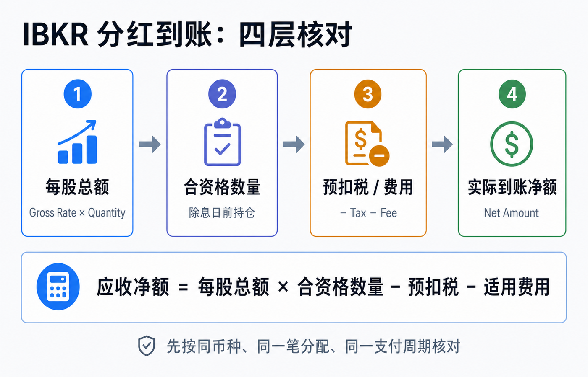
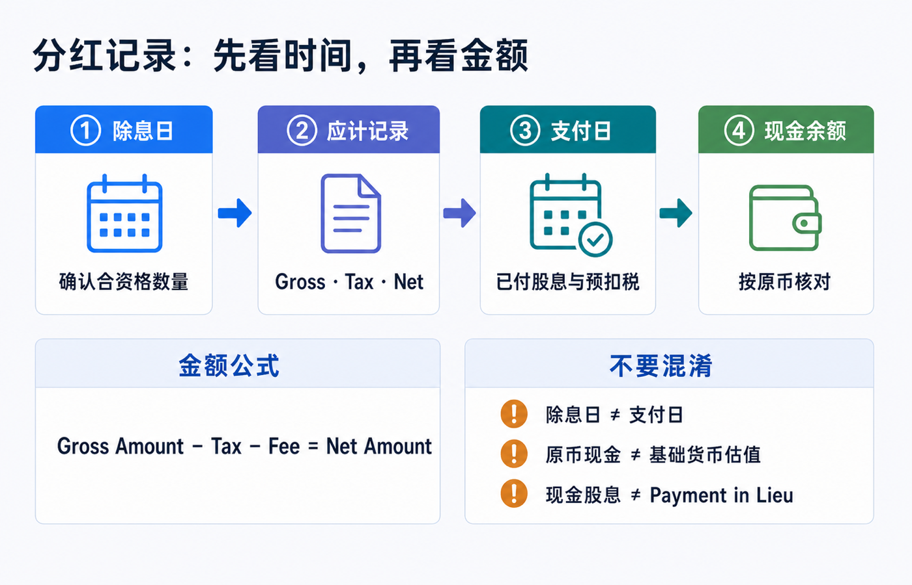
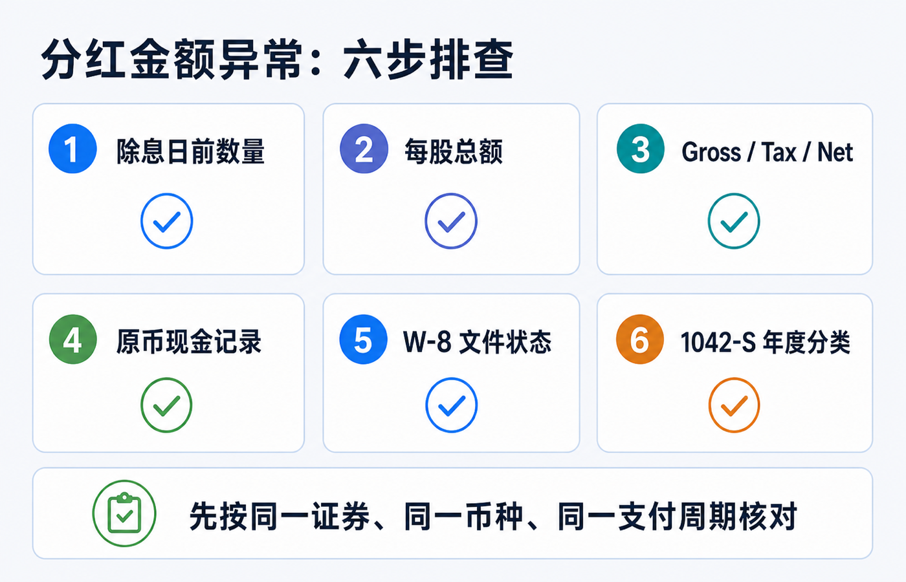

# 分红到账后金额为什么不对：读懂 IBKR 股息和预扣税记录

先说结论：**先不要拿“每股股息 × 现在的持股数”直接对现金余额。** 在 IBKR，一笔分红至少要分成四件事看：除息日前对应的数量、股息总额（gross）、预扣税或其他扣项、实际入账的净额（net）。支付日、报告币种、是否借券，以及分配最终被归类成什么，都会让你看到的金额或日期与预期不同。

最实用的核对式是：

> **应收净额 = 每股总额 × 除息日前合资格数量 − 预扣税 − 适用费用**

这里的“总额”不是最终到手金额；“合资格数量”也不是你今天账户里的数量。先让同一种币种、同一笔分配、同一个支付周期对齐，绝大多数“少到账”都能解释清楚。

> 本文用于理解 IBKR 的分红与税务记录，不构成投资、交易、税务、法律、开户、银行或跨境资金建议。税务身份、受益所有人资格、税收协定待遇、账户实体、证券类型与公司行动都会影响实际结果；申报或追税前请以完整结单、发行人通知、IBKR 客户支持与合资格税务专业人士的意见为准。资料核对日期：2026-07-18。

## 先把“少了的钱”放回正确的四个位置

对普通现金股息，先不要在首页余额里找答案。生成一份覆盖**除息日到支付日之后数个工作日**的 Activity Statement，再逐项比对。

| 你要核对的项目 | 它回答的问题 | 最容易犯的错误 |
|---|---|---|
| 每股总额（Gross Rate） | 发行人宣布每一股派多少原币 | 把新闻里的年化股息或税后收益率当成本次金额 |
| 合资格数量（Quantity） | 哪些股票有权参加本次分配 | 用支付日或今天的仓位代替除息日前数量 |
| 预扣税（Tax） | 总额中被扣走的税款是多少 | 只看净额，反推出一个“固定税率” |
| 净额（Net Amount） | 实际应该进入该币种现金的金额 | 把以基础货币展示的估值变化当成外币现金到账 |

IBKR 的 **Open Dividend Accruals** 参考说明列出了 Ex Date、Pay Date、Quantity、Tax、Fee、Gross Rate、Gross Amount 和 Net Amount；其中数量是除息日前的持仓数量，净额是把税和费用从总额扣除后的结果。它恰好就是上面公式的逐项证据。若你使用的结单模板没有显示这些栏位，切换到 Default Full 或自定义模板，再用自定义日期区间生成报告。

例如，某证券本次每股派发 USD 0.50，除息日前合资格数量为 100 股，则总额应为 USD 50。若该笔记录显示预扣税 USD 15，则净额是 USD 35；这并不表示 IBKR 少发 USD 15，而是总额和税款同时被完整记录。这个例子只用来演示算式，不代表任何证券、税率或你的账户结果。

## 在 IBKR 里按这个顺序找记录

分红的“出现”有不同阶段。看到应计，不等于钱已经可用；看到年度税表，也不等于那是新的现金收付。

### 1. 先看应计：数量、除息日和预计支付日

在支付日前，Open Dividend Accruals 是最适合核对资格数量与预计净额的位置。它把除息日和支付日并排展示，因此可以回答两个很常见的问题：

- 我在除息日之后卖出，为什么仍然有本次分红？
- 我在支付日之前买入，为什么没有这笔分红？

判断关键是发行人的除息规则和除息日前的持仓资格，而不是付款当天是否仍持有。遇到拆股、并购、特别股息或基金分配时，再以发行人公告和结单中的说明为准。

### 2. 再看已付股息：确认原币金额与支付日

IBKR 的 Dividends 区段按支付日列示已付股息，并显示日期、描述、金额、币种及收入类型。这里适合确认“有没有收到”和“收到的是哪一种分配”；不要用它单独判断税率。

如果你的账户基础货币不是股息原币，结单总览中的基础货币金额还会受到换汇或估值折算影响。核对现金是否到账时，先锁定股息原币（例如 USD、HKD），再分别看是否另有一笔外汇交易。**现金股息的原币流水、基础货币估值和后续换汇，不能混成同一笔金额。**

### 3. 最后看税款与现金报告：把总额和净额扣起来

使用覆盖支付日的完整 Activity Statement，在 Dividends、Withholding Tax（或对应的现金/税务区段）及 Cash Report 中寻找同一证券、同一币种、相近日期的记录。不同账户实体和结单模板的区段名称、排列可能不同；应以描述、币种、金额和日期共同匹配，而不是仅凭一行的显示顺序。

下面的顺序比“先问客服”更快：

1. 在应计记录确认每股总额和合资格数量；
2. 用 `Gross Rate × Quantity` 重算总额；
3. 在支付日附近找到税额和净额；
4. 用 `Gross Amount − Tax − Fee` 重算净额；
5. 再对照同币种的现金变动，而不是只看基础货币 NAV。

## 为什么你看到的日期或金额会“不对”

### 原因一：把除息日、支付日和入账日当成同一天

除息日决定资格，支付日是发行人安排派付的日期，券商记录生成与现金可见时间则可能在其后。若你只截取一天的结单，很容易看到应计却还没看到现金，或看到已付股息却遗漏同日税款。做核对时，日期区间至少覆盖除息日、支付日及其后数个工作日。

### 原因二：W-8 信息、税务身份或协定待遇影响预扣

对来自美国的股息，IRS 说明：向非美国税务居民支付的美国来源股息通常按 30% 或适用的更低协定税率预扣；符合条件的受益所有人可以通过向扣缴义务人提交 W-8BEN 主张协定待遇。IBKR 也说明，非美国客户开立账户时需要提交 W-8 以确认税务居住地并判断是否可能适用降低的预扣税率。

这不等于每位读者都应得到某个固定百分比。税率取决于税务居民地、身份、有效文件、收入类型和当时适用规则。尤其不要把“我来自某地”自动等同于“我一定适用某个协定税率”。若税率与预期不符，先在 Client Portal 检查税务资料是否仍有效、居住地和受益所有人资料是否与实际一致，再带着具体流水向 IBKR 询问。

IBKR 的当前说明还提示，W-8 通常在签署当年及其后 3 个日历年有效；情况变化会令文件失效，临近失效时 IBKR 会要求重新提交。不要为了追求某个税率而填写不真实信息。

### 原因三：你收到的是 Payment in Lieu，不是普通现金股息

IBKR 将 **Payment in Lieu of Dividends（PIL）** 定义为与发行人现金股息相对应的现金贷记或借记。若你的股票在保证金安排下被质押或借出，或参与 Stock Yield Enhancement Program，IBKR 说明你可能收到 PIL，而不是普通股息；空头持有人在标的派息时也可能出现 PIL 借记。

它的经济金额可能看起来像股息，但记录性质和税务处理不能想当然。IRS 2026 年 Form 1042-S 指引把普通股息、替代股息（substitute payment）和其他 dividend equivalent 分列为不同收入代码。这正是为什么应先看结单描述和年度表单的收入类型，再讨论“税率是不是错了”。

### 原因四：你拿年度税表和当日现金流水逐笔相减

Form 1042-S 用来报告特定美国来源收入及预扣金额；IRS 明确说明，即使全部收入按协定免税，相关支付仍可能需要在 Form 1042 和 1042-S 中报告。它是年度税务报告，不是对某一天现金余额的截图。

因此，对照 1042-S 时要先统一：

- 是否是同一个**日历年度**；
- 是否同一种收入类型，而非把股息、替代股息、基金资本利得分配或其他项目混在一起；
- 是否先比较总额与预扣额，再比较净额；
- 表单按美元、整美元或特定报告规则展示时，是否与结单中的原币小数位一致。

看到差异先保存相关结单和税表版本，不要擅自把一笔现金记录修改成“退款”或“补税”。涉及报税、退税或跨境申报时请咨询专业人士。

## 一张表判断该查什么，而不是先猜“扣错税”

| 看到的现象 | 优先核对 | 常见解释 | 下一步 |
|---|---|---|---|
| 总额对，但净额少 | Tax、Fee、W-8 状态 | 预扣税或适用费用 | 用总额减税费复算净额 |
| 数量对不上 | Ex Date、Quantity、公司行动 | 用错了支付日仓位，或证券发生调整 | 用除息日前数量与发行人公告核对 |
| 日期晚于支付日 | Open Dividend Accruals、Cash Report | 应计、支付和入账记录不在同一时点 | 扩大报告日期区间 |
| 描述写 PIL | Dividends 描述、借券/保证金状态 | 股票曾被借出、质押或持有空头相关头寸 | 区分 PIL 与普通股息，保留记录 |
| 年度表单与流水难以相等 | 1042-S 收入代码、年度范围、币种 | 汇总口径、收入类型或报告精度不同 | 先按年、按收入类型对账，再咨询专业人士 |

## 遇到异常时，发给 IBKR 的问题要足够具体

“我的分红少了”通常不足以让客服定位。准备以下信息，但务必遮挡完整账户号、税号、住址和其他敏感资料：

1. 证券代码、ISIN（如有）与发行人公布的本次每股总额；
2. 除息日、支付日，以及你在除息日前的合资格数量；
3. Activity Statement 的日期范围、币种、股息总额、税额、费用和净额；
4. 记录描述是 Cash Dividend、PIL 还是其他分配；
5. W-8 资料是否已更新，以及你需要确认的是文件状态、税率依据还是交易记录；
6. 若涉及年度资料，再附上对应年度的 1042-S 收入代码与金额，不要把整份敏感表单公开发送给无关对象。

把问题写成“请确认某证券、某支付日、某币种的 gross amount、withholding amount、net amount 和 income type，以及所依据的税务文件状态”，会比要求“把少的钱补回来”更容易得到可核验的答复。

## 常见误区：三个“看起来合理”的算法都不可靠

### “公司宣布每股 1 美元，我有 100 股，就该到账 100 美元”

这只算出了可能的总额。还缺除息日前资格数量、预扣税、费用和分配类型。应该把 USD 100 当作待核对的 gross amount，而不是到账承诺。

### “去年是 10%，今年也一定是 10%”

预扣税不是一个可永久套用的个人常数。税务居住地、表单有效性、协定资格、证券和收入类型都可能改变结果。IBKR 与 IRS 的现行资料都把有效 W-8 和适用协定作为判断条件，而非保证某个单一百分比。

### “1042-S 写了一个数，现金流水就必须逐笔相同”

1042-S 是按年度和收入类别进行的税务报告。普通股息、替代股息及其他分配可能使用不同报告代码；加上币种、四舍五入和期间范围差异，正确的做法是先分类汇总，而不是把一条年度金额硬配到一笔日常现金记录。

## 官方资料与核对入口

- [IBKR：非美国客户税务资料、W-8 有效期与一般预扣规则](https://www.interactivebrokers.com/en/support/tax-nonus-initial.php)
- [IBKR Reporting Reference：Open Dividend Accruals 字段定义](https://www.ibkrguides.com/reportingreference/reportguide/opendividendaccruals.htm)
- [IBKR Reporting Reference：已付股息区段字段](https://www.ibkrguides.com/reportingreference/reportguide/dividends_optional.htm)
- [IBKR：Payment in Lieu of Dividends 定义](https://www.interactivebrokers.com/campus/glossary-terms/payment-in-lieu-of-dividends/)
- [IRS：Form W-8BEN 的用途](https://www.irs.gov/forms-pubs/about-form-w-8-ben)
- [IRS：非美国税务居民的股息预扣与 1042-S 报告](https://www.irs.gov/individuals/international-taxpayers/federal-income-tax-withholding-and-reporting-on-other-kinds-of-us-source-income-paid-to-nonresident-aliens)
- [IRS：Form 1042-S 说明与 2026 年收入代码](https://www.irs.gov/instructions/i1042s)

资料以 2026-07-18 可访问的官方页面为准。IBKR 的界面、结单模板、账户实体和税务表单可随账户和地区变化；发生实际差异时，以你的原始结单、发行人公司行动通知和 IBKR 的书面回复为准。
