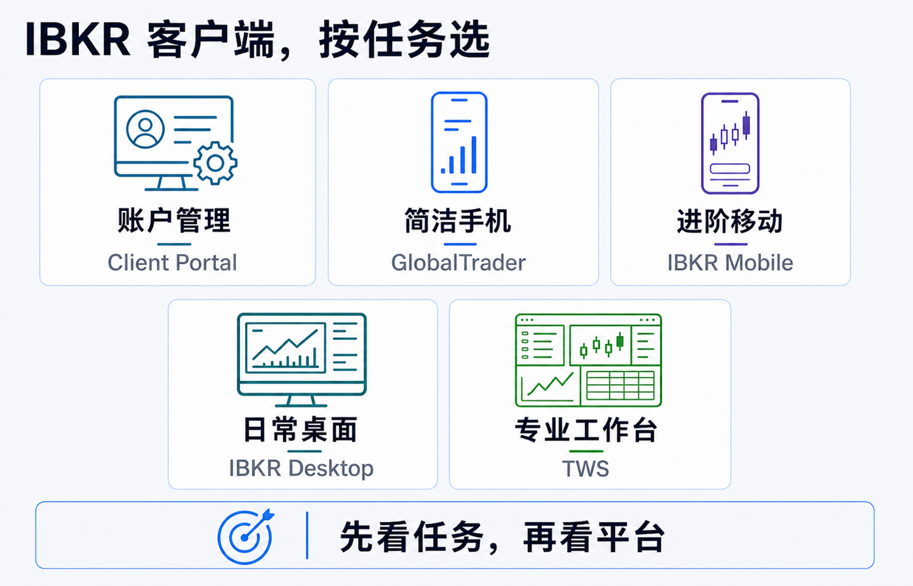
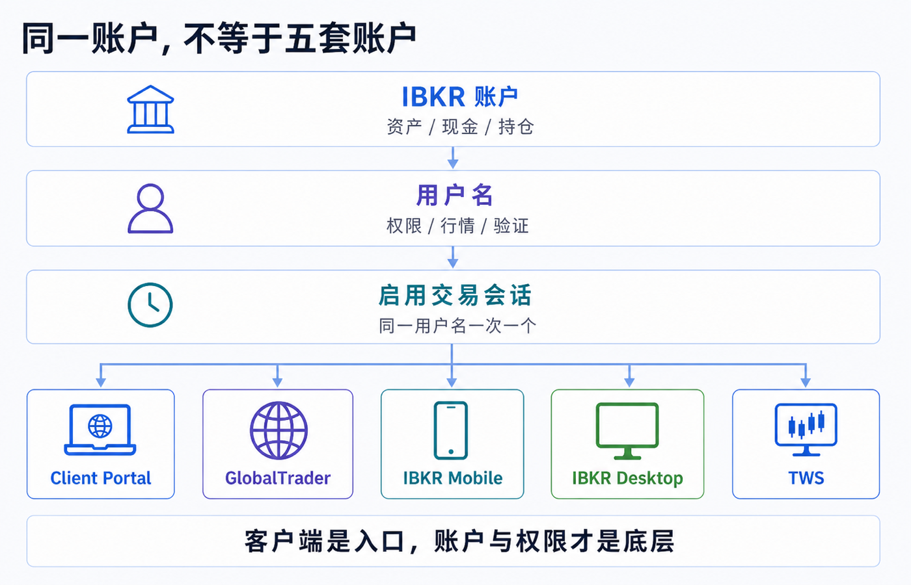
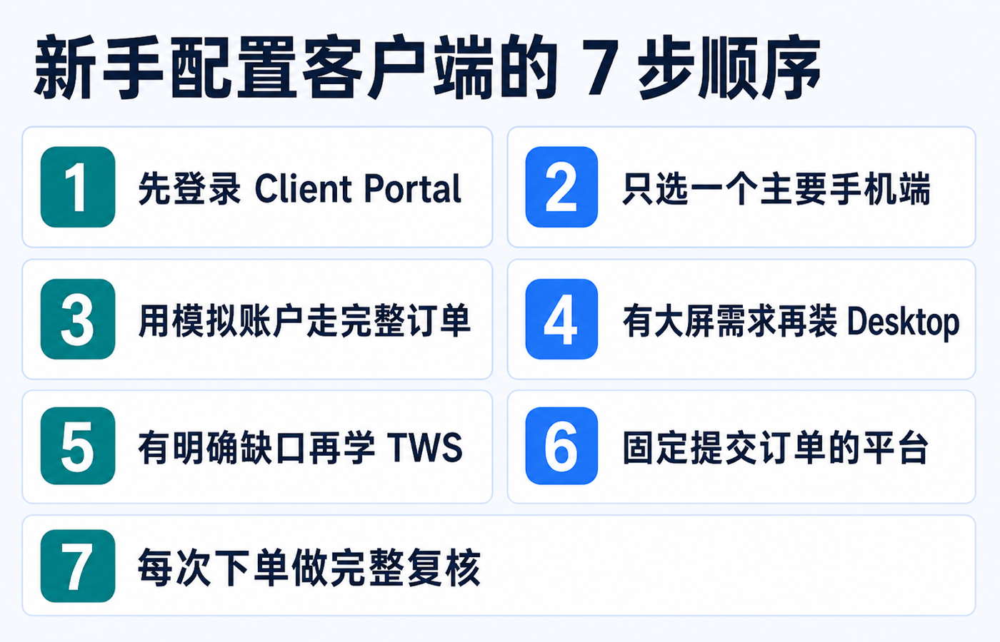

# IBKR 为什么有这么多客户端：网页、手机和专业交易平台怎么选

先说结论：**你不需要把 IBKR 的所有客户端都装一遍，更不需要在每个平台重新“开一个账户”。** 对大多数个人用户，最小组合通常是：

1. 用 **Client Portal** 管账户、看报表、处理资金和设置；
2. 在 **GlobalTrader** 与 **IBKR Mobile** 中选一个主要手机端；
3. 真正需要桌面图表、复杂订单或多窗口工作流时，再选 **IBKR Desktop** 或 **Trader Workstation（TWS）**。

它们连接的是同一套 IBKR 账户体系，但把复杂度切成不同界面。选择时不要问“哪个客户端功能最多”，而要问：**我现在是在管理账户、临时看仓位、日常下单，还是搭建专业交易工作台？**

> 本文用于理解 IBKR 客户端和账户访问结构，不构成投资、交易、开户、税务、法律、银行或跨境资金建议。平台功能、产品覆盖、交易权限、行情数据、登录会话、应用商店可用性和菜单路径会随账户实体、地区、用户名及版本变化；操作前请以本人账户、订单预览和 IBKR 当前官方说明为准。资料核对日期：2026-07-19。

## 先理解：五个客户端不是五个账户

IBKR 的平台数量多，主要是因为同一个账户同时承载了几类差异很大的任务：身份与安全、资金和报表、持仓监控、普通下单、复杂订单、行情分析以及自动化接口。把所有任务塞进一个界面，要么会让新手无从下手，要么会限制专业用户。

因此更准确的结构是：

- **账户**保存资产、现金、持仓和结算记录；
- **用户名**携带登录身份、交易权限、访问权限和行情订阅；
- **客户端**只是访问这些能力的不同入口；
- **具体功能**还受到账户实体、产品权限、行情数据、地区和版本限制。

IBKR 当前的平台总览把 Client Portal、IBKR Mobile、GlobalTrader、IBKR Desktop 和 TWS 放在同一平台体系中，并说明客户可使用其网页、移动和桌面平台而无需额外的平台使用费。但这不代表交易佣金、市场数据、研究订阅或第三方服务都免费，也不代表每个平台能显示完全相同的产品与工具。[IBKR：交易平台总览与对比](https://www.interactivebrokers.com/en/trading/trading-platforms.php)

## 五个平台分别适合做什么

| 平台 | 形态 | 最适合的任务 | 新手要知道的边界 |
|---|---|---|---|
| Client Portal | 网页 | 账户设置、入出金、报表、税务文件、客服消息、普通交易 | 无需安装，但不是把所有专业交易工具搬到浏览器里 |
| IBKR GlobalTrader | 手机 App | 简洁地查看和交易全球股票、ETF、期权等 | 体验更精简，不能假设它覆盖 Mobile 或 TWS 的全部工具 |
| IBKR Mobile | 手机 App | 移动监控、进阶订单、组合与账户管理、IB Key 验证 | 功能密度更高，小屏幕不适合长时间搭建复杂工作区 |
| IBKR Desktop | 桌面程序 | 现代界面下的图表、研究、组合监控和日常多资产交易 | 功能持续扩展；遇到专用工具要查官方平台对比，而不是凭旧文章判断 |
| Trader Workstation（TWS） | 桌面程序 | 多窗口、复杂订单、扫描器、期权与专业交易工作流 | 学习成本最高，不是开户后的必装软件 |

官方平台对比页会持续更新产品、订单、分析工具和语言支持。遇到“某个订单类型到底在哪个平台可用”这类问题，应查当前对比页或该订单类型的官方页面，而不是照搬旧截图。

## 网页端 Client Portal：先把它当账户控制台

Client Portal 的价值不只是“网页版下单”。IBKR 当前说明把它定位为无需下载的统一入口，可用于交易、查看余额、管理账户设置，以及访问研究和报表工具。[IBKR：Client Portal](https://www.interactivebrokers.com/en/trading/client-portal.php)

新手最值得先在这里熟悉的是：

- 账户余额、净清算价值、购买力与通知；
- 交易权限、市场数据订阅和用户设置；
- 入金、出金、转仓和银行指令；
- Activity Statement、交易确认、税务文件与其他报表；
- 客服工单、FYI 通知和待办事项；
- 普通订单票、持仓和未成交订单。

这意味着，即使你以后主要在手机或 TWS 下单，Client Portal 仍然是账户管理的主入口。遇到“为什么没有权限”“行情为什么延迟”“资金为什么暂时不能转出”时，答案往往在 Portal 的权限、订阅、报表或通知里，而不是换一个交易界面就会消失。

若只是长期持有、每月少量交易和定期下载报表，Client Portal 可能已经覆盖大部分电脑端需求。不要因为 TWS 看起来更专业，就把简单任务搬到更复杂的工具里。

## 手机端怎么选：GlobalTrader 还是 IBKR Mobile

两者都能连接 IBKR 的交易体系，但设计目标不同。

### GlobalTrader：优先降低界面复杂度

IBKR 将 GlobalTrader 描述为面向全球股票、ETF 和期权等产品的简化移动体验。当前官方页面强调其移动优先的界面、全球股票市场、期权工具和模拟体验。[IBKR：GlobalTrader](https://www.interactivebrokers.com/en/trading/globaltrader/overview.php)

它更适合这些情况：

- 第一次接触 IBKR，希望先认清搜索、持仓、订单和成交；
- 主要交易股票或 ETF，偶尔使用相对直观的期权工具；
- 不想在手机上同时看到大量高级参数；
- 希望先用模拟环境熟悉订单流程。

简洁不等于风险更低。下单前仍要确认合约、币种、交易所、订单类型、有效期、交易时段和预计费用。

### IBKR Mobile：把更多桌面能力带到手机

IBKR Mobile 当前官方页面强调进阶订单、算法、灵活路由、扫描器、组合与账户指标，以及 IB Key 双重验证。它覆盖的产品和工具更多，更适合已经理解 IBKR 订单结构、需要在外监控或调整订单的人。[IBKR：IBKR Mobile](https://www.interactivebrokers.com/en/trading/ibkr-mobile.php)

它更适合这些情况：

- 需要查看更完整的余额、保证金和组合指标；
- 会使用 bracket、conditional、算法或多腿期权等工具；
- 需要在手机上处理提醒、报表和更复杂的订单；
- 把手机作为桌面端的监控与应急入口。

如果你拿不准，可以先选 GlobalTrader 熟悉基本交易，再在确实遇到功能缺口时转向 IBKR Mobile。两者不是按“新账户/老账户”区分，也不需要迁移持仓。

## 桌面端怎么选：IBKR Desktop 还是 TWS

### IBKR Desktop：现代日常工作台

IBKR 将 Desktop 定位为现代、可定制、兼顾简洁与进阶能力的桌面平台。官方说明它适合从基础流程逐步增加图表、研究、订单和组合工具的用户。[IBKR：IBKR Desktop](https://www.interactivebrokers.com/en/trading/ibkr-desktop.php)

优先选 Desktop 的典型场景是：

- 想在大屏幕上看图表、自选列表、持仓和订单；
- 主要做常见股票、ETF、期权、期货、外汇或债券交易；
- 希望界面比 TWS 更容易建立日常习惯；
- 需要可定制布局，但暂时不依赖某个 TWS 专用模块。

归档中的 2024 年旧文把 IBKR Desktop 描述为“新界面、功能少”。到 2026 年，官方已经把它描述为持续扩展的完整投资工作区，因此不能继续用两年前的静态结论判断。现在更稳妥的问法是：**我需要的具体产品、订单类型和分析工具，在最新平台对比中是否已支持？**

### TWS：复杂工作流和专业工具箱

TWS 是 IBKR 的旗舰桌面平台。官方把它面向需要速度、灵活性、多产品和专业工具的活跃交易者；Mosaic 与 Classic TWS 提供多窗口布局、订单监控、扫描器、附加订单和大量订单类型及算法。[IBKR：Trader Workstation](https://www.interactivebrokers.com/en/trading/tws.php)

只有在出现这些明确需求时，TWS 的学习成本才更容易得到回报：

- 同时监控多组标的、市场深度、新闻和订单；
- 使用复杂期权、附加订单、条件单、算法或专用交易工具；
- 搭建多窗口联动、扫描器和固定的盘中工作流；
- 测试 TWS API 或需要 TWS/IB Gateway 相关能力；
- 某项功能在官方对比中明确只由 TWS 提供。

“功能最多”并不等于“最适合第一次下单”。复杂界面会增加选错账户、合约、数量、时段或高级参数的机会。刚开始使用 TWS 时，应先在模拟账户建立一个最小布局，只保留持仓、订单输入、订单监控和必要行情。

## 登录被顶下线：要区分账户、用户名和交易会话

这是多个客户端最容易制造的误解：同一个账户可以从多个平台访问，不等于同一个用户名能同时保持多个独立交易会话。

IBKR 当前 Web API 官方说明明确写道：**一个用户名在所有 IB 平台中一次只能有一个启用交易的 brokerage session。** 因此，在一个平台建立交易会话后，再用同一用户名从另一个平台进入交易功能，可能触发会话切换、重新验证或前一端失去交易连接。[IBKR：用户名与 brokerage session](https://www.interactivebrokers.com/campus/ibkr-api-page/web-api-staging/)

处理原则是：

1. 不要在提交订单时随意切换平台；
2. 先确认另一端是只读查看，还是正在建立交易会话；
3. 需要多个用户名时，通过 Client Portal 的 Users & Access Rights 正式创建并分配最小权限；
4. 不要共享主用户名、密码和双重验证；
5. 额外用户名的可用性、授权流程和权限范围取决于账户结构。

IBKR 当前用户权限指南说明，个人账户也可添加用户或额外用户名，但账户类型、人数、授权和资金权限存在限制；新增用户应使用自己的身份、验证和权限配置。[IBKR：Users & Access Rights](https://www.ibkrguides.com/clientportal/uar/accessrightsoverview.htm)

还要注意：**行情订阅通常按用户名配置。** 第二个用户名不会当然继承第一个用户名的市场数据权限，可能需要单独订阅或使用受限制的配置。增加用户名前，应同时核对交易权限、行情成本和资金访问范围。[IBKR：Market Data Subscriptions 与多用户](https://www.interactivebrokers.com/campus/ibkr-api-page/market-data-subscriptions/)

## 按使用场景组合，而不是只选一个“冠军”

| 使用场景 | 建议起步组合 | 为什么 |
|---|---|---|
| 长期持有、低频交易 | Client Portal + GlobalTrader | 管理和报表集中在网页，手机端保持简洁 |
| 需要完整移动监控 | Client Portal + IBKR Mobile | 网页处理账户设置，手机承担进阶监控与订单 |
| 主要在电脑做日常研究与交易 | Client Portal + IBKR Desktop + 一个手机端 | Desktop 作为主工作区，Portal 管设置，手机做验证和应急 |
| 复杂期权、多窗口或算法工具 | Client Portal + TWS + IBKR Mobile | TWS 承担专业工作流，Portal 管账户，Mobile 做监控 |
| 还不知道自己需要什么 | Client Portal + 一个手机端 + 模拟账户 | 先完成账户、订单和报表闭环，再根据真实缺口增加平台 |

这里的“组合”不是要求同时登录，也不是要求每个平台都装。它只是给每类任务安排一个固定入口，减少菜单记忆和重复设置。

## 新手配置客户端的 7 步顺序

1. **先登录 Client Portal。** 确认账户、实体、交易权限、基础货币、市场数据、通知和报表入口。
2. **只选一个主要手机端。** 简洁优先用 GlobalTrader；需要高级工具和 IB Key 日常操作时用 IBKR Mobile。
3. **先用模拟账户走一笔完整订单。** 从搜索合约、查看 Bid/Ask、设置数量与限价，到预览、成交和报表核对。
4. **有大屏需求再装 Desktop。** 先建立一个自选列表和最小订单区，不要一开始铺满工具。
5. **出现明确功能缺口再学 TWS。** 写下缺少的工具名称，并在官方平台对比中确认。
6. **固定提交订单的平台。** 订单发出后在同一平台监控，避免会话切换时重复操作。
7. **每次下单仍做同一套复核。** 平台变了，合约、币种、方向、数量、订单类型、价格、有效期、时段和预计费用不能少。

## 5 个常见误区

1. **“TWS 最专业，所以新手必须从 TWS 开始。”** 专业工具只有在真实需求出现时才有价值。
2. **“GlobalTrader 简单，所以和主账户不是一套持仓。”** 客户端不同不等于资产账户不同。
3. **“安装了平台，就自动获得交易权限和实时行情。”** 权限与行情按账户和用户名配置，客户端不能替你开通。
4. **“同一账号可以在五个平台同时交易。”** 一个用户名的启用交易会话存在并发限制。
5. **“Desktop 以前缺某功能，所以以后也永远没有。”** 平台持续更新，应按当前官方对比核对。

## 最后记住一条选择公式

> **账户设置与报表 → Client Portal；简洁手机交易 → GlobalTrader；进阶移动交易 → IBKR Mobile；现代桌面工作区 → IBKR Desktop；复杂专业工具 → TWS。**

先让一个平台完成一个明确任务，再逐步扩展，比同时学习五套界面更可靠。真正需要统一的不是按钮位置，而是你每次都用同一套方法确认账户、合约、行情、订单和记录。

## 官方资料

- [IBKR 交易平台总览与当前功能对比](https://www.interactivebrokers.com/en/trading/trading-platforms.php)
- [IBKR Client Portal](https://www.interactivebrokers.com/en/trading/client-portal.php)
- [IBKR GlobalTrader](https://www.interactivebrokers.com/en/trading/globaltrader/overview.php)
- [IBKR Mobile](https://www.interactivebrokers.com/en/trading/ibkr-mobile.php)
- [IBKR Desktop](https://www.interactivebrokers.com/en/trading/ibkr-desktop.php)
- [IBKR Trader Workstation](https://www.interactivebrokers.com/en/trading/tws.php)
- [IBKR 用户名与交易会话说明](https://www.interactivebrokers.com/campus/ibkr-api-page/web-api-staging/)
- [IBKR Users & Access Rights](https://www.ibkrguides.com/clientportal/uar/accessrightsoverview.htm)
- [IBKR 多用户名与市场数据订阅](https://www.interactivebrokers.com/campus/ibkr-api-page/market-data-subscriptions/)

资料以 2026-07-19 可访问的官方页面为准。平台功能、订单类型、行情显示和应用下载渠道可能调整；使用前请再次查阅官方平台对比页、本人账户权限和应用内版本说明。
