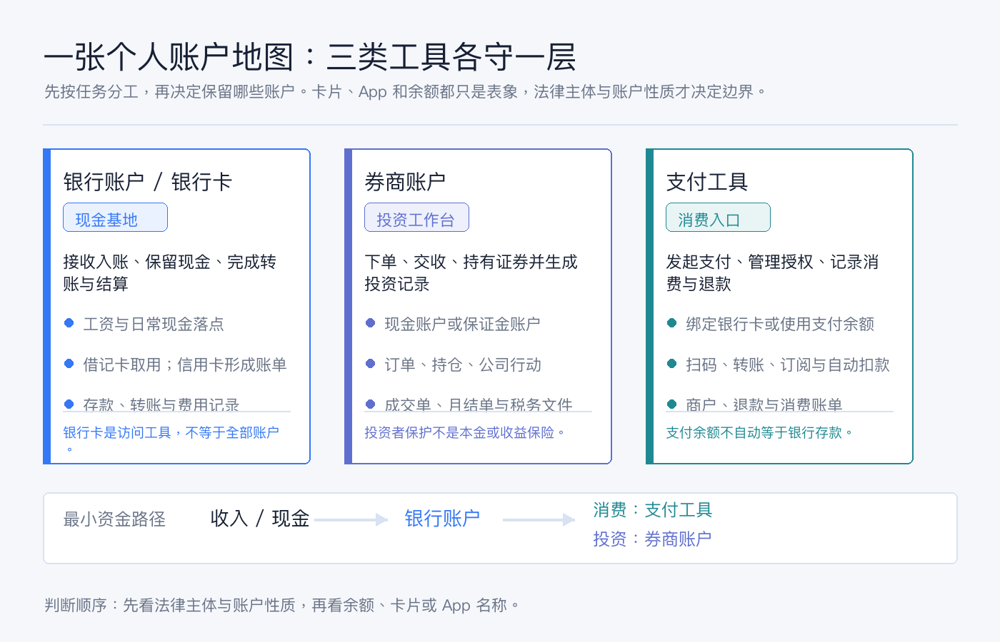
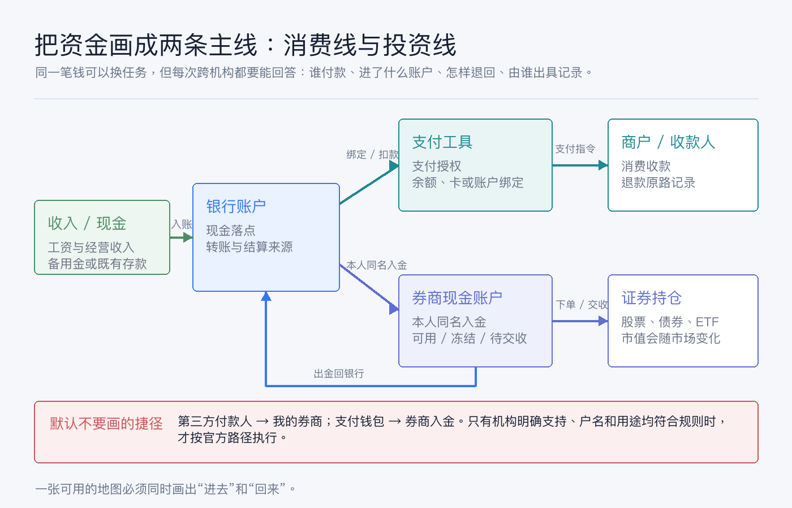
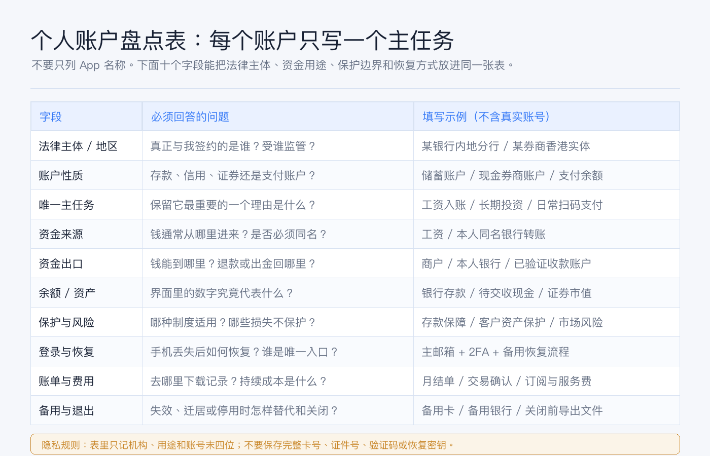

# 先画一张个人账户地图：银行卡、券商和支付工具分别负责什么

很多人的“账户清单”其实只是一排 App：某银行、某券商、支付宝、微信支付、Apple Pay、Wise……看起来很完整，真正要找一笔钱、停一个自动扣款或把投资资金转回来时，还是会乱。

问题不在账户太多，而在**没有给每个账户分配任务**。

先记住结论：

- **银行账户是现金基地**，负责接收入账、保存存款、转账结算和提供银行流水；银行卡只是访问或使用其中一部分功能的工具。
- **券商账户是投资工作台**，负责下单、交收、持有证券和提供交易、持仓与税务记录；券商里的“现金”不能一概当作银行存款。
- **支付工具是消费入口**，负责发起支付、管理授权、连接银行账户或卡、记录退款与订阅；支付余额不自动等于银行存款。

把这三类工具混在一起，最容易出现三种错觉：看到余额就以为都是现金，看到大品牌就以为保护相同，能把钱转进去就以为也一定能原路转回。

> 本文是一般性的账户管理教育内容，不构成银行、支付、开户、投资、税务、法律或跨境资金建议。不同国家和地区、法律实体、账户类型与客户身份适用不同规则。文中的制度边界已于 2026-07-19 按文末官方资料核对；处理自己的账户时，请以签约实体、账户协议和当前官方说明为准。



## 先拆名词：卡、账户、App 和机构不是一回事

开始画地图前，先把四个经常混用的词拆开。

| 你看到的东西 | 它可能是什么 | 真正要确认什么 |
|---|---|---|
| 银行卡 | 借记卡、信用卡或账户访问凭证 | 卡背后连着哪个存款账户或授信账户；发卡实体是谁 |
| 银行 App | 同一家品牌下多个账户和服务的入口 | 每笔余额属于活期、定期、外币、理财还是信用账单 |
| 券商 App | 交易前端，也可能连接不同法律实体或清算安排 | 客户协议中的签约实体、账户类型、持仓与现金安排 |
| 支付 App / 钱包 | 支付指令入口、卡包、支付账户或储值工具 | 扣款来源、支付余额性质、退款去向和自动扣款授权 |

这一步很重要。**品牌是你记住的名字，法律实体才是与你签约、接受监管并出具账户记录的主体。** 同一个品牌在不同地区可能对应不同实体；同一个 App 里也可能同时出现银行存款、非存款投资产品和支付服务。

所以，账户地图的第一列不要只写“某某 App”，而要写成：

> 机构或签约实体 + 地区 + 账户性质 + 账号末四位 + 唯一主任务

只保留末四位用于识别，不要把完整卡号、银行账号、证件号、验证码或恢复密钥写进普通表格。

## 银行卡负责什么：把现金放稳、收进来、付出去

日常说“银行卡”，实际要分开看底层银行账户与卡片。

### 借记卡与信用卡的任务不同

- **借记卡**通常让你使用关联存款账户里的钱；刷卡、取现和转账最终反映在银行账户流水中。
- **信用卡**使用的是授信额度，消费后形成待还账单；它不是你的现金余额，也不应被放进净资产表当作资产。
- **银行账户**才是接收工资、保留备用金、完成同名转账和生成流水的基础账本。

对大多数人来说，银行层至少可以分成三个任务：

1. **主账户**：收入和主要现金落点，承担日常转账与账单。
2. **备用账户**：主卡失效、通道故障或旅行时提供替代路径。
3. **专用账户**：只处理特定币种、跨境汇款、固定扣款或某一类长期支出。

不需要为了凑齐“三类”强开账户；一个账户可以承担多个相关任务，但一定要写清主任务。换工作留下的工资卡、历史信用卡和备用外币卡很容易长期并存。它们是否值得保留，应看任务、费用、恢复能力和备用价值，而不是只看开户难度。

### 存款保护只保护符合条件的存款

账户地图还要写“保护边界”。例如，中国现行《存款保险条例》规定，同一存款人在同一家投保机构的被保险存款本金和利息合并计算，最高偿付限额为人民币 50 万元；境外分支机构等情形有其适用边界。[司法部：存款保险条例](https://www.moj.gov.cn/pub/sfbgw/zcjd/201504/t20150401_390087.html)

这不等于“银行 App 里展示的任何产品都受存款保险”。美国 FDIC 的官方说明也用同样思路区分：保险要同时看机构是否受保、产品是否属于存款；股票、债券和基金不是银行存款。[FDIC：Deposit Insurance at a Glance](https://www.fdic.gov/consumer-resource-center/deposit-insurance-glance)

地图上不要只写“有保障”，而要写：**什么产品、哪家法律实体、哪个制度、怎样合并计算、哪些损失不覆盖。**

## 券商负责什么：把现金变成证券，并留下完整证据

美国 Investor.gov 对券商账户的定义很直白：这是在注册券商处开立、用于买卖股票、债券、基金和 ETF 等投资产品的账户；常见账户类型包括现金账户和保证金账户。[Investor.gov：Brokerage Accounts](https://www.investor.gov/introduction-investing/investing-basics/investment-accounts/brokerage-accounts)

对个人账户地图来说，券商主要负责四件事：

1. **执行**：接收订单，处理成交、撤单、有效期和交易权限。
2. **交收与持有记录**：把成交后的现金变化和证券数量记入账户。
3. **公司行动与现金流**：记录股息、利息、拆股、投票、要约和其他事件。
4. **证据**：提供成交确认、月结单、活动报表和适用的税务文件。

### 券商现金不能只看一个“Cash”标签

券商界面里的现金可能处于可用、冻结、待交收、不同币种或现金管理计划中。部分券商还会把闲置现金扫入银行存款计划或货币市场基金；两者的法律性质和保护框架并不相同。

因此地图里至少要写清：

- 是现金账户还是保证金账户；
- 现金由券商持有、扫入银行，还是换成货币市场基金；
- 入金必须来自谁，出金可以回到哪里；
- 卖出后何时完成交收，何时可以转出；
- 账户由哪个实体服务，适用哪种客户资产保护。

以美国为例，SIPC 在成员券商财务失败且客户资产缺失等法定情形下，协助返还符合条件的现金和证券；其官网同时明确，保护不覆盖证券市值下跌、错误投资建议或承诺收益。当前限额为每位客户 50 万美元，其中现金限额 25 万美元，并且仍受成员资格、资产类型和账户用途等条件约束。[SIPC：What SIPC Protects](https://www.sipc.org/for-investors/what-sipc-protects)

所以不要把“券商受保护”写成“投资本金有保险”。更准确的写法是：**客户资产保护解决特定托管或机构失败问题，市场风险仍由投资者承担。**

## 支付工具负责什么：让支付更顺，但不替代现金基地

支付工具最适合承担的是高频、小额、明确场景的任务：扫码付款、转账给收款人、管理订阅、绑定银行卡、接收退款和查看消费记录。

中国《非银行支付机构监督管理条例》把支付账户定义为：根据用户真实意愿开立，用于发起支付指令、反映交易明细、记录资金余额的电子簿记载体；从事储值账户运营的非银行支付机构不得向用户支付与余额有关的利息等收益。[中国人民银行：非银行支付机构监督管理条例](https://www.pbc.gov.cn/tiaofasi/144941/144953/5174993/index.html)

这给账户地图一个很实用的判断：

- 如果钱包只是绑定银行卡，付款时资金来源仍可能是银行账户或信用卡；
- 如果钱包里有支付余额，要单独记录它的账户性质、充值与提现规则；
- 自动扣款是支付授权，不是“这笔订阅不存在”；
- 退款可能原路退回卡、银行账户或支付余额，要看原交易和服务规则。

香港金管局对 FPS 的介绍也能说明“支付通道”和“底层账户”的区别：FPS 是连接银行与储值支付工具运营商的平台，可用于个人转账、电子钱包充值和网上支付。[香港金融管理局：Faster Payment System](https://www.hkma.gov.hk/eng/smart-consumers/faster-payment-system)

因此，支付工具可以连接银行和商户，但不等于它自动继承了银行存款或券商资产的保护属性。支付层最值得单独维护的是**自动扣款、订阅周期、退款路径和账单来源**。

## 画资金流，不要只列账户名

一张真正有用的地图至少有两条主线：消费线和投资线。



### 消费线

```text
收入 / 现金
→ 银行账户
→ 银行卡或支付工具发起付款
→ 商户 / 收款人
→ 退款按原交易规则返回
```

这里要记录的是扣款源、自动授权和退款去向。支付工具界面显示成功，不代表银行账单已经最终入账；信用卡退款也可能先显示为待处理。

### 投资线

```text
本人银行账户
→ 券商认可的入金方式
→ 券商现金账户
→ 下单与交收
→ 证券持仓
→ 卖出后的现金
→ 本人已验证银行账户
```

这条线必须同时画“进去”和“回来”。把资金通路与返回链路分开检查，能更早发现户名、资金来源和退回路径的问题；但具体银行、支付服务和券商规则会变化，不能把历史操作路径当成今天仍然有效的通用答案。

默认不要在地图里画两条捷径：

1. **第三方付款人直接给我的券商入金。** 这会带来户名、资金来源与退回路径问题。
2. **支付钱包直接给券商入金。** 只有券商与支付机构明确支持、账户实名一致且用途符合规则时，才按官方流程使用。

“转得动”只是技术结果，不代表它就是稳定、可解释、可长期复用的路径。

## 用十个字段完成自己的账户盘点



建议用一张表，每个账户一行，至少包含以下字段：

| 字段 | 写什么 |
|---|---|
| 法律主体 / 地区 | 与你签约的准确机构、分支或券商实体，以及主要监管地区 |
| 账户性质 | 存款、信用、证券现金、证券保证金、支付账户或储值余额 |
| 唯一主任务 | 工资入账、日常支付、备用卡、跨境收付、长期投资等，只选一个主任务 |
| 识别信息 | 账号末四位即可；不要保存完整账号或证件号 |
| 资金来源 | 工资、本人同名银行、退款、卖出证券等 |
| 资金出口 | 商户、本人银行、其他已验证账户；是否有等待期或限额 |
| 余额 / 资产类型 | 银行存款、信用欠款、支付余额、待交收现金、证券市值 |
| 保护与风险 | 适用制度、限额和排除项；市场风险、汇率风险和操作风险另列 |
| 登录与恢复 | 主邮箱、手机号、2FA、备用设备和官方恢复路径 |
| 账单、费用与退出 | 报表下载位置、持续费用、关闭前要导出的文件和备用方案 |

如果一个账户的“唯一主任务”写不出来，它通常属于以下三类之一：历史遗留、功能重复，或只是因为难开所以舍不得关。先核对费用、税务和关闭影响，再决定保留；不要为了整理而仓促关掉仍承载工资、退款、自动扣款或历史报表的账户。

## 最容易犯的六个错误

1. **把卡片当成账户。** 卡过期不一定代表底层账户关闭；换卡也不一定改变所有入账与扣款关系。
2. **把支付余额和银行存款相加两次。** 如果支付工具只是展示绑定卡的可用来源，不应重复计入资产。
3. **把券商总资产当成可立即转出的现金。** 持仓市值、待交收资金和可出金现金是不同数字。
4. **只记录怎么入金。** 没有出金路径、退款路径和失败处理方式的地图是不完整的。
5. **只写品牌，不写实体。** 保护制度、税务文件和客服责任通常落在具体法律实体上。
6. **把所有恢复方式绑在同一部手机。** 手机号、邮箱、2FA 和密码管理器形成单点故障，至少要有一条经过测试的备用恢复路径。

用两张不同网络或不同发卡行的卡互为备份，可以降低单卡偶发失败的影响。这个思路可以推广到账户地图：备用不是简单复制，而是避免主路径和备用路径共享同一个故障点。

## 三十分钟行动清单

今天不需要一次整理完所有金融生活，先完成最小版本：

1. 打开银行、券商和支付工具，列出仍能登录的账户，只记机构、地区、账户性质和末四位。
2. 给每个账户写一个唯一主任务；写不出的标记为“待核对”，不要立刻关闭。
3. 选择一笔工资或其他收入，画出它进入银行、用于消费或进入券商的两条路径。
4. 对每条投资路径补上出金回本人银行的箭头，对每条消费路径补上退款去向。
5. 从支付工具和银行卡账单中检查自动扣款、订阅和长期未识别的小额费用。
6. 为主银行、主券商和主支付工具各测试一次官方登录恢复流程，并记录恢复入口，不记录验证码或密钥。
7. 在表里加一列“下次复查日期”，半年或一年复查一次实体、费用、联系方式和备用路径。

做完后，你应该能在一分钟内回答四个问题：日常现金在哪里，投资资产在哪里，消费从哪里扣，任何一条主路径失效时怎样恢复或替代。

## 最后：账户地图的目标是减少混乱，不是增加账户

好的个人账户系统不取决于拥有多少银行卡、券商或支付 App，而取决于每个工具是否有清楚、不可替代或值得保留的任务。

先把银行账户当现金基地，把券商账户当投资工作台，把支付工具当消费入口；再补上法律实体、资金来源、资金出口、保护边界和恢复方式。这样一来，换卡、换手机、迁居、调整券商或处理退款时，你面对的不再是一堆图标，而是一张可以沿着箭头排查的地图。

最实用的顺序只有三步：**先盘点，再分工，最后画出进去和回来的路径。**

## 参考资料

- 中华人民共和国司法部，[《存款保险条例》](https://www.moj.gov.cn/pub/sfbgw/zcjd/201504/t20150401_390087.html)。
- 中国人民银行，[《非银行支付机构监督管理条例》](https://www.pbc.gov.cn/tiaofasi/144941/144953/5174993/index.html)。
- Investor.gov，[Brokerage Accounts](https://www.investor.gov/introduction-investing/investing-basics/investment-accounts/brokerage-accounts)。
- Securities Investor Protection Corporation，[What SIPC Protects](https://www.sipc.org/for-investors/what-sipc-protects)。
- Federal Deposit Insurance Corporation，[Deposit Insurance at a Glance](https://www.fdic.gov/consumer-resource-center/deposit-insurance-glance)。
- 香港金融管理局，[Faster Payment System](https://www.hkma.gov.hk/eng/smart-consumers/faster-payment-system)。

资料核对日期：2026-07-19。
