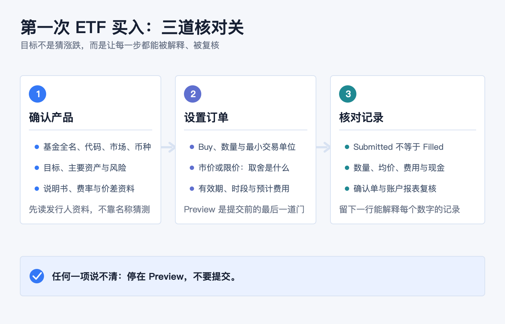
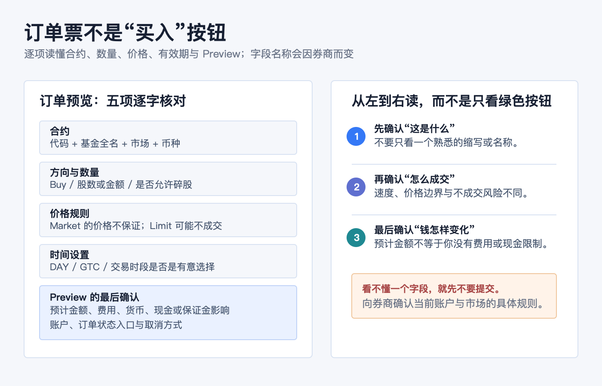
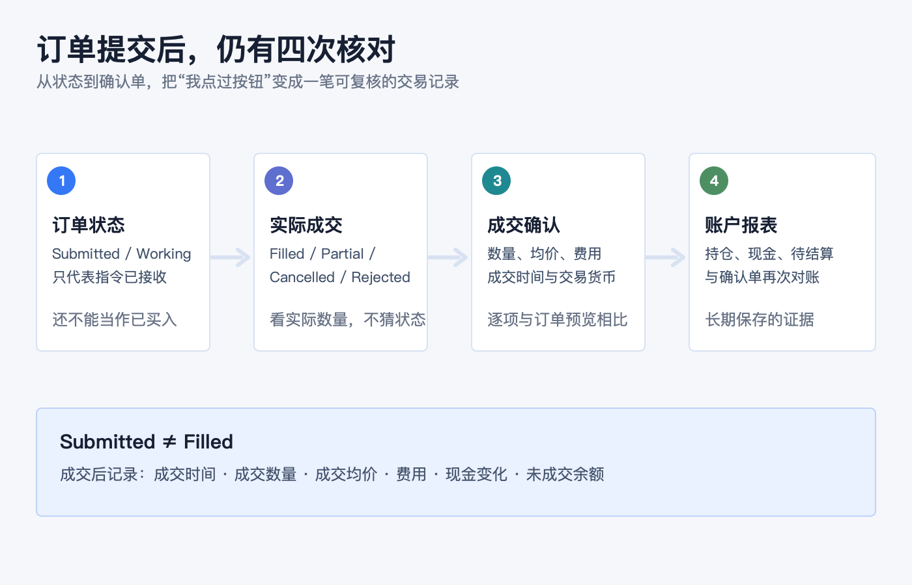

# 开户后的第一笔投资：新手如何完成第一次 ETF 买入

开户、入金和开通交易权限之后，第一笔 ETF 买入最重要的目标不是“立刻买到最好的产品”，而是建立一套以后每次都能重复的核对动作：

1. 我买的是哪只基金、在哪个市场挂牌、用什么货币交易？
2. 我填的是哪一种价格规则，最坏会以什么价格成交或不成交？
3. 提交后，我怎样确认订单、费用、现金和持仓都与预期一致？

把这三个问题答清楚，第一次下单就不再只是点击一个绿色的 Buy 按钮，而是一条能回看、能纠错的记录链路。

> 本文是一般性的 ETF 与订单操作教育，不构成任何证券推荐、投资、交易、税务、开户、银行或跨境资金建议。不同市场、券商实体、账户类型、交易权限、币种、产品和软件版本的字段与规则会不同；下单前请以基金发行人资料、本人账户的订单预览及当前协议为准。本文不替代适当性评估。资料核对日期：2026-07-23。

## 第一步不是输入代码：先确认你要买的到底是什么

ETF 是在交易所交易的基金份额。对一般投资者而言，买入通常发生在二级市场：你通过券商向市场中的卖方买入份额，而不是向基金公司直接申购一份“想当然的 ETF”。因此，屏幕上的价格会在交易时段内变化，也可能高于或低于基金的净值（NAV）。[美国 SEC：ETF 投资者公告](https://www.investor.gov/introduction-investing/general-resources/news-alerts/alerts-bulletins/investor-bulletins-24)

不要只根据一个熟悉的名称、缩写或别人发来的代码下单。先打开基金发行人或监管披露页面，把下面五项写清楚：

| 要核对什么 | 为什么不能跳过 |
|---|---|
| 基金全名、代码、资产类型与挂牌市场 | 相近名称、相同代码的不同市场挂牌，可能不是同一张合约；也不要把 ETF、ETN 或其他交易所产品混为一谈。 |
| 投资目标和主要持仓 | “指数”“科技”“债券”只是标签；目标、跟踪方式和实际资产决定你持有什么。 |
| 主要风险 | 行业集中、单一国家、利率、信用、杠杆、衍生品、商品或货币等风险，不会因名称里有 ETF 就消失。 |
| 持续费率与交易成本 | 基金运营费用通常体现在基金层面；此外还可能有佣金、换汇成本、买卖价差或平台费用。 |
| 交易货币与账户结算安排 | 显示货币、下单货币、账户基础货币和实际可用现金不是永远同一个概念。 |

SEC 建议投资者阅读基金的摘要说明书和完整说明书，重点理解目标、策略、风险与费用；基金网站也通常会提供 NAV、收盘价、历史溢价/折价、持仓和买卖价差等资料。不要把“代码能搜到”当成已完成尽调。[美国 SEC：买入 ETF 前应查阅的资料](https://www.investor.gov/introduction-investing/general-resources/news-alerts/alerts-bulletins/investor-bulletins-24)

归档中的旧文《ETF 入门系列：基金分类 & 什么是 ETF》帮助确定了本篇应先解释“基金份额 + 交易所交易”的基本结构；但基金规则、产品、费用和市场数据均以本篇列出的当前官方资料与发行人文件为准。

## 账户里有钱，不等于这笔单已经准备好了

第一次真实下单前，先在券商页面确认四件事：

- 你登录的是正确的真实账户，而不是模拟账户、家庭成员账户或另一法律实体下的账户；
- 账户是现金账户还是保证金账户，以及订单预览会怎样显示购买力、借款或利息影响；
- 这笔钱是否已按该券商规则可用于该市场与该币种的交易；
- 该账户是否拥有目标市场、产品和碎股（如适用）的交易权限。

这些问题没有一个能靠“我已经成功入金”自动回答。不同券商对可用现金、待结算资金、换汇、最低单位、碎股和交易权限的显示方式不同；看不懂时，停在账户余额与订单预览页，向券商核实字段含义，而不是用一笔真实订单做试验。

## 订单票里的价格：别只盯着 Last

假设某只 ETF 的报价窗口显示如下。下面只是解释报价的示例，不是任何基金或价格建议：

| 报价 | 示例 | 对买入者的含义 |
|---|---:|---|
| Bid / 买方报价 | 99.90 | 当前买方愿意出的最高价。 |
| Ask / 卖方报价 | 100.10 | 当前卖方愿意接受的最低价；买单要想立即成交，通常要面对这一侧。 |
| Last / 最近成交价 | 100.00 | 已发生的一笔成交，不保证你现在也能以此价格买到。 |

Bid 与 Ask 的差额是买卖价差。它是交易成本的一部分：即使基金净值没有变化，买入后立即按 Bid 卖出也可能出现差额。对 ETF 来说，价差、市场价格与 NAV 的关系，都应在基金资料与当时的报价环境中理解，而不是只看一条涨跌曲线。[美国 SEC：ETF 的市场价格、NAV 与买卖价差](https://www.investor.gov/introduction-investing/general-resources/news-alerts/alerts-bulletins/investor-bulletins-24)

## 把第一张订单拆成五个字段

券商 App、网页和桌面端的入口会变化，但普通 ETF 订单通常都能还原为以下五项。不要因为界面把它们折叠起来，就省略其中任何一项。

### 1. 合约：代码之外，再看全名、市场与币种

搜索后，先核对基金全名、资产类别、挂牌市场和交易货币。代码相同或相似，并不保证产品相同；同一基金在不同交易所的挂牌也可能使用不同货币或不同最小交易单位。

### 2. 方向与数量：确认是 Buy，确认单位是什么

确认方向是买入，数量输入的是整股、碎股还是金额。是否允许按金额买入、能否买碎股、最小数量是多少，取决于券商、账户、市场和证券本身。不要把“我想投入的预算”直接当成“系统会接受的订单数量”。

### 3. 价格规则：成交速度与价格边界是两件事

- **市价单（Market）**寻求按当时最优可得价格成交，通常更快，但成交价不保证；快速波动时，最终成交价可能偏离你看到的 Last 或实时报价。
- **限价单（Limit）**设定买入的最高价格或卖出的最低价格；它能限制价格边界，却不保证一定成交。

SEC 对订单类型的提醒很直接：市价单不保证价格，限价单不保证成交；可用订单类型和具体规则还会因券商而异。[美国 SEC：订单类型说明](https://www.investor.gov/introduction-investing/general-resources/news-alerts/alerts-bulletins/investor-bulletins-14)

第一次订单不必因为想“功能齐全”而叠加止损、条件单、跟踪单或复杂有效期。先确定自己到底更看重即时成交还是可接受的最高买价；如果这句话仍说不清，先不要提交。

### 4. 有效期与交易时段：订单会留多久、在哪些时段工作

DAY、GTC、盘前盘后、指定日期等设置会影响订单何时有效。以美股订单为例，未成交的 DAY 单不会自动延续到下一交易日；GTC 也通常有券商规定的最长有效期。不同市场的交易时段、节假日与订单支持范围不同，不能从一个 App 的截图推断到另一个市场。[美国 SEC：订单有效期与限制](https://www.investor.gov/introduction-investing/general-resources/news-alerts/alerts-bulletins/investor-bulletins-14)

### 5. Preview：这是提交前最后一次把文字读成事实

在 Preview、Review 或确认页逐项核对：

- 账户、基金全名、代码、市场与货币；
- Buy / Sell、数量或金额，以及是否出现了你不理解的碎股；
- 市价或限价、限价数值、有效期、交易时段设置；
- 预计成交金额、佣金或其他费用、换汇与现金/保证金影响；
- 提交后订单会出现在什么位置，以及怎样取消尚未成交的订单。

预览页不是装饰。任何一项与自己的计划不同，先返回修改或取消；不要期待成交后再靠“撤单”挽回已经完成的交易。

## 点击 Submit 后，订单还没有结束

Submitted、Working、Partially Filled、Filled、Cancelled、Rejected 是不同状态。只有 Filled（或部分成交后显示的实际成交数量）才代表真正成交；Submitted 只代表券商已经收到或正在处理指令。

成交后至少回看四个数字：成交数量、成交均价、费用和成交时间。再查看持仓、现金变化与未成交余额。若交易的是美国市场，多数券商交易的标准结算周期已是 T+1；但可交易、可取现、可转出或可再次使用的时间，仍要以具体券商、账户与产品规则为准，不能把“T+1”当作所有市场和所有现金状态的通用答案。[美国 SEC：美国多数证券交易的 T+1 标准结算周期](https://www.sec.gov/newsroom/press-releases/2024-62)

交易确认单和账户报表是后续核对的证据。Investor.gov 建议投资者仔细比较交易确认与账户报表；发现错误、缺失资产或不认识的交易时，应尽快联系券商与清算方，并保留书面记录。[Investor.gov：理解券商账户报表](https://www.investor.gov/better-understanding-your-brokerage-account-statement)

## 第一次买入后，留下一行可复核的记录

不要只截一张“已成交”画面。用自己能长期保存的表格、笔记或券商报表，至少记下：

| 字段 | 记录什么 |
|---|---|
| 这只基金是什么 | 基金全名、代码、挂牌市场、交易货币，以及你读过的发行人资料链接或日期。 |
| 订单怎么设 | Buy / Sell、数量、订单类型、限价（如有）、有效期、是否允许扩展时段。 |
| 实际怎样成交 | 状态、成交数量、成交均价、成交时间、佣金或其他已显示费用。 |
| 钱和持仓怎样变化 | 交易前后现金、待结算状态、持仓数量、成本与任何未成交余额。 |
| 下次复查什么 | 下一份确认单或账户报表的日期；如有异常，记录联系券商的时间和工单。 |

这一行记录的价值，不是事后证明“买得对”，而是让你能解释每一个数字从哪里来。以后卖出、收到分配、处理税务资料或发现余额异常时，它比记忆更可靠。

## 最容易在第一笔 ETF 买入中出错的六件事

1. **只看代码，不看基金文件。** 名称相似的产品可能有不同资产、风险、市场或法律结构。
2. **把 Last 当作自己必然成交的价格。** 对买入者更相关的是当时可成交的 Ask 与订单规则；市价单不保证最终价格。
3. **把限价单理解成“必定在这个价成交”。** 它限制最差价格，不解决排队、流动性或价格根本没触及的问题。
4. **把基金费率当作全部成本。** 还要看佣金、买卖价差、换汇和账户可能显示的其他交易成本。
5. **看到 Submitted 就以为完成了。** 订单可能继续工作、部分成交、被拒绝或被取消。
6. **只看持仓市值，不看确认单和报表。** 实际成交数量、均价、费用、现金状态与记录日期都需要对上。

## 提交前 60 秒清单

- [ ] 我能说清这只 ETF 的目标、主要资产、主要风险和费用，并已读过当前发行人资料。
- [ ] 我确认了基金全名、代码、资产类别、挂牌市场和交易货币。
- [ ] 我知道自己在正确的真实账户中，也知道这是现金还是保证金安排。
- [ ] 我确认这笔资金、产品与市场权限在该账户中可用。
- [ ] 我看的是 Bid / Ask 与行情状态，不只看 Last。
- [ ] 我理解市价单的价格不保证，或理解限价单可能不成交。
- [ ] 我确认了 Buy、数量单位、限价（如有）、有效期与交易时段。
- [ ] Preview 显示的账户、预计金额、费用、货币与现金影响都与计划一致。
- [ ] 我知道提交后去哪里看订单状态，也知道 Filled 才是实际成交。
- [ ] 我会用确认单和账户报表复核成交、费用、现金和持仓。

第一笔 ETF 买入不需要做得复杂，但必须做得可解释：**先把产品读明白，再把订单填明白，最后把成交记录对明白。** 这套顺序比任何一个“买入按钮在哪里”的教学都更能在下一次交易中保护你。

## 官方资料

- [美国 SEC / Investor.gov：Updated Investor Bulletin: Exchange-Traded Funds (ETFs)](https://www.investor.gov/introduction-investing/general-resources/news-alerts/alerts-bulletins/investor-bulletins-24)
- [美国 SEC / Investor.gov：Investor Bulletin: Understanding Order Types](https://www.investor.gov/introduction-investing/general-resources/news-alerts/alerts-bulletins/investor-bulletins-14)
- [美国 SEC：美国市场 T+1 标准结算周期说明](https://www.sec.gov/newsroom/press-releases/2024-62)
- [Investor.gov：Better Understanding Your Brokerage Account Statement](https://www.investor.gov/better-understanding-your-brokerage-account-statement)

资料核对日期：2026-07-23。具体基金的策略、费用、持仓、溢价/折价和市场数据会变动；实际下单前，请再次查看该基金发行人、交易所与本人券商的当前页面。
