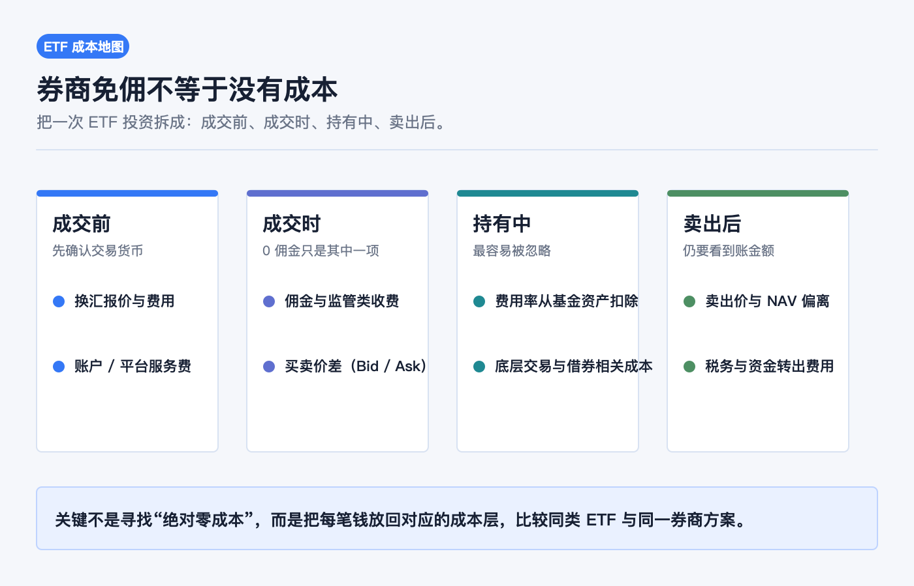
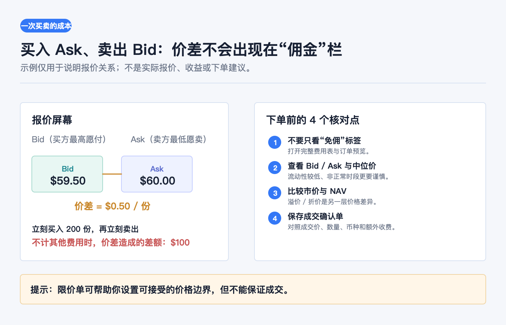
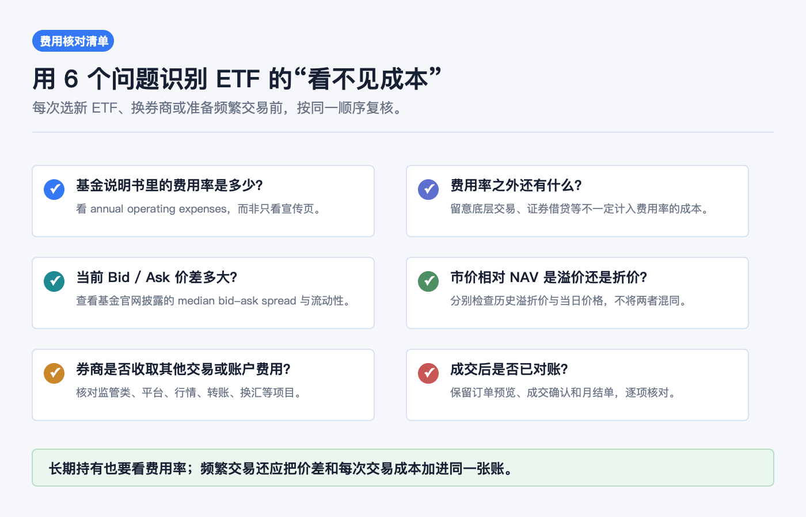

# 券商免佣不等于没有成本：ETF 费用到底藏在哪里

先说结论：**“免佣”通常只说明券商不对某类订单收取传统佣金；它不是“买 ETF 没有成本”的同义词。** ETF 投资至少有四层成本：基金从资产中支付的持续费用、成交时的买卖价差、市场价相对净值的溢价或折价，以及券商、账户、行情、换汇或转账等可能另列的收费。

对长期持有者，最值得先比较的是费用率和基金本身的结构；对频繁交易者，Bid / Ask 价差和每次交易的附加收费往往同样重要。正确的提问不是“这家券商是不是零佣”，而是：**我买入、持有、卖出和把资金转走，每一步实际会损失什么、付给谁、在哪里显示？**

> 本文用于一般投资教育，不构成投资、交易、税务、法律、开户、银行或跨境资金建议。文中以美国市场 ETF 的公开披露框架举例；不同市场、券商实体、账户地区、ETF、订单类型、币种和税务身份适用的收费、报价和规则不同。下单前请以基金说明书、基金官网、本人券商费用表、订单预览与成交确认单为准。资料核对日期：2026-07-23。

## 先把“免佣”放回它真正的位置

佣金只是交易成本表中的一行。FINRA 提醒，许多线上平台提供免佣交易，但一笔交易仍可能伴随费用或成本；券商也可能通过未投资现金的利息、Bid / Ask 价差或订单流付款等其他方式获得收入。[FINRA：线上交易常见问题](https://www.finra.org/investors/insights/questions-about-online-trading)

这不表示每一笔免佣订单都“被多收了钱”，也不表示订单流付款必然带来差的成交。它提醒我们：不能只看首页的“$0 commission”，还要看完整费用表、报价质量、订单预览和成交确认单。

| 成本层 | 常见表现 | 你最该查看的原始资料 |
|---|---|---|
| 基金内部 | 费用率、管理费、其他运营费用 | Summary Prospectus / Prospectus 的 Fee Table |
| 订单成交 | Bid / Ask 价差、报价深度、订单成交价 | 下单界面、订单预览、成交确认单 |
| ETF 市价 | 相对 NAV 的溢价或折价 | 基金官网的 NAV、市场价和历史溢折价 |
| 券商与账户 | 佣金、监管类或交易类收费、行情、平台、转账、换汇 | 券商当前费用表与账户协议 |

不要把这些项目相加成一个“永远固定的费率”。有些是持续的基金成本，有些只在交易发生时出现，有些只在特定账户或资金路径中触发。

## 第一层：费用率为什么看不见，却会影响净值

ETF 不是没有运营成本。美国 SEC 的投资者教育材料说明，基金和 ETF 会把运营成本以费用和支出的形式传递给投资者；说明书中的标准费用表会列出 annual operating expenses，其中包括管理费、其他费用，以及以平均净资产百分比表示的总费用率（expense ratio）。这些费用从基金资产中支付，因此不会像一笔单独的“扣款”直接出现在你的券商成交明细里，而是会降低基金资产价值和投资回报。[Investor.gov：共同基金与 ETF 费用和支出](https://www.investor.gov/introduction-investing/general-resources/news-alerts/alerts-bulletins/investor-bulletins/mutual-fund-and-etf-fees-and-expenses-investor-bulletin)

用一个只为理解量级的简化算式：如果一只 ETF 的年费用率为 0.03%，另一只为 0.50%，且某年的平均持有金额都为 10,000 美元，按费用率计算的年度量级分别约为 3 美元与 50 美元。真实结果会随每日基金资产、申赎、市场波动和费用安排变化；这不是账户会在年末向你单独扣的两笔固定金额。

### 费用率要看哪一行

在说明书的 fee table 中，优先确认：

1. **Total Annual Fund Operating Expenses**：比较同类 ETF 时的核心起点；
2. **Fee Waiver / Expense Reimbursement**：如果有临时减免，要看减免结束日期和是否可能被追回；
3. **Acquired Fund Fees and Expenses**：基金若持有其他基金，可能还存在底层基金费用；
4. **基金策略和持仓方式**：同样叫“指数 ETF”，不代表成本、换手、衍生品使用或跟踪方式相同。

费用率也不是基金所有经济摩擦的完整清单。SEC 的材料特别指出，证券借贷相关成本、基金买卖底层证券的交易成本等，可能不计入费用率，但仍可能影响投资价值。因此“费用率很低”是重要信息，却不是停止核对的理由。

## 第二层：成交时的价差，通常比“0 佣金”更容易被忽略

ETF 在交易所内以市场价格成交。屏幕同时会有 Bid（买方最高愿付价）和 Ask（卖方最低愿卖价）：买入通常面对 Ask，卖出通常面对 Bid，两者的差就是 Bid / Ask 价差。

SEC 的 ETF 投资者公告给出过一个直观示例：若 Ask 为 60 美元、Bid 为 59.50 美元，买入 200 份后立即按 Bid 卖出，在不考虑其他费用的前提下，差额就是 100 美元。该公告把价差视为会降低潜在回报的“隐含成本”，并指出流动性较好、交易量较高的 ETF 往往有更窄的价差；基金官网通常会披露 median bid-ask spread。[Investor.gov：ETF 投资者公告](https://www.investor.gov/introduction-investing/general-resources/news-alerts/alerts-bulletins/investor-bulletins-24)

这也解释了为什么“小额、频繁、在流动性较弱时段交易”不能只比较佣金。即使佣金为零，重复跨越价差也会累积成本。限价单可以让你为可接受的价格设定边界，但不保证成交；是否使用、限在哪里，仍取决于具体 ETF、市场和你的交易目的。

### 价差和溢折价不是同一个概念

- **价差**：同一时点 Bid 与 Ask 的差，直接关系到一笔订单的可成交价格。
- **溢价 / 折价**：ETF 的市场价格相对每份 NAV 的高低。以高于 NAV 的价格买入叫溢价，以低于 NAV 的价格卖出则会形成折价结果。

两者都不是“券商佣金”，但都可能影响实际回报。SEC 说明，ETF 的市价可在交易日内高于或低于 NAV；投资者应在基金官网或说明书中查阅历史溢折价资料，而不是只用一个盘中价格下结论。[Investor.gov：ETF 价格与 NAV](https://www.investor.gov/introduction-investing/general-resources/news-alerts/alerts-bulletins/investor-bulletins-24)

## 第三层：券商费用表里，别只搜“commission”

对同一只 ETF，基金费用率不会因为你换券商而改变；但你的交易和账户成本可能改变。核对券商费用表时，至少按下面的顺序找：

1. **交易项目**：股票 / ETF 是否真的免佣；是否区分市场、订单类型、碎股、电话下单或特殊产品；
2. **监管或交易所相关项目**：名称、收取方向、计价单位和券商是否向客户转嫁；
3. **账户与服务项目**：最低余额、账户维护、平台、行情、纸质文件、转仓、出金或电汇；
4. **换汇与跨币种资金路径**：报价里是否包含点差或单独费用，持有 ETF 的交易币种与账户现金币种是否一致；
5. **收费变更机制**：费用表的生效日期、适用实体与通知方式。

以美国 Section 31 为例，法规义务本身适用于自律组织（SRO），并非 SEC 直接向个人投资者收取；但 SRO 会向券商会员收取交易费用，券商通常又会向客户收取按笔费用。因而，确认单里即使有“SEC fee”或类似名称，也应回到**券商自己的费用表**理解金额和收取方式，而不是把它误解为 SEC 对个人设定的统一账单。[SEC：Section 31 交易费用的基本说明](https://www.sec.gov/rules-regulations/fee-rate-advisories/section-31-transaction-fees-basic-information-firms)

这里最容易犯的错误是把旧攻略、活动页或别人的截图当作永久费率。费用可能因签约实体、居住地、账户等级、订单市场、促销条件或生效日期不同而不同；这篇文章不替任何券商列价或作选择建议。

## 第四层：别把券商的收入模式，直接等同于你的实际成交成本

免佣模式需要区分两个问题：券商是否直接向你收一项费用，和券商如何从业务中获得收入，不是同一件事。FINRA 列举的未投资现金利息、Bid / Ask 价差和 payment for order flow（订单流付款）属于后一个问题。

对投资者更实用的动作是：

- 查看券商的费用表、客户关系摘要或订单路由披露；
- 下单前看 Bid、Ask、时间戳和预计费用，不把 Last 当作可成交价格；
- 成交后对照成交确认单中的价格、数量、币种和额外收费；
- 要比较两家券商时，在**同一 ETF、相近时间、相近订单条件**下比较，不用不同交易日的截图硬比。

一次成交差几分钱不必立即推断路由问题；市场波动、订单大小、时段和报价深度都会影响结果。相反，如果你长期、重复地使用某种交易方式，保存记录并复盘实际成交会比只看广告语更有用。

## 把“成本”与市场损益、税务和汇率风险分开

费用会侵蚀回报，但不等于所有亏损都是费用：

| 现象 | 更可能是什么 | 不能直接推出什么 |
|---|---|---|
| 持仓回报低于预期 | 费用率、市场波动、跟踪差异、交易时点等共同作用 | “费用率就是全部损失” |
| 买入后立刻出现浮亏 | Bid / Ask 价差、价格变动或显示口径差异 | “券商一定扣了隐性佣金” |
| 市价高于或低于 NAV | 溢价或折价 | “基金净值被券商改了” |
| 外币本位币价值变化 | 汇率变动与可能的换汇成本 | “ETF 费用率变高了” |
| 卖出到账较少 | 卖出价格、费用、税务或资金路径 | “只需要比较佣金” |

税务、汇率和跨境资金规则高度依赖你的税务居民地、账户实体和资金安排。它们应与 ETF 本身的费用率分开核对；涉及申报、跨境汇款或税收协定时，应以专业意见和本人机构文件为准。

## 下单前和成交后，用这 6 个问题复核

1. 基金说明书里的总年费用率是多少，是否有到期的费率减免？
2. 这只 ETF 的策略、换手和底层持仓方式，会不会带来费用率之外的摩擦？
3. 当前 Bid / Ask 价差和基金官网披露的 median spread 如何？
4. 现在的市价相对 NAV 是溢价还是折价，历史情况如何？
5. 本人券商对这类订单、账户、行情、转账和换汇到底收什么？
6. 成交确认单与订单预览是否一致，是否已保存到自己的对账记录？

如果你只打算长期、低频地持有，先把第 1、3、4、5 个问题答清楚；如果你会频繁交易，就把每次的价差与附加交易成本也放进同一张账。**免佣可以降低一部分显性摩擦，但不能替代对 ETF 结构、报价和账户条款的核对。**

## 官方资料

- [Investor.gov：共同基金与 ETF 费用和支出（2025-07-23）](https://www.investor.gov/introduction-investing/general-resources/news-alerts/alerts-bulletins/investor-bulletins/mutual-fund-and-etf-fees-and-expenses-investor-bulletin)
- [Investor.gov：ETF 投资者公告（费用、价差、溢折价）](https://www.investor.gov/introduction-investing/general-resources/news-alerts/alerts-bulletins/investor-bulletins-24)
- [FINRA：线上交易的 6 个常见问题](https://www.finra.org/investors/insights/questions-about-online-trading)
- [SEC：Section 31 交易费用的基本说明](https://www.sec.gov/rules-regulations/fee-rate-advisories/section-31-transaction-fees-basic-information-firms)
- [SEC EDGAR：查找基金说明书与申报文件](https://www.sec.gov/search-filings)

资料以 2026-07-23 可访问的官方页面为准。ETF 说明书、费用表、订单路由披露和监管收费都可能更新；在实际交易前，请再次以该 ETF 的最新文件与本人账户可见条款核对。
