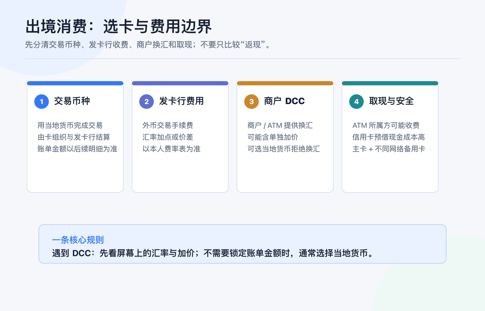
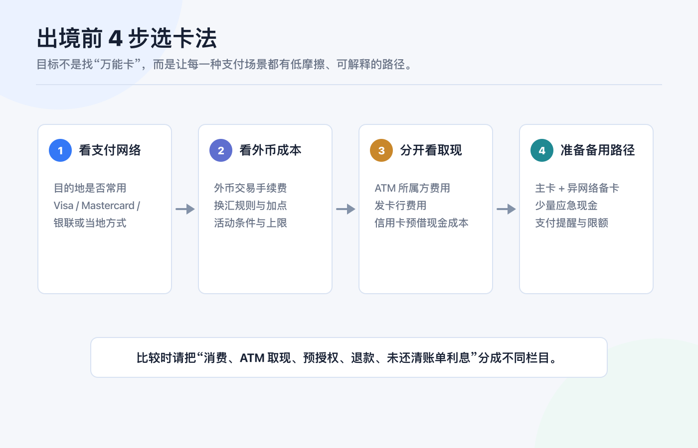
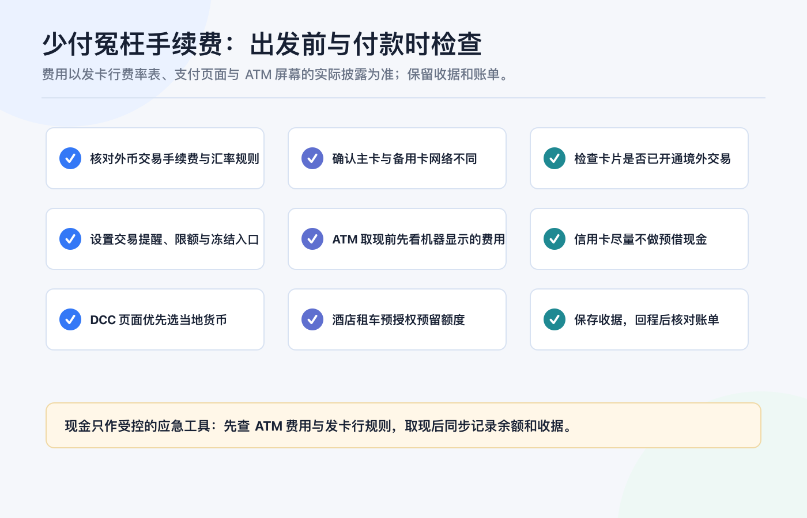

# 境外银行卡不只用来入金：出境消费时如何选卡和避免手续费

先说结论：**出境消费不该只问“这张卡有没有返现”，而要先把支付网络、外币交易成本、商户换汇、ATM 取现和备用路径分开看。**

一张卡能给券商入金，不代表它就适合在旅途中刷卡；一张卡免年费，也不代表外币交易、取现、动态货币兑换（DCC）或酒店预授权的成本最低。更稳妥的做法是：出发前为每个场景指定一条主路径，再准备一条不依赖同一支付网络的备用路径。

> 本文只提供出境支付的通用检查框架，不构成任何银行、信用卡、投资、税务、法律、换汇或跨境资金建议。卡片功能、境外交易开关、费用、汇率、奖励、取现限额、争议处理与可用性，会因发卡行、卡组织、账户实体、地区和产品版本而变化；付款前请以本人发卡行的最新费率表、卡片条款和支付页面披露为准。资料核对日期：2026-07-23。

## 先拆清楚：一笔境外消费的钱到底花在哪

把“外币刷卡手续费”当成一个数字，最容易比较错卡。一次出境支付至少可能经过五层：

| 层级 | 你要看什么 | 容易被忽略的边界 |
|---|---|---|
| 商户标价 | 商品或服务以什么币种报价 | 标价币种不等于最终入账币种；线上页面也可能主动切换货币。 |
| 卡组织与发卡行结算 | 卡组织汇率、发卡行换汇规则、外币交易手续费 | 具体汇率、加点与费用必须以本人发卡行条款和账单为准。 |
| 商户 DCC | 商户或 ATM 提议把当地货币即时换成你的账单币种 | 这是一项额外的换汇服务，不是“免换汇”。 |
| ATM 取现 | ATM 所属方费用、发卡行费用、汇率与限额 | 信用卡的预借现金通常还会涉及单独的手续费与利息规则。 |
| 预授权与退款 | 酒店、租车、加油站先冻结额度，之后才结算或撤销 | 可用额度、实际扣款、退款到账和汇率差可能不在同一天发生。 |

因此，比较两张卡时，至少要把**普通消费、ATM 取现、预授权、退款和未还清信用卡账单后的利息**拆成不同栏目。只看“境外消费返 X%”或“免外币交易费”都不够。

Visa 的消费者说明指出：当商户或 ATM 提供 DCC 时，屏幕或收据应清楚展示当地币金额、持卡人账单币金额、汇率与附加费用/加价，并让持卡人选择接受或拒绝；商户和 ATM 不应代替持卡人作出选择。[Visa：DCC 说明](https://www.visa.com/en-us/personal/travel/dynamic-currency-conversion)

## DCC 是什么：为什么“换成人民币/港币/美元结算”不一定省钱

DCC（Dynamic Currency Conversion，动态货币兑换）指商户或 ATM 在支付当下，主动把当地货币转换为你卡片的账单币种。它的吸引力是：你立刻知道一个熟悉货币的金额；但代价是，这笔换汇不再只由卡组织和发卡行的正常结算流程决定，商户侧的换汇服务可能包含额外的加价。

最实用的现场判断不是死记某一个币种，而是看清楚选项：

| 屏幕出现的选项 | 该怎么理解 | 下一步 |
|---|---|---|
| “Pay in local currency / 以当地货币支付” | 交易先以商户所在地区的本币提交 | 通常让卡组织与发卡行按你的卡片规则处理换汇。 |
| “Pay in CNY / HKD / USD”等账单币 | 商户或 ATM 提供了 DCC 换汇 | 先看披露的汇率、加价和最终金额；不需要锁定金额时，通常选择当地货币。 |
| 未展示完整汇率或被默认选中 | 你无法比较这项商户侧换汇的总成本 | 让店员取消/重新操作，或拒绝 DCC；保留收据并联系发卡行。 |

Visa 的规则支持页面写明，境外使用 Visa 卡时，持卡人必须有机会选择按当地货币处理；若商户未提供这种选择，Visa 建议通知发卡行。[Visa：货币转换与持卡人选择](https://www.visa.com/en-us/support/visa-rules)

这不是说“当地货币永远一定更便宜”。如果你的发卡行对外币交易收取较高费用、而你确实愿意接受眼前披露的 DCC 总价，结果可能不同。正确的原则是：**比较总成本后主动选择，而不是让商户或终端替你选择。** Mastercard 的 DCC 指引同样要求在选择前披露本地币金额、持卡人账单币金额、汇率和可能的额外加价。[Mastercard：DCC Performance Guide（2025）](https://www.mastercard.com/content/dam/public/mastercardcom/na/global-site/documents/DCC-Guide-2025-Merchant-Version.pdf)

## 选卡不要按“等级”，按四个真实场景

### 场景一：日常小额刷卡

优先确认目的地的受理网络、你卡片的外币交易费用和手机支付可用性。把“有实体卡”与“能用手机钱包”分开确认：有些地区的交通、便利店和小额商户高度依赖感应支付，而有些银行卡、发卡地区或数字钱包对境外绑卡另有条件。

你的目标不是带最多卡，而是带一张你已验证过的主卡，并有一张不同网络或不同发卡行的备用卡。一次 45 天跨国旅行记录曾采用 Visa 与 Mastercard 互为备用、少量现金兜底的方式；这里仅把它当作“不要把单一路径当成确定性”的经验提示，不把其中旧卡权益、受理情况或活动当作当前事实。

### 场景二：酒店、租车和押金类预授权

酒店、租车和部分加油站可能先做预授权：它会占用可用额度，但不是最终扣款。出发前要确认三件事：

1. 主卡的可用额度是否覆盖“房费/租金 + 押金 + 可能的汇率波动”；
2. 备用卡是否也能独立完成入住或租车，而不是只用来买咖啡；
3. 撤销预授权或退款到账的时间，以商户、收单机构和发卡行的流程为准，不要把冻结金额当成已经永久扣款。

若预授权异常，保存订单、授权单、收据和聊天记录；先找商户确认撤销，再按发卡行规定提出查询或争议。不要仅凭 App 里的“待处理”状态自行判断最终费用。

### 场景三：ATM 取现与必须用现金的地方

现金是备用支付手段，不是自动更便宜的选择。ATM 取现的成本可能叠加：ATM 所属方费用、发卡行的跨境或取现费用、汇率差，以及信用卡预借现金的利息规则。香港金融管理局的消费者提示明确提醒，使用信用卡预借现金通常没有免息期，发卡行还可能按比例或每笔收取处理费；境外使用前也应了解发卡行外币交易费用。[香港金融管理局：信用卡消费者提示](https://www.hkma.gov.hk/eng/smart-consumers/credit-cards/)

所以我的默认顺序是：

1. 能安全、透明地刷卡或手机支付时，先用消费卡；
2. 必须取现时，先看 ATM 屏幕上披露的费用与 DCC 选项；
3. 用借记卡还是信用卡取现，必须按你自己的发卡行规则比较；
4. 取现后记录金额、币种、ATM 收据和账户余额，避免回程无法核对。

### 场景四：线上订房、改签和退款

线上页面同样可能出现商户换汇或多币种定价。下单前保留“价格币种、付款币种、是否可退款、退款币种、取消条款”的截图。退款不一定按照你最初看到的本币折算金额到账：退款日、原支付日和最终清算日可能不同，汇率与发卡行规则也可能不同。

不要为了拿奖励去忽略退款与取消条件。对高金额、可退订或未来才履约的订单，尤其要确认自己能下载订单确认、商户条款和卡片交易记录。

## 出发前的最小选卡表：每张卡都填一遍

你不需要把卡片按“最好/最差”排队，只需要为本次旅程填这一张表：

| 项目 | 主卡 | 备用卡 | 现金/第三路径 |
|---|---|---|---|
| 支付网络与目的地受理情况 |  |  |  |
| 普通外币消费手续费与汇率规则 |  |  |  |
| 是否支持感应/手机支付 |  |  |  |
| 境外交易是否需要预先开通 |  |  |  |
| 单笔、单日和可用额度 |  |  |  |
| ATM 所属方、发卡行与预借现金成本 |  |  |  |
| 酒店/租车预授权可承受额度 |  |  |  |
| 交易提醒、冻结入口、海外客服 |  |  |  |
| 账单日、还款日、可下载记录 |  |  |  |

如果一张卡只能解决“消费”，另一张只能解决“取现”，这不是问题；问题是你没有提前知道每张卡到底负责什么。把角色写清楚，也能避免到当地才发现主卡因网络、限额、手机号验证或手机没电而失效。

## 少付冤枉手续费的 9 项检查

1. **出发前看费率表，不只看宣传页。** 查清普通外币消费、ATM 取现、预借现金、货币兑换、逾期还款、补卡和争议处理相关条款。
2. **主卡和备用卡不要完全同质。** 最理想的备用不是多带一张同一网络、同一发卡行、同一手机验证方式的卡，而是一条真正独立的支付路径。
3. **确认境外交易开关、限额与交易提醒。** 不要到收银台才发现卡片因安全设置无法交易。
4. **面对 DCC，先看当地币、账单币、汇率和加价。** 没看懂就选择当地货币，或取消交易重新确认。
5. **ATM 屏幕上的费用也要确认。** 有些费用来自 ATM 所属方，不会因为你的发卡行没有某项费用而消失。
6. **尽量不把信用卡当取现工具。** 预借现金的费用与计息规则通常和普通消费不同。
7. **为预授权留出缓冲。** 不要让酒店或租车押金占满主卡额度，影响后续交通和紧急付款。
8. **保留收据与订单。** 特别是 DCC、ATM、酒店和租车交易；它们是后续核对或争议的基础。
9. **回程后核对原币金额、入账币种、汇率、费用和退款。** 旅行账本可先记录原始币种、金额、日期、支出账户和备注，再用账单完成核对；先记录消费币种、再统一复盘，能让后续账单核对更完整。

## 常见误区：省手续费不是“只带一张零费率卡”

**误区一：DCC 显示熟悉货币，所以更安全。**  
熟悉的数字只解决了可读性，不自动证明总成本更低。应比较已披露的汇率和加价，并保留自己选择的权利。

**误区二：免费提现次数等于取现免费。**  
发卡行的优惠不必然覆盖 ATM 所属方费用、汇率差或信用卡预借现金利息。每次取现都要按实际 ATM 和本人卡片条款看。

**误区三：同一银行多带两张卡，就算有备份。**  
如果它们同受同一账户、同一验证手机号、同一风控限制或同一支付网络影响，故障时可能一起失效。备用路径的价值来自独立性。

**误区四：刷卡少就不用对账。**  
跨币种交易的授权、清算、退款和费用可能分批出现。回程后的核对比旅途中的估算更接近最终结果。

## 最后的原则：把“选择权”留在自己手里

出境消费最省心的状态，不是每一笔都追到最低汇率，而是你知道每一笔由谁换汇、哪里可能收费、卡被拒时换哪条路径、出问题后凭什么核对。

所以，出发前做好四件事：**查主卡费率、带独立备用路径、把 DCC 选择权留给自己、保存能对账的记录。** 这样，境外银行卡就不只是入金工具，而是旅行中可控、可复盘的支付基础设施。

## 官方资料

- [Visa：Decoding Dynamic Currency Conversion](https://www.visa.com/en-us/personal/travel/dynamic-currency-conversion)
- [Visa：Travel Credit Cards & Foreign Transactions Explained](https://www.visa.com/en-us/personal/travel/travel-cards-and-foreign-transactions)
- [Visa：货币转换与当地货币处理选择](https://www.visa.com/en-us/support/visa-rules)
- [Mastercard：Dynamic Currency Conversion Performance Guide（2025）](https://www.mastercard.com/content/dam/public/mastercardcom/na/global-site/documents/DCC-Guide-2025-Merchant-Version.pdf)
- [香港金融管理局：信用卡消费者提示](https://www.hkma.gov.hk/eng/smart-consumers/credit-cards/)

资料以 2026-07-23 可访问的官方页面为准。每家发卡行的费用、适用网络、优惠和安全控制都可能变动；在出发前、进行高额预授权、ATM 取现或接受 DCC 前，请再次查看本人卡片的最新费率表与交易页面。
